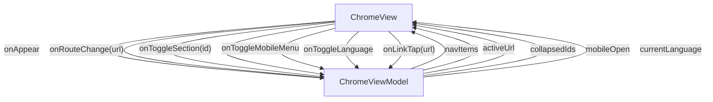

# Chrome - Site chrome

## Overview

Site-wide chrome composition: mounts the TopBar (sticky header with brand, Search, language toggle, mobile-menu button) and the Sidebar (persistent left rail grouping every documentation route into 6 collapsible category sections). Not a page — rendered by the Next.js RootLayout as a sibling of {children}. The ViewModel owns the static nav catalog, the per-section collapse state, the mobile-drawer open flag, and the active-route mirror that comes from Next.js's usePathname().

| | |
|---|---|
| Created | 2026-04-23 |
| Updated | 2026-04-23 |

## Screen Structure

### UI Components

| Component | ID | Platform | Description | Initial State | Notes |
|---|---|---|---|---|---|
| View | `chrome_root` | - | - | - | - |
| &nbsp;&nbsp;↳ TopBar | `chrome_topbar` | - | - | - | - |
| &nbsp;&nbsp;↳ Sidebar | `chrome_sidebar` | - | - | - | - |

### Layout Structure

```
chrome_root
├── chrome_topbar
└── chrome_sidebar
```

## Data Flow



### ViewModel

#### Methods

| Signature | Platforms | Description |
|---|---|---|
| `onAppear()` | all | Seed navItems from the module-scope NAV_CATALOG constant. Resolve every section.label via StringManager.getString('chrome_nav_<id>_label') and every entry.label via StringManager.getString(entry.titleKey). Also mirror StringManager.language into currentLanguage and ColorManager.currentMode into currentColorMode. |
| `onRouteChange(url: String)` | all | Update activeUrl and auto-expand the containing section. Called from the ChromeWrapper's useEffect when usePathname() changes — this is the only public method NOT bound in the layout's data block. |
| `onToggleSection(id: String)` | all | Toggle id's membership in collapsedIds. Pure state update. |
| `onToggleMobileMenu()` | all | Flip mobileOpen. Pure state update. |
| `onToggleLanguage()` | all | StringManager.setLanguage(next) → onAppear() for re-seed → dispatchEvent(new CustomEvent('chrome:languagechange')). The dispatchEvent lets already-mounted generated pages (which cache their string reads per-render) hook a listener and force a re-render if they need to. |
| `onToggleColorMode()` | all | Set ColorManager.followSystemMode = false, then ColorManager.setMode(current === 'dark' ? 'light' : 'dark'). The VM subscribes to ColorManager in the constructor, so setMode triggers a notify → the listener re-seeds currentColorMode → React re-renders the toggle icon. |
| `onLinkTap(url: String)` | all | If mobileOpen is true, flip it to false — closes the drawer as the next page mounts. No preventDefault, no router.push (Next.js <Link> handles navigation). |

#### Vars

| Declaration | Flags | Platforms | Description |
|---|---|---|---|
| `var navItems: Array(SidebarSection)` | observable | all | Nav catalog, seeded in onAppear, re-seeded on language toggle. |
| `var activeUrl: String` | observable | all | Current route; ChromeWrapper pushes it via onRouteChange. |
| `var collapsedIds: Array(String)` | observable | all | Collapsed section ids. |
| `var mobileOpen: Bool` | observable | all | Mobile drawer open flag. |
| `var currentLanguage: String` | observable | all | Mirror of StringManager.language. |
| `var currentColorMode: String` | observable | all | Mirror of ColorManager.currentMode, 'light' or 'dark'. |

## State Management

### UI Data Variables

| Variable Name | Type | Description | Notes |
|---|---|---|---|
| `navItems` | [SidebarSection] | Ordered nav catalog — six SidebarSection entries (learn / guides / concepts / reference / platforms / tools). Seeded by onAppear from the module-scope NAV_CATALOG constant; each entry's label + every row's label is pre-resolved through StringManager so the Sidebar component receives display-ready strings. | - |
| `activeUrl` | String | Mirror of the current route. Set by the Chrome wrapper via onRouteChange(pathname) whenever Next.js's usePathname() changes. Drives the aria-current='page' highlight on the matching Sidebar row. | - |
| `collapsedIds` | [String] | Section ids currently collapsed. onToggleSection flips membership. onRouteChange auto-removes the containing section so the user always sees the current route's siblings without an extra click. | - |
| `mobileOpen` | Bool | Mobile drawer open flag. True on viewports <1024px when the user has tapped the top-bar menu button. Tapping any Sidebar link (onLinkTap) and tapping Escape both flip it back to false. | - |
| `currentLanguage` | String | Mirror of StringManager.language. Drives the TopBar's language-toggle display label (shows the OTHER language as an invitation to switch). Re-seeded inside onAppear on every language toggle so the chrome re-localizes in lockstep with generated pages. | - |
| `currentColorMode` | String | Mirror of ColorManager.currentMode. Drives the TopBar's theme-toggle icon (sun when the current mode is 'light', moon when 'dark'). Seeded from ColorManager at construction and re-synced via ColorManager.subscribe() whenever the mode changes (manual toggle or prefers-color-scheme media query). | - |
| `onToggleLanguage` | String | (from binding) | - |
| `onToggleColorMode` | String | (from binding) | - |
| `onToggleMobileMenu` | String | (from binding) | - |
| `onToggleSection` | String | (from binding) | - |
| `onLinkTap` | String | (from binding) | - |

### View-local Event Handlers

_Handlers kept inside the View layer. ViewModel public API lives under `dataFlow.viewModel`._

| Handler | Description | Notes |
|---|---|---|
| `onAppear` | Build navItems from NAV_CATALOG, pre-resolving each section.label and each entry.label through StringManager with the chrome_nav_<id>_label and screen-specific title keys. Also seed currentLanguage from StringManager.language. | - |
| `onRouteChange` | Mirror the current Next.js pathname into activeUrl. Additionally auto-expand the containing section (remove its id from collapsedIds) so the user immediately sees the current route highlighted inside an open section — no manual expansion required. | - |
| `onToggleSection` | Toggle membership of id in collapsedIds. Fired by the Sidebar when the user taps a section header. | - |
| `onToggleMobileMenu` | Flip mobileOpen. Fired by the TopBar's hamburger button, which CSS media-queries hide on wide viewports. | - |
| `onToggleLanguage` | Flip StringManager.language between the configured languages, then re-run onAppear so every cached label re-resolves. Also dispatches a 'chrome:languagechange' CustomEvent so already-rendered generated pages can listen + force-refresh if they cache their own labels. | - |
| `onToggleColorMode` | Flip ColorManager.currentMode between 'light' and 'dark' and disable followSystemMode so the manual choice sticks. ColorManager.subscribe notifies the VM to re-seed currentColorMode, which re-renders the toggle icon. | - |
| `onLinkTap` | Invoked by the Sidebar after a link is clicked — NO preventDefault, the <a> still navigates. On mobile viewports, flips mobileOpen to false so the drawer closes as the next page mounts. | - |

## User Actions

| Action | Processing | Destination | Notes |
|---|---|---|---|
| Tap a section header | onToggleSection(id) — flip membership in collapsedIds. | - | - |
| Tap a nav link | Next.js <Link> navigates. Chrome fires onLinkTap(url); on mobile, drawer closes. | - | - |
| Tap the hamburger | onToggleMobileMenu — flip mobileOpen. | - | - |
| Tap the language toggle | onToggleLanguage — StringManager.setLanguage + re-seed + dispatch 'chrome:languagechange'. | - | - |
| Tap the theme toggle | onToggleColorMode — ColorManager.setMode flips light↔dark, subscribe callback re-seeds currentColorMode. | - | - |
| Type ⌘+K (anywhere) | Search modal opens; unrelated to chrome state. | - | - |

## Validation

## Related Files

| Type | File Path | Notes |
|---|---|---|
| Layout | `docs/screens/layouts/chrome.json` | - |
| Component | `docs/components/json/topbar.component.json` | - |
| Component | `docs/components/json/sidebar.component.json` | - |
| ViewModel | `jsonui-doc-web/src/viewmodels/ChromeViewModel.ts` | - |
| Wrapper | `jsonui-doc-web/src/components/chrome/ChromeMount.tsx` | - |
| View | `jsonui-doc-web/src/app/layout.tsx` | - |

## Notes

- Not a page: no src/app/chrome/page.tsx. The generated Chrome.tsx is consumed ONLY by ChromeMount, which RootLayout renders site-wide.
- The layout never renders a 'slot' for page content. RootLayout places {children} beside the generated Chrome; CSS in globals.css reserves topbar/sidebar space via padding on .site-main.
- onRouteChange is the only public method on the VM that is NOT surfaced as a layout data binding — it is called only from the ChromeWrapper via the generated hook.
