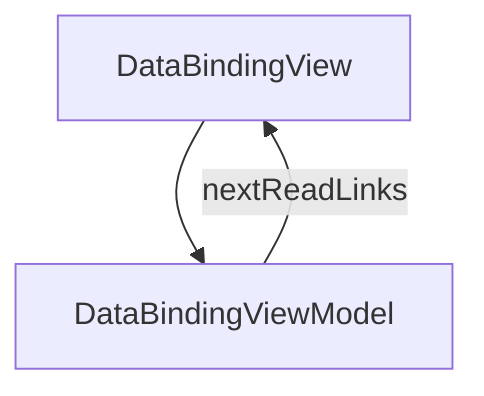

# DataBinding - Data binding as contract

## Overview

Essay: why @{variable} is not a template expression but a typed binding to a ViewModel field. Four H2 sections covering the syntax, type-checking, one-way flow, and the 'no logic in layout' rule. ~4-min read.

| | |
|---|---|
| Created | 2026-04-23 |
| Updated | 2026-04-24 |

## Screen Structure

### UI Components

| Component | ID | Platform | Description | Initial State | Notes |
|---|---|---|---|---|---|
| View | `concepts_data_binding_root` | - | - | - | - |
| &nbsp;&nbsp;↳ Scroll | `concepts_data_binding_scroll` | - | - | - | - |
| &nbsp;&nbsp;&nbsp;&nbsp;↳ View | `concepts_data_binding_header` | - | - | - | - |
| &nbsp;&nbsp;&nbsp;&nbsp;&nbsp;&nbsp;↳ Label | `-` | - | - | - | - |
| &nbsp;&nbsp;&nbsp;&nbsp;&nbsp;&nbsp;↳ Label | `concepts_data_binding_title` | - | - | - | - |
| &nbsp;&nbsp;&nbsp;&nbsp;&nbsp;&nbsp;↳ Label | `concepts_data_binding_lead` | - | - | - | - |
| &nbsp;&nbsp;&nbsp;&nbsp;&nbsp;&nbsp;↳ Label | `-` | - | - | - | - |
| &nbsp;&nbsp;&nbsp;&nbsp;↳ View | `concepts_data_binding_content_with_rail` | - | - | - | - |
| &nbsp;&nbsp;&nbsp;&nbsp;&nbsp;&nbsp;↳ View | `concepts_data_binding_body_column` | - | - | - | - |
| &nbsp;&nbsp;&nbsp;&nbsp;&nbsp;&nbsp;&nbsp;&nbsp;↳ View | `section_syntax` | - | - | - | - |
| &nbsp;&nbsp;&nbsp;&nbsp;&nbsp;&nbsp;&nbsp;&nbsp;&nbsp;&nbsp;↳ Label | `-` | - | - | - | - |
| &nbsp;&nbsp;&nbsp;&nbsp;&nbsp;&nbsp;&nbsp;&nbsp;&nbsp;&nbsp;↳ Label | `-` | - | - | - | - |
| &nbsp;&nbsp;&nbsp;&nbsp;&nbsp;&nbsp;&nbsp;&nbsp;&nbsp;&nbsp;↳ CodeBlock | `-` | - | - | - | - |
| &nbsp;&nbsp;&nbsp;&nbsp;&nbsp;&nbsp;&nbsp;&nbsp;↳ View | `section_typed` | - | - | - | - |
| &nbsp;&nbsp;&nbsp;&nbsp;&nbsp;&nbsp;&nbsp;&nbsp;&nbsp;&nbsp;↳ Label | `-` | - | - | - | - |
| &nbsp;&nbsp;&nbsp;&nbsp;&nbsp;&nbsp;&nbsp;&nbsp;&nbsp;&nbsp;↳ Label | `-` | - | - | - | - |
| &nbsp;&nbsp;&nbsp;&nbsp;&nbsp;&nbsp;&nbsp;&nbsp;&nbsp;&nbsp;↳ CodeBlock | `-` | - | - | - | - |
| &nbsp;&nbsp;&nbsp;&nbsp;&nbsp;&nbsp;&nbsp;&nbsp;↳ View | `section_oneway` | - | - | - | - |
| &nbsp;&nbsp;&nbsp;&nbsp;&nbsp;&nbsp;&nbsp;&nbsp;&nbsp;&nbsp;↳ Label | `-` | - | - | - | - |
| &nbsp;&nbsp;&nbsp;&nbsp;&nbsp;&nbsp;&nbsp;&nbsp;&nbsp;&nbsp;↳ Label | `-` | - | - | - | - |
| &nbsp;&nbsp;&nbsp;&nbsp;&nbsp;&nbsp;&nbsp;&nbsp;&nbsp;&nbsp;↳ CodeBlock | `-` | - | - | - | - |
| &nbsp;&nbsp;&nbsp;&nbsp;&nbsp;&nbsp;&nbsp;&nbsp;↳ View | `section_focus` | - | - | - | - |
| &nbsp;&nbsp;&nbsp;&nbsp;&nbsp;&nbsp;&nbsp;&nbsp;&nbsp;&nbsp;↳ Label | `-` | - | - | - | - |
| &nbsp;&nbsp;&nbsp;&nbsp;&nbsp;&nbsp;&nbsp;&nbsp;&nbsp;&nbsp;↳ Label | `-` | - | - | - | - |
| &nbsp;&nbsp;&nbsp;&nbsp;&nbsp;&nbsp;&nbsp;&nbsp;&nbsp;&nbsp;↳ CodeBlock | `-` | - | - | - | - |
| &nbsp;&nbsp;&nbsp;&nbsp;&nbsp;&nbsp;&nbsp;&nbsp;↳ View | `section_no_logic` | - | - | - | - |
| &nbsp;&nbsp;&nbsp;&nbsp;&nbsp;&nbsp;&nbsp;&nbsp;&nbsp;&nbsp;↳ Label | `-` | - | - | - | - |
| &nbsp;&nbsp;&nbsp;&nbsp;&nbsp;&nbsp;&nbsp;&nbsp;&nbsp;&nbsp;↳ Label | `-` | - | - | - | - |
| &nbsp;&nbsp;&nbsp;&nbsp;&nbsp;&nbsp;&nbsp;&nbsp;&nbsp;&nbsp;↳ CodeBlock | `-` | - | - | - | - |
| &nbsp;&nbsp;&nbsp;&nbsp;&nbsp;&nbsp;&nbsp;&nbsp;↳ View | `concepts_data_binding_next` | - | - | - | - |
| &nbsp;&nbsp;&nbsp;&nbsp;&nbsp;&nbsp;&nbsp;&nbsp;&nbsp;&nbsp;↳ Label | `-` | - | - | - | - |
| &nbsp;&nbsp;&nbsp;&nbsp;&nbsp;&nbsp;&nbsp;&nbsp;&nbsp;&nbsp;↳ Collection | `concepts_data_binding_next_collection` | - | - | - | - |
| &nbsp;&nbsp;&nbsp;&nbsp;&nbsp;&nbsp;&nbsp;&nbsp;↳ View | `concepts_data_binding_footer` | - | - | - | - |
| &nbsp;&nbsp;&nbsp;&nbsp;&nbsp;&nbsp;&nbsp;&nbsp;&nbsp;&nbsp;↳ Label | `-` | - | - | - | - |
| &nbsp;&nbsp;&nbsp;&nbsp;&nbsp;&nbsp;↳ View | `concepts_data_binding_rail_column` | - | - | - | - |
| &nbsp;&nbsp;&nbsp;&nbsp;&nbsp;&nbsp;&nbsp;&nbsp;↳ View | `concepts_data_binding_toc_wrap` | - | - | - | - |
| &nbsp;&nbsp;&nbsp;&nbsp;&nbsp;&nbsp;&nbsp;&nbsp;&nbsp;&nbsp;↳ TableOfContents | `-` | - | - | - | - |

### Layout Structure

```
concepts_data_binding_root
└── concepts_data_binding_scroll
```

## Data Flow



### ViewModel

#### Methods

| Signature | Platforms | Description |
|---|---|---|
| `onAppear()` | all | Seed nextReadLinks from the module-scope NEXT_READ_ENTRIES catalog (two rows: next_why_spec_first -> /concepts/why-spec-first, next_viewmodel -> /concepts/viewmodel-owned-state) and stamp currentLanguage from StringManager.language. Each row's titleKey / descriptionKey is resolved through StringManager with the concepts_data_binding_ namespace prefix, so the strings.json keys loaded are concepts_data_binding_next_why_spec_first_title / _description and concepts_data_binding_next_viewmodel_title / _description. |
| `onNavigate(url: String)` | all | Client-side navigation via router.push(url). Destinations are the spec-mapped concept URLs enumerated in transitions: /concepts, /concepts/viewmodel-owned-state, /concepts/why-spec-first. |

#### Vars

| Declaration | Flags | Platforms | Description |
|---|---|---|---|
| `var nextReadLinks: Array(NextReadLink)` | observable | all | Two closing 'read next' cards pointing at /concepts/why-spec-first and /concepts/viewmodel-owned-state. Seeded by onAppear from the NEXT_READ_ENTRIES static catalog and re-seeded by onToggleLanguage. |

## State Management

### UI Data Variables

| Variable Name | Type | Description | Notes |
|---|---|---|---|
| `nextReadLinks` | [NextReadLink] | Two follow-up essays at the bottom. | - |

### View-local Event Handlers

_Handlers kept inside the View layer. ViewModel public API lives under `dataFlow.viewModel`._

| Handler | Description | Notes |
|---|---|---|
| `onAppear` | Seed nextReadLinks. | - |
| `onNavigate` | Client-side navigation. | - |
| `onNavigateConcepts` |  | - |

## User Actions

| Action | Processing | Destination | Notes |
|---|---|---|---|
| Tap a TOC entry | TOC-internal scroll. No VM. | - | - |
| Tap a NextReadLink card | onNavigate(url) with the bound url. | - | - |

## Validation

## Transitions

| Condition | Destination | Notes |
|---|---|---|
| url is a spec-mapped concept URL or /concepts | Target spec screen or tab | - |

## Related Files

| Type | File Path | Notes |
|---|---|---|
| Layout | `docs/screens/layouts/concepts/data-binding.json` | - |
| ViewModel | `jsonui-doc-web/src/viewmodels/concepts/DataBindingViewModel.ts` | - |
| View | `jsonui-doc-web/src/app/concepts/data-binding/page.tsx` | - |

## Notes

- Second live essay under Concepts. Flipping CONCEPTS_ENTRIES row 4 (data-binding) from 'upcoming' to 'live' in HomeViewModel is the last step.
- The closing next-reads point at WhySpecFirst (back) and ViewModel-owned state (upcoming sibling).
- 2026-04-24 rewrite: the four section bodies were rewritten against the real SwiftJsonUI / KotlinJsonUI / ReactJsonUI implementations — see docs/plans/concepts-data-binding-rewrite.md. Key correction: form inputs (TextField / CheckBox / Switch / Toggle / Slider / SelectBox / Segment) are effectively two-way on every platform (SwiftUI $binding, Android LaunchedEffect + updateData, Web auto-generated onChange); the optional onXxxChange handler is a notification hook that fires AFTER the VM field has already updated, not a gate. Non-input bindings (Label text, visibility, src, colors, items) remain read-only.
