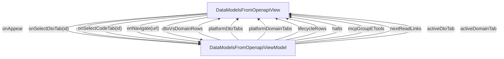

# DataModelsFromOpenapi - Data models from OpenAPI

## Overview

Concept essay: how `jui build` reads OpenAPI files in docs/api/ and emits two layers per platform — a fully regenerated DTO (wire-shape 1:1) plus a one-time Domain scaffold (user-owned). Explains why this kills the 3-platform schema-drift problem, how per-consumer `api.schemas.*` path filters scope what gets generated when many apps share one swagger, and how MCP Group E lets an agent discover and dry-run filter changes. Ten H2 sections, ~9-min read. Companion to /guides/api-data-models which is the cookbook.

| | |
|---|---|
| Created | 2026-05-27 |
| Updated | 2026-05-27 |

## Screen Structure

### UI Components

| Component | ID | Platform | Description | Initial State | Notes |
|---|---|---|---|---|---|
| View | `concepts_data_models_from_openapi_root` | - | - | - | - |
| &nbsp;&nbsp;↳ Scroll | `concepts_data_models_from_openapi_scroll` | - | - | - | - |
| &nbsp;&nbsp;&nbsp;&nbsp;↳ View | `concepts_data_models_from_openapi_header` | - | - | - | - |
| &nbsp;&nbsp;&nbsp;&nbsp;&nbsp;&nbsp;↳ Label | `-` | - | - | - | - |
| &nbsp;&nbsp;&nbsp;&nbsp;&nbsp;&nbsp;↳ Label | `-` | - | - | - | - |
| &nbsp;&nbsp;&nbsp;&nbsp;&nbsp;&nbsp;↳ Label | `-` | - | - | - | - |
| &nbsp;&nbsp;&nbsp;&nbsp;&nbsp;&nbsp;↳ Label | `-` | - | - | - | - |
| &nbsp;&nbsp;&nbsp;&nbsp;↳ View | `concepts_data_models_from_openapi_content_with_rail` | - | - | - | - |
| &nbsp;&nbsp;&nbsp;&nbsp;&nbsp;&nbsp;↳ View | `concepts_data_models_from_openapi_body_column` | - | - | - | - |
| &nbsp;&nbsp;&nbsp;&nbsp;&nbsp;&nbsp;&nbsp;&nbsp;↳ View | `section_problem` | - | - | - | - |
| &nbsp;&nbsp;&nbsp;&nbsp;&nbsp;&nbsp;&nbsp;&nbsp;&nbsp;&nbsp;↳ Label | `-` | - | - | - | - |
| &nbsp;&nbsp;&nbsp;&nbsp;&nbsp;&nbsp;&nbsp;&nbsp;&nbsp;&nbsp;↳ Label | `-` | - | - | - | - |
| &nbsp;&nbsp;&nbsp;&nbsp;&nbsp;&nbsp;&nbsp;&nbsp;↳ View | `section_two_layers` | - | - | - | - |
| &nbsp;&nbsp;&nbsp;&nbsp;&nbsp;&nbsp;&nbsp;&nbsp;&nbsp;&nbsp;↳ Label | `-` | - | - | - | - |
| &nbsp;&nbsp;&nbsp;&nbsp;&nbsp;&nbsp;&nbsp;&nbsp;&nbsp;&nbsp;↳ Label | `-` | - | - | - | - |
| &nbsp;&nbsp;&nbsp;&nbsp;&nbsp;&nbsp;&nbsp;&nbsp;&nbsp;&nbsp;↳ Collection | `concepts_data_models_from_openapi_compare_collection` | - | - | - | - |
| &nbsp;&nbsp;&nbsp;&nbsp;&nbsp;&nbsp;&nbsp;&nbsp;↳ View | `section_dto` | - | - | - | - |
| &nbsp;&nbsp;&nbsp;&nbsp;&nbsp;&nbsp;&nbsp;&nbsp;&nbsp;&nbsp;↳ Label | `-` | - | - | - | - |
| &nbsp;&nbsp;&nbsp;&nbsp;&nbsp;&nbsp;&nbsp;&nbsp;&nbsp;&nbsp;↳ Label | `-` | - | - | - | - |
| &nbsp;&nbsp;&nbsp;&nbsp;&nbsp;&nbsp;&nbsp;&nbsp;&nbsp;&nbsp;↳ Collection | `concepts_data_models_from_openapi_dto_tabs` | - | - | - | - |
| &nbsp;&nbsp;&nbsp;&nbsp;&nbsp;&nbsp;&nbsp;&nbsp;&nbsp;&nbsp;↳ View | `dto_panel_swift` | - | - | - | - |
| &nbsp;&nbsp;&nbsp;&nbsp;&nbsp;&nbsp;&nbsp;&nbsp;&nbsp;&nbsp;&nbsp;&nbsp;↳ CodeBlock | `-` | - | - | - | - |
| &nbsp;&nbsp;&nbsp;&nbsp;&nbsp;&nbsp;&nbsp;&nbsp;&nbsp;&nbsp;↳ View | `dto_panel_kotlin` | - | - | - | - |
| &nbsp;&nbsp;&nbsp;&nbsp;&nbsp;&nbsp;&nbsp;&nbsp;&nbsp;&nbsp;&nbsp;&nbsp;↳ CodeBlock | `-` | - | - | - | - |
| &nbsp;&nbsp;&nbsp;&nbsp;&nbsp;&nbsp;&nbsp;&nbsp;&nbsp;&nbsp;↳ View | `dto_panel_ts` | - | - | - | - |
| &nbsp;&nbsp;&nbsp;&nbsp;&nbsp;&nbsp;&nbsp;&nbsp;&nbsp;&nbsp;&nbsp;&nbsp;↳ CodeBlock | `-` | - | - | - | - |
| &nbsp;&nbsp;&nbsp;&nbsp;&nbsp;&nbsp;&nbsp;&nbsp;↳ View | `section_discriminated` | - | - | - | - |
| &nbsp;&nbsp;&nbsp;&nbsp;&nbsp;&nbsp;&nbsp;&nbsp;&nbsp;&nbsp;↳ Label | `-` | - | - | - | - |
| &nbsp;&nbsp;&nbsp;&nbsp;&nbsp;&nbsp;&nbsp;&nbsp;&nbsp;&nbsp;↳ Label | `-` | - | - | - | - |
| &nbsp;&nbsp;&nbsp;&nbsp;&nbsp;&nbsp;&nbsp;&nbsp;&nbsp;&nbsp;↳ CodeBlock | `-` | - | - | - | - |
| &nbsp;&nbsp;&nbsp;&nbsp;&nbsp;&nbsp;&nbsp;&nbsp;&nbsp;&nbsp;↳ CodeBlock | `-` | - | - | - | - |
| &nbsp;&nbsp;&nbsp;&nbsp;&nbsp;&nbsp;&nbsp;&nbsp;&nbsp;&nbsp;↳ Label | `-` | - | - | - | - |
| &nbsp;&nbsp;&nbsp;&nbsp;&nbsp;&nbsp;&nbsp;&nbsp;↳ View | `section_domain` | - | - | - | - |
| &nbsp;&nbsp;&nbsp;&nbsp;&nbsp;&nbsp;&nbsp;&nbsp;&nbsp;&nbsp;↳ Label | `-` | - | - | - | - |
| &nbsp;&nbsp;&nbsp;&nbsp;&nbsp;&nbsp;&nbsp;&nbsp;&nbsp;&nbsp;↳ Label | `-` | - | - | - | - |
| &nbsp;&nbsp;&nbsp;&nbsp;&nbsp;&nbsp;&nbsp;&nbsp;&nbsp;&nbsp;↳ Collection | `concepts_data_models_from_openapi_domain_tabs` | - | - | - | - |
| &nbsp;&nbsp;&nbsp;&nbsp;&nbsp;&nbsp;&nbsp;&nbsp;&nbsp;&nbsp;↳ View | `domain_panel_swift` | - | - | - | - |
| &nbsp;&nbsp;&nbsp;&nbsp;&nbsp;&nbsp;&nbsp;&nbsp;&nbsp;&nbsp;&nbsp;&nbsp;↳ CodeBlock | `-` | - | - | - | - |
| &nbsp;&nbsp;&nbsp;&nbsp;&nbsp;&nbsp;&nbsp;&nbsp;&nbsp;&nbsp;↳ View | `domain_panel_kotlin` | - | - | - | - |
| &nbsp;&nbsp;&nbsp;&nbsp;&nbsp;&nbsp;&nbsp;&nbsp;&nbsp;&nbsp;&nbsp;&nbsp;↳ CodeBlock | `-` | - | - | - | - |
| &nbsp;&nbsp;&nbsp;&nbsp;&nbsp;&nbsp;&nbsp;&nbsp;&nbsp;&nbsp;↳ View | `domain_panel_ts` | - | - | - | - |
| &nbsp;&nbsp;&nbsp;&nbsp;&nbsp;&nbsp;&nbsp;&nbsp;&nbsp;&nbsp;&nbsp;&nbsp;↳ CodeBlock | `-` | - | - | - | - |
| &nbsp;&nbsp;&nbsp;&nbsp;&nbsp;&nbsp;&nbsp;&nbsp;↳ View | `section_customize` | - | - | - | - |
| &nbsp;&nbsp;&nbsp;&nbsp;&nbsp;&nbsp;&nbsp;&nbsp;&nbsp;&nbsp;↳ Label | `-` | - | - | - | - |
| &nbsp;&nbsp;&nbsp;&nbsp;&nbsp;&nbsp;&nbsp;&nbsp;&nbsp;&nbsp;↳ Label | `-` | - | - | - | - |
| &nbsp;&nbsp;&nbsp;&nbsp;&nbsp;&nbsp;&nbsp;&nbsp;&nbsp;&nbsp;↳ CodeBlock | `-` | - | - | - | - |
| &nbsp;&nbsp;&nbsp;&nbsp;&nbsp;&nbsp;&nbsp;&nbsp;&nbsp;&nbsp;↳ Label | `-` | - | - | - | - |
| &nbsp;&nbsp;&nbsp;&nbsp;&nbsp;&nbsp;&nbsp;&nbsp;↳ View | `section_filter` | - | - | - | - |
| &nbsp;&nbsp;&nbsp;&nbsp;&nbsp;&nbsp;&nbsp;&nbsp;&nbsp;&nbsp;↳ Label | `-` | - | - | - | - |
| &nbsp;&nbsp;&nbsp;&nbsp;&nbsp;&nbsp;&nbsp;&nbsp;&nbsp;&nbsp;↳ Label | `-` | - | - | - | - |
| &nbsp;&nbsp;&nbsp;&nbsp;&nbsp;&nbsp;&nbsp;&nbsp;&nbsp;&nbsp;↳ CodeBlock | `-` | - | - | - | - |
| &nbsp;&nbsp;&nbsp;&nbsp;&nbsp;&nbsp;&nbsp;&nbsp;&nbsp;&nbsp;↳ Label | `-` | - | - | - | - |
| &nbsp;&nbsp;&nbsp;&nbsp;&nbsp;&nbsp;&nbsp;&nbsp;↳ View | `section_mcp` | - | - | - | - |
| &nbsp;&nbsp;&nbsp;&nbsp;&nbsp;&nbsp;&nbsp;&nbsp;&nbsp;&nbsp;↳ Label | `-` | - | - | - | - |
| &nbsp;&nbsp;&nbsp;&nbsp;&nbsp;&nbsp;&nbsp;&nbsp;&nbsp;&nbsp;↳ Label | `-` | - | - | - | - |
| &nbsp;&nbsp;&nbsp;&nbsp;&nbsp;&nbsp;&nbsp;&nbsp;&nbsp;&nbsp;↳ Collection | `concepts_data_models_from_openapi_mcp_collection` | - | - | - | - |
| &nbsp;&nbsp;&nbsp;&nbsp;&nbsp;&nbsp;&nbsp;&nbsp;↳ View | `section_lifecycle` | - | - | - | - |
| &nbsp;&nbsp;&nbsp;&nbsp;&nbsp;&nbsp;&nbsp;&nbsp;&nbsp;&nbsp;↳ Label | `-` | - | - | - | - |
| &nbsp;&nbsp;&nbsp;&nbsp;&nbsp;&nbsp;&nbsp;&nbsp;&nbsp;&nbsp;↳ Label | `-` | - | - | - | - |
| &nbsp;&nbsp;&nbsp;&nbsp;&nbsp;&nbsp;&nbsp;&nbsp;&nbsp;&nbsp;↳ Collection | `concepts_data_models_from_openapi_lifecycle_collection` | - | - | - | - |
| &nbsp;&nbsp;&nbsp;&nbsp;&nbsp;&nbsp;&nbsp;&nbsp;↳ View | `section_halts` | - | - | - | - |
| &nbsp;&nbsp;&nbsp;&nbsp;&nbsp;&nbsp;&nbsp;&nbsp;&nbsp;&nbsp;↳ Label | `-` | - | - | - | - |
| &nbsp;&nbsp;&nbsp;&nbsp;&nbsp;&nbsp;&nbsp;&nbsp;&nbsp;&nbsp;↳ Label | `-` | - | - | - | - |
| &nbsp;&nbsp;&nbsp;&nbsp;&nbsp;&nbsp;&nbsp;&nbsp;&nbsp;&nbsp;↳ Collection | `concepts_data_models_from_openapi_halts_collection` | - | - | - | - |
| &nbsp;&nbsp;&nbsp;&nbsp;&nbsp;&nbsp;&nbsp;&nbsp;↳ View | `concepts_data_models_from_openapi_next` | - | - | - | - |
| &nbsp;&nbsp;&nbsp;&nbsp;&nbsp;&nbsp;&nbsp;&nbsp;&nbsp;&nbsp;↳ Label | `-` | - | - | - | - |
| &nbsp;&nbsp;&nbsp;&nbsp;&nbsp;&nbsp;&nbsp;&nbsp;&nbsp;&nbsp;↳ Collection | `concepts_data_models_from_openapi_next_collection` | - | - | - | - |
| &nbsp;&nbsp;&nbsp;&nbsp;&nbsp;&nbsp;&nbsp;&nbsp;↳ View | `concepts_data_models_from_openapi_footer` | - | - | - | - |
| &nbsp;&nbsp;&nbsp;&nbsp;&nbsp;&nbsp;&nbsp;&nbsp;&nbsp;&nbsp;↳ Label | `-` | - | - | - | - |
| &nbsp;&nbsp;&nbsp;&nbsp;&nbsp;&nbsp;↳ View | `concepts_data_models_from_openapi_rail_column` | - | - | - | - |
| &nbsp;&nbsp;&nbsp;&nbsp;&nbsp;&nbsp;&nbsp;&nbsp;↳ View | `concepts_data_models_from_openapi_toc_wrap` | - | - | - | - |
| &nbsp;&nbsp;&nbsp;&nbsp;&nbsp;&nbsp;&nbsp;&nbsp;&nbsp;&nbsp;↳ TableOfContents | `-` | - | - | - | - |

### Layout Structure

```
concepts_data_models_from_openapi_root
└── concepts_data_models_from_openapi_scroll
```

## Data Flow



### ViewModel

#### Methods

| Signature | Platforms | Description |
|---|---|---|
| `onAppear()` | all | Seed every public observable from module-scope static catalogs: dtoVsDomainRows (3 rows), lifecycleRows (5 rows), halts (6 rows), mcpGroupETools (3 rows: list_api_specs / list_api_models / preview_api_model_sync), nextReadLinks (3 cards). Every string field resolves through StringManager with the concepts_data_models_from_openapi_ prefix. Finally calls buildDtoTabs('swift') and buildDomainTabs('swift') to populate the two tab header collections; activeDtoTab and activeDomainTab stay at their 'swift' initial values. |
| `onSelectDtoTab(id: String)` | all | Set activeDtoTab = id, then platformDtoTabs = buildDtoTabs(id). The corresponding swiftDtoPanelVisibility / kotlinDtoPanelVisibility / tsDtoPanelVisibility strings are derived by displayLogic (set by the layout, not the VM). |
| `onSelectCodeTab(id: String)` | all | Same shape as onSelectDtoTab, but targets activeDomainTab and platformDomainTabs. Bound to the section-4 tab strip. |
| `onNavigate(url: String)` | all | router.push(url). Hit by NextReadLink card taps and the breadcrumb. |
| `buildDtoTabs(activeId: String)` | all | Helper that returns [TabHeaderCell] with 3 entries (id='swift' / 'kotlin' / 'ts'). The row whose id === activeId gets the accent palette (bgColor: var(--color-accent), fgColor: var(--color-on-accent), borderColor: var(--color-accent)); the others get the surface palette. Each row's onSelect is wired to () => this.onSelectDtoTab(id). Mirrors LearnHelloWorldViewModel.buildPlatformTabs exactly. |
| `buildDomainTabs(activeId: String)` | all | Same shape as buildDtoTabs but onSelect is wired to () => this.onSelectCodeTab(id). Independent active state from buildDtoTabs so a reader can hold the DTO panel on Swift while flipping the Domain panel to Kotlin. |

#### Vars

| Declaration | Flags | Platforms | Description |
|---|---|---|---|
| `var dtoVsDomainRows: Array(ComparisonRow)` | observable | all | 3-row comparison table for section 2. |
| `var platformDtoTabs: Array(TabHeaderCell)` | observable | all | 3-row tab header for the section-3 DTO switcher. |
| `var platformDomainTabs: Array(TabHeaderCell)` | observable | all | 3-row tab header for the section-4 Domain switcher. |
| `var lifecycleRows: Array(LifecycleStepRow)` | observable | all | 5-row lifecycle list for section 8. |
| `var halts: Array(HaltRow)` | observable | all | 6-row halt table for section 9. |
| `var mcpGroupETools: Array(McpToolCell)` | observable | all | 3-row Group E catalog for section 7. |
| `var nextReadLinks: Array(NextReadLink)` | observable | all | 3 closing cards. |
| `var activeDtoTab: String` | observable | all | Currently visible DTO tab id; 'swift' by default. |
| `var activeDomainTab: String` | observable | all | Currently visible Domain tab id; 'swift' by default. |
| `var swiftDtoPanelVisibility: String` | observable | all | Derived from activeDtoTab via displayLogic. |
| `var kotlinDtoPanelVisibility: String` | observable | all | Derived from activeDtoTab via displayLogic. |
| `var tsDtoPanelVisibility: String` | observable | all | Derived from activeDtoTab via displayLogic. |
| `var swiftDomainPanelVisibility: String` | observable | all | Derived from activeDomainTab via displayLogic. |
| `var kotlinDomainPanelVisibility: String` | observable | all | Derived from activeDomainTab via displayLogic. |
| `var tsDomainPanelVisibility: String` | observable | all | Derived from activeDomainTab via displayLogic. |

## State Management

### UI Data Variables

| Variable Name | Type | Description | Notes |
|---|---|---|---|
| `dtoVsDomainRows` | [ComparisonRow] | Three rows for the DTO vs Domain comparison table in section 2 (owner / regeneration cadence / what the file holds). Each row carries labelKey + dtoKey + domainKey under the concepts_data_models_from_openapi_ namespace, pre-resolved via StringManager. | - |
| `platformDtoTabs` | [TabHeaderCell] | Three T6-pattern tab headers for the section 3 'What the DTO looks like' switcher (id='swift' | 'kotlin' | 'ts'). Initial active is 'swift'. Rebuilt on every onSelectDtoTab call by buildDtoTabs(activeId) so the active row picks up the accent palette and the others revert to surface. Mirrors LearnHelloWorldViewModel.buildPlatformTabs exactly. | - |
| `platformDomainTabs` | [TabHeaderCell] | Same shape as platformDtoTabs but for section 4 ('What the Domain scaffold looks like'). Independent active state so a reader can read DTO/Swift alongside Domain/Kotlin if they want. | - |
| `lifecycleRows` | [LifecycleStepRow] | Five rows for the section 8 lifecycle list (DTO full regen / Domain skip-if-exists / filter apply / orphan handling / drift check). Each row has stepKey + bodyKey. | - |
| `halts` | [HaltRow] | Six rows for the section 9 ERROR-halt table (format-aware mapping / oneOf / discriminator / multi-file $ref / YAML / direct self-ref). Each row carries triggerKey + behaviorKey + workaroundKey. The narrative emphasizes 'no silent fallback' — the build halts so the author notices. | - |
| `mcpGroupETools` | [McpToolCell] | Three rows for the section 7 'Discovery from your agent' card list: list_api_specs, list_api_models, preview_api_model_sync. Each carries nameKey + roleKey + useCaseKey. Cells are informational only — no per-row navigation; the linked detail lives on /guides/api-data-models §5 and §6. | - |
| `nextReadLinks` | [NextReadLink] | Three closing 'read next' cards: /guides/api-data-models (the cookbook), /concepts/why-spec-first, /concepts/one-layout-json. Seeded in onAppear. | - |
| `activeDtoTab` | String | Id of the currently selected DTO sample tab ('swift' | 'kotlin' | 'ts'). Drives displayLogic for the three section-3 sample panels. | - |
| `activeDomainTab` | String | Id of the currently selected Domain sample tab. Drives displayLogic for the three section-4 sample panels. | - |
| `swiftDtoPanelVisibility` | String | (from binding) | - |
| `kotlinDtoPanelVisibility` | String | (from binding) | - |
| `tsDtoPanelVisibility` | String | (from binding) | - |
| `swiftDomainPanelVisibility` | String | (from binding) | - |
| `kotlinDomainPanelVisibility` | String | (from binding) | - |
| `tsDomainPanelVisibility` | String | (from binding) | - |

### View-local Event Handlers

_Handlers kept inside the View layer. ViewModel public API lives under `dataFlow.viewModel`._

| Handler | Description | Notes |
|---|---|---|
| `onAppear` | Seed dtoVsDomainRows, lifecycleRows, halts, mcpGroupETools, and nextReadLinks from module-scope catalogs, then call buildDtoTabs('swift') and buildDomainTabs('swift') to populate the two tab-header collections. Every user-visible string flows through StringManager with the concepts_data_models_from_openapi_ prefix. | - |
| `onSelectDtoTab` | T6-pattern tab toggle for the DTO sample switcher. Sets activeDtoTab = id, then assigns platformDtoTabs = buildDtoTabs(id). displayLogic derives swiftDtoPanelVisibility / kotlinDtoPanelVisibility / tsDtoPanelVisibility from activeDtoTab. | - |
| `onSelectCodeTab` | T6-pattern tab toggle for the Domain sample switcher. Sets activeDomainTab = id, then assigns platformDomainTabs = buildDomainTabs(id). Name reused from the project-wide eventHandlers.allowedNames whitelist. | - |
| `onNavigate` | Client-side navigation via router.push(url). Bound to each NextReadLink card's onClick and to the TOC breadcrumb (/concepts). | - |
| `onNavigateConcepts` |  | - |

### Display Logic

```
activeDtoTab == 'swift':
  - dto_panel_swift: visible [variable: swiftDtoPanelVisibility]

activeDtoTab == 'kotlin':
  - dto_panel_kotlin: visible [variable: kotlinDtoPanelVisibility]

activeDtoTab == 'ts':
  - dto_panel_ts: visible [variable: tsDtoPanelVisibility]

activeDomainTab == 'swift':
  - domain_panel_swift: visible [variable: swiftDomainPanelVisibility]

activeDomainTab == 'kotlin':
  - domain_panel_kotlin: visible [variable: kotlinDomainPanelVisibility]

activeDomainTab == 'ts':
  - domain_panel_ts: visible [variable: tsDomainPanelVisibility]

```

## User Actions

| Action | Processing | Destination | Notes |
|---|---|---|---|
| Tap a TOC entry | TOC-internal scroll. | - | - |
| Tap a DTO sample tab | onSelectDtoTab(id) flips activeDtoTab; displayLogic swaps the visible dto_panel_*. | - | - |
| Tap a Domain sample tab | onSelectCodeTab(id) flips activeDomainTab; displayLogic swaps the visible domain_panel_*. | - | - |
| Tap a NextReadLink card | onNavigate(url). | - | - |

## Validation

## Transitions

| Condition | Destination | Notes |
|---|---|---|
| url is /concepts, /guides/api-data-models, /concepts/why-spec-first, or /concepts/one-layout-json | Target spec screen | - |

## Related Files

| Type | File Path | Notes |
|---|---|---|
| Layout | `docs/screens/layouts/concepts/data-models-from-openapi.json` | - |
| Layout | `docs/screens/layouts/cells/comparison_row.json` | - |
| Layout | `docs/screens/layouts/cells/lifecycle_step_row.json` | - |
| Layout | `docs/screens/layouts/cells/halt_row.json` | - |
| Layout | `docs/screens/layouts/cells/mcp_tool_cell.json` | - |
| Layout | `docs/screens/layouts/cells/tab_header.json` | - |
| ViewModel | `jsonui-doc-web/src/viewmodels/concepts/DataModelsFromOpenapiViewModel.ts` | - |
| View | `jsonui-doc-web/src/app/concepts/data-models-from-openapi/page.tsx` | - |
| Component | `docs/components/json/codeblock.component.json` | - |

## Notes

- Eighth concept essay. Companion to the cookbook at /guides/api-data-models — this page explains the why (drift problem, two-layer split, lifecycle), the guide explains the how (commands, filter syntax, customization patterns).
- Ten H2 sections per plan 2026-05-27 swagger-models-doc-additions §1.2: (1) The drift problem, (2) DTO + Domain — two layers one boundary, (3) What the DTO looks like, (4) What the Domain scaffold looks like, (5) The customization zone, (6) Scope what gets generated — path filter, (7) Discovery from your agent — MCP Group E, (8) Lifecycle — what happens on every build, (9) What v1 does NOT support, (10) Where to go next.
- Code samples in sections 3, 4, and 5 use generic example schemas (User, Order, LoginRequest) and generic example paths (/api/auth/*, /api/users/*, /api/admin/*). No consumer-project schema names per the project's no-local-project-refs memory rule.
- Section 5 (customization zone) holds ONE complete worked example in Swift — proxy + computed + Date conversion in one Domain extension. Kotlin / TS get a 2-line teaser each that links to the guide §8 for the matching pattern.
- Section 6 path filter coverage is one paragraph + one minimal include_paths snippet only. The full filter mechanics (evaluation order, glob rules, 0-schema warning) live in /guides/api-data-models §3 — single source of truth, no duplicate.
- Section 7 (MCP Group E) names list_api_specs / list_api_models / preview_api_model_sync, one paragraph each. Detail (input schema / output schema / agent-loop pattern) lives in /guides/api-data-models §5 and §6. This section primarily exists to surface the discovery surface to readers who are not running through an agent today.
- Section 9 (NOT supported) lists six ERROR-halt triggers (format-aware mapping, oneOf, discriminator, multi-file $ref, YAML, direct self-ref). The 'no silent fallback' framing is intentional — the build halts so the author notices and updates the schema or the spec.
- Section 10 NextRead points to /guides/api-data-models (1), /concepts/why-spec-first (2), /concepts/one-layout-json (3) — the latter two will be lightly revised in this same define pass to cross-link back to this concept page.
- Strings prefix: concepts_data_models_from_openapi_. Estimated 95-120 keys (section headings, body paragraphs, the four catalog cells, the two code-tab labels, the closing NextRead). en + ja content is jsonui-implement / jsonui-localize's responsibility — only key shapes are declared here.
- Only CodeBlock is referenced as a custom component (already whitelisted). The four cell layouts (comparison_row / lifecycle_step_row / halt_row / mcp_tool_cell) are standard Layout JSON authored alongside the page Layout — they are not custom JsonUI types.
- 2026-08-31 — section_dto_body gains the 1.7.25 description escaping. Measured on a one-field schema whose description contains both '/*' and '*/': the v1.7.24 generated .ts fails to compile (TS1131 plus five more errors on the comment line, from tsc run directly on the file), and the v1.7.25 output contains '/api/admin/ *' and '* /' inside an intact comment and type-checks. The web half was measured here rather than transcribed because the upstream report is Kotlin-first — nesting is the Kotlin hazard, while on web the closing marker alone is enough, and the two need different sentences.
