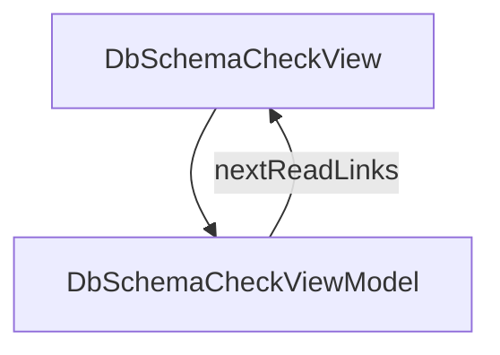

# DbSchemaCheck - DB schema check (docs/db ⇔ live DB)

## Overview

Concept essay: the builtin db-schema checker in `jsonui-doc check` — how docs/db table JSON (schema-only OpenAPI + x-* extensions) is compared against the live database schema, declaration vs declaration at confidence proof. Covers the file format (x-table-name, the nullable convention, x-primary-key / x-unique / x-auto-increment / x-index / x-indexes / x-foreign-key / x-db-type / x-enum-values, multi-DB directory layout), what exactly gets compared (tables and columns in both directions, family-based type matching, constraints, enums), how to declare the check in jui.config.json (databases map + checks entry, dump_command vs the builtin SQLAlchemy dumper via JSONUI_CHECK_DB_URL_<DB>), running it (`check db`, `.check-report.json`, the Implementation contract HTML page, exit-code gate), and what it does not check. Six H2 sections + TOC + next-reads. ~6-min read. Deep-dive companion to /concepts/implementation-contract-check.

| | |
|---|---|
| Created | 2026-07-24 |
| Updated | 2026-07-24 |

## Screen Structure

### UI Components

| Component | ID | Platform | Description | Initial State | Notes |
|---|---|---|---|---|---|
| View | `concepts_db_schema_check_root` | - | - | - | - |
| &nbsp;&nbsp;↳ Scroll | `concepts_db_schema_check_scroll` | - | - | - | - |
| &nbsp;&nbsp;&nbsp;&nbsp;↳ View | `concepts_db_schema_check_header` | - | - | - | - |
| &nbsp;&nbsp;&nbsp;&nbsp;&nbsp;&nbsp;↳ Label | `-` | - | - | - | - |
| &nbsp;&nbsp;&nbsp;&nbsp;&nbsp;&nbsp;↳ Label | `-` | - | - | - | - |
| &nbsp;&nbsp;&nbsp;&nbsp;&nbsp;&nbsp;↳ Label | `-` | - | - | - | - |
| &nbsp;&nbsp;&nbsp;&nbsp;&nbsp;&nbsp;↳ Label | `-` | - | - | - | - |
| &nbsp;&nbsp;&nbsp;&nbsp;↳ View | `concepts_db_schema_check_content_with_rail` | - | - | - | - |
| &nbsp;&nbsp;&nbsp;&nbsp;&nbsp;&nbsp;↳ View | `concepts_db_schema_check_body_column` | - | - | - | - |
| &nbsp;&nbsp;&nbsp;&nbsp;&nbsp;&nbsp;&nbsp;&nbsp;↳ View | `section_problem` | - | - | - | - |
| &nbsp;&nbsp;&nbsp;&nbsp;&nbsp;&nbsp;&nbsp;&nbsp;&nbsp;&nbsp;↳ Label | `-` | - | - | - | - |
| &nbsp;&nbsp;&nbsp;&nbsp;&nbsp;&nbsp;&nbsp;&nbsp;&nbsp;&nbsp;↳ Label | `-` | - | - | - | - |
| &nbsp;&nbsp;&nbsp;&nbsp;&nbsp;&nbsp;&nbsp;&nbsp;↳ View | `section_docs` | - | - | - | - |
| &nbsp;&nbsp;&nbsp;&nbsp;&nbsp;&nbsp;&nbsp;&nbsp;&nbsp;&nbsp;↳ Label | `-` | - | - | - | - |
| &nbsp;&nbsp;&nbsp;&nbsp;&nbsp;&nbsp;&nbsp;&nbsp;&nbsp;&nbsp;↳ Label | `-` | - | - | - | - |
| &nbsp;&nbsp;&nbsp;&nbsp;&nbsp;&nbsp;&nbsp;&nbsp;&nbsp;&nbsp;↳ CodeBlock | `-` | - | - | - | - |
| &nbsp;&nbsp;&nbsp;&nbsp;&nbsp;&nbsp;&nbsp;&nbsp;&nbsp;&nbsp;↳ Label | `-` | - | - | - | - |
| &nbsp;&nbsp;&nbsp;&nbsp;&nbsp;&nbsp;&nbsp;&nbsp;↳ View | `section_compared` | - | - | - | - |
| &nbsp;&nbsp;&nbsp;&nbsp;&nbsp;&nbsp;&nbsp;&nbsp;&nbsp;&nbsp;↳ Label | `-` | - | - | - | - |
| &nbsp;&nbsp;&nbsp;&nbsp;&nbsp;&nbsp;&nbsp;&nbsp;&nbsp;&nbsp;↳ Label | `-` | - | - | - | - |
| &nbsp;&nbsp;&nbsp;&nbsp;&nbsp;&nbsp;&nbsp;&nbsp;&nbsp;&nbsp;↳ Label | `-` | - | - | - | - |
| &nbsp;&nbsp;&nbsp;&nbsp;&nbsp;&nbsp;&nbsp;&nbsp;&nbsp;&nbsp;↳ Label | `-` | - | - | - | - |
| &nbsp;&nbsp;&nbsp;&nbsp;&nbsp;&nbsp;&nbsp;&nbsp;&nbsp;&nbsp;↳ Label | `-` | - | - | - | - |
| &nbsp;&nbsp;&nbsp;&nbsp;&nbsp;&nbsp;&nbsp;&nbsp;&nbsp;&nbsp;↳ Label | `-` | - | - | - | - |
| &nbsp;&nbsp;&nbsp;&nbsp;&nbsp;&nbsp;&nbsp;&nbsp;↳ View | `section_declare` | - | - | - | - |
| &nbsp;&nbsp;&nbsp;&nbsp;&nbsp;&nbsp;&nbsp;&nbsp;&nbsp;&nbsp;↳ Label | `-` | - | - | - | - |
| &nbsp;&nbsp;&nbsp;&nbsp;&nbsp;&nbsp;&nbsp;&nbsp;&nbsp;&nbsp;↳ Label | `-` | - | - | - | - |
| &nbsp;&nbsp;&nbsp;&nbsp;&nbsp;&nbsp;&nbsp;&nbsp;&nbsp;&nbsp;↳ CodeBlock | `-` | - | - | - | - |
| &nbsp;&nbsp;&nbsp;&nbsp;&nbsp;&nbsp;&nbsp;&nbsp;&nbsp;&nbsp;↳ Label | `-` | - | - | - | - |
| &nbsp;&nbsp;&nbsp;&nbsp;&nbsp;&nbsp;&nbsp;&nbsp;↳ View | `section_run` | - | - | - | - |
| &nbsp;&nbsp;&nbsp;&nbsp;&nbsp;&nbsp;&nbsp;&nbsp;&nbsp;&nbsp;↳ Label | `-` | - | - | - | - |
| &nbsp;&nbsp;&nbsp;&nbsp;&nbsp;&nbsp;&nbsp;&nbsp;&nbsp;&nbsp;↳ Label | `-` | - | - | - | - |
| &nbsp;&nbsp;&nbsp;&nbsp;&nbsp;&nbsp;&nbsp;&nbsp;&nbsp;&nbsp;↳ CodeBlock | `-` | - | - | - | - |
| &nbsp;&nbsp;&nbsp;&nbsp;&nbsp;&nbsp;&nbsp;&nbsp;&nbsp;&nbsp;↳ Label | `-` | - | - | - | - |
| &nbsp;&nbsp;&nbsp;&nbsp;&nbsp;&nbsp;&nbsp;&nbsp;↳ View | `section_limits` | - | - | - | - |
| &nbsp;&nbsp;&nbsp;&nbsp;&nbsp;&nbsp;&nbsp;&nbsp;&nbsp;&nbsp;↳ Label | `-` | - | - | - | - |
| &nbsp;&nbsp;&nbsp;&nbsp;&nbsp;&nbsp;&nbsp;&nbsp;&nbsp;&nbsp;↳ Label | `-` | - | - | - | - |
| &nbsp;&nbsp;&nbsp;&nbsp;&nbsp;&nbsp;&nbsp;&nbsp;↳ View | `concepts_db_schema_check_next` | - | - | - | - |
| &nbsp;&nbsp;&nbsp;&nbsp;&nbsp;&nbsp;&nbsp;&nbsp;&nbsp;&nbsp;↳ Label | `-` | - | - | - | - |
| &nbsp;&nbsp;&nbsp;&nbsp;&nbsp;&nbsp;&nbsp;&nbsp;&nbsp;&nbsp;↳ Collection | `concepts_db_schema_check_next_collection` | - | - | - | - |
| &nbsp;&nbsp;&nbsp;&nbsp;&nbsp;&nbsp;&nbsp;&nbsp;↳ View | `concepts_db_schema_check_footer` | - | - | - | - |
| &nbsp;&nbsp;&nbsp;&nbsp;&nbsp;&nbsp;&nbsp;&nbsp;&nbsp;&nbsp;↳ Label | `-` | - | - | - | - |
| &nbsp;&nbsp;&nbsp;&nbsp;&nbsp;&nbsp;↳ View | `concepts_db_schema_check_rail_column` | - | - | - | - |
| &nbsp;&nbsp;&nbsp;&nbsp;&nbsp;&nbsp;&nbsp;&nbsp;↳ View | `concepts_db_schema_check_toc_wrap` | - | - | - | - |
| &nbsp;&nbsp;&nbsp;&nbsp;&nbsp;&nbsp;&nbsp;&nbsp;&nbsp;&nbsp;↳ TableOfContents | `-` | - | - | - | - |

### Layout Structure

```
concepts_db_schema_check_root
└── concepts_db_schema_check_scroll
```

## Data Flow



### ViewModel

#### Methods

| Signature | Platforms | Description |
|---|---|---|
| `onAppear()` | all | Seed nextReadLinks from the module-scope catalog (three rows: next_contract -> /concepts/implementation-contract-check, next_verify_guide -> /guides/verifying-implementation-against-docs, next_cli_reference -> /reference/cli-commands). Each row's titleKey / descriptionKey is resolved through StringManager with the concepts_db_schema_check_ namespace prefix. |
| `onNavigate(url: String)` | all | router.push(url). |

## State Management

### UI Data Variables

| Variable Name | Type | Description | Notes |
|---|---|---|---|
| `nextReadLinks` | [NextReadLink] | Three follow-up cards: concepts/implementation-contract-check (umbrella concept), guides/verifying-implementation-against-docs (cookbook) and reference/cli-commands (command details). | - |

### View-local Event Handlers

_Handlers kept inside the View layer. ViewModel public API lives under `dataFlow.viewModel`._

| Handler | Description | Notes |
|---|---|---|
| `onAppear` | Seed nextReadLinks. | - |
| `onNavigate` | Client-side navigation. | - |
| `onNavigateConcepts` |  | - |

## User Actions

| Action | Processing | Destination | Notes |
|---|---|---|---|
| Tap a TOC entry | TOC-internal scroll. | - | - |
| Tap a NextReadLink card | onNavigate(url). | - | - |

## Validation

## Transitions

| Condition | Destination | Notes |
|---|---|---|
| url is a spec-mapped concept URL or the guide or the CLI reference | Target spec screen or tab | - |

## Related Files

| Type | File Path | Notes |
|---|---|---|
| Layout | `docs/screens/layouts/concepts/db-schema-check.json` | - |
| ViewModel | `jsonui-doc-web/src/viewmodels/concepts/DbSchemaCheckViewModel.ts` | - |
| View | `jsonui-doc-web/src/app/concepts/db-schema-check/page.tsx` | - |

## Notes

- 2026-07-24 — Dedicated deep-dive page for the DB side of `jsonui-doc check`, split out from /concepts/implementation-contract-check (which stays the umbrella essay: check-vs-generate, confidence levels, plugin tiers).
- Six H2 sections + TOC + next-reads (3 cards).
- Section 1 — section_problem: docs/db is the SSoT for the data model but migrations move the real schema without touching it; `jui verify` guards docs→code, not docs→database. The db-schema checker closes the loop from the DB side.
- Section 2 — section_docs: the table JSON format. One table per file (first non-enum object schema; files with `paths` are skipped as API docs), `info.x-table-name` fallback snake_case, nullable-only NOT-NULL convention (`required` deliberately not reused), multi-DB directory layout, enum companion schemas + x-enum-values, x-foreign-key enforced:false = ERD-only reference. Worked users.json CodeBlock inline in the layout.
- Section 3 — section_compared: tables both directions (missing_in_impl / missing_in_doc, default-ignored migration bookkeeping tables + ignore_tables), columns (family-based type match, x-db-type exact pin, maxLength), constraints & indexes (x-primary-key / x-unique / x-auto-increment / x-index / x-indexes / x-foreign-key), enums & nullability. All findings confidence=proof.
- Section 4 — section_declare: jui.config.json databases map + checks entry (builtin:db-schema). Two schema sources: dump_command (normalized {tables:{}} JSON on stdout) or the builtin SQLAlchemy dumper via JSONUI_CHECK_DB_URL_<DATABASE>. Security contract: no credentials in config, only declared commands run, scripts inside project root.
- Section 5 — section_run: `check --list` / `check db` / `check db:<name>`, report at docs/db/.check-report.json (named DB subdir), rendered by `generate html` (--with-checks sugar) as the Implementation contract page, exit codes 0/1/2 as the CI gate, input_hashes stale banner.
- Section 6 — section_limits: structure only, not data; semantic invariants are full-checker territory; family-based type matching unless x-db-type pins the column.
- Strings prefix: concepts_db_schema_check_ (namespace). en + ja owned by jsonui-localize.
- Public repo hygiene: no consumer project names; generic domain examples only (users / plans).
- Cross-links: /concepts/implementation-contract-check gained a third next-read card pointing here (next_db_schema).
