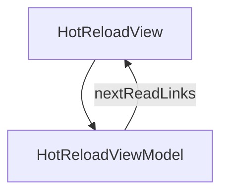

# HotReload - Hot reload everywhere

## Overview

Essay: how hot reload works on each platform — Dynamic mode on iOS, Dynamic mode on Android, the project's own React dev server on web — and why one edit yields three live reloads. Four H2 sections. ~5-min read.

| | |
|---|---|
| Created | 2026-04-23 |
| Updated | 2026-04-23 |

## Screen Structure

### UI Components

| Component | ID | Platform | Description | Initial State | Notes |
|---|---|---|---|---|---|
| View | `concepts_hot_reload_root` | - | - | - | - |
| &nbsp;&nbsp;↳ Scroll | `concepts_hot_reload_scroll` | - | - | - | - |
| &nbsp;&nbsp;&nbsp;&nbsp;↳ View | `concepts_hot_reload_header` | - | - | - | - |
| &nbsp;&nbsp;&nbsp;&nbsp;&nbsp;&nbsp;↳ Label | `-` | - | - | - | - |
| &nbsp;&nbsp;&nbsp;&nbsp;&nbsp;&nbsp;↳ Label | `-` | - | - | - | - |
| &nbsp;&nbsp;&nbsp;&nbsp;&nbsp;&nbsp;↳ Label | `-` | - | - | - | - |
| &nbsp;&nbsp;&nbsp;&nbsp;&nbsp;&nbsp;↳ Label | `-` | - | - | - | - |
| &nbsp;&nbsp;&nbsp;&nbsp;↳ View | `concepts_hot_reload_content_with_rail` | - | - | - | - |
| &nbsp;&nbsp;&nbsp;&nbsp;&nbsp;&nbsp;↳ View | `concepts_hot_reload_body_column` | - | - | - | - |
| &nbsp;&nbsp;&nbsp;&nbsp;&nbsp;&nbsp;&nbsp;&nbsp;↳ View | `section_web` | - | - | - | - |
| &nbsp;&nbsp;&nbsp;&nbsp;&nbsp;&nbsp;&nbsp;&nbsp;&nbsp;&nbsp;↳ Label | `-` | - | - | - | - |
| &nbsp;&nbsp;&nbsp;&nbsp;&nbsp;&nbsp;&nbsp;&nbsp;&nbsp;&nbsp;↳ Label | `-` | - | - | - | - |
| &nbsp;&nbsp;&nbsp;&nbsp;&nbsp;&nbsp;&nbsp;&nbsp;&nbsp;&nbsp;↳ CodeBlock | `-` | - | - | - | - |
| &nbsp;&nbsp;&nbsp;&nbsp;&nbsp;&nbsp;&nbsp;&nbsp;↳ View | `section_ios` | - | - | - | - |
| &nbsp;&nbsp;&nbsp;&nbsp;&nbsp;&nbsp;&nbsp;&nbsp;&nbsp;&nbsp;↳ Label | `-` | - | - | - | - |
| &nbsp;&nbsp;&nbsp;&nbsp;&nbsp;&nbsp;&nbsp;&nbsp;&nbsp;&nbsp;↳ Label | `-` | - | - | - | - |
| &nbsp;&nbsp;&nbsp;&nbsp;&nbsp;&nbsp;&nbsp;&nbsp;&nbsp;&nbsp;↳ CodeBlock | `-` | - | - | - | - |
| &nbsp;&nbsp;&nbsp;&nbsp;&nbsp;&nbsp;&nbsp;&nbsp;&nbsp;&nbsp;↳ CodeBlock | `-` | - | - | - | - |
| &nbsp;&nbsp;&nbsp;&nbsp;&nbsp;&nbsp;&nbsp;&nbsp;↳ View | `section_android` | - | - | - | - |
| &nbsp;&nbsp;&nbsp;&nbsp;&nbsp;&nbsp;&nbsp;&nbsp;&nbsp;&nbsp;↳ Label | `-` | - | - | - | - |
| &nbsp;&nbsp;&nbsp;&nbsp;&nbsp;&nbsp;&nbsp;&nbsp;&nbsp;&nbsp;↳ Label | `-` | - | - | - | - |
| &nbsp;&nbsp;&nbsp;&nbsp;&nbsp;&nbsp;&nbsp;&nbsp;&nbsp;&nbsp;↳ CodeBlock | `-` | - | - | - | - |
| &nbsp;&nbsp;&nbsp;&nbsp;&nbsp;&nbsp;&nbsp;&nbsp;&nbsp;&nbsp;↳ CodeBlock | `-` | - | - | - | - |
| &nbsp;&nbsp;&nbsp;&nbsp;&nbsp;&nbsp;&nbsp;&nbsp;↳ View | `section_why` | - | - | - | - |
| &nbsp;&nbsp;&nbsp;&nbsp;&nbsp;&nbsp;&nbsp;&nbsp;&nbsp;&nbsp;↳ Label | `-` | - | - | - | - |
| &nbsp;&nbsp;&nbsp;&nbsp;&nbsp;&nbsp;&nbsp;&nbsp;&nbsp;&nbsp;↳ Label | `-` | - | - | - | - |
| &nbsp;&nbsp;&nbsp;&nbsp;&nbsp;&nbsp;&nbsp;&nbsp;↳ View | `concepts_hot_reload_next` | - | - | - | - |
| &nbsp;&nbsp;&nbsp;&nbsp;&nbsp;&nbsp;&nbsp;&nbsp;&nbsp;&nbsp;↳ Label | `-` | - | - | - | - |
| &nbsp;&nbsp;&nbsp;&nbsp;&nbsp;&nbsp;&nbsp;&nbsp;&nbsp;&nbsp;↳ Collection | `concepts_hot_reload_next_collection` | - | - | - | - |
| &nbsp;&nbsp;&nbsp;&nbsp;&nbsp;&nbsp;&nbsp;&nbsp;↳ View | `concepts_hot_reload_footer` | - | - | - | - |
| &nbsp;&nbsp;&nbsp;&nbsp;&nbsp;&nbsp;&nbsp;&nbsp;&nbsp;&nbsp;↳ Label | `-` | - | - | - | - |
| &nbsp;&nbsp;&nbsp;&nbsp;&nbsp;&nbsp;↳ View | `concepts_hot_reload_rail_column` | - | - | - | - |
| &nbsp;&nbsp;&nbsp;&nbsp;&nbsp;&nbsp;&nbsp;&nbsp;↳ View | `concepts_hot_reload_toc_wrap` | - | - | - | - |
| &nbsp;&nbsp;&nbsp;&nbsp;&nbsp;&nbsp;&nbsp;&nbsp;&nbsp;&nbsp;↳ TableOfContents | `-` | - | - | - | - |

### Layout Structure

```
concepts_hot_reload_root
└── concepts_hot_reload_scroll
```

## Data Flow



### ViewModel

#### Methods

| Signature | Platforms | Description |
|---|---|---|
| `onAppear()` | all | Seed nextReadLinks from the module-scope NEXT_READ_ENTRIES catalog (two rows: next_viewmodel -> /concepts/viewmodel-owned-state, next_why_spec_first -> /concepts/why-spec-first) and stamp currentLanguage from StringManager.language. Each row's titleKey / descriptionKey is resolved through StringManager with the concepts_hot_reload_ namespace prefix. |
| `onNavigate(url: String)` | all | Client-side navigation via router.push(url). Destinations are the spec-mapped concept URLs enumerated in transitions: /concepts, /concepts/viewmodel-owned-state, /concepts/why-spec-first. |

#### Vars

| Declaration | Flags | Platforms | Description |
|---|---|---|---|
| `var nextReadLinks: Array(NextReadLink)` | observable | all | Two closing 'read next' cards pointing at /concepts/viewmodel-owned-state and /concepts/why-spec-first. Seeded by onAppear from the NEXT_READ_ENTRIES static catalog and re-seeded by onToggleLanguage. |

## State Management

### UI Data Variables

| Variable Name | Type | Description | Notes |
|---|---|---|---|
| `nextReadLinks` | [NextReadLink] | Two follow-up essays. | - |

### View-local Event Handlers

_Handlers kept inside the View layer. ViewModel public API lives under `dataFlow.viewModel`._

| Handler | Description | Notes |
|---|---|---|
| `onAppear` | Seed nextReadLinks. | - |
| `onNavigate` | Client-side navigation. | - |
| `onNavigateConcepts` |  | - |

## User Actions

| Action | Processing | Destination | Notes |
|---|---|---|---|
| Tap a TOC entry | TOC-internal scroll. | - | - |
| Tap a NextReadLink card | onNavigate(url). | - | - |

## Validation

## Transitions

| Condition | Destination | Notes |
|---|---|---|
| url is a spec-mapped concept URL or /concepts | Target spec screen or tab | - |

## Related Files

| Type | File Path | Notes |
|---|---|---|
| Layout | `docs/screens/layouts/concepts/hot-reload.json` | - |
| ViewModel | `jsonui-doc-web/src/viewmodels/concepts/HotReloadViewModel.ts` | - |
| View | `jsonui-doc-web/src/app/concepts/hot-reload/page.tsx` | - |

## Notes

- Fifth and final concepts essay. Flipping CONCEPTS_ENTRIES row 5 to 'live' completes the Concepts tab.
- Focus on the *mechanism*, not the UX — this page is for readers who want to understand why changing a JSON in an editor causes their iPhone simulator to re-render.
- Web section is framework-neutral by measurement (2026-08-25): the hotload server's supported platforms are ios and android only (web is build-step only), Next.js App Router is merely the default web_framework adapter, and the toolchain's own web conformance host is Vite + React with no Next dependency. Do not re-frame this section as Next-specific.
