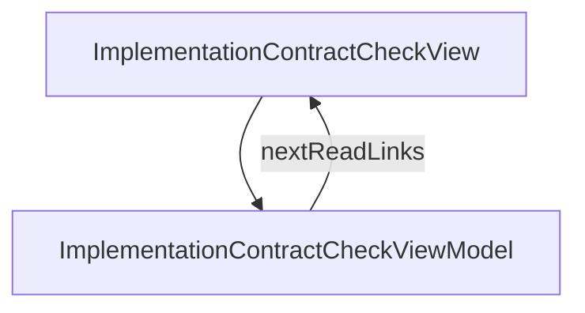

# ImplementationContractCheck - Implementation contract check

## Overview

Concept essay: how `jsonui-doc check` verifies docs (spec / swagger / DB models) against the real implementation. Explains the check-vs-generate split (check is a producer, generate is a renderer; docs must be buildable without touching the network), the three confidence levels (proof / metadata / sampled), the two plugin tiers (adapter type vs full-checker type), how the results surface as an 'implementation contract' page in the generated HTML, and the limits of static-declaration diffing. Six H2 sections + TOC + next-reads. ~7-min read. Companion to /guides/verifying-implementation-against-docs which is the cookbook.

| | |
|---|---|
| Created | 2026-07-07 |
| Updated | 2026-07-07 |

## Screen Structure

### UI Components

| Component | ID | Platform | Description | Initial State | Notes |
|---|---|---|---|---|---|
| View | `concepts_implementation_contract_check_root` | - | - | - | - |
| &nbsp;&nbsp;↳ Scroll | `concepts_implementation_contract_check_scroll` | - | - | - | - |
| &nbsp;&nbsp;&nbsp;&nbsp;↳ View | `concepts_implementation_contract_check_header` | - | - | - | - |
| &nbsp;&nbsp;&nbsp;&nbsp;&nbsp;&nbsp;↳ Label | `-` | - | - | - | - |
| &nbsp;&nbsp;&nbsp;&nbsp;&nbsp;&nbsp;↳ Label | `-` | - | - | - | - |
| &nbsp;&nbsp;&nbsp;&nbsp;&nbsp;&nbsp;↳ Label | `-` | - | - | - | - |
| &nbsp;&nbsp;&nbsp;&nbsp;&nbsp;&nbsp;↳ Label | `-` | - | - | - | - |
| &nbsp;&nbsp;&nbsp;&nbsp;↳ View | `concepts_implementation_contract_check_content_with_rail` | - | - | - | - |
| &nbsp;&nbsp;&nbsp;&nbsp;&nbsp;&nbsp;↳ View | `concepts_implementation_contract_check_body_column` | - | - | - | - |
| &nbsp;&nbsp;&nbsp;&nbsp;&nbsp;&nbsp;&nbsp;&nbsp;↳ View | `section_problem` | - | - | - | - |
| &nbsp;&nbsp;&nbsp;&nbsp;&nbsp;&nbsp;&nbsp;&nbsp;&nbsp;&nbsp;↳ Label | `-` | - | - | - | - |
| &nbsp;&nbsp;&nbsp;&nbsp;&nbsp;&nbsp;&nbsp;&nbsp;&nbsp;&nbsp;↳ Label | `-` | - | - | - | - |
| &nbsp;&nbsp;&nbsp;&nbsp;&nbsp;&nbsp;&nbsp;&nbsp;↳ View | `section_split` | - | - | - | - |
| &nbsp;&nbsp;&nbsp;&nbsp;&nbsp;&nbsp;&nbsp;&nbsp;&nbsp;&nbsp;↳ Label | `-` | - | - | - | - |
| &nbsp;&nbsp;&nbsp;&nbsp;&nbsp;&nbsp;&nbsp;&nbsp;&nbsp;&nbsp;↳ Label | `-` | - | - | - | - |
| &nbsp;&nbsp;&nbsp;&nbsp;&nbsp;&nbsp;&nbsp;&nbsp;↳ View | `section_confidence` | - | - | - | - |
| &nbsp;&nbsp;&nbsp;&nbsp;&nbsp;&nbsp;&nbsp;&nbsp;&nbsp;&nbsp;↳ Label | `-` | - | - | - | - |
| &nbsp;&nbsp;&nbsp;&nbsp;&nbsp;&nbsp;&nbsp;&nbsp;&nbsp;&nbsp;↳ Label | `-` | - | - | - | - |
| &nbsp;&nbsp;&nbsp;&nbsp;&nbsp;&nbsp;&nbsp;&nbsp;↳ View | `section_plugin_tiers` | - | - | - | - |
| &nbsp;&nbsp;&nbsp;&nbsp;&nbsp;&nbsp;&nbsp;&nbsp;&nbsp;&nbsp;↳ Label | `-` | - | - | - | - |
| &nbsp;&nbsp;&nbsp;&nbsp;&nbsp;&nbsp;&nbsp;&nbsp;&nbsp;&nbsp;↳ Label | `-` | - | - | - | - |
| &nbsp;&nbsp;&nbsp;&nbsp;&nbsp;&nbsp;&nbsp;&nbsp;↳ View | `section_reading` | - | - | - | - |
| &nbsp;&nbsp;&nbsp;&nbsp;&nbsp;&nbsp;&nbsp;&nbsp;&nbsp;&nbsp;↳ Label | `-` | - | - | - | - |
| &nbsp;&nbsp;&nbsp;&nbsp;&nbsp;&nbsp;&nbsp;&nbsp;&nbsp;&nbsp;↳ Label | `-` | - | - | - | - |
| &nbsp;&nbsp;&nbsp;&nbsp;&nbsp;&nbsp;&nbsp;&nbsp;&nbsp;&nbsp;↳ Label | `-` | - | - | - | - |
| &nbsp;&nbsp;&nbsp;&nbsp;&nbsp;&nbsp;&nbsp;&nbsp;&nbsp;&nbsp;↳ CodeBlock | `-` | - | - | - | - |
| &nbsp;&nbsp;&nbsp;&nbsp;&nbsp;&nbsp;&nbsp;&nbsp;↳ View | `section_limits` | - | - | - | - |
| &nbsp;&nbsp;&nbsp;&nbsp;&nbsp;&nbsp;&nbsp;&nbsp;&nbsp;&nbsp;↳ Label | `-` | - | - | - | - |
| &nbsp;&nbsp;&nbsp;&nbsp;&nbsp;&nbsp;&nbsp;&nbsp;&nbsp;&nbsp;↳ Label | `-` | - | - | - | - |
| &nbsp;&nbsp;&nbsp;&nbsp;&nbsp;&nbsp;&nbsp;&nbsp;↳ View | `concepts_implementation_contract_check_next` | - | - | - | - |
| &nbsp;&nbsp;&nbsp;&nbsp;&nbsp;&nbsp;&nbsp;&nbsp;&nbsp;&nbsp;↳ Label | `-` | - | - | - | - |
| &nbsp;&nbsp;&nbsp;&nbsp;&nbsp;&nbsp;&nbsp;&nbsp;&nbsp;&nbsp;↳ Collection | `concepts_implementation_contract_check_next_collection` | - | - | - | - |
| &nbsp;&nbsp;&nbsp;&nbsp;&nbsp;&nbsp;&nbsp;&nbsp;↳ View | `concepts_implementation_contract_check_footer` | - | - | - | - |
| &nbsp;&nbsp;&nbsp;&nbsp;&nbsp;&nbsp;&nbsp;&nbsp;&nbsp;&nbsp;↳ Label | `-` | - | - | - | - |
| &nbsp;&nbsp;&nbsp;&nbsp;&nbsp;&nbsp;↳ View | `concepts_implementation_contract_check_rail_column` | - | - | - | - |
| &nbsp;&nbsp;&nbsp;&nbsp;&nbsp;&nbsp;&nbsp;&nbsp;↳ View | `concepts_implementation_contract_check_toc_wrap` | - | - | - | - |
| &nbsp;&nbsp;&nbsp;&nbsp;&nbsp;&nbsp;&nbsp;&nbsp;&nbsp;&nbsp;↳ TableOfContents | `-` | - | - | - | - |

### Layout Structure

```
concepts_implementation_contract_check_root
└── concepts_implementation_contract_check_scroll
```

## Data Flow



### ViewModel

#### Methods

| Signature | Platforms | Description |
|---|---|---|
| `onAppear()` | all | Seed nextReadLinks from the module-scope NEXT_READ_ENTRIES catalog (two rows: next_verify_guide -> /guides/verifying-implementation-against-docs, next_cli_reference -> /reference/cli-commands) and stamp currentLanguage from StringManager.language. Each row's titleKey / descriptionKey is resolved through StringManager with the concepts_implementation_contract_check_ namespace prefix. |
| `onNavigate(url: String)` | all | Client-side navigation via router.push(url). Destinations are enumerated in transitions: /concepts, /guides/verifying-implementation-against-docs, /reference/cli-commands. |

#### Vars

| Declaration | Flags | Platforms | Description |
|---|---|---|---|
| `var nextReadLinks: Array(NextReadLink)` | observable | all | Two closing 'read next' cards pointing at the cookbook guide and the CLI reference. Seeded by onAppear from the NEXT_READ_ENTRIES static catalog and re-seeded by onToggleLanguage. |

## State Management

### UI Data Variables

| Variable Name | Type | Description | Notes |
|---|---|---|---|
| `nextReadLinks` | [NextReadLink] | Three follow-up cards: concepts/db-schema-check (DB-side deep dive), guides/verifying-implementation-against-docs (cookbook) and reference/cli-commands (command details). | - |

### View-local Event Handlers

_Handlers kept inside the View layer. ViewModel public API lives under `dataFlow.viewModel`._

| Handler | Description | Notes |
|---|---|---|
| `onAppear` | Seed nextReadLinks. | - |
| `onNavigate` | Client-side navigation. | - |
| `onNavigateConcepts` |  | - |

## User Actions

| Action | Processing | Destination | Notes |
|---|---|---|---|
| Tap a TOC entry | TOC-internal scroll. | - | - |
| Tap a NextReadLink card | onNavigate(url). | - | - |

## Validation

## Transitions

| Condition | Destination | Notes |
|---|---|---|
| url is a spec-mapped concept URL or the guide or the CLI reference | Target spec screen or tab | - |

## Related Files

| Type | File Path | Notes |
|---|---|---|
| Layout | `docs/screens/layouts/concepts/implementation-contract-check.json` | - |
| ViewModel | `jsonui-doc-web/src/viewmodels/concepts/ImplementationContractCheckViewModel.ts` | - |
| View | `jsonui-doc-web/src/app/concepts/implementation-contract-check/page.tsx` | - |

## Notes

- 2026-07-07 — New concept essay for the doc-contract-check feature. Explains the design principles behind `jsonui-doc check`, mapping to the upstream jsonui-cli 2026-07-07-doc-contract-check-00/01/02/03 proposals (all Phase 1–3 implemented, Phase 4 non-RDB deferred).
- Six H2 sections + TOC + next-reads (3 cards). Companion cookbook lives at /guides/verifying-implementation-against-docs.
- Section 1 — section_problem: docs (spec / swagger / DB models) are the SSoT for generation, but drift between docs and the real implementation (running server, live DB) has historically been a human-vigilance problem. 上流の `jui verify --fail-on-diff` は doc→ code パイプライン内の DTO 再生成 drift しか掴めなかった。この空白を埋めるのが contract check.
- Section 2 — section_split: 「check = 生産者 / generate = 描画者」の分離原則。`jsonui-doc generate html` は接続情報のない環境でも常に成功する不変条件を守る (clone → generate html で第三者コード実行ゼロ)。`jsonui-doc check` は明示コマンドで、config 宣言済みチェッカーを実行前に `--list` で開示し、タイムアウト付き。check が保存した `docs/**/.check-report.json` を generate が読み込んで描画する形。テストと同格の「コードを実行する明示コマンド」。
- Section 3 — section_confidence: 結果 JSON の `confidence` フィールドは 3 段階。`proof` = スキーマ・宣言同士の照合 (RDB スキーマ vs docs/db、OpenAPI vs docs/api)。`metadata` = キー・インデックス等の部分照合 (Firestore の複合 index など、Phase 4)。`sampled` = 実データのサンプリング検証 (「サンプル 1000 件で違反なし」— 証明にはならない、Phase 4)。同じ「mismatch なし」でも証明レベルが違うことを明示する設計。
- Section 4 — section_plugin_tiers: 「アダプタ型」(推奨の入口) は事実を所定形式で吐くコマンドだけ書き、比較・判定・レポート生成はライブラリ側。数十行で書ける。「フルチェッカー型」は比較まで自分で行い、結果 JSON を stdout に出す。実 API を認証付きで叩いて実レスポンスを検証する等、アダプタで表現できないケース用。ビルトインチェッカー (`builtin:openapi-diff` / `builtin:db-schema`) は同じソケットに挿さる 'アダプタ型と同じ契約に乗った同梱プラグイン'。
- Section 5 — section_reading: 生成 HTML の「実装との整合性」ページの読み方。検証時刻つきステータス (例: '2026-07-07 14:00 時点の main (MySQL 8.0) と照合済み ✓')、mismatch 一覧、鮮度判定 (レポート保存後に docs が変更されていれば stale 表示、input_hashes 比較)、confidence バッジ。exit code 0 = OK / 1 = mismatch / 2 = 実行エラー。CI ゲートは check コマンドの exit code (0/1/2) を見る側の仕事で、generate html は check が失敗していても成功する (「ズレている時こそ、どこがズレているかのページを見たい」)。
- Section 6 — section_limits: 見つけられない差分。OpenAPI diff は「実装が宣言するスキーマとの照合」であって「実レスポンスの検証ではない」。認証を通して staging を叩く / シードデータ / 意味的規約 (特定カラムの NULL の意味など) の検証はフルチェッカー型の領域。DB schema チェッカーも「型ファミリ一致が既定」で、厳密型を強制したい列だけ `x-db-type: 'DECIMAL(10,2)'` を書けば完全一致比較になる。抜けの構造を先に開示することで、誤った安心感を避ける。
- Three closing next-reads: (0) next_db_schema -> /concepts/db-schema-check (DB-side deep dive, added 2026-07-24), (1) next_verify_guide -> /guides/verifying-implementation-against-docs (cookbook — 実際のチェッカー宣言 + FastAPI アダプタ例 + CI での回し方), (2) next_cli_reference -> /reference/cli-commands (jsonui-doc check の全サブコマンド + exit code + config スキーマ).
- Strings prefix: concepts_implementation_contract_check_ (namespace). Estimated 50-70 keys (breadcrumb / title / lead / read_time / 6 x heading+body / 6 x toc rows / 2 x next-read title+description / footer / toc_title). en + ja owned by jsonui-localize.
- Public repo hygiene: no consumer project names, no specific schema/table language from upstream implementation corpus. Use generic domain examples (orders / users / products) if concrete samples are needed. Concrete code samples for `impl_openapi_command` etc. belong to the companion guide, not this concept essay.
- Cross-links from other pages: (a) /reference/cli-commands section_checks_body already references this page indirectly ('cookbook 予定'). (b) /guides/api-data-models section_ci_body mentions check but does not link to this page yet (link to be added when both new pages are live). (c) Home RECENT_CHANGES entry to be added.
- 2026-08-31 — section_reading_summary added for jsonui-cli 1.7.20, which makes the check summary name its unit and denominator. Measured on a four-operation fixture with a cat-based impl_openapi_command: nothing excluded prints [4/4 operation], ignore_paths ['/internal/*'] prints [3/4 operation, 1 excluded by config], and excluding every path prints [0/4 operation, 4 excluded by config] plus a warning that nothing was compared. The published emphasis is the part the warning does not change: the exit code in that last case is still 0 (measured), so a pipeline gating on exit code alone cannot tell it from a clean pass. The inputs block was read out of the generated .check-report.json — impl_openapi_sha256 and doc_files always present, doc_source_rev absent until the fixture was made a git repository, which is the documented 'absent rather than guessed' behaviour and the reason it is labelled as the docs side rather than the implementation's.
