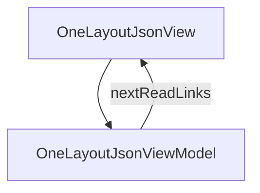

# OneLayoutJson - One Layout JSON per screen

## Overview

Essay: why a single Layout JSON drives SwiftUI, Jetpack Compose, and Next.js — and the constraints this choice imposes. Five H2 sections (2026-07 addition: normalization levels L0/L1/L2). ~6-min read. 2026-05 cross-link: a closing paragraph notes that the same one-source-of-truth principle applies to API data models — one OpenAPI schema drives generated DTOs and Domain scaffolds across all three platforms — and points the reader at /concepts/data-models-from-openapi.

| | |
|---|---|
| Created | 2026-04-23 |
| Updated | 2026-07-07 |

## Screen Structure

### UI Components

| Component | ID | Platform | Description | Initial State | Notes |
|---|---|---|---|---|---|
| View | `concepts_one_layout_json_root` | - | - | - | - |
| &nbsp;&nbsp;↳ Scroll | `concepts_one_layout_json_scroll` | - | - | - | - |
| &nbsp;&nbsp;&nbsp;&nbsp;↳ View | `concepts_one_layout_json_header` | - | - | - | - |
| &nbsp;&nbsp;&nbsp;&nbsp;&nbsp;&nbsp;↳ Label | `-` | - | - | - | - |
| &nbsp;&nbsp;&nbsp;&nbsp;&nbsp;&nbsp;↳ Label | `-` | - | - | - | - |
| &nbsp;&nbsp;&nbsp;&nbsp;&nbsp;&nbsp;↳ Label | `-` | - | - | - | - |
| &nbsp;&nbsp;&nbsp;&nbsp;&nbsp;&nbsp;↳ Label | `-` | - | - | - | - |
| &nbsp;&nbsp;&nbsp;&nbsp;↳ View | `concepts_one_layout_json_content_with_rail` | - | - | - | - |
| &nbsp;&nbsp;&nbsp;&nbsp;&nbsp;&nbsp;↳ View | `concepts_one_layout_json_body_column` | - | - | - | - |
| &nbsp;&nbsp;&nbsp;&nbsp;&nbsp;&nbsp;&nbsp;&nbsp;↳ View | `section_one_source` | - | - | - | - |
| &nbsp;&nbsp;&nbsp;&nbsp;&nbsp;&nbsp;&nbsp;&nbsp;&nbsp;&nbsp;↳ Label | `-` | - | - | - | - |
| &nbsp;&nbsp;&nbsp;&nbsp;&nbsp;&nbsp;&nbsp;&nbsp;&nbsp;&nbsp;↳ Label | `-` | - | - | - | - |
| &nbsp;&nbsp;&nbsp;&nbsp;&nbsp;&nbsp;&nbsp;&nbsp;&nbsp;&nbsp;↳ CodeBlock | `-` | - | - | - | - |
| &nbsp;&nbsp;&nbsp;&nbsp;&nbsp;&nbsp;&nbsp;&nbsp;↳ View | `section_three_out` | - | - | - | - |
| &nbsp;&nbsp;&nbsp;&nbsp;&nbsp;&nbsp;&nbsp;&nbsp;&nbsp;&nbsp;↳ Label | `-` | - | - | - | - |
| &nbsp;&nbsp;&nbsp;&nbsp;&nbsp;&nbsp;&nbsp;&nbsp;&nbsp;&nbsp;↳ Label | `-` | - | - | - | - |
| &nbsp;&nbsp;&nbsp;&nbsp;&nbsp;&nbsp;&nbsp;&nbsp;&nbsp;&nbsp;↳ CodeBlock | `-` | - | - | - | - |
| &nbsp;&nbsp;&nbsp;&nbsp;&nbsp;&nbsp;&nbsp;&nbsp;&nbsp;&nbsp;↳ CodeBlock | `-` | - | - | - | - |
| &nbsp;&nbsp;&nbsp;&nbsp;&nbsp;&nbsp;&nbsp;&nbsp;&nbsp;&nbsp;↳ CodeBlock | `-` | - | - | - | - |
| &nbsp;&nbsp;&nbsp;&nbsp;&nbsp;&nbsp;&nbsp;&nbsp;↳ View | `section_norm_levels` | - | - | - | - |
| &nbsp;&nbsp;&nbsp;&nbsp;&nbsp;&nbsp;&nbsp;&nbsp;&nbsp;&nbsp;↳ Label | `-` | - | - | - | - |
| &nbsp;&nbsp;&nbsp;&nbsp;&nbsp;&nbsp;&nbsp;&nbsp;&nbsp;&nbsp;↳ Label | `-` | - | - | - | - |
| &nbsp;&nbsp;&nbsp;&nbsp;&nbsp;&nbsp;&nbsp;&nbsp;&nbsp;&nbsp;↳ CodeBlock | `-` | - | - | - | - |
| &nbsp;&nbsp;&nbsp;&nbsp;&nbsp;&nbsp;&nbsp;&nbsp;↳ View | `section_constraints` | - | - | - | - |
| &nbsp;&nbsp;&nbsp;&nbsp;&nbsp;&nbsp;&nbsp;&nbsp;&nbsp;&nbsp;↳ Label | `-` | - | - | - | - |
| &nbsp;&nbsp;&nbsp;&nbsp;&nbsp;&nbsp;&nbsp;&nbsp;&nbsp;&nbsp;↳ Label | `-` | - | - | - | - |
| &nbsp;&nbsp;&nbsp;&nbsp;&nbsp;&nbsp;&nbsp;&nbsp;↳ View | `section_wins` | - | - | - | - |
| &nbsp;&nbsp;&nbsp;&nbsp;&nbsp;&nbsp;&nbsp;&nbsp;&nbsp;&nbsp;↳ Label | `-` | - | - | - | - |
| &nbsp;&nbsp;&nbsp;&nbsp;&nbsp;&nbsp;&nbsp;&nbsp;&nbsp;&nbsp;↳ Label | `-` | - | - | - | - |
| &nbsp;&nbsp;&nbsp;&nbsp;&nbsp;&nbsp;&nbsp;&nbsp;↳ View | `concepts_one_layout_json_next` | - | - | - | - |
| &nbsp;&nbsp;&nbsp;&nbsp;&nbsp;&nbsp;&nbsp;&nbsp;&nbsp;&nbsp;↳ Label | `-` | - | - | - | - |
| &nbsp;&nbsp;&nbsp;&nbsp;&nbsp;&nbsp;&nbsp;&nbsp;&nbsp;&nbsp;↳ Collection | `concepts_one_layout_json_next_collection` | - | - | - | - |
| &nbsp;&nbsp;&nbsp;&nbsp;&nbsp;&nbsp;&nbsp;&nbsp;↳ View | `concepts_one_layout_json_footer` | - | - | - | - |
| &nbsp;&nbsp;&nbsp;&nbsp;&nbsp;&nbsp;&nbsp;&nbsp;&nbsp;&nbsp;↳ Label | `-` | - | - | - | - |
| &nbsp;&nbsp;&nbsp;&nbsp;&nbsp;&nbsp;↳ View | `concepts_one_layout_json_rail_column` | - | - | - | - |
| &nbsp;&nbsp;&nbsp;&nbsp;&nbsp;&nbsp;&nbsp;&nbsp;↳ View | `concepts_one_layout_json_toc_wrap` | - | - | - | - |
| &nbsp;&nbsp;&nbsp;&nbsp;&nbsp;&nbsp;&nbsp;&nbsp;&nbsp;&nbsp;↳ TableOfContents | `-` | - | - | - | - |

### Layout Structure

```
concepts_one_layout_json_root
└── concepts_one_layout_json_scroll
```

## Data Flow



### ViewModel

#### Methods

| Signature | Platforms | Description |
|---|---|---|
| `onAppear()` | all | Seed nextReadLinks from the module-scope NEXT_READ_ENTRIES catalog (two rows: next_why_spec_first -> /concepts/why-spec-first, next_viewmodel -> /concepts/viewmodel-owned-state) and stamp currentLanguage from StringManager.language. Each row's titleKey / descriptionKey is resolved through StringManager with the concepts_one_layout_json_ namespace prefix. |
| `onNavigate(url: String)` | all | Client-side navigation via router.push(url). Destinations are the spec-mapped concept URLs enumerated in transitions: /concepts, /concepts/viewmodel-owned-state, /concepts/why-spec-first. |

#### Vars

| Declaration | Flags | Platforms | Description |
|---|---|---|---|
| `var nextReadLinks: Array(NextReadLink)` | observable | all | Two closing 'read next' cards pointing at /concepts/why-spec-first and /concepts/viewmodel-owned-state. Seeded by onAppear from the NEXT_READ_ENTRIES static catalog and re-seeded by onToggleLanguage. |

## State Management

### UI Data Variables

| Variable Name | Type | Description | Notes |
|---|---|---|---|
| `nextReadLinks` | [NextReadLink] | Two follow-up essays. | - |

### View-local Event Handlers

_Handlers kept inside the View layer. ViewModel public API lives under `dataFlow.viewModel`._

| Handler | Description | Notes |
|---|---|---|
| `onAppear` | Seed nextReadLinks. | - |
| `onNavigate` | Client-side navigation. | - |
| `onNavigateConcepts` |  | - |

## User Actions

| Action | Processing | Destination | Notes |
|---|---|---|---|
| Tap a TOC entry | TOC-internal scroll. | - | - |
| Tap a NextReadLink card | onNavigate(url). | - | - |

## Validation

## Transitions

| Condition | Destination | Notes |
|---|---|---|
| url is a spec-mapped concept URL or /concepts | Target spec screen or tab | - |

## Related Files

| Type | File Path | Notes |
|---|---|---|
| Layout | `docs/screens/layouts/concepts/one-layout-json.json` | - |
| ViewModel | `jsonui-doc-web/src/viewmodels/concepts/OneLayoutJsonViewModel.ts` | - |
| View | `jsonui-doc-web/src/app/concepts/one-layout-json/page.tsx` | - |

## Notes

- Third live essay. Flipping CONCEPTS_ENTRIES row 2 to 'live' is the last step.
- One CodeBlock shows the same Layout JSON snippet alongside the three generated platform renderings (SwiftUI / Compose / React) in fold-out style — actually just three adjacent CodeBlocks with platform filenames.
- 2026-05 update (swagger-driven Data Models): the closing section (or a new short final paragraph after the existing §4) gains ONE paragraph noting that the same one-source-of-truth principle is now extended to API data models — one OpenAPI schema in docs/api/ drives generated DTOs and Domain scaffolds across all three platforms, with the same drift-elimination payoff as one Layout JSON. The paragraph ends with an inline link to /concepts/data-models-from-openapi. Body-copy change only inside the existing concepts_one_layout_json_section_*_body strings.
- 2026-07-07 — Normalization levels addition (Renderer SSoT rollout). Add new prose section `section_norm_levels` after `section_three_out` (H2 順序: one_source → three_out → norm_levels → constraints → wins). Heading: 'Normalization levels (L0 / L1 / L2)' / '正規化レベル (L0 / L1 / L2)'. Body describes: L0 = 作者が編集する原本 (`docs/screens/layouts/*.json`)、L1 = `jui build` が配布時にエイリアス→正準名の書き換えと `$jui: {normalized:'L1', schemaVersion:1}` marker 付与を行った形 (2026-07 以降 default 有効。各プラットフォームの codegen が消費)、L2 = runtime (hotloader / dynamic mode) が L1 に style merge + include 展開 + platform filter を適用した最終形。作者が編集するのは常に L0 — L1/L2 は自動生成なので手編集禁止 (`@generated` marker で保護)。`normalizeLayouts` の opt-out flag は `jui.config.json` の `"normalizeLayouts": false`。TOC row `toc_norm_levels` を追加、`section_three_out` と `section_constraints` の間位置に。
- 2026-07-07 — Add a small CodeBlock (JSON) to `section_norm_levels` showing the `$jui` marker: `{"$jui": {"normalized": "L1", "schemaVersion": 1}, "type": "View", ...}`. Language: json. Copyable: true.
