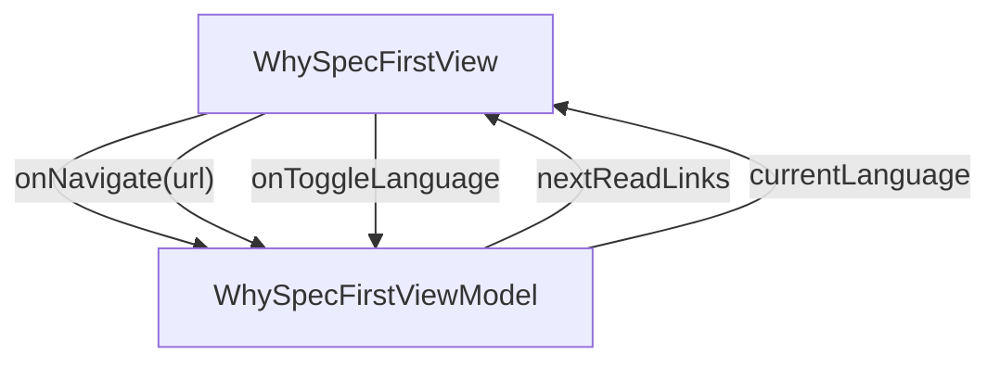

# WhySpecFirst - Why spec-first

## Overview

Short essay explaining the design-side and engineering-side motivations for the spec-first JsonUI workflow. ~6-min read. Four H2 sections (The contract / The drift gate / The agent handshake / What we give up) plus a closing 'read next' link row. Uses TableOfContents for in-page nav and CodeBlock for a single illustrative snippet. 2026-05 cross-link: a one-paragraph addition under §1 (The contract) notes that the spec's contract surface extends to API schemas via OpenAPI in docs/api/, and that consumers of a shared swagger can scope what gets generated per-app through api.schemas.* filters — pointing the reader at /concepts/data-models-from-openapi for the full story.

| | |
|---|---|
| Created | 2026-04-23 |
| Updated | 2026-05-27 |

## Screen Structure

### UI Components

| Component | ID | Platform | Description | Initial State | Notes |
|---|---|---|---|---|---|
| View | `concepts_why_spec_first_root` | - | - | - | - |
| &nbsp;&nbsp;↳ Scroll | `concepts_why_spec_first_scroll` | - | - | - | - |
| &nbsp;&nbsp;&nbsp;&nbsp;↳ View | `concepts_why_spec_first_header` | - | - | - | - |
| &nbsp;&nbsp;&nbsp;&nbsp;&nbsp;&nbsp;↳ Label | `-` | - | - | - | - |
| &nbsp;&nbsp;&nbsp;&nbsp;&nbsp;&nbsp;↳ Label | `concepts_why_spec_first_title` | - | - | - | - |
| &nbsp;&nbsp;&nbsp;&nbsp;&nbsp;&nbsp;↳ Label | `concepts_why_spec_first_lead` | - | - | - | - |
| &nbsp;&nbsp;&nbsp;&nbsp;&nbsp;&nbsp;↳ Label | `-` | - | - | - | - |
| &nbsp;&nbsp;&nbsp;&nbsp;↳ View | `concepts_why_spec_first_content_with_rail` | - | - | - | - |
| &nbsp;&nbsp;&nbsp;&nbsp;&nbsp;&nbsp;↳ View | `concepts_why_spec_first_body_column` | - | - | - | - |
| &nbsp;&nbsp;&nbsp;&nbsp;&nbsp;&nbsp;&nbsp;&nbsp;↳ View | `section_contract` | - | - | - | - |
| &nbsp;&nbsp;&nbsp;&nbsp;&nbsp;&nbsp;&nbsp;&nbsp;&nbsp;&nbsp;↳ Label | `-` | - | - | - | - |
| &nbsp;&nbsp;&nbsp;&nbsp;&nbsp;&nbsp;&nbsp;&nbsp;&nbsp;&nbsp;↳ Label | `-` | - | - | - | - |
| &nbsp;&nbsp;&nbsp;&nbsp;&nbsp;&nbsp;&nbsp;&nbsp;&nbsp;&nbsp;↳ CodeBlock | `-` | - | - | - | - |
| &nbsp;&nbsp;&nbsp;&nbsp;&nbsp;&nbsp;&nbsp;&nbsp;&nbsp;&nbsp;↳ Label | `-` | - | - | - | - |
| &nbsp;&nbsp;&nbsp;&nbsp;&nbsp;&nbsp;&nbsp;&nbsp;↳ View | `section_drift_gate` | - | - | - | - |
| &nbsp;&nbsp;&nbsp;&nbsp;&nbsp;&nbsp;&nbsp;&nbsp;&nbsp;&nbsp;↳ Label | `-` | - | - | - | - |
| &nbsp;&nbsp;&nbsp;&nbsp;&nbsp;&nbsp;&nbsp;&nbsp;&nbsp;&nbsp;↳ Label | `-` | - | - | - | - |
| &nbsp;&nbsp;&nbsp;&nbsp;&nbsp;&nbsp;&nbsp;&nbsp;&nbsp;&nbsp;↳ CodeBlock | `-` | - | - | - | - |
| &nbsp;&nbsp;&nbsp;&nbsp;&nbsp;&nbsp;&nbsp;&nbsp;↳ View | `section_agent` | - | - | - | - |
| &nbsp;&nbsp;&nbsp;&nbsp;&nbsp;&nbsp;&nbsp;&nbsp;&nbsp;&nbsp;↳ Label | `-` | - | - | - | - |
| &nbsp;&nbsp;&nbsp;&nbsp;&nbsp;&nbsp;&nbsp;&nbsp;&nbsp;&nbsp;↳ Label | `-` | - | - | - | - |
| &nbsp;&nbsp;&nbsp;&nbsp;&nbsp;&nbsp;&nbsp;&nbsp;&nbsp;&nbsp;↳ CodeBlock | `-` | - | - | - | - |
| &nbsp;&nbsp;&nbsp;&nbsp;&nbsp;&nbsp;&nbsp;&nbsp;↳ View | `section_tradeoff` | - | - | - | - |
| &nbsp;&nbsp;&nbsp;&nbsp;&nbsp;&nbsp;&nbsp;&nbsp;&nbsp;&nbsp;↳ Label | `-` | - | - | - | - |
| &nbsp;&nbsp;&nbsp;&nbsp;&nbsp;&nbsp;&nbsp;&nbsp;&nbsp;&nbsp;↳ Label | `-` | - | - | - | - |
| &nbsp;&nbsp;&nbsp;&nbsp;&nbsp;&nbsp;&nbsp;&nbsp;↳ View | `concepts_why_spec_first_next` | - | - | - | - |
| &nbsp;&nbsp;&nbsp;&nbsp;&nbsp;&nbsp;&nbsp;&nbsp;&nbsp;&nbsp;↳ Label | `-` | - | - | - | - |
| &nbsp;&nbsp;&nbsp;&nbsp;&nbsp;&nbsp;&nbsp;&nbsp;&nbsp;&nbsp;↳ Collection | `concepts_why_spec_first_next_collection` | - | - | - | - |
| &nbsp;&nbsp;&nbsp;&nbsp;&nbsp;&nbsp;&nbsp;&nbsp;↳ View | `concepts_why_spec_first_footer` | - | - | - | - |
| &nbsp;&nbsp;&nbsp;&nbsp;&nbsp;&nbsp;&nbsp;&nbsp;&nbsp;&nbsp;↳ Label | `-` | - | - | - | - |
| &nbsp;&nbsp;&nbsp;&nbsp;&nbsp;&nbsp;↳ View | `concepts_why_spec_first_rail_column` | - | - | - | - |
| &nbsp;&nbsp;&nbsp;&nbsp;&nbsp;&nbsp;&nbsp;&nbsp;↳ View | `concepts_why_spec_first_toc_wrap` | - | - | - | - |
| &nbsp;&nbsp;&nbsp;&nbsp;&nbsp;&nbsp;&nbsp;&nbsp;&nbsp;&nbsp;↳ TableOfContents | `-` | - | - | - | - |

### Layout Structure

```
concepts_why_spec_first_root
└── concepts_why_spec_first_scroll
```

## Data Flow



### ViewModel

#### Methods

| Signature | Platforms | Description |
|---|---|---|
| `onAppear()` | all | Seed nextReadLinks from the module-scope NEXT_READ_ENTRIES catalog (two rows: next_data_binding -> /concepts/data-binding, next_one_layout -> /concepts/one-layout-json) and stamp currentLanguage from StringManager.language. Each row's titleKey / descriptionKey is resolved through StringManager with the concepts_why_spec_first_ namespace prefix. |
| `onNavigate(url: String)` | all | Client-side navigation via router.push(url). Destinations are the spec-mapped concept URLs enumerated in transitions: /concepts, /concepts/one-layout-json, /concepts/data-binding. |

#### Vars

| Declaration | Flags | Platforms | Description |
|---|---|---|---|
| `var nextReadLinks: Array(NextReadLink)` | observable | all | Two closing 'read next' cards pointing at /concepts/data-binding and /concepts/one-layout-json. Seeded by onAppear from the NEXT_READ_ENTRIES static catalog and re-seeded by onToggleLanguage. |

## State Management

### UI Data Variables

| Variable Name | Type | Description | Notes |
|---|---|---|---|
| `nextReadLinks` | [NextReadLink] | Two follow-up concept essays at the bottom of the page (One Layout JSON / Data binding as contract). Seeded by onAppear. | - |

### View-local Event Handlers

_Handlers kept inside the View layer. ViewModel public API lives under `dataFlow.viewModel`._

| Handler | Description | Notes |
|---|---|---|
| `onAppear` | Populate nextReadLinks with the static v1 catalog. Labels flow through StringManager. | - |
| `onNavigate` | Client-side navigation for the breadcrumb ('/concepts') and each NextReadLink. | - |
| `onNavigateConcepts` |  | - |

## User Actions

| Action | Processing | Destination | Notes |
|---|---|---|---|
| Tap a TableOfContents entry | TOC's own scroll-to-anchor logic runs. No VM involvement. | - | - |
| Tap a NextReadLink card | onNavigate(url) with the bound NextReadLink.url. | - | - |

## Validation

## Transitions

| Condition | Destination | Notes |
|---|---|---|
| url is a spec-mapped concept URL or /concepts | Target spec screen or tab | - |

## Related Files

| Type | File Path | Notes |
|---|---|---|
| Layout | `docs/screens/layouts/concepts/why-spec-first.json` | - |
| ViewModel | `jsonui-doc-web/src/viewmodels/concepts/WhySpecFirstViewModel.ts` | - |
| View | `jsonui-doc-web/src/app/concepts/why-spec-first/page.tsx` | - |

## Notes

- First live entry under the Concepts tab. Flipping concepts_index's first catalog row from 'upcoming' to 'live' is the implementer's final step.
- TOC items are authored as a literal array in the layout (English-only per the deferred-i18n note on TableOfContents). Re-authoring as a VM-driven @{binding} becomes worthwhile once the overall TOC i18n story lands.
- The essay holds one CodeBlock — a ~5-line snippet showing a minimal screen_spec + derived Layout JSON + derived ViewModelBase stub — to make the 'the spec is the contract' section tangible.
- No Collapse / expandable sections on this page. Troubleshooting-style pages have them; concept essays stay linear.
- 2026-05 update (swagger-driven Data Models): §1 (The contract) gains ONE paragraph noting that the spec's contract surface also covers API schemas via OpenAPI files in docs/api/, and that consumers of a shared swagger can scope what gets generated per-app through api.schemas.{include_paths, exclude_paths, include_schemas, exclude_schemas, skip_domain}. The paragraph ends with an inline link to /concepts/data-models-from-openapi for the full story. No new uiVariable / customType — body-copy change only inside the existing concepts_why_spec_first_section_contract_body string, and the closing paragraph may also link out to the new concept page.
- 2026-09-03: section_drift_body claimed the invariant without stating its scope. jsonui-cli 1.8.5 made the scope readable — `verified N of M screen(s)` — and this repository measures 0 of 2: every screen here has a hand-authored layout, so its own verify gate has been exiting 0 over an empty comparison. Two other consumer surfaces reported 0 of 47 and 0 of 30. The body now says what the rule does not promise (coverage) and tells the reader to read the denominator before treating green as evidence.
