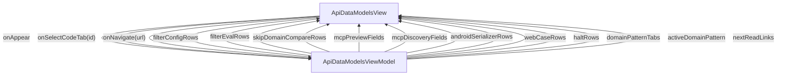

# ApiDataModels - API data models

## Overview

Guides > API data models. Cookbook companion to /concepts/data-models-from-openapi. Fifteen H2 sections covering setup (docs/api/), the add-schema/build/proxy loop, path + schema filter syntax, the two skip_domain levels, MCP-driven preview + discovery, the Repository return-type rule, the four Domain customization patterns, the Android serializer and Web case-convention picks, migrating hand-written models, reserved-word collisions, cycle rules, drift detection in CI, and the ERROR-halt table. ~18-min read.

| | |
|---|---|
| Created | 2026-05-27 |
| Updated | 2026-07-07 |

## Screen Structure

### UI Components

| Component | ID | Platform | Description | Initial State | Notes |
|---|---|---|---|---|---|
| View | `guides_api_data_models_root` | - | - | - | - |
| &nbsp;&nbsp;↳ Scroll | `guides_api_data_models_scroll` | - | - | - | - |
| &nbsp;&nbsp;&nbsp;&nbsp;↳ View | `guides_api_data_models_header` | - | - | - | - |
| &nbsp;&nbsp;&nbsp;&nbsp;&nbsp;&nbsp;↳ Label | `-` | - | - | - | - |
| &nbsp;&nbsp;&nbsp;&nbsp;&nbsp;&nbsp;↳ Label | `-` | - | - | - | - |
| &nbsp;&nbsp;&nbsp;&nbsp;&nbsp;&nbsp;↳ Label | `-` | - | - | - | - |
| &nbsp;&nbsp;&nbsp;&nbsp;&nbsp;&nbsp;↳ Label | `-` | - | - | - | - |
| &nbsp;&nbsp;&nbsp;&nbsp;↳ View | `guides_api_data_models_content_with_rail` | - | - | - | - |
| &nbsp;&nbsp;&nbsp;&nbsp;&nbsp;&nbsp;↳ View | `guides_api_data_models_body_column` | - | - | - | - |
| &nbsp;&nbsp;&nbsp;&nbsp;&nbsp;&nbsp;&nbsp;&nbsp;↳ View | `section_setup` | - | - | - | - |
| &nbsp;&nbsp;&nbsp;&nbsp;&nbsp;&nbsp;&nbsp;&nbsp;&nbsp;&nbsp;↳ Label | `-` | - | - | - | - |
| &nbsp;&nbsp;&nbsp;&nbsp;&nbsp;&nbsp;&nbsp;&nbsp;&nbsp;&nbsp;↳ Label | `-` | - | - | - | - |
| &nbsp;&nbsp;&nbsp;&nbsp;&nbsp;&nbsp;&nbsp;&nbsp;&nbsp;&nbsp;↳ CodeBlock | `-` | - | - | - | - |
| &nbsp;&nbsp;&nbsp;&nbsp;&nbsp;&nbsp;&nbsp;&nbsp;↳ View | `section_add_schema` | - | - | - | - |
| &nbsp;&nbsp;&nbsp;&nbsp;&nbsp;&nbsp;&nbsp;&nbsp;&nbsp;&nbsp;↳ Label | `-` | - | - | - | - |
| &nbsp;&nbsp;&nbsp;&nbsp;&nbsp;&nbsp;&nbsp;&nbsp;&nbsp;&nbsp;↳ Label | `-` | - | - | - | - |
| &nbsp;&nbsp;&nbsp;&nbsp;&nbsp;&nbsp;&nbsp;&nbsp;&nbsp;&nbsp;↳ CodeBlock | `-` | - | - | - | - |
| &nbsp;&nbsp;&nbsp;&nbsp;&nbsp;&nbsp;&nbsp;&nbsp;↳ View | `section_filter` | - | - | - | - |
| &nbsp;&nbsp;&nbsp;&nbsp;&nbsp;&nbsp;&nbsp;&nbsp;&nbsp;&nbsp;↳ Label | `-` | - | - | - | - |
| &nbsp;&nbsp;&nbsp;&nbsp;&nbsp;&nbsp;&nbsp;&nbsp;&nbsp;&nbsp;↳ Label | `-` | - | - | - | - |
| &nbsp;&nbsp;&nbsp;&nbsp;&nbsp;&nbsp;&nbsp;&nbsp;&nbsp;&nbsp;↳ Label | `-` | - | - | - | - |
| &nbsp;&nbsp;&nbsp;&nbsp;&nbsp;&nbsp;&nbsp;&nbsp;&nbsp;&nbsp;↳ Collection | `guides_api_data_models_filter_config_collection` | - | - | - | - |
| &nbsp;&nbsp;&nbsp;&nbsp;&nbsp;&nbsp;&nbsp;&nbsp;&nbsp;&nbsp;↳ Label | `-` | - | - | - | - |
| &nbsp;&nbsp;&nbsp;&nbsp;&nbsp;&nbsp;&nbsp;&nbsp;&nbsp;&nbsp;↳ Collection | `guides_api_data_models_filter_eval_collection` | - | - | - | - |
| &nbsp;&nbsp;&nbsp;&nbsp;&nbsp;&nbsp;&nbsp;&nbsp;&nbsp;&nbsp;↳ CodeBlock | `-` | - | - | - | - |
| &nbsp;&nbsp;&nbsp;&nbsp;&nbsp;&nbsp;&nbsp;&nbsp;&nbsp;&nbsp;↳ Label | `-` | - | - | - | - |
| &nbsp;&nbsp;&nbsp;&nbsp;&nbsp;&nbsp;&nbsp;&nbsp;↳ View | `section_skip_domain` | - | - | - | - |
| &nbsp;&nbsp;&nbsp;&nbsp;&nbsp;&nbsp;&nbsp;&nbsp;&nbsp;&nbsp;↳ Label | `-` | - | - | - | - |
| &nbsp;&nbsp;&nbsp;&nbsp;&nbsp;&nbsp;&nbsp;&nbsp;&nbsp;&nbsp;↳ Label | `-` | - | - | - | - |
| &nbsp;&nbsp;&nbsp;&nbsp;&nbsp;&nbsp;&nbsp;&nbsp;&nbsp;&nbsp;↳ Collection | `guides_api_data_models_skip_domain_collection` | - | - | - | - |
| &nbsp;&nbsp;&nbsp;&nbsp;&nbsp;&nbsp;&nbsp;&nbsp;&nbsp;&nbsp;↳ CodeBlock | `-` | - | - | - | - |
| &nbsp;&nbsp;&nbsp;&nbsp;&nbsp;&nbsp;&nbsp;&nbsp;↳ View | `section_mcp_preview` | - | - | - | - |
| &nbsp;&nbsp;&nbsp;&nbsp;&nbsp;&nbsp;&nbsp;&nbsp;&nbsp;&nbsp;↳ Label | `-` | - | - | - | - |
| &nbsp;&nbsp;&nbsp;&nbsp;&nbsp;&nbsp;&nbsp;&nbsp;&nbsp;&nbsp;↳ Label | `-` | - | - | - | - |
| &nbsp;&nbsp;&nbsp;&nbsp;&nbsp;&nbsp;&nbsp;&nbsp;&nbsp;&nbsp;↳ CodeBlock | `-` | - | - | - | - |
| &nbsp;&nbsp;&nbsp;&nbsp;&nbsp;&nbsp;&nbsp;&nbsp;&nbsp;&nbsp;↳ Collection | `guides_api_data_models_mcp_preview_collection` | - | - | - | - |
| &nbsp;&nbsp;&nbsp;&nbsp;&nbsp;&nbsp;&nbsp;&nbsp;&nbsp;&nbsp;↳ Label | `-` | - | - | - | - |
| &nbsp;&nbsp;&nbsp;&nbsp;&nbsp;&nbsp;&nbsp;&nbsp;↳ View | `section_mcp_discovery` | - | - | - | - |
| &nbsp;&nbsp;&nbsp;&nbsp;&nbsp;&nbsp;&nbsp;&nbsp;&nbsp;&nbsp;↳ Label | `-` | - | - | - | - |
| &nbsp;&nbsp;&nbsp;&nbsp;&nbsp;&nbsp;&nbsp;&nbsp;&nbsp;&nbsp;↳ Label | `-` | - | - | - | - |
| &nbsp;&nbsp;&nbsp;&nbsp;&nbsp;&nbsp;&nbsp;&nbsp;&nbsp;&nbsp;↳ Collection | `guides_api_data_models_mcp_discovery_collection` | - | - | - | - |
| &nbsp;&nbsp;&nbsp;&nbsp;&nbsp;&nbsp;&nbsp;&nbsp;↳ View | `section_return_type` | - | - | - | - |
| &nbsp;&nbsp;&nbsp;&nbsp;&nbsp;&nbsp;&nbsp;&nbsp;&nbsp;&nbsp;↳ Label | `-` | - | - | - | - |
| &nbsp;&nbsp;&nbsp;&nbsp;&nbsp;&nbsp;&nbsp;&nbsp;&nbsp;&nbsp;↳ Label | `-` | - | - | - | - |
| &nbsp;&nbsp;&nbsp;&nbsp;&nbsp;&nbsp;&nbsp;&nbsp;&nbsp;&nbsp;↳ CodeBlock | `-` | - | - | - | - |
| &nbsp;&nbsp;&nbsp;&nbsp;&nbsp;&nbsp;&nbsp;&nbsp;↳ View | `section_customize` | - | - | - | - |
| &nbsp;&nbsp;&nbsp;&nbsp;&nbsp;&nbsp;&nbsp;&nbsp;&nbsp;&nbsp;↳ Label | `-` | - | - | - | - |
| &nbsp;&nbsp;&nbsp;&nbsp;&nbsp;&nbsp;&nbsp;&nbsp;&nbsp;&nbsp;↳ Label | `-` | - | - | - | - |
| &nbsp;&nbsp;&nbsp;&nbsp;&nbsp;&nbsp;&nbsp;&nbsp;&nbsp;&nbsp;↳ Collection | `guides_api_data_models_domain_pattern_tabs` | - | - | - | - |
| &nbsp;&nbsp;&nbsp;&nbsp;&nbsp;&nbsp;&nbsp;&nbsp;&nbsp;&nbsp;↳ View | `domain_pattern_panel_proxy` | - | - | - | - |
| &nbsp;&nbsp;&nbsp;&nbsp;&nbsp;&nbsp;&nbsp;&nbsp;&nbsp;&nbsp;&nbsp;&nbsp;↳ CodeBlock | `-` | - | - | - | - |
| &nbsp;&nbsp;&nbsp;&nbsp;&nbsp;&nbsp;&nbsp;&nbsp;&nbsp;&nbsp;↳ View | `domain_pattern_panel_type_conv` | - | - | - | - |
| &nbsp;&nbsp;&nbsp;&nbsp;&nbsp;&nbsp;&nbsp;&nbsp;&nbsp;&nbsp;&nbsp;&nbsp;↳ CodeBlock | `-` | - | - | - | - |
| &nbsp;&nbsp;&nbsp;&nbsp;&nbsp;&nbsp;&nbsp;&nbsp;&nbsp;&nbsp;↳ View | `domain_pattern_panel_computed` | - | - | - | - |
| &nbsp;&nbsp;&nbsp;&nbsp;&nbsp;&nbsp;&nbsp;&nbsp;&nbsp;&nbsp;&nbsp;&nbsp;↳ CodeBlock | `-` | - | - | - | - |
| &nbsp;&nbsp;&nbsp;&nbsp;&nbsp;&nbsp;&nbsp;&nbsp;&nbsp;&nbsp;↳ View | `domain_pattern_panel_stored` | - | - | - | - |
| &nbsp;&nbsp;&nbsp;&nbsp;&nbsp;&nbsp;&nbsp;&nbsp;&nbsp;&nbsp;&nbsp;&nbsp;↳ CodeBlock | `-` | - | - | - | - |
| &nbsp;&nbsp;&nbsp;&nbsp;&nbsp;&nbsp;&nbsp;&nbsp;↳ View | `section_android` | - | - | - | - |
| &nbsp;&nbsp;&nbsp;&nbsp;&nbsp;&nbsp;&nbsp;&nbsp;&nbsp;&nbsp;↳ Label | `-` | - | - | - | - |
| &nbsp;&nbsp;&nbsp;&nbsp;&nbsp;&nbsp;&nbsp;&nbsp;&nbsp;&nbsp;↳ Label | `-` | - | - | - | - |
| &nbsp;&nbsp;&nbsp;&nbsp;&nbsp;&nbsp;&nbsp;&nbsp;&nbsp;&nbsp;↳ Collection | `guides_api_data_models_android_collection` | - | - | - | - |
| &nbsp;&nbsp;&nbsp;&nbsp;&nbsp;&nbsp;&nbsp;&nbsp;&nbsp;&nbsp;↳ CodeBlock | `-` | - | - | - | - |
| &nbsp;&nbsp;&nbsp;&nbsp;&nbsp;&nbsp;&nbsp;&nbsp;&nbsp;&nbsp;↳ Label | `-` | - | - | - | - |
| &nbsp;&nbsp;&nbsp;&nbsp;&nbsp;&nbsp;&nbsp;&nbsp;↳ View | `section_web_case` | - | - | - | - |
| &nbsp;&nbsp;&nbsp;&nbsp;&nbsp;&nbsp;&nbsp;&nbsp;&nbsp;&nbsp;↳ Label | `-` | - | - | - | - |
| &nbsp;&nbsp;&nbsp;&nbsp;&nbsp;&nbsp;&nbsp;&nbsp;&nbsp;&nbsp;↳ Label | `-` | - | - | - | - |
| &nbsp;&nbsp;&nbsp;&nbsp;&nbsp;&nbsp;&nbsp;&nbsp;&nbsp;&nbsp;↳ Collection | `guides_api_data_models_web_case_collection` | - | - | - | - |
| &nbsp;&nbsp;&nbsp;&nbsp;&nbsp;&nbsp;&nbsp;&nbsp;↳ View | `section_migrate` | - | - | - | - |
| &nbsp;&nbsp;&nbsp;&nbsp;&nbsp;&nbsp;&nbsp;&nbsp;&nbsp;&nbsp;↳ Label | `-` | - | - | - | - |
| &nbsp;&nbsp;&nbsp;&nbsp;&nbsp;&nbsp;&nbsp;&nbsp;&nbsp;&nbsp;↳ Label | `-` | - | - | - | - |
| &nbsp;&nbsp;&nbsp;&nbsp;&nbsp;&nbsp;&nbsp;&nbsp;&nbsp;&nbsp;↳ CodeBlock | `-` | - | - | - | - |
| &nbsp;&nbsp;&nbsp;&nbsp;&nbsp;&nbsp;&nbsp;&nbsp;&nbsp;&nbsp;↳ Label | `-` | - | - | - | - |
| &nbsp;&nbsp;&nbsp;&nbsp;&nbsp;&nbsp;&nbsp;&nbsp;↳ View | `section_reserved` | - | - | - | - |
| &nbsp;&nbsp;&nbsp;&nbsp;&nbsp;&nbsp;&nbsp;&nbsp;&nbsp;&nbsp;↳ Label | `-` | - | - | - | - |
| &nbsp;&nbsp;&nbsp;&nbsp;&nbsp;&nbsp;&nbsp;&nbsp;&nbsp;&nbsp;↳ Label | `-` | - | - | - | - |
| &nbsp;&nbsp;&nbsp;&nbsp;&nbsp;&nbsp;&nbsp;&nbsp;↳ View | `section_cycles` | - | - | - | - |
| &nbsp;&nbsp;&nbsp;&nbsp;&nbsp;&nbsp;&nbsp;&nbsp;&nbsp;&nbsp;↳ Label | `-` | - | - | - | - |
| &nbsp;&nbsp;&nbsp;&nbsp;&nbsp;&nbsp;&nbsp;&nbsp;&nbsp;&nbsp;↳ Label | `-` | - | - | - | - |
| &nbsp;&nbsp;&nbsp;&nbsp;&nbsp;&nbsp;&nbsp;&nbsp;&nbsp;&nbsp;↳ CodeBlock | `-` | - | - | - | - |
| &nbsp;&nbsp;&nbsp;&nbsp;&nbsp;&nbsp;&nbsp;&nbsp;↳ View | `section_ci` | - | - | - | - |
| &nbsp;&nbsp;&nbsp;&nbsp;&nbsp;&nbsp;&nbsp;&nbsp;&nbsp;&nbsp;↳ Label | `-` | - | - | - | - |
| &nbsp;&nbsp;&nbsp;&nbsp;&nbsp;&nbsp;&nbsp;&nbsp;&nbsp;&nbsp;↳ Label | `-` | - | - | - | - |
| &nbsp;&nbsp;&nbsp;&nbsp;&nbsp;&nbsp;&nbsp;&nbsp;&nbsp;&nbsp;↳ CodeBlock | `-` | - | - | - | - |
| &nbsp;&nbsp;&nbsp;&nbsp;&nbsp;&nbsp;&nbsp;&nbsp;↳ View | `section_halt_table` | - | - | - | - |
| &nbsp;&nbsp;&nbsp;&nbsp;&nbsp;&nbsp;&nbsp;&nbsp;&nbsp;&nbsp;↳ Label | `-` | - | - | - | - |
| &nbsp;&nbsp;&nbsp;&nbsp;&nbsp;&nbsp;&nbsp;&nbsp;&nbsp;&nbsp;↳ Label | `-` | - | - | - | - |
| &nbsp;&nbsp;&nbsp;&nbsp;&nbsp;&nbsp;&nbsp;&nbsp;&nbsp;&nbsp;↳ Collection | `guides_api_data_models_halt_collection` | - | - | - | - |
| &nbsp;&nbsp;&nbsp;&nbsp;&nbsp;&nbsp;&nbsp;&nbsp;↳ View | `guides_api_data_models_next` | - | - | - | - |
| &nbsp;&nbsp;&nbsp;&nbsp;&nbsp;&nbsp;&nbsp;&nbsp;&nbsp;&nbsp;↳ Label | `-` | - | - | - | - |
| &nbsp;&nbsp;&nbsp;&nbsp;&nbsp;&nbsp;&nbsp;&nbsp;&nbsp;&nbsp;↳ Collection | `guides_api_data_models_next_collection` | - | - | - | - |
| &nbsp;&nbsp;&nbsp;&nbsp;&nbsp;&nbsp;&nbsp;&nbsp;↳ View | `guides_api_data_models_footer` | - | - | - | - |
| &nbsp;&nbsp;&nbsp;&nbsp;&nbsp;&nbsp;&nbsp;&nbsp;&nbsp;&nbsp;↳ Label | `-` | - | - | - | - |
| &nbsp;&nbsp;&nbsp;&nbsp;&nbsp;&nbsp;↳ View | `guides_api_data_models_rail_column` | - | - | - | - |
| &nbsp;&nbsp;&nbsp;&nbsp;&nbsp;&nbsp;&nbsp;&nbsp;↳ View | `guides_api_data_models_toc_wrap` | - | - | - | - |
| &nbsp;&nbsp;&nbsp;&nbsp;&nbsp;&nbsp;&nbsp;&nbsp;&nbsp;&nbsp;↳ TableOfContents | `-` | - | - | - | - |

### Layout Structure

```
guides_api_data_models_root
└── guides_api_data_models_scroll
```

## Data Flow



### ViewModel

#### Methods

| Signature | Platforms | Description |
|---|---|---|
| `onAppear()` | all | Seed every public observable from module-scope static catalogs: filterConfigRows (5 rows from the api.schemas.* settings reference), filterEvalRows (4 rows of evaluation-order), skipDomainCompareRows (3 rows comparing schema-side vs app-side skip_domain), mcpPreviewFields (4 rows for preview_api_model_sync output), mcpDiscoveryFields (~6 rows across list_api_specs and list_api_models output), androidSerializerRows (3 rows: moshi default / kotlinx / none), webCaseRows (3 rows: snake_case default / camelCase), haltRows (6 ERROR-halt rows), nextReadLinks (3 cards). Every string field is resolved through StringManager with the guides_api_data_models_ prefix family. Finally calls buildDomainPatternTabs('proxy') to populate domainPatternTabs; activeDomainPattern stays at its 'proxy' initial value. |
| `onSelectCodeTab(id: String)` | all | Set activeDomainPattern = id and assign domainPatternTabs = buildDomainPatternTabs(id). displayLogic derives the four *PatternPanelVisibility strings from activeDomainPattern. |
| `onNavigate(url: String)` | all | router.push(url). Hit by NextReadLink card taps and the breadcrumb. |
| `buildDomainPatternTabs(activeId: String)` | all | Helper that returns [TabHeaderCell] with 4 entries (id='proxy' / 'type_conv' / 'computed' / 'stored'). The row whose id === activeId gets the accent palette; the others get surface. Each row's onSelect is wired to () => this.onSelectCodeTab(id). Mirrors LearnHelloWorldViewModel.buildPlatformTabs. |

#### Vars

| Declaration | Flags | Platforms | Description |
|---|---|---|---|
| `var filterConfigRows: Array(FilterConfigRow)` | observable | all | 5-row api.schemas.* settings reference for §3. |
| `var filterEvalRows: Array(FilterEvalRow)` | observable | all | 4-row filter evaluation-order table for §3. |
| `var skipDomainCompareRows: Array(ComparisonRow)` | observable | all | 3-row skip_domain comparison for §4. |
| `var mcpPreviewFields: Array(McpFieldRow)` | observable | all | 4-row preview_api_model_sync field table for §5. |
| `var mcpDiscoveryFields: Array(McpFieldRow)` | observable | all | ~6-row list_api_specs / list_api_models field table for §6. |
| `var androidSerializerRows: Array(ComparisonRow)` | observable | all | 3-row moshi / kotlinx / none comparison for §9. |
| `var webCaseRows: Array(ComparisonRow)` | observable | all | 3-row snake_case / camelCase comparison for §10. |
| `var haltRows: Array(HaltRow)` | observable | all | 6-row ERROR-halt cookbook table for §15. |
| `var domainPatternTabs: Array(TabHeaderCell)` | observable | all | 4-row tab header for the §8 Domain-customization switcher. |
| `var activeDomainPattern: String` | observable | all | Currently visible §8 pattern tab id; 'proxy' by default. |
| `var nextReadLinks: Array(NextReadLink)` | observable | all | 3 closing cards. |
| `var proxyPatternPanelVisibility: String` | observable | all | Derived from activeDomainPattern via displayLogic. |
| `var typeConvPatternPanelVisibility: String` | observable | all | Derived from activeDomainPattern via displayLogic. |
| `var computedPatternPanelVisibility: String` | observable | all | Derived from activeDomainPattern via displayLogic. |
| `var storedPatternPanelVisibility: String` | observable | all | Derived from activeDomainPattern via displayLogic. |

## State Management

### UI Data Variables

| Variable Name | Type | Description | Notes |
|---|---|---|---|
| `filterConfigRows` | [FilterConfigRow] | Five rows for the §3 'api.schemas.* settings reference' table: include_paths, exclude_paths, include_schemas, exclude_schemas, skip_domain. Each row carries keyKey + typeKey + defaultKey + globKey + descriptionKey under the guides_api_data_models_filter_ namespace. | - |
| `filterEvalRows` | [FilterEvalRow] | Four rows for the §3 evaluation-order table (path includes -> path excludes -> schema includes -> schema excludes). Each row has orderKey + ruleKey + bodyKey. | - |
| `skipDomainCompareRows` | [ComparisonRow] | Three rows for the §4 skip_domain comparison table (where it lives / scope / when to pick which). Each row has labelKey + schemaSideKey + appSideKey under the guides_api_data_models_skip_domain_ namespace. | - |
| `mcpPreviewFields` | [McpFieldRow] | Four rows for §5 documenting the preview_api_model_sync output shape (kept_schemas, filtered_out, skip_domain_matches, halts). Each carries fieldKey + typeKey + bodyKey under the guides_api_data_models_mcp_preview_ namespace. | - |
| `mcpDiscoveryFields` | [McpFieldRow] | Rows for §6 documenting list_api_specs and list_api_models output shapes. Two tools, ~6 rows total. Keys under the guides_api_data_models_mcp_discovery_ namespace. | - |
| `androidSerializerRows` | [ComparisonRow] | Three rows for the §9 Android-serializer comparison table (moshi / kotlinx / none). labelKey + moshiKey + kotlinxKey + noneKey — note this row type has 4 columns not 3; rendered with the comparison_4col cell rather than comparison_row. See customTypes below. | - |
| `webCaseRows` | [ComparisonRow] | Three rows for the §10 Web case-convention comparison (snake_case default zero-cost / camelCase runtime conversion). Reuses ComparisonRow since it's a 3-col compare (label + snake / camel). | - |
| `haltRows` | [HaltRow] | Six rows for the §15 ERROR-halt table (mirror of the concept page's section 9 but more recipe-flavored: each row has triggerKey + behaviorKey + workaroundKey, where workaround is a concrete code or config patch hint). | - |
| `domainPatternTabs` | [TabHeaderCell] | Four T6-pattern tab headers for the §8 Domain-customization switcher (id='proxy' | 'type_conv' | 'computed' | 'stored'). Initial active is 'proxy'. Rebuilt by buildDomainPatternTabs(id) on every onSelectCodeTab call. | - |
| `activeDomainPattern` | String | Id of the currently selected Domain-customization pattern in §8 ('proxy' | 'type_conv' | 'computed' | 'stored'). Drives displayLogic for the four §8 sample panels. | - |
| `nextReadLinks` | [NextReadLink] | Three closing 'read next' cards: /concepts/data-models-from-openapi (back to the concept), /reference/cli-commands (jui g api / jui ls api-* details), /tools/mcp (MCP Group E tool reference). Seeded in onAppear. | - |
| `proxyPatternPanelVisibility` | String | (from binding) | - |
| `typeConvPatternPanelVisibility` | String | (from binding) | - |
| `computedPatternPanelVisibility` | String | (from binding) | - |
| `storedPatternPanelVisibility` | String | (from binding) | - |

### View-local Event Handlers

_Handlers kept inside the View layer. ViewModel public API lives under `dataFlow.viewModel`._

| Handler | Description | Notes |
|---|---|---|
| `onAppear` | Seed filterConfigRows (5), filterEvalRows (4), skipDomainCompareRows (3), mcpPreviewFields (4), mcpDiscoveryFields (~6), androidSerializerRows (3), webCaseRows (3), haltRows (6), and nextReadLinks (3) from module-scope catalogs, then call buildDomainPatternTabs('proxy') to populate domainPatternTabs. Every string flows through StringManager with the guides_api_data_models_ prefix (and the sub-prefixes _filter_ / _skip_domain_ / _mcp_preview_ / _mcp_discovery_ / _return_type_ where applicable). | - |
| `onSelectCodeTab` | T6-pattern tab toggle for the §8 Domain-pattern switcher. Sets activeDomainPattern = id, then assigns domainPatternTabs = buildDomainPatternTabs(id). displayLogic derives proxyPatternPanelVisibility / typeConvPatternPanelVisibility / computedPatternPanelVisibility / storedPatternPanelVisibility from activeDomainPattern. | - |
| `onNavigate` | Client-side navigation via router.push(url). Bound to each NextReadLink card and any inline cross-link CTAs to /concepts/data-models-from-openapi / /reference/cli-commands / /tools/mcp / /learn/installation. | - |
| `onNavigateGuides` |  | - |

### Display Logic

```
activeDomainPattern == 'proxy':
  - domain_pattern_panel_proxy: visible [variable: proxyPatternPanelVisibility]

activeDomainPattern == 'type_conv':
  - domain_pattern_panel_type_conv: visible [variable: typeConvPatternPanelVisibility]

activeDomainPattern == 'computed':
  - domain_pattern_panel_computed: visible [variable: computedPatternPanelVisibility]

activeDomainPattern == 'stored':
  - domain_pattern_panel_stored: visible [variable: storedPatternPanelVisibility]

```

## User Actions

| Action | Processing | Destination | Notes |
|---|---|---|---|
| Tap a TOC entry | TOC-internal scroll. | - | - |
| Tap a §8 Domain-pattern tab | onSelectCodeTab(id) flips activeDomainPattern; displayLogic swaps the visible domain_pattern_panel_*. | - | - |
| Tap a CodeBlock copy button | Copy handled inside the CodeBlock converter. No VM involvement. | - | - |
| Tap a NextReadLink card | onNavigate(url) with the bound NextReadLink.url. | - | - |
| Tap an inline cross-link | onNavigate(url) to /concepts/data-models-from-openapi or /reference/cli-commands or /tools/mcp or /learn/installation. | - | - |

## Validation

## Transitions

| Condition | Destination | Notes |
|---|---|---|
| url is /guides, /concepts/data-models-from-openapi, /reference/cli-commands, /tools/mcp, or /learn/installation | Target spec screen | - |

## Related Files

| Type | File Path | Notes |
|---|---|---|
| Layout | `docs/screens/layouts/guides/api-data-models.json` | - |
| Layout | `docs/screens/layouts/cells/filter_config_row.json` | - |
| Layout | `docs/screens/layouts/cells/filter_eval_row.json` | - |
| Layout | `docs/screens/layouts/cells/comparison_row.json` | - |
| Layout | `docs/screens/layouts/cells/comparison_4col_row.json` | - |
| Layout | `docs/screens/layouts/cells/mcp_field_row.json` | - |
| Layout | `docs/screens/layouts/cells/halt_row.json` | - |
| Layout | `docs/screens/layouts/cells/tab_header.json` | - |
| ViewModel | `jsonui-doc-web/src/viewmodels/guides/ApiDataModelsViewModel.ts` | - |
| View | `jsonui-doc-web/src/app/guides/api-data-models/page.tsx` | - |
| Component | `docs/components/json/codeblock.component.json` | - |

## Notes

- Cookbook companion to /concepts/data-models-from-openapi. Concept explains why; this page is how-to with copy-pasteable recipes.
- Fifteen H2 sections per plan 2026-05-27 swagger-models-doc-additions §2.2: (1) Set up docs/api/, (2) Add a new schema + run build + write proxies, (3) Scope what gets generated — path/schema filter, (4) Two levels of skip_domain, (5) Preview filter changes via MCP preview_api_model_sync, (6) Inspect current state via list_api_specs / list_api_models, (7) DTO vs Domain — Repository return type, (8) Customize Domain — 4 patterns, (9) Android serializer pick, (10) Web case convention pick, (11) Migrating hand-written models, (12) Reserved word collisions, (13) Cycles — what fails what's allowed, (14) Drift detection in CI, (15) Error-halt cookbook table.
- All schema names in code examples are generic: User, Order, LoginRequest. All paths in filter examples are generic: /api/auth/*, /api/users/*, /api/admin/*, /api/internal/*. NEVER use a real consumer-project schema or path — per the project's no-local-project-refs memory rule.
- §3 is the canonical filter reference for the entire site. The 5-row api.schemas.* settings table lives ONLY here; the concept page §6 links to this section instead of duplicating. Same for §4 (skip_domain two-level OR), §5 (preview_api_model_sync), §6 (list_api_specs / list_api_models).
- §7 Repository return-type rule: when a Repository method declares its returnType as a swagger schema name (e.g. 'User'), the codegen auto-resolves it to the Domain type. To get the raw DTO instead, write 'UserDto' explicitly. The Swift code sample shows both shapes side-by-side.
- §8 uses a 4-tab T6-pattern switcher (proxy / type_conv / computed / stored). Each panel holds a complete Swift snippet showing the corresponding Domain customization. Kotlin / TS variants are linked from the §8 lead but not inlined — single-platform sample keeps the section readable.
- §9 Android serializer comparison: moshi (default; requires ksp plugin), kotlinx (no ksp; @Serializable annotations), none (no annotations; reader supplies their own deserializer). The §9 lead links to /learn/installation for the ksp setup steps.
- §10 Web case convention: snake_case is the default and is zero-cost (no runtime conversion); camelCase requires a runtime case transform on every (de)serialize. The lead recommends snake_case unless the rest of the codebase uses camelCase pervasively.
- §11 Migrating hand-written models: §4 skip_domain is the per-schema escape hatch — set x-jui-skip-domain: true on the schema (everyone-skips) or list it in api.schemas.skip_domain (per-app overlay) to keep your hand-written model and not generate a Domain scaffold for that schema. The DTO is still generated; the migration is gradual.
- §13 cycles: direct self-reference ($ref to the same schema at the property level) is ERROR-halt. Collection-mediated cycles (e.g. Node with children: array of Node) are allowed because the cycle is broken by the array boundary.
- §14 CI: drift detection runs jui verify --fail-on-diff. Filter changes that prune schemas + a normal build are SEMANTICALLY identical to the verify step's reconciliation; filter is lenient (warns on 0-schema match), parser is strict (halts on bad schema). The 14-line YAML snippet is GitHub Actions-style.
- §15 halt table: cookbook-flavored — each row carries a concrete workaround (e.g. 'replace oneOf with separate endpoints' or 'inline the $ref-ed schema into the main file'). Recipes, not just diagnoses.
- Strings prefix: guides_api_data_models_ with sub-namespaces _filter_ (§3) / _skip_domain_ (§4) / _mcp_preview_ (§5) / _mcp_discovery_ (§6) / _return_type_ (§7). Estimated 140-180 keys. en + ja content is jsonui-implement / jsonui-localize's responsibility.
- Only CodeBlock referenced as a custom component (already whitelisted). The 7 cell layouts authored alongside the page Layout are standard JsonUI cells, not custom component types.
- 2026-07-07 — Contract check awareness (Renderer SSoT + doc-contract-check rollout). Extend `section_ci_body` with 1-2 sentences noting: 'Since 2026-07, docs↔ implementation drift can also be machine-verified via `jsonui-doc check` (which runs a builtin:openapi-diff between the impl-declared OpenAPI and docs/api/). This complements `jui verify --fail-on-diff` (which verifies DTO regeneration is byte-stable against the docs) — verify catches DTO drift within the doc→code pipeline, check catches API drift between docs and the running server.' Update `section_ci_heading` if needed to reflect both. Do NOT add a link to /guides/verifying-implementation-against-docs yet — that page is authored in a follow-up session. The addition is body-copy only, no new sections or TOC entries. ja も対応。
