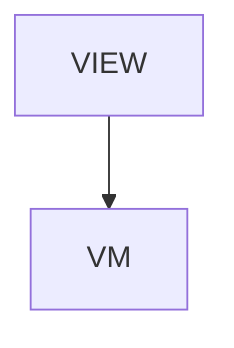

# ApiMock - Mocking APIs in tests

## Overview

Guides > Mocking APIs in tests. Six sections + TOC + next-reads. How jsonui-test mocks a backend for tests: mock definition files generated from OpenAPI (*.mock.json, one per operationId, multiple scenarios), `mock generate` (+ --check drift), `mock serve` (local server + /__jsonui__/panel control panel, 127.0.0.1 bind + per-launch token + Host/DNS-rebind + path-traversal hardening, CLI-only / not MCP), per-test scenario selection (root `mocks` + `setMocks` step; screen per-file, flow per-transition), and driver MockClient integration (mockServerURL + token; admin API /__jsonui__/scenario-set + /__jsonui__/reset with X-JsonUI-Token). mock.schema.json is editor/doc-only.

| | |
|---|---|
| Created | 2026-07-09 |
| Updated | 2026-07-09 |

## Screen Structure

### UI Components

| Component | ID | Platform | Description | Initial State | Notes |
|---|---|---|---|---|---|
| View | `guides_api_mock_root` | - | - | - | - |
| &nbsp;&nbsp;↳ Scroll | `guides_api_mock_scroll` | - | - | - | - |
| &nbsp;&nbsp;&nbsp;&nbsp;↳ View | `guides_api_mock_header` | - | - | - | - |
| &nbsp;&nbsp;&nbsp;&nbsp;&nbsp;&nbsp;↳ Label | `-` | - | - | - | - |
| &nbsp;&nbsp;&nbsp;&nbsp;&nbsp;&nbsp;↳ Label | `-` | - | - | - | - |
| &nbsp;&nbsp;&nbsp;&nbsp;&nbsp;&nbsp;↳ Label | `-` | - | - | - | - |
| &nbsp;&nbsp;&nbsp;&nbsp;&nbsp;&nbsp;↳ Label | `-` | - | - | - | - |
| &nbsp;&nbsp;&nbsp;&nbsp;↳ View | `guides_api_mock_content_with_rail` | - | - | - | - |
| &nbsp;&nbsp;&nbsp;&nbsp;&nbsp;&nbsp;↳ View | `guides_api_mock_body_column` | - | - | - | - |
| &nbsp;&nbsp;&nbsp;&nbsp;&nbsp;&nbsp;&nbsp;&nbsp;↳ View | `section_what` | - | - | - | - |
| &nbsp;&nbsp;&nbsp;&nbsp;&nbsp;&nbsp;&nbsp;&nbsp;&nbsp;&nbsp;↳ Label | `-` | - | - | - | - |
| &nbsp;&nbsp;&nbsp;&nbsp;&nbsp;&nbsp;&nbsp;&nbsp;&nbsp;&nbsp;↳ Label | `-` | - | - | - | - |
| &nbsp;&nbsp;&nbsp;&nbsp;&nbsp;&nbsp;&nbsp;&nbsp;↳ View | `section_files` | - | - | - | - |
| &nbsp;&nbsp;&nbsp;&nbsp;&nbsp;&nbsp;&nbsp;&nbsp;&nbsp;&nbsp;↳ Label | `-` | - | - | - | - |
| &nbsp;&nbsp;&nbsp;&nbsp;&nbsp;&nbsp;&nbsp;&nbsp;&nbsp;&nbsp;↳ Label | `-` | - | - | - | - |
| &nbsp;&nbsp;&nbsp;&nbsp;&nbsp;&nbsp;&nbsp;&nbsp;&nbsp;&nbsp;↳ Label | `-` | - | - | - | - |
| &nbsp;&nbsp;&nbsp;&nbsp;&nbsp;&nbsp;&nbsp;&nbsp;&nbsp;&nbsp;↳ CodeBlock | `-` | - | - | - | - |
| &nbsp;&nbsp;&nbsp;&nbsp;&nbsp;&nbsp;&nbsp;&nbsp;↳ View | `section_generate` | - | - | - | - |
| &nbsp;&nbsp;&nbsp;&nbsp;&nbsp;&nbsp;&nbsp;&nbsp;&nbsp;&nbsp;↳ Label | `-` | - | - | - | - |
| &nbsp;&nbsp;&nbsp;&nbsp;&nbsp;&nbsp;&nbsp;&nbsp;&nbsp;&nbsp;↳ Label | `-` | - | - | - | - |
| &nbsp;&nbsp;&nbsp;&nbsp;&nbsp;&nbsp;&nbsp;&nbsp;&nbsp;&nbsp;↳ Label | `-` | - | - | - | - |
| &nbsp;&nbsp;&nbsp;&nbsp;&nbsp;&nbsp;&nbsp;&nbsp;↳ View | `section_checks` | - | - | - | - |
| &nbsp;&nbsp;&nbsp;&nbsp;&nbsp;&nbsp;&nbsp;&nbsp;&nbsp;&nbsp;↳ Label | `-` | - | - | - | - |
| &nbsp;&nbsp;&nbsp;&nbsp;&nbsp;&nbsp;&nbsp;&nbsp;&nbsp;&nbsp;↳ Label | `-` | - | - | - | - |
| &nbsp;&nbsp;&nbsp;&nbsp;&nbsp;&nbsp;&nbsp;&nbsp;&nbsp;&nbsp;↳ Label | `-` | - | - | - | - |
| &nbsp;&nbsp;&nbsp;&nbsp;&nbsp;&nbsp;&nbsp;&nbsp;&nbsp;&nbsp;↳ Label | `-` | - | - | - | - |
| &nbsp;&nbsp;&nbsp;&nbsp;&nbsp;&nbsp;&nbsp;&nbsp;&nbsp;&nbsp;↳ Label | `-` | - | - | - | - |
| &nbsp;&nbsp;&nbsp;&nbsp;&nbsp;&nbsp;&nbsp;&nbsp;&nbsp;&nbsp;↳ Label | `-` | - | - | - | - |
| &nbsp;&nbsp;&nbsp;&nbsp;&nbsp;&nbsp;&nbsp;&nbsp;&nbsp;&nbsp;↳ Label | `-` | - | - | - | - |
| &nbsp;&nbsp;&nbsp;&nbsp;&nbsp;&nbsp;&nbsp;&nbsp;&nbsp;&nbsp;↳ Label | `-` | - | - | - | - |
| &nbsp;&nbsp;&nbsp;&nbsp;&nbsp;&nbsp;&nbsp;&nbsp;↳ View | `section_serve` | - | - | - | - |
| &nbsp;&nbsp;&nbsp;&nbsp;&nbsp;&nbsp;&nbsp;&nbsp;&nbsp;&nbsp;↳ Label | `-` | - | - | - | - |
| &nbsp;&nbsp;&nbsp;&nbsp;&nbsp;&nbsp;&nbsp;&nbsp;&nbsp;&nbsp;↳ Label | `-` | - | - | - | - |
| &nbsp;&nbsp;&nbsp;&nbsp;&nbsp;&nbsp;&nbsp;&nbsp;&nbsp;&nbsp;↳ Label | `-` | - | - | - | - |
| &nbsp;&nbsp;&nbsp;&nbsp;&nbsp;&nbsp;&nbsp;&nbsp;&nbsp;&nbsp;↳ Label | `-` | - | - | - | - |
| &nbsp;&nbsp;&nbsp;&nbsp;&nbsp;&nbsp;&nbsp;&nbsp;↳ View | `section_scenarios` | - | - | - | - |
| &nbsp;&nbsp;&nbsp;&nbsp;&nbsp;&nbsp;&nbsp;&nbsp;&nbsp;&nbsp;↳ Label | `-` | - | - | - | - |
| &nbsp;&nbsp;&nbsp;&nbsp;&nbsp;&nbsp;&nbsp;&nbsp;&nbsp;&nbsp;↳ Label | `-` | - | - | - | - |
| &nbsp;&nbsp;&nbsp;&nbsp;&nbsp;&nbsp;&nbsp;&nbsp;&nbsp;&nbsp;↳ Label | `-` | - | - | - | - |
| &nbsp;&nbsp;&nbsp;&nbsp;&nbsp;&nbsp;&nbsp;&nbsp;&nbsp;&nbsp;↳ CodeBlock | `-` | - | - | - | - |
| &nbsp;&nbsp;&nbsp;&nbsp;&nbsp;&nbsp;&nbsp;&nbsp;↳ View | `section_drivers` | - | - | - | - |
| &nbsp;&nbsp;&nbsp;&nbsp;&nbsp;&nbsp;&nbsp;&nbsp;&nbsp;&nbsp;↳ Label | `-` | - | - | - | - |
| &nbsp;&nbsp;&nbsp;&nbsp;&nbsp;&nbsp;&nbsp;&nbsp;&nbsp;&nbsp;↳ Label | `-` | - | - | - | - |
| &nbsp;&nbsp;&nbsp;&nbsp;&nbsp;&nbsp;&nbsp;&nbsp;&nbsp;&nbsp;↳ Label | `-` | - | - | - | - |
| &nbsp;&nbsp;&nbsp;&nbsp;&nbsp;&nbsp;&nbsp;&nbsp;↳ View | `guides_api_mock_next` | - | - | - | - |
| &nbsp;&nbsp;&nbsp;&nbsp;&nbsp;&nbsp;&nbsp;&nbsp;&nbsp;&nbsp;↳ Label | `-` | - | - | - | - |
| &nbsp;&nbsp;&nbsp;&nbsp;&nbsp;&nbsp;&nbsp;&nbsp;&nbsp;&nbsp;↳ Collection | `guides_api_mock_next_collection` | - | - | - | - |
| &nbsp;&nbsp;&nbsp;&nbsp;&nbsp;&nbsp;&nbsp;&nbsp;↳ View | `guides_api_mock_footer` | - | - | - | - |
| &nbsp;&nbsp;&nbsp;&nbsp;&nbsp;&nbsp;&nbsp;&nbsp;&nbsp;&nbsp;↳ Label | `-` | - | - | - | - |
| &nbsp;&nbsp;&nbsp;&nbsp;&nbsp;&nbsp;↳ View | `guides_api_mock_rail_column` | - | - | - | - |
| &nbsp;&nbsp;&nbsp;&nbsp;&nbsp;&nbsp;&nbsp;&nbsp;↳ View | `guides_api_mock_toc_wrap` | - | - | - | - |
| &nbsp;&nbsp;&nbsp;&nbsp;&nbsp;&nbsp;&nbsp;&nbsp;&nbsp;&nbsp;↳ TableOfContents | `-` | - | - | - | - |

### Layout Structure

```
guides_api_mock_root
└── guides_api_mock_scroll
```

## Data Flow



### ViewModel

#### Methods

| Signature | Platforms | Description |
|---|---|---|
| `onAppear()` | all | Seed nextReadLinks from the module-scope NEXT_READ_ENTRIES catalog (two rows: next_testing -> /guides/testing, next_cli -> /reference/cli-commands). Each row's titleKey / descriptionKey is resolved through StringManager with the guides_api_mock_ namespace prefix. |
| `onNavigate(url: String)` | all | Client-side navigation via router.push(url). Destinations are the spec-mapped URLs enumerated in transitions: /, /guides/testing, /reference/cli-commands. |

#### Vars

| Declaration | Flags | Platforms | Description |
|---|---|---|---|
| `var nextReadLinks: Array(NextReadLink)` | observable | all | Two closing 'read next' cards pointing at /guides/testing and /reference/cli-commands. Seeded by onAppear and re-seeded by mountLanguage. |

## State Management

### UI Data Variables

| Variable Name | Type | Description | Notes |
|---|---|---|---|
| `nextReadLinks` | [NextReadLink] | Two closing cards: /guides/testing (the test DSL) + /reference/cli-commands (the mock subcommands). | - |

### View-local Event Handlers

_Handlers kept inside the View layer. ViewModel public API lives under `dataFlow.viewModel`._

| Handler | Description | Notes |
|---|---|---|
| `onAppear` | Seed nextReadLinks. | - |
| `onNavigate` | Client-side navigation. | - |
| `onNavigateGuides` |  | - |

## User Actions

| Action | Processing | Destination | Notes |
|---|---|---|---|
| Tap a TOC entry | TOC-internal scroll. | - | - |
| Tap a NextReadLink card | onNavigate(url). | - | - |

## Validation

## Transitions

| Condition | Destination | Notes |
|---|---|---|
| url is spec-mapped | Target screen or tab | - |

## Related Files

| Type | File Path | Notes |
|---|---|---|
| Layout | `docs/screens/layouts/guides/api-mock.json` | - |
| ViewModel | `jsonui-doc-web/src/viewmodels/guides/ApiMockViewModel.ts` | - |
| View | `jsonui-doc-web/src/app/guides/api-mock/page.tsx` | - |

## Notes

- Live Guides entry (added 2026-07-09 for the test-tooling doc pass). Added to ChromeViewModel NAV_CATALOG guides + GuidesIndexViewModel CATALOG.
- Six sections: (1) what API mocks are, (2) mock definition files (*.mock.json, multi-scenario) with a code example, (3) mock generate (+ --check drift / MCP test_mock_generate), (4) mock serve + control panel + hardening (CLI-only), (5) per-test scenario selection (root mocks + setMocks; screen per-file / flow per-transition) with a code example, (6) driver MockClient + admin API.
- Companion to /guides/testing (the test DSL) and /reference/test-tooling (the support matrix + ownership table). Sample data is neutral (products / items) per public-repo hygiene.
- 2026-07-30 — new section 4 'Contract checks', and sections 5-7 renumbered. Three claims on the page had gone stale with the upstream mock-contract work: generation no longer 'skips existing files' (it clears and rewrites <mockDir>/generated/, while hand-written files live outside it and overlay per scenario), --check no longer compares only method and path (it matches scenario bodies against the schema for their status code — types, required including nested and array elements, enum, nullable respected — and identifies scenarios by route, not filename), and neither check has to be invoked by hand (jsonui-test validate runs the contract check and regenerates generated/ when missing or older than the swagger). New on the page: request-side validation in mock serve, on by default, which records violations and exits non-zero without rejecting the request. Escape hatches documented: --no-mock-check, mock.validateRequests=false, --no-validate-requests, per-scenario skipRequestValidation.
- The same edits landed on the pages that repeat the claim: guides_testing.section_cli_bullet_mock, tools_mcp.tool_test_mock_generate_role, reference_cli_commands.section_test_tools_body. docs/data/cli-commands.json gained jsonui-test mock generate / mock serve entries and --no-mock-check on validate, so the catalogue on /reference/cli-commands carries the flags too.
- 2026-08-31 — section_files_body corrected for jsonui-cli 1.7.22. The overlay paragraph has described the thin-overlay shape (a hand-written file carrying only the scenarios its tests drive, routine ones filling in from the generated side) since it was written, and that was the intent rather than the behaviour. Measured on a fixture with one hand-written overlay carrying a single scenario and no activeScenario: v1.7.21 mock generate printed 'Generated 0 mock file(s) ...; 1 route(s) already served by a hand-written mock' and left no generated copy for that route, and jsonui-test validate on the identical tree failed with activeScenario 'default' is not among scenarios: ['two_items']; v1.7.23 prints '1 route(s) overlaid by hand-written mock(s)', keeps the generated copy, and raises no activeScenario error. One variable between the two runs, the tool version. Fixture note for anyone repeating it: the merged-view check needs the generated counterpart to exist, so a tree whose generated/ was last written by the older tool reproduces the old error for a different reason.
- 2026-08-31 — while editing section_files_body, removed a literal '**シナリオ単位**' from its JA text. Prose Labels print markdown verbatim on this site, so the asterisks were reaching the screen; it had survived because probes read the EN rendering and the earlier sweep classified this file's remaining '**' as glob patterns without separating the JA case.
- 2026-08-31 — section_files_body extended for the mock route index union (1.7.24) and the stale-generated visibility (1.7.25). The union is published through the observable that shows which index answered: with a generated half declaring default/empty/error_403 and an overlay declaring only two_items, a name in neither errors with available: ['default','empty','error_403','two_items'] on 1.7.24 and with the generated three alone on 1.7.23. Getting the check to fire took two corrections to the fixture, both recorded because they are the kind of thing that reads as 'the check found nothing': a screen test's mocks block belongs at the file root (inside a case it is silently 'Unknown case key: mocks'), and without mock.swagger declared the run prints 'Unchecked mocks: N' and compares nothing. An earlier attempt reported no difference between versions purely because of those two, and the full output — not the grepped lines — is what said so. For 1.7.25: a stale body in the generated half of a route with NO overlay warns and the summary separates the halves, where 1.7.24 said No drift; exit stays 0 in both, which is why the published sentence says the exit code cannot see it. Measured but NOT published: on an overlaid route the same stale generated body is still reported as No drift on 1.7.25. That may well be intended (the generated copy is rewritten wholesale), so it is raised upstream as an observation rather than written up as a rule.
- 2026-08-31 — the overlaid-route gap is now stated on the page rather than left implied. The previous wording scoped the 1.7.25 improvement to 'a route with no overlay', which is accurate but invites the reader to supply a reason for the scope, and the available reason ('generated copies of overlaid routes are rewritten wholesale, so their bodies do not matter') is wrong: upstream confirmed it as a defect after this page asked, with a fix expected in a later release. Written as a limitation with its status rather than as a rule, so the replacement when the fix ships is one sentence. The measurement behind it is this lane's: same tree, breaking the hand-written half raises a finding while breaking the generated half of the same overlaid route reports No drift.
- 2026-08-31 — the limitation note gains the sort-order asymmetry, measured here after upstream pointed out that this lane's fixture could not observe it. The earlier fixture used a tag directory named 'items', which sorts after 'generated', so only the generated half could go unchecked. Renaming that one directory and changing nothing else — same file, same swagger, same command — flips the outcome: under 'items' a drifted hand-written default body prints '[BODY] ... Drift detected' and exits 1, under 'aitems' the same file prints 'No drift' and exits 0. The exit code flipping on a directory name is why this is published rather than held for the fix: a green --check on 1.7.25 and earlier is only as good as the naming happened to be. Not filed separately upstream — it is the same phenomenon already in flight for the next release, and the bugs README asks for one file per phenomenon; the measurement was sent to that lane instead.
- 2026-08-31 — the limitation block now names its command and states what the other one does. The paragraph already said 'mock generate --check', but a reader who gates on jsonui-test validate would reasonably expect the same warning there. Measured on a tree where only the generated half is stale: validate prints Result: PASSED, exits 0, and leaves the file unchanged, while a drifted hand-written body on the same tree stops it with [BODY] Mock contract drift. Published as an absence that proves nothing — the warning is not in validate's output and its absence is not evidence the generated half is fresh. The mechanism was NOT published: one run printed 'Regenerated 2 mock file(s)' which suggested validate refreshes generated/ first, but re-staling the file and re-running left it byte-identical, so the regeneration hypothesis did not survive its own check and only the observable behaviour is stated.
- 2026-08-31 — the mechanism behind validate's silence is now published, after being measured here rather than taken from the upstream lane that offered it. The observable is the generated file's md5, not the result line: with the swagger untouched, editing a generated body and running validate leaves the hash identical and prints no Regenerated line; touching the swagger and running the same command prints 'Regenerated 2 mock file(s)' and changes the hash. Both runs print Result: PASSED. That is the reverse of the hypothesis dropped one edit earlier — validate does not refresh a content-stale tree, it refreshes on the swagger's mtime — so a stale generated body survives indefinitely while the swagger is unchanged. Worth recording that the earlier hypothesis was not merely unproven but backwards, and that the run that suggested it had simply followed a swagger write. [2026-09-03 addendum: the quoted output is what jsonui-cli printed when this was measured (1.7.x). From 1.8.11 the line carries a reason suffix — `Regenerated N mock file(s) into mocks/generated/ — <why>` — so the quotation above is a substring of the real output, not the whole line. The measurement it records still stands; only the transcript is abridged.]
- 2026-08-31 — the 1.7.25 limitation block is replaced wholesale for v1.7.26, which is what keeping it to one block was for. Five arms measured here, of which two were shot in both sort directions on purpose because the upstream lane reported them once: hand-written drift under a tag sorting before 'generated' and again after it, both [BODY] + exit 1 (on 1.7.25 that same rename flipped it to No drift + exit 0); generated-only drift in both directions, [WARN] + exit 0 both times; both halves broken in both directions, [BODY] and [WARN] together with exit 1. The two-halves-at-once arm is the one that distinguishes 'the index sees both' from 'the index sees one at a time and both single arms happened to hit', and it also pins the weights staying per-file. Fifth arm: jsonui-test validate now carries a standing 'mock contract: 6 scenario(s) compared, 1 generated body(ies) stale' line, and prints the compared count even with nothing stale — measured both ways, because a denominator that only appears when something is wrong is not a denominator. The published text keeps the mtime fact, which the fix does not change.
- 2026-09-01 — the quoted denominator line is updated for v1.7.27, which leads with the total and closes the buckets. The A/B is this lane's own fixture, unchanged between runs: v1.7.26 prints 'mock contract: 6 scenario(s) compared, 1 generated body(ies) stale' and v1.7.27 prints 'mock contract: 7 scenario(s) — 6 compared, 1 not compared (no JSON body), 1 generated body(ies) stale'. Enumerating the tree confirms seven scenarios exist and all seven carry a body, so the uncomparable one is uncomparable on the contract side: the swagger declares that status with no response schema. Worth having as a worked example because the previous line was not wrong about the six — it simply did not say there was a seventh, and a bucket line that does not close on the total reads as though the printed buckets were the whole. Published as the general point alongside the version fact, since the same shape is what made this page's earlier '0 endpoint declarations, zero warnings' worth qualifying as an empty denominator.
- 2026-09-01 — removed four markdown bolds this lane had just written into the JA of section_files_body. This site prints Prose Label markdown verbatim, and the rule has been enforced on other people's text on this very page; writing it anyway is worth recording rather than quietly fixing. It was caught by the probe, not by review — the JA arm added after the last incident is what found it, on its first outing where the new text was Japanese. The EN arm was clean, which is exactly the blind spot that let the earlier ones live for months.
- 2026-09-01 — the serve route-identity item, deferred twice, is now measured and published for the half that reproduced. Fixture: swagger declares /api/items/{item_id}; the hand-written mock declares /api/items/{id}. On v1.7.27 the server prints 'loaded 1 endpoint(s)' and '1 hand-written mock(s) overlay the generated tree:' naming the file; on v1.7.25 the same tree prints 'loaded 2 endpoint(s)' with no overlay line. mock generate reports '1 route(s) overlaid' on BOTH versions, so generate is the wrong surface to probe this on — the divergence is serve's. What did NOT reproduce: on 1.7.25 the request still returned the hand-written body, under the original tag directory and again under one renamed to sort after 'generated', so this lane never observed the generated copy answering instead. Published as the startup-line check plus an explicit statement that the answering-registration question was not settled here, rather than describing a failure from the outside. Fifth time today that a fixture's incidental choices decided which direction was observable.
- 2026-09-01 — two corrections in one pass, both from measurement. (a) The denominator quote moves to v1.7.28, whose uncompared bucket names its kind: 'no response body declared' (a debt — the status is declared, the payload contract is missing, which is this fixture's 403) versus 'declared non-JSON response' (a correct silence). The published caveat that the second label reports what the contract says rather than what the endpoint returns is kept, because a framework that defaults its declared content type to JSON while streaming a file lands in the debt bucket — a limitation stated where its scope is, per this page's own habit. (b) The route-identity paragraph is rewritten: this lane had published 'this fixture could not settle it' after trying only /api/items/{id}, which is the spelling that wins. The server sorts routes by path, so on 1.7.25 a hand-written {id} is served and a hand-written {uid} is not — the generated stub answers and the startup lines name neither as an overlay. Measured here before publishing, against a mechanism the upstream lane supplied as a falsifiable prediction. The page now says it first reported this as not reproducible, because the earlier sentence is live and a silent rewrite would leave readers who saw it with no way to know it changed.
- 2026-09-01 — the denominator's unit is now named on the page, after an upstream thread where two lanes' counts disagreed and turned out to be the same set in different units (operations vs scenarios). Enumerated this lane's own fixture to publish the composition rather than the claim: 3 files, 2 operations, 7 scenarios — listItems contributing 3 generated plus 2 hand-written, listOthers contributing 2 — which is what the line's 7 counts. Published because a total that looks large next to an endpoint count reads as a defect otherwise, and because this page has now spent three edits on the same lesson: a number without its unit gets read in the reader's unit.
- 2026-09-01 — the third uncompared label, published with the limit that the first two did not have. jsonui-cli 1.7.33 adds 'not compared (declared but absent)'. Measured on this lane's own fixture (swagger declares 200 and 403 on one route; scenarios default/200, empty/200, error_403/403), holding the hand-written overlay constant and changing one scenario per arm. Deleting error_403 — the only scenario serving a declared status — holds the total at 7 and moves one into the new bucket: FAILED, exit 1, and [ABSENT] from mock generate --check, exit 1. Deleting empty — a second scenario on a status default still covers — takes the total from 7 to 6 with every bucket at zero, 'No drift' from --check, and both exiting 0. So the closure is against declared statuses, not against generator output: mock generate restores empty, which is what proves it is the generator's and not a hand-addition. The first arm shot was the wrong one and nearly settled it the wrong way — deleting error_403 alone shows the total holding at 7 and looks like a complete fix, because that scenario was already the fixture's 'no response body declared' entry; the label changed while compared and total both stayed put. The second arm is what separates 'the denominator is fixed' from 'the denominator is fixed for whole statuses'. Filed upstream. Also reproduced independently, not published: the [ABSENT] run's summary reads 'Drift detected: 0 missing, 0 orphaned, 0 drifted, 0 stale body(ies)' — four zeros while exiting 1, because [ABSENT] feeds no counter. Another lane had already reported it; recorded as an independent reproduction rather than a transcription.
- 2026-09-01 — the closure limit published earlier today is corrected, because jsonui-cli 1.7.36 removed it. The correction keeps the old limit in view rather than deleting it, since it is what says what the closure is against. Measured on 1.7.36 with the fixture state asserted immediately before and after every run: deleting the same-status variant now prints 'empty: generation produces this scenario (status 200), and this file does not have it' and exits 1, and adding a scenario generation does not produce prints 'handmade: generation does not produce this scenario (status 200), and the next mock generate will drop it' and exits 1. Both were filed from this lane. The published sentences name the scenario rather than the status because the status-shaped wording, which shipped first, stated something false in the delete case — the status was still served by another scenario — and that was caught by shooting the true case and the false case side by side rather than accepting the one that fired. Not published, and filed instead: the same deletion is order-dependent under `jsonui-test validate`. On a tree where validate has not run yet it silently regenerates the missing scenario and reports nothing, exit 0; once validate has run there, the same deletion reports 'not compared (declared but absent)' and exits 1. A fresh checkout — CI's condition — is the silent side. An intact-tree validate rewrites generated/ (mtimes advance, content identical), which is the mechanism as far as it could be established; forcing the mock file's mtime to 2030 did not change the outcome, so it is not simply that file's age, and the trigger is not identified. Nothing about it goes on the page until it is. This was first read as a shipped regression, because the local checkout reported it and the release did not; both behave identically and what differed was the tree's history before the measurement. Arms now print the scenario list immediately before and after each run rather than relying on the sequence of commands believed to have run.
- 2026-09-01 — jsonui-cli 1.7.47 adds three printed surfaces to `jsonui-test validate`, and one of them cannot fire from that command. Measured on this lane's fixture (swagger declares 200 and 403 on /api/items, 200 on /api/others), one mutation per arm, with the mutation asserted on disk before each run and the raw unfiltered output captured. (1) A scope note prints under the mock contract line on every run that reaches the gate, including a clean one. (2) A convention line — not failing is the rule, as for orphans — prints only when a stale generated body is actually present; both inputs had to be aged (swagger and hand-written mock), since regeneration watches both. (3) A footnote 'N finding(s) above are not counted in Warnings:' prints after the summary and is absent at zero. Its three reasons are not equally reachable: 'a status no operation declares' fired (status 418, form B) and 'the scenario declares its own undeclaredStatus' fired (status 403 on the operation whose twin does not declare it, form C, with an object-form reason). The third — 'a scenario with no status at all', the one the footnote calls clearable — did not fire and structurally cannot: such a scenario is itself an error ('status' must be an HTTP status int, got: None), the gate runs only when total errors are zero, and every mock under the configured mockDir is validated. Measured on both halves: removing status from the hand-written scenario and from the generated one each produced the error and skipped the gate. The finding exists and is printed by the other command — mock generate --check shows [WARN] … two_items: no status — not compared, exit 0 — and that command prints no footnote. Two arms of this measurement were void before they were read: the first pair mutated nothing because the fixture path variable was not exported, and the undeclaredStatus arm used a bare true, which the checker ignores by design (object form with a non-empty reason only). Both were caught by printing a control of the mutated value in the same invocation as the run, not by reading the output.
- 2026-09-01 — jsonui-cli 1.7.50 puts the classification footnote on the command each finding appears on, and the published contrast between the two commands is gone. Measured on four fixtures, both commands each, raw output captured. `mock generate --check` now opens with the same `mock contract:` denominator line and closes with a sentence carrying the uncompared count ('No drift in the 5 scenario(s) compared; 1 scenario(s) were not compared') rather than a bare all-clear, so the sentence saying validate carries a standing denominator 'instead' was rewritten. The footnote's first line branches per command: 'are not counted in Warnings:' on validate, 'do not fail this check:' on --check, which has no warnings counter. The no-status class — the one this lane filed as unreachable on 1.7.47 — now prints its sentence, on --check and only there. Two predictions did not hold and are recorded because they say what the change is not: it is an addition rather than a move (validate still prints its own footnote for the two classes it can reach), and validate's note that misnamed files and optional-field omissions appear only in --check was predicted to reverse but is still printed and still true.
- 2026-09-01 (correction, same day) — the first version of the sentence above said --check 'closes with a sentence that carries the uncompared count rather than a bare all-clear'. That was generalised from one fixture which happened to have an uncompared scenario, and it was published before being checked against a fixture without one. Re-measured on three: with nothing uncompared and nothing stale the closing line is still the old unconditional 'No drift: mocks are in sync with swagger.'; an uncompared scenario gives the compared/not-compared sentence; a stale generated body gives a third form naming the refresh command. The claim is data-dependent, not a version fact. Also measured while correcting it: the closing line's 'not compared' counts only findings listed above it, while the denominator's 'not compared' bucket is wider — the pristine fixture prints '1 not compared (no response body declared)' on the contract line and the bare all-clear underneath, so the two lines disagree by construction and neither is wrong. The failure here was the one this page keeps documenting in other people's tools: a conclusion whose real subject was one fixture, published with the subject of a release.
- 2026-09-01 — jsonui-cli 1.7.51 registers `skipRequestValidation`, a scenario key the mock server had always honoured at serve time but the validator did not know. This page had been recommending it as the per-scenario escape hatch since before it was registered, so the advice as written produced a warning the reader could only clear by abandoning the feature. Measured across the two shipped trees on one fixture, the key asserted on disk as a control before each run: Warnings: 1 with `[WARN] Unknown scenario key: skipRequestValidation` on 1.7.50, Warnings: 0 on 1.7.51. Negative control: a one-character variant (`skipRequestValidationn`) still warns on 1.7.51, so the unknown-key check was narrowed, not switched off. Eight other arms (validate and --check over four fixtures) were byte-identical between the two versions with a decoy confirming the comparator was live — and none of them contained the key, which is why the identical result said nothing about the only thing that changed. The arm that mattered was the one that inverted the property the release touched. Upstream measured zero occurrences of this key across its own corpus; that counts usage, not exposure — this site was publishing the recommendation regardless.
- 2026-09-01 — jsonui-cli 1.7.52 changes the mock scenario vocabulary twice, and both are warnings that leave the run at exit 0. Measured by A/B of the shipped 1.7.51 and 1.7.52 trees on one scenario carrying both a bare `undeclaredStatus: true` and a `headers` key, each asserted on disk as a control: Warnings: 0 on 1.7.51, Warnings: 2 on 1.7.52, Result: PASSED and captured exit 0 on both. Upstream first announced the headers removal as an error and corrected it to a warning; measured here independently before the correction arrived. The `undeclaredStatus` warning is the more useful of the two because being ignored was previously silent, which is what cost readers time — this page had documented the silence as deliberate, and now documents that it ends in 1.7.52. Second finding, from the exposure check rather than the release: the editor's `mock.schema.json` is a distributed COPY declaring additionalProperties:false, so it marks unknown keys invalid while the CLI only warns — and a stale copy marks a NEWLY ADDED key invalid, giving an author a red squiggle on a correct declaration. `skipRequestValidation`, which this page began recommending at 1.7.51, is exactly that case. The page now says to check the copy's date and re-sync rather than delete the key. Exposure check run before writing any of this: of six identifiers, three were exposed and one hit (`headers` in learn_what_is_jsonui) was unrelated English prose about layout headers — the name flagged it and the content cleared it, which is why the check has two stages.
- 2026-09-03 — inventory of published quotations of tool output, prompted by an upstream notice that assumed the note above was published prose (it is not; this ledger is internal). The site quotes tool output in 7 published string keys (summary/Result lines, [WARN]/[NOTE] levels, two checkmark transcripts) and in 8 CodeBlocks across 8 layout files. Nothing checks any of them against the real output — the read-stamp mechanism covers CLI reference cards only. When a release changes an output line, those 15 places are the exposure, and the way to keep them honest is to re-measure them during that release's uptake.
