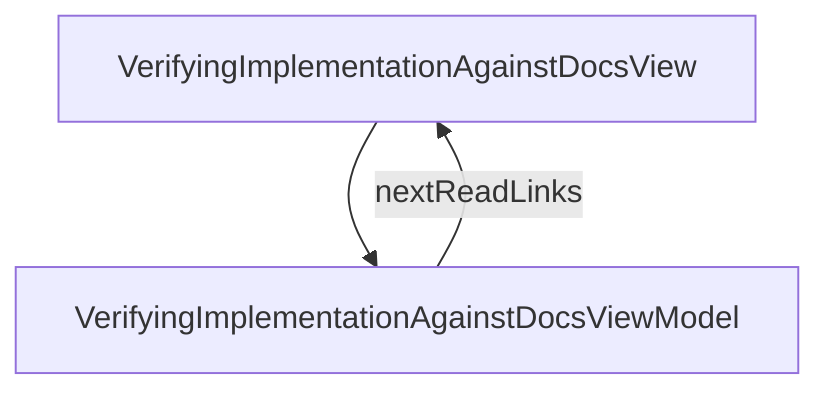

# VerifyingImplementationAgainstDocs - Verifying implementation against docs

## Overview

Cookbook companion to /concepts/implementation-contract-check. Walkthrough for setting up `jsonui-doc check` end-to-end: what OpenAPI diff catches vs skips, how to declare checkers in jui.config.json, a minimal FastAPI adapter script that exports the impl-side OpenAPI, how the same slot works for Spring / NestJS / Rails, running check locally + in CI with exit-code semantics, how results surface in generated HTML, and what still requires the full-checker plugin type (auth-required live-response verification). Seven H2 sections + TOC + next-reads. ~10-min read.

| | |
|---|---|
| Created | 2026-07-07 |
| Updated | 2026-07-07 |

## Screen Structure

### UI Components

| Component | ID | Platform | Description | Initial State | Notes |
|---|---|---|---|---|---|
| View | `guides_verifying_implementation_against_docs_root` | - | - | - | - |
| &nbsp;&nbsp;↳ Scroll | `guides_verifying_implementation_against_docs_scroll` | - | - | - | - |
| &nbsp;&nbsp;&nbsp;&nbsp;↳ View | `guides_verifying_implementation_against_docs_header` | - | - | - | - |
| &nbsp;&nbsp;&nbsp;&nbsp;&nbsp;&nbsp;↳ Label | `-` | - | - | - | - |
| &nbsp;&nbsp;&nbsp;&nbsp;&nbsp;&nbsp;↳ Label | `-` | - | - | - | - |
| &nbsp;&nbsp;&nbsp;&nbsp;&nbsp;&nbsp;↳ Label | `-` | - | - | - | - |
| &nbsp;&nbsp;&nbsp;&nbsp;&nbsp;&nbsp;↳ Label | `-` | - | - | - | - |
| &nbsp;&nbsp;&nbsp;&nbsp;↳ View | `guides_verifying_implementation_against_docs_content_with_rail` | - | - | - | - |
| &nbsp;&nbsp;&nbsp;&nbsp;&nbsp;&nbsp;↳ View | `guides_verifying_implementation_against_docs_body_column` | - | - | - | - |
| &nbsp;&nbsp;&nbsp;&nbsp;&nbsp;&nbsp;&nbsp;&nbsp;↳ View | `section_what` | - | - | - | - |
| &nbsp;&nbsp;&nbsp;&nbsp;&nbsp;&nbsp;&nbsp;&nbsp;&nbsp;&nbsp;↳ Label | `-` | - | - | - | - |
| &nbsp;&nbsp;&nbsp;&nbsp;&nbsp;&nbsp;&nbsp;&nbsp;&nbsp;&nbsp;↳ Label | `-` | - | - | - | - |
| &nbsp;&nbsp;&nbsp;&nbsp;&nbsp;&nbsp;&nbsp;&nbsp;↳ View | `section_declare` | - | - | - | - |
| &nbsp;&nbsp;&nbsp;&nbsp;&nbsp;&nbsp;&nbsp;&nbsp;&nbsp;&nbsp;↳ Label | `-` | - | - | - | - |
| &nbsp;&nbsp;&nbsp;&nbsp;&nbsp;&nbsp;&nbsp;&nbsp;&nbsp;&nbsp;↳ Label | `-` | - | - | - | - |
| &nbsp;&nbsp;&nbsp;&nbsp;&nbsp;&nbsp;&nbsp;&nbsp;&nbsp;&nbsp;↳ CodeBlock | `-` | - | - | - | - |
| &nbsp;&nbsp;&nbsp;&nbsp;&nbsp;&nbsp;&nbsp;&nbsp;↳ View | `section_fastapi` | - | - | - | - |
| &nbsp;&nbsp;&nbsp;&nbsp;&nbsp;&nbsp;&nbsp;&nbsp;&nbsp;&nbsp;↳ Label | `-` | - | - | - | - |
| &nbsp;&nbsp;&nbsp;&nbsp;&nbsp;&nbsp;&nbsp;&nbsp;&nbsp;&nbsp;↳ Label | `-` | - | - | - | - |
| &nbsp;&nbsp;&nbsp;&nbsp;&nbsp;&nbsp;&nbsp;&nbsp;&nbsp;&nbsp;↳ CodeBlock | `-` | - | - | - | - |
| &nbsp;&nbsp;&nbsp;&nbsp;&nbsp;&nbsp;&nbsp;&nbsp;↳ View | `section_frameworks` | - | - | - | - |
| &nbsp;&nbsp;&nbsp;&nbsp;&nbsp;&nbsp;&nbsp;&nbsp;&nbsp;&nbsp;↳ Label | `-` | - | - | - | - |
| &nbsp;&nbsp;&nbsp;&nbsp;&nbsp;&nbsp;&nbsp;&nbsp;&nbsp;&nbsp;↳ Label | `-` | - | - | - | - |
| &nbsp;&nbsp;&nbsp;&nbsp;&nbsp;&nbsp;&nbsp;&nbsp;&nbsp;&nbsp;↳ CodeBlock | `-` | - | - | - | - |
| &nbsp;&nbsp;&nbsp;&nbsp;&nbsp;&nbsp;&nbsp;&nbsp;↳ View | `section_execute` | - | - | - | - |
| &nbsp;&nbsp;&nbsp;&nbsp;&nbsp;&nbsp;&nbsp;&nbsp;&nbsp;&nbsp;↳ Label | `-` | - | - | - | - |
| &nbsp;&nbsp;&nbsp;&nbsp;&nbsp;&nbsp;&nbsp;&nbsp;&nbsp;&nbsp;↳ Label | `-` | - | - | - | - |
| &nbsp;&nbsp;&nbsp;&nbsp;&nbsp;&nbsp;&nbsp;&nbsp;&nbsp;&nbsp;↳ CodeBlock | `-` | - | - | - | - |
| &nbsp;&nbsp;&nbsp;&nbsp;&nbsp;&nbsp;&nbsp;&nbsp;&nbsp;&nbsp;↳ CodeBlock | `-` | - | - | - | - |
| &nbsp;&nbsp;&nbsp;&nbsp;&nbsp;&nbsp;&nbsp;&nbsp;↳ View | `section_html` | - | - | - | - |
| &nbsp;&nbsp;&nbsp;&nbsp;&nbsp;&nbsp;&nbsp;&nbsp;&nbsp;&nbsp;↳ Label | `-` | - | - | - | - |
| &nbsp;&nbsp;&nbsp;&nbsp;&nbsp;&nbsp;&nbsp;&nbsp;&nbsp;&nbsp;↳ Label | `-` | - | - | - | - |
| &nbsp;&nbsp;&nbsp;&nbsp;&nbsp;&nbsp;&nbsp;&nbsp;&nbsp;&nbsp;↳ CodeBlock | `-` | - | - | - | - |
| &nbsp;&nbsp;&nbsp;&nbsp;&nbsp;&nbsp;&nbsp;&nbsp;↳ View | `section_limits` | - | - | - | - |
| &nbsp;&nbsp;&nbsp;&nbsp;&nbsp;&nbsp;&nbsp;&nbsp;&nbsp;&nbsp;↳ Label | `-` | - | - | - | - |
| &nbsp;&nbsp;&nbsp;&nbsp;&nbsp;&nbsp;&nbsp;&nbsp;&nbsp;&nbsp;↳ Label | `-` | - | - | - | - |
| &nbsp;&nbsp;&nbsp;&nbsp;&nbsp;&nbsp;&nbsp;&nbsp;&nbsp;&nbsp;↳ CodeBlock | `-` | - | - | - | - |
| &nbsp;&nbsp;&nbsp;&nbsp;&nbsp;&nbsp;&nbsp;&nbsp;&nbsp;&nbsp;↳ CodeBlock | `-` | - | - | - | - |
| &nbsp;&nbsp;&nbsp;&nbsp;&nbsp;&nbsp;&nbsp;&nbsp;↳ View | `guides_verifying_implementation_against_docs_next` | - | - | - | - |
| &nbsp;&nbsp;&nbsp;&nbsp;&nbsp;&nbsp;&nbsp;&nbsp;&nbsp;&nbsp;↳ Label | `-` | - | - | - | - |
| &nbsp;&nbsp;&nbsp;&nbsp;&nbsp;&nbsp;&nbsp;&nbsp;&nbsp;&nbsp;↳ Collection | `guides_verifying_implementation_against_docs_next_collection` | - | - | - | - |
| &nbsp;&nbsp;&nbsp;&nbsp;&nbsp;&nbsp;&nbsp;&nbsp;↳ View | `guides_verifying_implementation_against_docs_footer` | - | - | - | - |
| &nbsp;&nbsp;&nbsp;&nbsp;&nbsp;&nbsp;&nbsp;&nbsp;&nbsp;&nbsp;↳ Label | `-` | - | - | - | - |
| &nbsp;&nbsp;&nbsp;&nbsp;&nbsp;&nbsp;↳ View | `guides_verifying_implementation_against_docs_rail_column` | - | - | - | - |
| &nbsp;&nbsp;&nbsp;&nbsp;&nbsp;&nbsp;&nbsp;&nbsp;↳ View | `guides_verifying_implementation_against_docs_toc_wrap` | - | - | - | - |
| &nbsp;&nbsp;&nbsp;&nbsp;&nbsp;&nbsp;&nbsp;&nbsp;&nbsp;&nbsp;↳ TableOfContents | `-` | - | - | - | - |

### Layout Structure

```
guides_verifying_implementation_against_docs_root
└── guides_verifying_implementation_against_docs_scroll
```

## Data Flow



### ViewModel

#### Methods

| Signature | Platforms | Description |
|---|---|---|
| `onAppear()` | all | Seed nextReadLinks from the module-scope NEXT_READ_ENTRIES catalog (two rows: next_concept -> /concepts/implementation-contract-check, next_api_cookbook -> /guides/api-data-models) and stamp currentLanguage from StringManager.language. Each row's titleKey / descriptionKey is resolved through StringManager with the guides_verifying_implementation_against_docs_ namespace prefix. |
| `onNavigate(url: String)` | all | Client-side navigation via router.push(url). Destinations are enumerated in transitions: /guides, /concepts/implementation-contract-check, /guides/api-data-models. |

#### Vars

| Declaration | Flags | Platforms | Description |
|---|---|---|---|
| `var nextReadLinks: Array(NextReadLink)` | observable | all | Two closing 'read next' cards pointing at the concept essay and the API DTO cookbook. Seeded by onAppear from the NEXT_READ_ENTRIES static catalog and re-seeded by onToggleLanguage. |

## State Management

### UI Data Variables

| Variable Name | Type | Description | Notes |
|---|---|---|---|
| `nextReadLinks` | [NextReadLink] | Two follow-up cards: concepts/implementation-contract-check (the concept essay) and guides/api-data-models (the API DTO cookbook). | - |

### View-local Event Handlers

_Handlers kept inside the View layer. ViewModel public API lives under `dataFlow.viewModel`._

| Handler | Description | Notes |
|---|---|---|
| `onAppear` | Seed nextReadLinks. | - |
| `onNavigate` | Client-side navigation. | - |
| `onNavigateGuides` |  | - |

## User Actions

| Action | Processing | Destination | Notes |
|---|---|---|---|
| Tap a TOC entry | TOC-internal scroll. | - | - |
| Tap a NextReadLink card | onNavigate(url). | - | - |

## Validation

## Transitions

| Condition | Destination | Notes |
|---|---|---|
| url is a spec-mapped guide URL or the concept essay | Target spec screen or tab | - |

## Related Files

| Type | File Path | Notes |
|---|---|---|
| Layout | `docs/screens/layouts/guides/verifying-implementation-against-docs.json` | - |
| ViewModel | `jsonui-doc-web/src/viewmodels/guides/VerifyingImplementationAgainstDocsViewModel.ts` | - |
| View | `jsonui-doc-web/src/app/guides/verifying-implementation-against-docs/page.tsx` | - |

## Notes

- 2026-07-07 — New guide (cookbook) companion to /concepts/implementation-contract-check. Documents the workflow for the doc-contract-check feature (Phase 1–3 of jsonui-cli's 2026-07-07-doc-contract-check impl plan).
- Seven H2 sections + TOC + next-reads. Each section carries at least one CodeBlock (JSON config snippet, Python adapter script, shell command, YAML CI step, or example report row).
- Section 1 — section_what: What OpenAPI diff catches vs skips. Table (prose or ComparisonRow-style, choose whichever fits the reader flow). Catches: paths (present / absent, both directions), method (GET/POST/etc.), parameter names + required + types, requestBody schema, 2xx response schema (property existence + types + nullable + required), enum value sets, schema name mismatches (as warning, not mismatch). Does NOT catch: live response shape (only the impl's declared OpenAPI), auth flows, backend business logic. Note the design decision: adapter type + comparator, so backend framework can be anything that emits OpenAPI.
- Section 2 — section_declare: `jui.config.json` に `checks` 配列を宣言する。CodeBlock 1 — jsonc: `{ "checks": [{ "name": "api", "type": "builtin:openapi-diff", "impl_openapi_command": "python -m app.export_openapi", "timeout_seconds": 60 }] }`. 説明: `name` は識別子、`type` はチェッカー種別、`impl_openapi_command` は「実装側 OpenAPI を stdout に吐くコマンド」、`timeout_seconds` は既定 60。認証情報は config に書かず環境変数か実行時引数で渡す原則を明示。
- Section 3 — section_fastapi: 最小の FastAPI アダプタスクリプトの例。CodeBlock 2 — python: 汎用オンライン教科書レベルの FastAPI アプリ (`/items` / `/users` の簡素な CRUD 前提) に対する `app.openapi()` dump スクリプト、5–8 行程度。`json.dumps(app.openapi(), indent=2)` を stdout に出す。runnable なミニ例に留め、認証・DB・実業務は含めない。**consumer 由来のサンプルコードは絶対に貼らない**。
- Section 4 — section_frameworks: 他フレームワークでの代替パス。Spring (springdoc-openapi の JSON エンドポイント → wget → stdout)、NestJS (`@nestjs/swagger` の `SwaggerModule.createDocument` を JSON に serialize)、Rails (rswag が YAML を吐くので `yq -o json`)。各 1 行の hint + どの extension を差せば動くかの案内。目的は「OpenAPI を吐ける backend なら framework 問わず動く」ことの証明。CodeBlock は各 framework 1 行 shell の合計 3–4 行、CodeBlock は 1 個で言語 shell。
- Section 5 — section_execute: ローカルと CI での実行方法。ローカル: `jsonui-doc check --list` (何が走るか事前表示 / 実行しない) → `jsonui-doc check api` (実行) → 結果は `docs/api/.check-report.json` に保存 (default では commit しない、`.gitignore` 追加を推奨)。exit code 0/1/2 の意味 = OK / mismatch あり / 実行エラー (接続失敗・タイムアウト・プラグイン出力不正)。CI: GitHub Actions の 6–8 行 YAML スニペット (env vars で `JSONUI_CHECK_DB_URL_MAIN` 等を渡し、`jsonui-doc check` を明示ステップとして呼ぶ)。CodeBlock は shell + yaml の 2 個。
- Section 6 — section_html: 生成 HTML への反映。`jsonui-doc generate html` はレポートがあれば「実装との整合性」ページを追加描画する。表示要素: 検証時刻 (`executed_at`)、チェッカー名、対象 (target / dialect)、confidence バッジ、mismatch 一覧 (target / status / expected / actual / message)、stale 判定 (docs が変わったのにレポートが古い場合の警告表示、input_hashes 比較)。`generate html` は check レポートが無くても・失敗していても常に成功する不変条件を再確認。`jsonui-doc generate html --with-checks` シュガーを紹介 (check → generate を 1 発、CI 便利フラグ)。CodeBlock 1 例 — sample of what a mismatch row looks like in JSON (from the underlying `.check-report.json`).
- Section 7 — section_limits: フルチェッカー型の出番。認証必要 / 実データ検証 / 意味的規約 (特定カラムの NULL の意味、response のフィールド組み合わせ制約) など、宣言同士では表現できないケース。CodeBlock 3 — jsonc: フルチェッカー型宣言例 `{ "name": "api-live", "type": "checker", "command": ".jsonui/checks/live_api_check.py", "timeout_seconds": 120 }`。CodeBlock 4 — python outline: httpx で数エンドポイントを叩いて結果 JSON (schemaVersion / results / summary) を stdout に吐く 8–10 行スニペット、認証は要件のみ言及 (実装は reader の責務)。フルチェッカー型は結果 JSON contract (§ concepts の説明) に準拠、不正出力は exit 2。
- Two closing next-reads: (1) next_concept -> /concepts/implementation-contract-check (concept essay — 設計原則・confidence 3 段階・plugin 2 段階の背景), (2) next_api_cookbook -> /guides/api-data-models (API DTO の cookbook — swagger 側の author 作業を先に知りたい reader 向け).
- Strings prefix: guides_verifying_implementation_against_docs_ (namespace). Estimated 80–120 keys (breadcrumb / title / lead / read_time / 7 x heading+body / 7 x toc rows / 2 x next-read title+description / footer / toc_title + subheadings + inline labels). en + ja owned by jsonui-localize.
- Public repo hygiene: 汎用ドメイン (orders / users / products / items) 以外の具体語彙は使わない。上流の実地検証コーパス由来のテーブル名・カラム名・複合 index 構成を一切引用しない。impl_openapi_command の例は FastAPI 最小サンプル、実 API のパスも `/items` / `/users` に丸める。
- CodeBlocks needed: (1) jui.config.json checks 宣言 jsonc, (2) FastAPI export スクリプト python 5–8 行, (3) shell — 他 framework の 3 行 hint, (4) shell — jsonui-doc check --list / check api / exit code, (5) yaml — GitHub Actions 6–8 行 CI ステップ, (6) json — mismatch レポート行の例, (7) jsonc — フルチェッカー宣言, (8) python — httpx フルチェッカー 8–10 行 outline. Total: 8 CodeBlocks. すべて汎用ドメインで書く。
- Cross-links from other pages: (a) home RECENT_CHANGES entry to be added for both new pages, (b) /reference/cli-commands section_checks_body's '具体 cookbook は今後追加予定' phrasing to be updated post-launch to link here (follow-up edit), (c) /concepts/implementation-contract-check next-reads points here (implemented in that spec).
