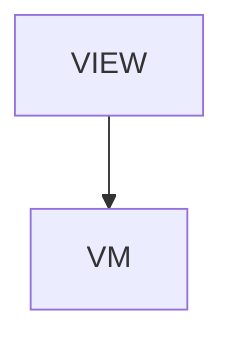

# WritingLayouts - Writing layouts

## Overview

Guides > Writing layouts. Task-focused walk-through of how to author layout JSON well — style definitions, include (sub-layout reuse), Collection basics and multi-section patterns, @{binding} and visibility tricks, and common pitfalls. Seven sections + TOC + next-reads. Web (rjui) focused because this docs site is Web-primary; cross-platform nuances deferred to concept essays.

| | |
|---|---|
| Layout File | `guides/writing-layouts` |
| Created | 2026-04-24 |
| Updated | 2026-04-24 |

## Screen Structure

### UI Components

| Component | ID | Platform | Description | Initial State | Notes |
|---|---|---|---|---|---|
| View | `guides_writing_layouts_root` | - | - | - | - |
| &nbsp;&nbsp;↳ Scroll | `guides_writing_layouts_scroll` | - | - | - | - |
| &nbsp;&nbsp;&nbsp;&nbsp;↳ View | `guides_writing_layouts_header` | - | - | - | - |
| &nbsp;&nbsp;&nbsp;&nbsp;&nbsp;&nbsp;↳ Label | `-` | - | - | - | - |
| &nbsp;&nbsp;&nbsp;&nbsp;&nbsp;&nbsp;↳ Label | `-` | - | - | - | - |
| &nbsp;&nbsp;&nbsp;&nbsp;&nbsp;&nbsp;↳ Label | `-` | - | - | - | - |
| &nbsp;&nbsp;&nbsp;&nbsp;&nbsp;&nbsp;↳ Label | `-` | - | - | - | - |
| &nbsp;&nbsp;&nbsp;&nbsp;↳ View | `guides_writing_layouts_content_with_rail` | - | - | - | - |
| &nbsp;&nbsp;&nbsp;&nbsp;&nbsp;&nbsp;↳ View | `guides_writing_layouts_body_column` | - | - | - | - |
| &nbsp;&nbsp;&nbsp;&nbsp;&nbsp;&nbsp;&nbsp;&nbsp;↳ View | `section_where` | - | - | - | - |
| &nbsp;&nbsp;&nbsp;&nbsp;&nbsp;&nbsp;&nbsp;&nbsp;&nbsp;&nbsp;↳ Label | `-` | - | - | - | - |
| &nbsp;&nbsp;&nbsp;&nbsp;&nbsp;&nbsp;&nbsp;&nbsp;&nbsp;&nbsp;↳ Label | `-` | - | - | - | - |
| &nbsp;&nbsp;&nbsp;&nbsp;&nbsp;&nbsp;&nbsp;&nbsp;&nbsp;&nbsp;↳ CodeBlock | `-` | - | - | - | - |
| &nbsp;&nbsp;&nbsp;&nbsp;&nbsp;&nbsp;&nbsp;&nbsp;↳ View | `section_style` | - | - | - | - |
| &nbsp;&nbsp;&nbsp;&nbsp;&nbsp;&nbsp;&nbsp;&nbsp;&nbsp;&nbsp;↳ Label | `-` | - | - | - | - |
| &nbsp;&nbsp;&nbsp;&nbsp;&nbsp;&nbsp;&nbsp;&nbsp;&nbsp;&nbsp;↳ Label | `-` | - | - | - | - |
| &nbsp;&nbsp;&nbsp;&nbsp;&nbsp;&nbsp;&nbsp;&nbsp;&nbsp;&nbsp;↳ CodeBlock | `-` | - | - | - | - |
| &nbsp;&nbsp;&nbsp;&nbsp;&nbsp;&nbsp;&nbsp;&nbsp;&nbsp;&nbsp;↳ CodeBlock | `-` | - | - | - | - |
| &nbsp;&nbsp;&nbsp;&nbsp;&nbsp;&nbsp;&nbsp;&nbsp;&nbsp;&nbsp;↳ Label | `-` | - | - | - | - |
| &nbsp;&nbsp;&nbsp;&nbsp;&nbsp;&nbsp;&nbsp;&nbsp;&nbsp;&nbsp;↳ Label | `-` | - | - | - | - |
| &nbsp;&nbsp;&nbsp;&nbsp;&nbsp;&nbsp;&nbsp;&nbsp;↳ View | `section_include` | - | - | - | - |
| &nbsp;&nbsp;&nbsp;&nbsp;&nbsp;&nbsp;&nbsp;&nbsp;&nbsp;&nbsp;↳ Label | `-` | - | - | - | - |
| &nbsp;&nbsp;&nbsp;&nbsp;&nbsp;&nbsp;&nbsp;&nbsp;&nbsp;&nbsp;↳ Label | `-` | - | - | - | - |
| &nbsp;&nbsp;&nbsp;&nbsp;&nbsp;&nbsp;&nbsp;&nbsp;&nbsp;&nbsp;↳ CodeBlock | `-` | - | - | - | - |
| &nbsp;&nbsp;&nbsp;&nbsp;&nbsp;&nbsp;&nbsp;&nbsp;&nbsp;&nbsp;↳ CodeBlock | `-` | - | - | - | - |
| &nbsp;&nbsp;&nbsp;&nbsp;&nbsp;&nbsp;&nbsp;&nbsp;&nbsp;&nbsp;↳ Label | `-` | - | - | - | - |
| &nbsp;&nbsp;&nbsp;&nbsp;&nbsp;&nbsp;&nbsp;&nbsp;↳ View | `section_collection_basic` | - | - | - | - |
| &nbsp;&nbsp;&nbsp;&nbsp;&nbsp;&nbsp;&nbsp;&nbsp;&nbsp;&nbsp;↳ Label | `-` | - | - | - | - |
| &nbsp;&nbsp;&nbsp;&nbsp;&nbsp;&nbsp;&nbsp;&nbsp;&nbsp;&nbsp;↳ Label | `-` | - | - | - | - |
| &nbsp;&nbsp;&nbsp;&nbsp;&nbsp;&nbsp;&nbsp;&nbsp;&nbsp;&nbsp;↳ CodeBlock | `-` | - | - | - | - |
| &nbsp;&nbsp;&nbsp;&nbsp;&nbsp;&nbsp;&nbsp;&nbsp;&nbsp;&nbsp;↳ Label | `-` | - | - | - | - |
| &nbsp;&nbsp;&nbsp;&nbsp;&nbsp;&nbsp;&nbsp;&nbsp;&nbsp;&nbsp;↳ Label | `-` | - | - | - | - |
| &nbsp;&nbsp;&nbsp;&nbsp;&nbsp;&nbsp;&nbsp;&nbsp;&nbsp;&nbsp;↳ Label | `-` | - | - | - | - |
| &nbsp;&nbsp;&nbsp;&nbsp;&nbsp;&nbsp;&nbsp;&nbsp;&nbsp;&nbsp;↳ Label | `-` | - | - | - | - |
| &nbsp;&nbsp;&nbsp;&nbsp;&nbsp;&nbsp;&nbsp;&nbsp;&nbsp;&nbsp;↳ Label | `-` | - | - | - | - |
| &nbsp;&nbsp;&nbsp;&nbsp;&nbsp;&nbsp;&nbsp;&nbsp;&nbsp;&nbsp;↳ Label | `-` | - | - | - | - |
| &nbsp;&nbsp;&nbsp;&nbsp;&nbsp;&nbsp;&nbsp;&nbsp;&nbsp;&nbsp;↳ Label | `-` | - | - | - | - |
| &nbsp;&nbsp;&nbsp;&nbsp;&nbsp;&nbsp;&nbsp;&nbsp;&nbsp;&nbsp;↳ CodeBlock | `-` | - | - | - | - |
| &nbsp;&nbsp;&nbsp;&nbsp;&nbsp;&nbsp;&nbsp;&nbsp;&nbsp;&nbsp;↳ CodeBlock | `-` | - | - | - | - |
| &nbsp;&nbsp;&nbsp;&nbsp;&nbsp;&nbsp;&nbsp;&nbsp;↳ View | `section_collection_multi` | - | - | - | - |
| &nbsp;&nbsp;&nbsp;&nbsp;&nbsp;&nbsp;&nbsp;&nbsp;&nbsp;&nbsp;↳ Label | `-` | - | - | - | - |
| &nbsp;&nbsp;&nbsp;&nbsp;&nbsp;&nbsp;&nbsp;&nbsp;&nbsp;&nbsp;↳ Label | `-` | - | - | - | - |
| &nbsp;&nbsp;&nbsp;&nbsp;&nbsp;&nbsp;&nbsp;&nbsp;&nbsp;&nbsp;↳ CodeBlock | `-` | - | - | - | - |
| &nbsp;&nbsp;&nbsp;&nbsp;&nbsp;&nbsp;&nbsp;&nbsp;&nbsp;&nbsp;↳ Label | `-` | - | - | - | - |
| &nbsp;&nbsp;&nbsp;&nbsp;&nbsp;&nbsp;&nbsp;&nbsp;↳ View | `section_binding` | - | - | - | - |
| &nbsp;&nbsp;&nbsp;&nbsp;&nbsp;&nbsp;&nbsp;&nbsp;&nbsp;&nbsp;↳ Label | `-` | - | - | - | - |
| &nbsp;&nbsp;&nbsp;&nbsp;&nbsp;&nbsp;&nbsp;&nbsp;&nbsp;&nbsp;↳ Label | `-` | - | - | - | - |
| &nbsp;&nbsp;&nbsp;&nbsp;&nbsp;&nbsp;&nbsp;&nbsp;&nbsp;&nbsp;↳ CodeBlock | `-` | - | - | - | - |
| &nbsp;&nbsp;&nbsp;&nbsp;&nbsp;&nbsp;&nbsp;&nbsp;&nbsp;&nbsp;↳ Label | `-` | - | - | - | - |
| &nbsp;&nbsp;&nbsp;&nbsp;&nbsp;&nbsp;&nbsp;&nbsp;&nbsp;&nbsp;↳ Label | `-` | - | - | - | - |
| &nbsp;&nbsp;&nbsp;&nbsp;&nbsp;&nbsp;&nbsp;&nbsp;&nbsp;&nbsp;↳ Label | `-` | - | - | - | - |
| &nbsp;&nbsp;&nbsp;&nbsp;&nbsp;&nbsp;&nbsp;&nbsp;↳ View | `section_pitfalls` | - | - | - | - |
| &nbsp;&nbsp;&nbsp;&nbsp;&nbsp;&nbsp;&nbsp;&nbsp;&nbsp;&nbsp;↳ Label | `-` | - | - | - | - |
| &nbsp;&nbsp;&nbsp;&nbsp;&nbsp;&nbsp;&nbsp;&nbsp;&nbsp;&nbsp;↳ Label | `-` | - | - | - | - |
| &nbsp;&nbsp;&nbsp;&nbsp;&nbsp;&nbsp;&nbsp;&nbsp;&nbsp;&nbsp;↳ Label | `-` | - | - | - | - |
| &nbsp;&nbsp;&nbsp;&nbsp;&nbsp;&nbsp;&nbsp;&nbsp;&nbsp;&nbsp;↳ Label | `-` | - | - | - | - |
| &nbsp;&nbsp;&nbsp;&nbsp;&nbsp;&nbsp;&nbsp;&nbsp;&nbsp;&nbsp;↳ Label | `-` | - | - | - | - |
| &nbsp;&nbsp;&nbsp;&nbsp;&nbsp;&nbsp;&nbsp;&nbsp;&nbsp;&nbsp;↳ Label | `-` | - | - | - | - |
| &nbsp;&nbsp;&nbsp;&nbsp;&nbsp;&nbsp;&nbsp;&nbsp;&nbsp;&nbsp;↳ Label | `-` | - | - | - | - |
| &nbsp;&nbsp;&nbsp;&nbsp;&nbsp;&nbsp;&nbsp;&nbsp;↳ View | `guides_writing_layouts_next` | - | - | - | - |
| &nbsp;&nbsp;&nbsp;&nbsp;&nbsp;&nbsp;&nbsp;&nbsp;&nbsp;&nbsp;↳ Label | `-` | - | - | - | - |
| &nbsp;&nbsp;&nbsp;&nbsp;&nbsp;&nbsp;&nbsp;&nbsp;&nbsp;&nbsp;↳ Collection | `guides_writing_layouts_next_collection` | - | - | - | - |
| &nbsp;&nbsp;&nbsp;&nbsp;&nbsp;&nbsp;&nbsp;&nbsp;↳ View | `guides_writing_layouts_footer` | - | - | - | - |
| &nbsp;&nbsp;&nbsp;&nbsp;&nbsp;&nbsp;&nbsp;&nbsp;&nbsp;&nbsp;↳ Label | `-` | - | - | - | - |
| &nbsp;&nbsp;&nbsp;&nbsp;&nbsp;&nbsp;↳ View | `guides_writing_layouts_rail_column` | - | - | - | - |
| &nbsp;&nbsp;&nbsp;&nbsp;&nbsp;&nbsp;&nbsp;&nbsp;↳ View | `guides_writing_layouts_toc_wrap` | - | - | - | - |
| &nbsp;&nbsp;&nbsp;&nbsp;&nbsp;&nbsp;&nbsp;&nbsp;&nbsp;&nbsp;↳ TableOfContents | `-` | - | - | - | - |

### Layout Structure

```
guides_writing_layouts_root
└── guides_writing_layouts_scroll
```

## Data Flow


```mermaid
flowchart TD
    VIEW --> VM
```

### ViewModel

#### Methods

| Signature | Platforms | Description |
|---|---|---|
| `onAppear()` | all | Seed nextReadLinks from the module-scope NEXT_READ_ENTRIES catalog (two rows: next_custom_components -> /guides/custom-components, next_first_spec -> /guides/writing-your-first-spec) and stamp currentLanguage from StringManager.language. Each row's titleKey / descriptionKey is resolved through StringManager with the guides_writing_layouts_ namespace prefix. |
| `onNavigate(url: String)` | all | Client-side navigation via router.push(url). Destinations are the spec-mapped URLs enumerated in transitions: /, /guides/custom-components, /guides/writing-your-first-spec. |

#### Vars

| Declaration | Flags | Platforms | Description |
|---|---|---|---|
| `var nextReadLinks: Array(NextReadLink)` | observable | all | Two closing 'read next' cards pointing at /guides/custom-components and /guides/writing-your-first-spec. Seeded by onAppear from the NEXT_READ_ENTRIES static catalog. |

## State Management

### UI Data Variables

| Variable Name | Type | Default | Description | Notes |
|---|---|---|---|---|
| `nextReadLinks` | [NextReadLink] | `-` | Two closing cards. | - |
| `onHeroInstallTap` | String | `-` | (from binding) | - |
| `onBack` | String | `-` | (from binding) | - |
| `label` | String | `-` | (from binding) | - |
| `agents` | String | `-` | (from binding) | - |
| `nameKey` | String | `-` | (from binding) | - |
| `roleKey` | String | `-` | (from binding) | - |
| `whenToUseKey` | String | `-` | (from binding) | - |
| `referenceSections` | String | `-` | (from binding) | - |
| `errorMessage` | String | `-` | (from binding) | - |
| `errorVisibility` | String | `-` | (from binding) | - |

### View-local Event Handlers

_Handlers kept inside the View layer. ViewModel public API lives under `dataFlow.viewModel`._

| Handler | Description | Notes |
|---|---|---|
| `onAppear` | Seed nextReadLinks. | - |
| `onNavigate` | Client-side navigation. | - |
| `onNavigateGuides` |  | - |

## User Actions

| Action | Processing | Destination | Notes |
|---|---|---|---|
| Tap a TOC entry | TOC-internal scroll. | - | - |
| Tap a NextReadLink card | onNavigate(url). | - | - |

## Validation

## Transitions

| Condition | Destination | Notes |
|---|---|---|
| url is spec-mapped | Target screen or tab | - |

## Related Files

| Type | File Path | Notes |
|---|---|---|
| Layout | `docs/screens/layouts/guides/writing-layouts.json` | - |
| ViewModel | `jsonui-doc-web/src/viewmodels/guides/WritingLayoutsViewModel.ts` | - |
| View | `jsonui-doc-web/src/app/guides/writing-layouts/page.tsx` | - |

## Notes

- Sixth live entry under the Guides tab. Follows the same template as the other five (custom-components, localization, navigation, testing, writing-your-first-spec).
- Seven sections: (1) Orient yourself (where layout / cell / style / strings files live, with project tree), (2) Style definitions (styles/ folder, 'style' attribute, merge rule, no inheritance) with 2 CodeBlocks, (3) Include sub-layout reuse ('include' attribute, shared_data + data, not recursive) with 1 CodeBlock, (4) Collection basics — single cell type with items / cellIdProperty / sections / orientation / columnCount / line-itemSpacing / lazy / scrollEnabled; data block on the cell side that becomes a TS Data interface, with 3 CodeBlocks, (5) Collection multi-section — mixing cell types requires multiple sections because rjui cannot pick cell type dynamically per row, with 1 CodeBlock, (6) Binding and visibility — @{property} resolution + visible/invisible/gone triage, (7) Pitfalls — weight vs matchParent in flex-row, topMargin is orientation-agnostic, gone vs invisible DOM implications, _overlay is internal.
- Running exemplars: home.json styles ('primary_button', 'hero_section'), cells/agent_row.json for the cell data block example, and a minimal include example even though JsonUIDocument itself does not currently use the include mechanism (it is a supported feature worth documenting).
- Cross-links: the five existing guides' next-reads will be touched in a follow-up so at least custom-components points to this guide as a natural follow-on.
- 2026-09-03 - section_collection_basic_bullet_lazy was wrong: it described `lazy` as a boolean (true / false) while the attribute SSoT declares a string enum 'lazy' | 'eager' | 'none' (or a binding). Measured at 1.8.20 in a scratch copy: a Collection with lazy:false gets the build warning 'Attribute lazy in Collection expects string or binding, got boolean', and lazy:'none' gets none. Rewritten with the three values and the 1.8.20 flow scroll rule (with lazy in effect a flow Collection scrolls inside its own bounds; 'none' only wraps). Found by comparing the site's words with the SSoT sentence the release changed - the declaration itself reaches no runtime file here.
- 2026-09-03, a published page was printing an identifier. The full-namespace live check (every key of guides_writing_layouts, both languages) reported section_collection_basic_bullet_scrollEnabled absent; the page was rendering the KEY NAME where the bullet belongs. Cause is upstream: rjui's layout-to-TSX conversion does not recognise a string key containing an uppercase letter and emits it as literal text - the sibling bullets became {$s....BulletLazy} lookups while this one became the bare word. jui build exits 0 with zero warnings and every gate was green, so nothing here could have caught it. Of this site's 1988 string keys exactly two carried an uppercase letter and both were broken and published (the other is on the developer-menu page); renaming them to lowercase, with their layout references, restored the lookup. Filed upstream. Two unseeded leftovers, next_custom_components_title and _description, were removed from this namespace at the same time - the reference_components copies are the ones the view model reads.
- 2026-10-02 — section_include_body rewritten for 1.9.6. jsonui-cli 1.9.6 settles include semantics (user ruling 2026-10-02, 'follow the declaration; keep the maps as overrides'): an include is an inline expansion; the included layout reads the including screen's data, which that screen's ViewModel owns; an `id` on the include prefixes the included layout's data names; the include's `shared_data` then `data` maps are laid over that data. Web takes this meaning from 1.9.6; before it, a web partial kept defaults of its own. The sentence that said the include 'passes any shared_data / data fields on the include as props' is gone: that was the pre-1.9.6 web convention. section_binding_body: 'starts with @{name}' becomes 'is one whole @{name}', and the mixed form is named as warned. jsonui-cli 1.9.6 adds binding-mixed-text (WARNING, fails under --strict): an SSoT-declared attribute whose value contains `@{` but is not one whole `@{...}`. The user's ruling (2026-10-02) is that a sentence is assembled in the ViewModel and passed as one binding, because a layout-assembled sentence cannot be localized as one string and puts logic in the JSON.
- 2026-10-02 — section_include_note_depth said include was one level deep, with the included file's includes not followed. That was false before 1.9.6 as well: upstream reports that every expander (sjui / kjui / rjui / Python / the SJUI and KJUI runtimes) expands nesting recursively and stops on a cycle with an error. The bullet now states recursion and the nested data rules: prefixes compose (side + card + title → sideCardTitle); an inner map's values bind in the outer partial's scope, after the outer map; an inner include without a map only takes the prefix. Upstream's word, relayed by the orchestrator; not measured here.

<!-- jsonui-doc-producer: jsonui-doc:spec -->
