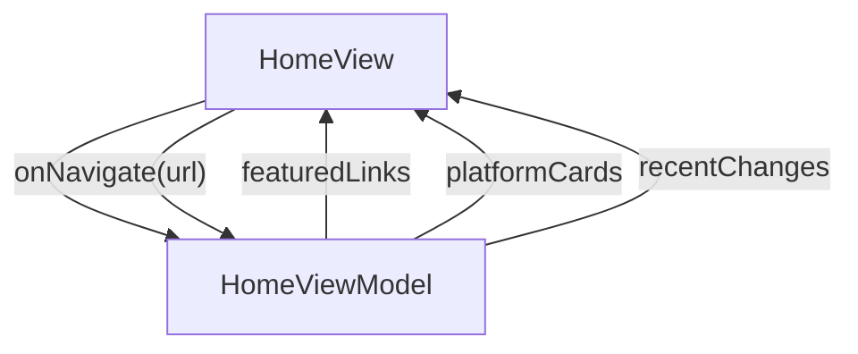

# Home - JsonUI

## Overview

Top page. Three sections: hero (brand statement + three CTAs), featured cards (3 'start here' links), platform cards (Swift/Kotlin/React), and a 'What's new' changelog ribbon. Navigation between site categories now lives in the site-wide chrome (TopBar + Sidebar) — home is no longer a navigation surface. Language toggle also moved to the top bar; home simply re-renders when StringManager flips.

| | |
|---|---|
| Created | 2026-04-22 |
| Updated | 2026-05-27 |

## Screen Structure

### UI Components

| Component | ID | Platform | Description | Initial State | Notes |
|---|---|---|---|---|---|
| View | `home_root` | - | - | - | - |
| &nbsp;&nbsp;↳ Scroll | `home_scroll` | - | - | - | - |
| &nbsp;&nbsp;&nbsp;&nbsp;↳ View | `home_hero` | - | - | - | - |
| &nbsp;&nbsp;&nbsp;&nbsp;&nbsp;&nbsp;↳ Label | `-` | - | - | - | - |
| &nbsp;&nbsp;&nbsp;&nbsp;&nbsp;&nbsp;↳ Label | `home_hero_title` | - | - | - | - |
| &nbsp;&nbsp;&nbsp;&nbsp;&nbsp;&nbsp;↳ Label | `-` | - | - | - | - |
| &nbsp;&nbsp;&nbsp;&nbsp;&nbsp;&nbsp;↳ View | `home_hero_ctas` | - | - | - | - |
| &nbsp;&nbsp;&nbsp;&nbsp;&nbsp;&nbsp;&nbsp;&nbsp;↳ Button | `home_hero_cta_primary` | - | - | - | - |
| &nbsp;&nbsp;&nbsp;&nbsp;&nbsp;&nbsp;&nbsp;&nbsp;↳ Button | `home_hero_cta_secondary` | - | - | - | - |
| &nbsp;&nbsp;&nbsp;&nbsp;&nbsp;&nbsp;&nbsp;&nbsp;↳ Button | `home_hero_cta_tertiary` | - | - | - | - |
| &nbsp;&nbsp;&nbsp;&nbsp;↳ View | `home_featured` | - | - | - | - |
| &nbsp;&nbsp;&nbsp;&nbsp;&nbsp;&nbsp;↳ Label | `-` | - | - | - | - |
| &nbsp;&nbsp;&nbsp;&nbsp;&nbsp;&nbsp;↳ Label | `-` | - | - | - | - |
| &nbsp;&nbsp;&nbsp;&nbsp;&nbsp;&nbsp;↳ Collection | `home_featured_collection` | - | - | - | - |
| &nbsp;&nbsp;&nbsp;&nbsp;↳ View | `home_platforms` | - | - | - | - |
| &nbsp;&nbsp;&nbsp;&nbsp;&nbsp;&nbsp;↳ Label | `-` | - | - | - | - |
| &nbsp;&nbsp;&nbsp;&nbsp;&nbsp;&nbsp;↳ Label | `-` | - | - | - | - |
| &nbsp;&nbsp;&nbsp;&nbsp;&nbsp;&nbsp;↳ Collection | `home_platforms_collection` | - | - | - | - |
| &nbsp;&nbsp;&nbsp;&nbsp;↳ View | `home_whats_new` | - | - | - | - |
| &nbsp;&nbsp;&nbsp;&nbsp;&nbsp;&nbsp;↳ Label | `-` | - | - | - | - |
| &nbsp;&nbsp;&nbsp;&nbsp;&nbsp;&nbsp;↳ Label | `-` | - | - | - | - |
| &nbsp;&nbsp;&nbsp;&nbsp;&nbsp;&nbsp;↳ Collection | `home_whats_new_collection` | - | - | - | - |

### Layout Structure

```
home_root
└── home_scroll
```

## Data Flow



### ViewModel

#### Methods

| Signature | Platforms | Description |
|---|---|---|
| `onAppear()` | all | Build featuredLinks, platformCards, and recentChanges by mapping the module-scope FEATURED_LINKS / PLATFORM_CARDS / RECENT_CHANGES constants through hydrate* helpers that resolve each titleKey / descriptionKey / blurbKey / ctaLabelKey via StringManager.getString() and bind a pre-wired onNavigate closure per row. Also wraps the results in CollectionDataSources via the asCollection() private helper so the generated Collection JSX finds data at data.xxx.sections[0].cells.data. |
| `onNavigate(url: String)` | all | Single navigation funnel: calls router.push(url). Hero CTA bindings (onHeroInstallTap / onHeroAiAgentsTap / onHeroShowcaseTap) and every card's onNavigate closure flow through this one method so future analytics / middleware can hook a single spot. |

#### Vars

| Declaration | Flags | Platforms | Description |
|---|---|---|---|
| `var featuredLinks: Array(FeaturedLink)` | observable | all | 3 featured-card cells, seeded in onAppear. |
| `var platformCards: Array(PlatformCard)` | observable | all | 3 platform-card cells, seeded in onAppear. |
| `var recentChanges: Array(ChangelogCard)` | observable | all | 3–6 'What's new' ribbon cells, seeded in onAppear. As of 2026-05 the catalog includes three new entries pointing at /concepts/data-models-from-openapi and /guides/api-data-models. |

## State Management

### UI Data Variables

| Variable Name | Type | Description | Notes |
|---|---|---|---|
| `featuredLinks` | [FeaturedLink] | Three Featured Section cards rendered below the hero: Get started / AI agents / Cross-platform showcase. Hardcoded by the ViewModel in onAppear from the FEATURED_LINKS constant; each row's titleKey and descriptionKey are pre-resolved through StringManager so the cell renders display-ready text. | - |
| `platformCards` | [PlatformCard] | Three platform cards (Swift / Kotlin / React) that link into each platform section. Hardcoded by the ViewModel in onAppear from the PLATFORM_CARDS constant. | - |
| `recentChanges` | [ChangelogCard] | Up to 3–6 'What's new' ribbon cards telling a returning reader what landed since their last visit. Seeded by the ViewModel in onAppear from the RECENT_CHANGES constant; no API, no runtime fetch. Each cell carries a formatted date + title + blurb + CTA label, all localized. 2026-05 update (swagger-driven Data Models): three new 'May 2026' entries are appended in HomeViewModel.RECENT_CHANGES — (1) DTO + Domain codegen body -> /concepts/data-models-from-openapi, (2) path filter -> /guides/api-data-models §3, (3) MCP Group E discovery -> /concepts/data-models-from-openapi §7. Each entry stays a distinct row (no bundling) so the discovery surface keeps its own first-class card. The spec only confirms the ChangelogCard structure supports the three rows; the literal RECENT_CHANGES catalog content lives in HomeViewModel.ts and is jsonui-implement's responsibility. | - |

### View-local Event Handlers

_Handlers kept inside the View layer. ViewModel public API lives under `dataFlow.viewModel`._

| Handler | Description | Notes |
|---|---|---|
| `onAppear` | Populate featuredLinks, platformCards, and recentChanges with the static v1 catalogs. Every user-visible string is resolved through StringManager using the home_* namespace so the language toggle (owned by the top bar) re-renders every row on flip. Navigation handlers (onHeroInstallTap etc.) are wired in initializeEventHandlers, not here. | - |
| `onNavigate` | Client-side navigation via router.push(url). Invoked by the hero CTAs and every card's onTap closure. | - |
| `onHeroInstallTap` |  | - |
| `onHeroAiAgentsTap` |  | - |
| `onHeroShowcaseTap` |  | - |

## User Actions

| Action | Processing | Destination | Notes |
|---|---|---|---|
| Tap hero CTA | onNavigate(url) with the hero CTA destination (/learn/installation, /tools/agents, or /platforms). | - | - |
| Tap a featured link card | onNavigate(url) with the bound FeaturedLink.url. | - | - |
| Tap a platform card | onNavigate(url) with the bound PlatformCard.url. | - | - |
| Tap a what's-new card | onNavigate(url) with the bound ChangelogCard.ctaUrl. | - | - |

## Validation

## Transitions

| Condition | Destination | Notes |
|---|---|---|
| url is any spec-mapped URL | Target spec screen resolved from url | - |

## Related Files

| Type | File Path | Notes |
|---|---|---|
| Layout | `docs/screens/layouts/home.json` | - |
| Layout | `docs/screens/layouts/cells/featured_card.json` | - |
| Layout | `docs/screens/layouts/cells/platform_card.json` | - |
| Layout | `docs/screens/layouts/cells/changelog_card.json` | - |
| ViewModel | `jsonui-doc-web/src/viewmodels/HomeViewModel.ts` | - |
| View | `jsonui-doc-web/src/app/page.tsx` | - |

## Notes

- Site-wide chrome (TopBar + Sidebar) now owns navigation + language toggle + search. Home hero no longer embeds a language toggle or inline Search. See docs/screens/json/chrome.spec.json.
- v1 uses hand-curated RECENT_CHANGES in the ViewModel. Adding a DocChangelogRepository later is a pure additive change and does not alter the ViewModel's public contract.
- featuredLinks count = 3 (Get started / AI agents / Cross-platform showcase). platformCards count = 3 (Swift / Kotlin / React). recentChanges count = 3–6 (3 new May 2026 entries appended for the swagger-driven Data Models feature; the spec only confirms ChangelogCard supports these — actual entries live in HomeViewModel.RECENT_CHANGES).
- All user-visible strings flow through StringManager keys under the home_* namespace.
