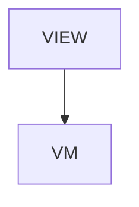

# FirstScreen - Your first screen

## Overview

Learn > build a real screen. Goes beyond hello-world: the reader constructs a three-section screen (Header / Hero / Collection) from scratch, wires it to a ViewModel, and ships a working example end-to-end. ~12-min read. Five sections plus closing trouble spots. Pairs with /learn/data-binding-basics (reader learns bindings first, then applies them in a real layout here).

| | |
|---|---|
| Created | 2026-04-23 |
| Updated | 2026-04-23 |

## Screen Structure

### UI Components

| Component | ID | Platform | Description | Initial State | Notes |
|---|---|---|---|---|---|
| View | `learn_first_screen_root` | - | - | - | - |
| &nbsp;&nbsp;↳ Scroll | `learn_first_screen_scroll` | - | - | - | - |
| &nbsp;&nbsp;&nbsp;&nbsp;↳ View | `learn_first_screen_header` | - | - | - | - |
| &nbsp;&nbsp;&nbsp;&nbsp;&nbsp;&nbsp;↳ Label | `-` | - | - | - | - |
| &nbsp;&nbsp;&nbsp;&nbsp;&nbsp;&nbsp;↳ Label | `-` | - | - | - | - |
| &nbsp;&nbsp;&nbsp;&nbsp;&nbsp;&nbsp;↳ Label | `-` | - | - | - | - |
| &nbsp;&nbsp;&nbsp;&nbsp;&nbsp;&nbsp;↳ Label | `-` | - | - | - | - |
| &nbsp;&nbsp;&nbsp;&nbsp;↳ View | `learn_first_screen_content_with_rail` | - | - | - | - |
| &nbsp;&nbsp;&nbsp;&nbsp;&nbsp;&nbsp;↳ View | `learn_first_screen_body_column` | - | - | - | - |
| &nbsp;&nbsp;&nbsp;&nbsp;&nbsp;&nbsp;&nbsp;&nbsp;↳ View | `section_shape` | - | - | - | - |
| &nbsp;&nbsp;&nbsp;&nbsp;&nbsp;&nbsp;&nbsp;&nbsp;&nbsp;&nbsp;↳ Label | `-` | - | - | - | - |
| &nbsp;&nbsp;&nbsp;&nbsp;&nbsp;&nbsp;&nbsp;&nbsp;&nbsp;&nbsp;↳ Label | `-` | - | - | - | - |
| &nbsp;&nbsp;&nbsp;&nbsp;&nbsp;&nbsp;&nbsp;&nbsp;↳ View | `section_spec` | - | - | - | - |
| &nbsp;&nbsp;&nbsp;&nbsp;&nbsp;&nbsp;&nbsp;&nbsp;&nbsp;&nbsp;↳ Label | `-` | - | - | - | - |
| &nbsp;&nbsp;&nbsp;&nbsp;&nbsp;&nbsp;&nbsp;&nbsp;&nbsp;&nbsp;↳ Label | `-` | - | - | - | - |
| &nbsp;&nbsp;&nbsp;&nbsp;&nbsp;&nbsp;&nbsp;&nbsp;&nbsp;&nbsp;↳ CodeBlock | `-` | - | - | - | - |
| &nbsp;&nbsp;&nbsp;&nbsp;&nbsp;&nbsp;&nbsp;&nbsp;↳ View | `section_layout` | - | - | - | - |
| &nbsp;&nbsp;&nbsp;&nbsp;&nbsp;&nbsp;&nbsp;&nbsp;&nbsp;&nbsp;↳ Label | `-` | - | - | - | - |
| &nbsp;&nbsp;&nbsp;&nbsp;&nbsp;&nbsp;&nbsp;&nbsp;&nbsp;&nbsp;↳ Label | `-` | - | - | - | - |
| &nbsp;&nbsp;&nbsp;&nbsp;&nbsp;&nbsp;&nbsp;&nbsp;&nbsp;&nbsp;↳ CodeBlock | `-` | - | - | - | - |
| &nbsp;&nbsp;&nbsp;&nbsp;&nbsp;&nbsp;&nbsp;&nbsp;↳ View | `section_cell` | - | - | - | - |
| &nbsp;&nbsp;&nbsp;&nbsp;&nbsp;&nbsp;&nbsp;&nbsp;&nbsp;&nbsp;↳ Label | `-` | - | - | - | - |
| &nbsp;&nbsp;&nbsp;&nbsp;&nbsp;&nbsp;&nbsp;&nbsp;&nbsp;&nbsp;↳ Label | `-` | - | - | - | - |
| &nbsp;&nbsp;&nbsp;&nbsp;&nbsp;&nbsp;&nbsp;&nbsp;&nbsp;&nbsp;↳ CodeBlock | `-` | - | - | - | - |
| &nbsp;&nbsp;&nbsp;&nbsp;&nbsp;&nbsp;&nbsp;&nbsp;↳ View | `section_wire` | - | - | - | - |
| &nbsp;&nbsp;&nbsp;&nbsp;&nbsp;&nbsp;&nbsp;&nbsp;&nbsp;&nbsp;↳ Label | `-` | - | - | - | - |
| &nbsp;&nbsp;&nbsp;&nbsp;&nbsp;&nbsp;&nbsp;&nbsp;&nbsp;&nbsp;↳ Label | `-` | - | - | - | - |
| &nbsp;&nbsp;&nbsp;&nbsp;&nbsp;&nbsp;&nbsp;&nbsp;&nbsp;&nbsp;↳ Collection | `section_wire_tabs` | - | - | - | - |
| &nbsp;&nbsp;&nbsp;&nbsp;&nbsp;&nbsp;&nbsp;&nbsp;&nbsp;&nbsp;↳ View | `section_wire_panel_swift` | - | - | - | - |
| &nbsp;&nbsp;&nbsp;&nbsp;&nbsp;&nbsp;&nbsp;&nbsp;&nbsp;&nbsp;&nbsp;&nbsp;↳ CodeBlock | `-` | - | - | - | - |
| &nbsp;&nbsp;&nbsp;&nbsp;&nbsp;&nbsp;&nbsp;&nbsp;&nbsp;&nbsp;↳ View | `section_wire_panel_kotlin` | - | - | - | - |
| &nbsp;&nbsp;&nbsp;&nbsp;&nbsp;&nbsp;&nbsp;&nbsp;&nbsp;&nbsp;&nbsp;&nbsp;↳ CodeBlock | `-` | - | - | - | - |
| &nbsp;&nbsp;&nbsp;&nbsp;&nbsp;&nbsp;&nbsp;&nbsp;&nbsp;&nbsp;↳ View | `section_wire_panel_typescript` | - | - | - | - |
| &nbsp;&nbsp;&nbsp;&nbsp;&nbsp;&nbsp;&nbsp;&nbsp;&nbsp;&nbsp;&nbsp;&nbsp;↳ CodeBlock | `-` | - | - | - | - |
| &nbsp;&nbsp;&nbsp;&nbsp;&nbsp;&nbsp;&nbsp;&nbsp;↳ View | `section_ship` | - | - | - | - |
| &nbsp;&nbsp;&nbsp;&nbsp;&nbsp;&nbsp;&nbsp;&nbsp;&nbsp;&nbsp;↳ Label | `-` | - | - | - | - |
| &nbsp;&nbsp;&nbsp;&nbsp;&nbsp;&nbsp;&nbsp;&nbsp;&nbsp;&nbsp;↳ Label | `-` | - | - | - | - |
| &nbsp;&nbsp;&nbsp;&nbsp;&nbsp;&nbsp;&nbsp;&nbsp;&nbsp;&nbsp;↳ CodeBlock | `-` | - | - | - | - |
| &nbsp;&nbsp;&nbsp;&nbsp;&nbsp;&nbsp;&nbsp;&nbsp;↳ View | `learn_first_screen_next` | - | - | - | - |
| &nbsp;&nbsp;&nbsp;&nbsp;&nbsp;&nbsp;&nbsp;&nbsp;&nbsp;&nbsp;↳ Label | `-` | - | - | - | - |
| &nbsp;&nbsp;&nbsp;&nbsp;&nbsp;&nbsp;&nbsp;&nbsp;&nbsp;&nbsp;↳ Collection | `learn_first_screen_next_collection` | - | - | - | - |
| &nbsp;&nbsp;&nbsp;&nbsp;&nbsp;&nbsp;&nbsp;&nbsp;↳ View | `learn_first_screen_footer` | - | - | - | - |
| &nbsp;&nbsp;&nbsp;&nbsp;&nbsp;&nbsp;&nbsp;&nbsp;&nbsp;&nbsp;↳ Label | `-` | - | - | - | - |
| &nbsp;&nbsp;&nbsp;&nbsp;&nbsp;&nbsp;↳ View | `learn_first_screen_rail_column` | - | - | - | - |
| &nbsp;&nbsp;&nbsp;&nbsp;&nbsp;&nbsp;&nbsp;&nbsp;↳ View | `learn_first_screen_toc_wrap` | - | - | - | - |
| &nbsp;&nbsp;&nbsp;&nbsp;&nbsp;&nbsp;&nbsp;&nbsp;&nbsp;&nbsp;↳ TableOfContents | `-` | - | - | - | - |

### Layout Structure

```
learn_first_screen_root
└── learn_first_screen_scroll
```

## Data Flow



### ViewModel

#### Methods

| Signature | Platforms | Description |
|---|---|---|
| `onAppear()` | all | Seed nextReadLinks from the module-scope NEXT_READ_ENTRIES catalog (two rows: next_guides -> /guides/writing-your-first-spec, next_data_binding -> /learn/data-binding-basics) and stamp currentLanguage from StringManager.language. Each row's titleKey / descriptionKey is resolved through StringManager with the learn_first_screen_ namespace prefix. |
| `onNavigate(url: String)` | all | Client-side navigation via router.push(url). Destinations are the spec-mapped URLs enumerated in transitions: /, /guides/writing-your-first-spec, /learn/data-binding-basics. |

#### Vars

| Declaration | Flags | Platforms | Description |
|---|---|---|---|
| `var nextReadLinks: Array(NextReadLink)` | observable | all | Two closing 'read next' cards pointing at /guides/writing-your-first-spec and /learn/data-binding-basics. Seeded by onAppear from the NEXT_READ_ENTRIES static catalog and re-seeded by onToggleLanguage. |
| `var codeTabs: Array(TabHeaderCell)` | observable | all | Three-platform tab row for the ViewModel section. Rebuilt whenever activeCodeTab changes so the active tab picks up the accent palette and the inactive tabs return to the neutral surface palette. |
| `var swiftCodeVisibility: String` | observable | all | Derived — 'visible' when activeCodeTab === 'swift', else 'gone'. Drives the Swift CodeBlock's visibility binding. |
| `var kotlinCodeVisibility: String` | observable | all | Derived — 'visible' when activeCodeTab === 'kotlin', else 'gone'. |
| `var typescriptCodeVisibility: String` | observable | all | Derived — 'visible' when activeCodeTab === 'typescript', else 'gone'. |

## State Management

### UI Data Variables

| Variable Name | Type | Description | Notes |
|---|---|---|---|
| `nextReadLinks` | [NextReadLink] | Two closing cards. | - |
| `codeTabs` | [TabHeaderCell] | Three-platform tab row for the ViewModel section (Swift / Kotlin / TypeScript). Active state drives background + foreground + border color on each tab via the shared cells/tab_header cell. | - |
| `swiftCodeVisibility` | String | visible/gone toggle for the Swift code panel. Derived from activeCodeTab === 'swift'. Initial is 'visible' because swift is the default active tab. | - |
| `kotlinCodeVisibility` | String | visible/gone toggle for the Kotlin code panel. Derived from activeCodeTab === 'kotlin'. | - |
| `typescriptCodeVisibility` | String | visible/gone toggle for the TypeScript code panel. Derived from activeCodeTab === 'typescript'. | - |

### View-local Event Handlers

_Handlers kept inside the View layer. ViewModel public API lives under `dataFlow.viewModel`._

| Handler | Description | Notes |
|---|---|---|
| `onAppear` | Seed nextReadLinks + codeTabs + initial panel visibilities. | - |
| `onNavigate` | Client-side navigation. | - |
| `onSelectCodeTab` | Switch the Swift / Kotlin / TypeScript tab under the ViewModel section. Updates activeCodeTab plus the three *CodeVisibility strings derived from it, same pattern as LearnHelloWorldViewModel.onSelectTab. | - |
| `onNavigateLearn` |  | - |

## User Actions

| Action | Processing | Destination | Notes |
|---|---|---|---|
| Tap a TOC entry | TOC-internal scroll. | - | - |
| Tap a NextReadLink card | onNavigate(url). | - | - |
| Tap a Swift / Kotlin / TypeScript tab under 'Wire the ViewModel' | onSelectCodeTab(id) — flips activeCodeTab and derives swiftCodeVisibility / kotlinCodeVisibility / typescriptCodeVisibility. | - | - |

## Validation

## Transitions

| Condition | Destination | Notes |
|---|---|---|
| url is spec-mapped | Target screen or tab | - |

## Related Files

| Type | File Path | Notes |
|---|---|---|
| Layout | `docs/screens/layouts/learn/first-screen.json` | - |
| ViewModel | `jsonui-doc-web/src/viewmodels/learn/FirstScreenViewModel.ts` | - |
| View | `jsonui-doc-web/src/app/learn/first-screen/page.tsx` | - |

## Notes

- Fifth and final live entry under the Learn tab — flipping LEARN_ENTRIES row 3 (first-screen) to 'live' completes the tab.
- Walkthrough builds a 'Recent Activity' screen: header (title + language toggle) + hero (welcome + CTA) + Collection (activity rows). Picks three parts that together exercise layout nesting, styles, a custom cell layout, and a CollectionDataSource binding.
- The ViewModel section (section_wire) is a 3-platform tabbed view — Swift / Kotlin / TypeScript — so the walkthrough shows the same onAppear contract across iOS (SwiftJsonUI), Android (KotlinJsonUI), and Web (ReactJsonUI). Tabs use the same cells/tab_header pattern as LearnHelloWorld.
- Eight CodeBlocks in total: (1) the spec with uiVariables + events + customType (platforms: ios + android + web), (2) the root layout JSON with header + hero + collection frames, (3) the activity_row cell, (4–6) the Swift / Kotlin / TypeScript ViewModel seed (one per platform, toggled by codeTabs), (7) the page route, (8) the final jui build + verify commands to ship.
