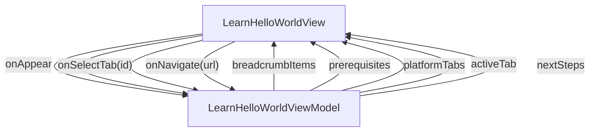

# LearnHelloWorld - Hello World

## Overview

Learn > Hello World. The five-minute first-screen tutorial. Beginners (audience A) land here from the home hero CTA (/learn/hello-world) and must see text on screen within 5 minutes on at least one of Swift / Kotlin / React. Page is one vertical ScrollView whose per-platform quickstart section is an inline tab switcher driven by activeTab + a Collection of tab headers (T6 pattern, not a root TabView). v1 seeds all content statically in the ViewModel; a DocContentRepository can be added later without changing the public ViewModel contract.

| | |
|---|---|
| Created | 2026-04-22 |
| Updated | 2026-04-22 |

## Screen Structure

### UI Components

| Component | ID | Platform | Description | Initial State | Notes |
|---|---|---|---|---|---|
| View | `learn_hello_world_root` | - | - | - | - |
| &nbsp;&nbsp;↳ Scroll | `learn_hello_world_scroll` | - | - | - | - |
| &nbsp;&nbsp;&nbsp;&nbsp;↳ View | `learn_hello_world_header` | - | - | - | - |
| &nbsp;&nbsp;&nbsp;&nbsp;&nbsp;&nbsp;↳ View | `-` | - | - | - | - |
| &nbsp;&nbsp;&nbsp;&nbsp;&nbsp;&nbsp;&nbsp;&nbsp;↳ Collection | `learn_hello_world_breadcrumb` | - | - | - | - |
| &nbsp;&nbsp;&nbsp;&nbsp;&nbsp;&nbsp;↳ Label | `learn_hello_world_title` | - | - | - | - |
| &nbsp;&nbsp;&nbsp;&nbsp;&nbsp;&nbsp;↳ Label | `learn_hello_world_lead` | - | - | - | - |
| &nbsp;&nbsp;&nbsp;&nbsp;↳ View | `learn_hello_world_prereqs` | - | - | - | - |
| &nbsp;&nbsp;&nbsp;&nbsp;&nbsp;&nbsp;↳ Label | `-` | - | - | - | - |
| &nbsp;&nbsp;&nbsp;&nbsp;&nbsp;&nbsp;↳ Label | `-` | - | - | - | - |
| &nbsp;&nbsp;&nbsp;&nbsp;&nbsp;&nbsp;↳ Collection | `learn_hello_world_prereq_collection` | - | - | - | - |
| &nbsp;&nbsp;&nbsp;&nbsp;↳ View | `learn_hello_world_quickstart` | - | - | - | - |
| &nbsp;&nbsp;&nbsp;&nbsp;&nbsp;&nbsp;↳ Label | `-` | - | - | - | - |
| &nbsp;&nbsp;&nbsp;&nbsp;&nbsp;&nbsp;↳ Label | `-` | - | - | - | - |
| &nbsp;&nbsp;&nbsp;&nbsp;&nbsp;&nbsp;↳ Label | `-` | - | - | - | - |
| &nbsp;&nbsp;&nbsp;&nbsp;&nbsp;&nbsp;↳ Collection | `learn_hello_world_common_steps` | - | - | - | - |
| &nbsp;&nbsp;&nbsp;&nbsp;&nbsp;&nbsp;↳ Label | `-` | - | - | - | - |
| &nbsp;&nbsp;&nbsp;&nbsp;&nbsp;&nbsp;↳ Collection | `learn_hello_world_tab_collection` | - | - | - | - |
| &nbsp;&nbsp;&nbsp;&nbsp;&nbsp;&nbsp;↳ View | `platform_panel_swift` | - | - | - | - |
| &nbsp;&nbsp;&nbsp;&nbsp;&nbsp;&nbsp;&nbsp;&nbsp;↳ Collection | `learn_hello_world_swift_steps` | - | - | - | - |
| &nbsp;&nbsp;&nbsp;&nbsp;&nbsp;&nbsp;↳ View | `platform_panel_kotlin` | - | - | - | - |
| &nbsp;&nbsp;&nbsp;&nbsp;&nbsp;&nbsp;&nbsp;&nbsp;↳ Collection | `learn_hello_world_kotlin_steps` | - | - | - | - |
| &nbsp;&nbsp;&nbsp;&nbsp;&nbsp;&nbsp;↳ View | `platform_panel_react` | - | - | - | - |
| &nbsp;&nbsp;&nbsp;&nbsp;&nbsp;&nbsp;&nbsp;&nbsp;↳ Collection | `learn_hello_world_react_steps` | - | - | - | - |
| &nbsp;&nbsp;&nbsp;&nbsp;↳ View | `learn_hello_world_next` | - | - | - | - |
| &nbsp;&nbsp;&nbsp;&nbsp;&nbsp;&nbsp;↳ Label | `-` | - | - | - | - |
| &nbsp;&nbsp;&nbsp;&nbsp;&nbsp;&nbsp;↳ Label | `-` | - | - | - | - |
| &nbsp;&nbsp;&nbsp;&nbsp;&nbsp;&nbsp;↳ Collection | `learn_hello_world_next_collection` | - | - | - | - |
| &nbsp;&nbsp;&nbsp;&nbsp;↳ View | `learn_hello_world_footer` | - | - | - | - |
| &nbsp;&nbsp;&nbsp;&nbsp;&nbsp;&nbsp;↳ Label | `-` | - | - | - | - |

### Layout Structure

```
learn_hello_world_root
└── learn_hello_world_scroll
```

## Data Flow



### ViewModel

#### Methods

| Signature | Platforms | Description |
|---|---|---|
| `onAppear()` | all | Seed breadcrumbItems (2 rows: Learn › Hello World), prerequisites (3 required tools), commonSteps (5 cross-platform steps rendered above the tab switcher), platformTabs (Swift / Kotlin / React — each with a short platform-specific [QuickstartStep] list for VM + run + live-reload), and nextSteps (2–3 follow-up cards) from module-scope static catalogs. Every string is resolved through StringManager with the learn_hello_world_ prefix. activeTab is left at its initial 'react' value. |
| `onSelectTab(id: String)` | all | Set `activeTab` to the tapped PlatformTab.id ('swift' | 'kotlin' | 'react'). The displayLogic block derives three *PanelVisibility strings from activeTab so exactly one platform's steps are visible at a time; the VM doesn't set those explicitly — the generated component does via the layout's visibility bindings. |
| `onNavigate(url: String)` | all | router.push(url). Hit by NextStepLink and BreadcrumbItem taps. |

#### Vars

| Declaration | Flags | Platforms | Description |
|---|---|---|---|
| `var breadcrumbItems: Array(BreadcrumbItem)` | observable | all | 2-row breadcrumb. |
| `var prerequisites: Array(Prerequisite)` | observable | all | 3 required-tool rows rendered above the tabs. |
| `var commonSteps: Array(QuickstartStep)` | observable | all | 5 cross-platform steps rendered above the platform tabs. |
| `var platformTabs: Array(PlatformTab)` | observable | all | 3 tab-header rows; each owns its own *platform-specific* steps list (ViewModel + run + live-reload). |
| `var activeTab: String` | observable | all | Currently visible tab id. Defaults to 'react' (the web-shipping platform). |
| `var nextSteps: Array(NextStepLink)` | observable | all | 2–3 follow-up tutorial cards below the platform panels. |
| `var swiftPanelVisibility: String` | observable | all | Derived visibility from displayLogic; set by the layout's binding, not the VM. |
| `var kotlinPanelVisibility: String` | observable | all | Same as above. |
| `var reactPanelVisibility: String` | observable | all | Same as above. |

## State Management

### UI Data Variables

| Variable Name | Type | Description | Notes |
|---|---|---|---|
| `breadcrumbItems` | [BreadcrumbItem] | Two-entry breadcrumb row: Learn / Hello World. Seeded by onAppear. | - |
| `prerequisites` | [Prerequisite] | Three required-tool rows (Node, macOS or JDK, a browser) rendered above the platform tabs. Seeded by onAppear. | - |
| `commonSteps` | [QuickstartStep] | Steps that are identical across Swift / Kotlin / React: install the CLI, create a platform project (prose-only pointer), run `jui init` with the right flag, author the layout, `jui build` + `jui verify --fail-on-diff`. Rendered above the platform tabs so readers only see platform-specific commands once they pick their stack. | - |
| `platformTabs` | [PlatformTab] | Tab-header data for the inline platform switcher. Exactly three entries: Swift / Kotlin / React. Each entry carries its own ordered [QuickstartStep] list of *platform-specific* steps only (ViewModel wiring + running the app + live-reload via `jui hotload listen` for mobile); the common install / init / author / build steps live in `commonSteps`. | - |
| `activeTab` | String | Id of the currently selected platform tab ('swift' | 'kotlin' | 'react'). Defaults to 'react' because the documentation site itself ships web-only (platforms: ['web']) and React is the fastest route to a running Hello World for a web-only reader. Bound by visibility expressions in the layout to reveal exactly one platform's steps. | - |
| `nextSteps` | [NextStepLink] | Two to three follow-up tutorial cards rendered below the platform tabs (Guides index, First screen, Data binding basics). Seeded by onAppear. | - |
| `swiftPanelVisibility` | String | (from binding) | - |
| `swiftSteps` | String | (from binding) | - |
| `kotlinPanelVisibility` | String | (from binding) | - |
| `kotlinSteps` | String | (from binding) | - |
| `reactPanelVisibility` | String | (from binding) | - |
| `reactSteps` | String | (from binding) | - |

### View-local Event Handlers

_Handlers kept inside the View layer. ViewModel public API lives under `dataFlow.viewModel`._

| Handler | Description | Notes |
|---|---|---|
| `onAppear` | Populate breadcrumbItems, prerequisites, commonSteps (5 cross-platform steps: install / create-platform / jui init / author / build+verify), platformTabs (each with a short platform-specific [QuickstartStep] list covering VM + run + live-reload), and nextSteps with the static v1 catalog. All user-visible strings inside those catalogs are @string/... keys so localization flows through StringManager. | - |
| `onSelectTab` | Switch the inline platform switcher (T6 pattern). Sets activeTab to 'swift' | 'kotlin' | 'react'. The tab-header Collection binds each row's onClick to this handler; the bound id comes from the row's PlatformTab.id. | - |
| `onNavigate` | Handle taps on a NextStepLink card or an in-page breadcrumb entry. The bound URL is supplied per row by Collection binding. | - |

### Display Logic

```
activeTab == 'swift':
  - platform_panel_swift: visible [variable: swiftPanelVisibility]

activeTab == 'kotlin':
  - platform_panel_kotlin: visible [variable: kotlinPanelVisibility]

activeTab == 'react':
  - platform_panel_react: visible [variable: reactPanelVisibility]

```

## User Actions

| Action | Processing | Destination | Notes |
|---|---|---|---|
| Select a platform tab (Swift / Kotlin / React) | onSelectTab(id) is invoked with the bound PlatformTab.id. ViewModel sets activeTab, and the displayLogic entries flip the matching platform_panel_* visibility. | - | - |
| Copy a code example | Handled inside the CodeBlock converter itself (built-in copy button). The optional onCopy event on CodeBlock is not wired here; copying does not depend on it. | - | - |
| Tap a Next step card | onNavigate(url) is invoked with the bound NextStepLink.url from the Collection row. | - | - |
| Tap the Learn breadcrumb | onNavigate(url) is invoked with BreadcrumbItem.url ('/learn'). | - | - |

## Validation

## Transitions

| Condition | Destination | Notes |
|---|---|---|
| url is any spec-mapped URL | Target spec screen resolved from url | - |

## Related Files

| Type | File Path | Notes |
|---|---|---|
| Layout | `docs/screens/layouts/learn/hello-world.json` | - |
| ViewModel | `jsonui-doc-web/src/viewmodels/learn/HelloWorldViewModel.ts` | - |
| View | `jsonui-doc-web/src/app/learn/hello-world/page.tsx` | - |

## Notes

- This is the target of the home hero CTA. KPI from docs/plans/00-overview.md §5: a reader must reach 'text on screen' within 5 minutes on at least one of Swift / Kotlin / React.
- TabView rule deviation (docs/plans/17-spec-templates.md §T8): the three platform variants are content within a single topic, not separate top-level sections. The spec therefore uses the T6 inline-tab pattern (activeTab: String + Collection + cellClasses: ['cells/tab_header']) inside a root ScrollView rather than a root TabView. Home already hosts the site-level TabView; this page sits inside one of its tabs.
- metadata.platforms = ['web'] mirrors the documentation-site deployment surface (jui.config.json only registers the web platform). The *content* inside the three tabs still covers Swift / Kotlin / React because those are what the reader is learning about, not what this page is rendered to.
- Standard components + CodeBlock only. CodeBlock is the one custom type referenced (registered in .jsonui-doc-rules.json and specified at docs/components/json/codeblock.component.json).
- All user-visible strings flow through @string/learn_hello_world_* keys into Resources/strings.json for en+ja localization. No paragraph exceeds ~100 chars, so docs/content/{en,ja}/ is not needed for v1; if later copy grows past that, the implementer can migrate paragraphs to docs/content/{en,ja}/learn/hello-world.json without changing this spec.
- v1 seeds breadcrumbItems / prerequisites / platformTabs / nextSteps in onAppear with hardcoded @string/... keys. Adding a DocContentRepository later is a pure additive change and does not alter the ViewModel's public contract.
- activeTab defaults to 'react' because web-only readers (the default audience of this site) can reach a running Hello World fastest via rjui + Next.js; Swift and Kotlin tabs still render their CodeBlocks identically and are one click away.
- QuickstartStep.code is optional because Step 5 ('What you should see') is a prose-only step without a CodeBlock; all other steps will carry code + language + filename at layout authoring time.
