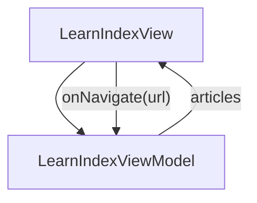

# LearnIndex - Learn

## Overview

Catalog page for the Learn section. Lists every learn-track article with status (live / upcoming), read time, and one-line description. Dual-purpose: rendered inline inside the home TabView AND at the standalone URL /learn. v1 seeds the catalog statically in the owning ViewModel; a DocContentRepository can replace the seed later without touching this spec.

| | |
|---|---|
| Created | 2026-04-23 |
| Updated | 2026-08-25 |

## Screen Structure

### UI Components

| Component | ID | Platform | Description | Initial State | Notes |
|---|---|---|---|---|---|
| View | `learn_index_root` | - | - | - | - |
| &nbsp;&nbsp;↳ Scroll | `learn_index_scroll` | - | - | - | - |
| &nbsp;&nbsp;&nbsp;&nbsp;↳ View | `learn_index_hero` | - | - | - | - |
| &nbsp;&nbsp;&nbsp;&nbsp;&nbsp;&nbsp;↳ Label | `-` | - | - | - | - |
| &nbsp;&nbsp;&nbsp;&nbsp;&nbsp;&nbsp;↳ Label | `-` | - | - | - | - |
| &nbsp;&nbsp;&nbsp;&nbsp;&nbsp;&nbsp;↳ Label | `-` | - | - | - | - |
| &nbsp;&nbsp;&nbsp;&nbsp;↳ View | `learn_index_catalog` | - | - | - | - |
| &nbsp;&nbsp;&nbsp;&nbsp;&nbsp;&nbsp;↳ Label | `-` | - | - | - | - |
| &nbsp;&nbsp;&nbsp;&nbsp;&nbsp;&nbsp;↳ Label | `-` | - | - | - | - |
| &nbsp;&nbsp;&nbsp;&nbsp;&nbsp;&nbsp;↳ Collection | `learn_index_articles_collection` | - | - | - | - |

### Layout Structure

```
learn_index_root
└── learn_index_scroll
```

## Data Flow



### ViewModel

#### Methods

| Signature | Platforms | Description |
|---|---|---|
| `onAppear()` | all | Seed `articles` from the module-scope CATALOG constant in LearnIndexViewModel. Each catalog row carries (id, url, titleKey) where titleKey is the screen's strings.json key (e.g. learn_installation_title). Expands each row into an ArticleCell with StringManager-resolved titleKey + descriptionKey (derived by suffix-substituting `_title` → `_lead`), pre-wired onNavigate closure, and the standard 'live' status decorations (statusBackground #DCFCE7, statusColor #166534, cardOpacity 1). The status / read-time fields stay as empty strings for v1 — the cell layout tolerates empty pills. |
| `onNavigate(url: String)` | all | router.push(url). All live article cards funnel through this one method. Upcoming entries have no onClick binding at the cell layout level. |

#### Vars

| Declaration | Flags | Platforms | Description |
|---|---|---|---|
| `var articles: Array(LearnArticle)` | observable | all | Ordered catalog, seeded in onAppear. Order is curriculum order — a beginner reads top-to-bottom. |

## State Management

### UI Data Variables

| Variable Name | Type | Description | Notes |
|---|---|---|---|
| `articles` | [LearnArticle] | Ordered catalog of learn-track articles. v1 seeds: Installation (live), Hello World (live), First Screen (upcoming), Data Binding Basics (upcoming), What is JsonUI (upcoming). Order is curriculum order — a beginner reads top-to-bottom. | - |

### View-local Event Handlers

_Handlers kept inside the View layer. ViewModel public API lives under `dataFlow.viewModel`._

| Handler | Description | Notes |
|---|---|---|
| `onAppear` | Populate `articles` with the static v1 catalog. All user-visible strings are @string/... keys so language toggle flows through StringManager. Each live article gets an onNavigate closure; upcoming articles get no handler (the card suppresses its tap-surface when status != 'live'). | - |
| `onNavigate` | Client-side navigation. Only the live cards fire this. Destination URLs are spec-mapped (e.g. /learn/installation). | - |

## User Actions

| Action | Processing | Destination | Notes |
|---|---|---|---|
| Tap a live article card | onNavigate(url) is invoked with the bound LearnArticle.url. Router pushes the URL, landing the reader on that article. | - | - |
| Tap an upcoming article card | No-op. The cell layout omits the onClick binding when status != 'live'. Visual treatment (reduced opacity + 'Coming soon' pill) signals unavailability. | - | - |

## Validation

## Transitions

| Condition | Destination | Notes |
|---|---|---|
| url is any spec-mapped learn URL | Target spec screen resolved from url | - |

## Related Files

| Type | File Path | Notes |
|---|---|---|
| Layout | `docs/screens/layouts/learn_index.json` | - |
| Layout | `docs/screens/layouts/cells/learn_article_card.json` | - |
| ViewModel | `jsonui-doc-web/src/viewmodels/LearnIndexViewModel.ts` | - |
| View | `jsonui-doc-web/src/app/learn/page.tsx` | - |

## Notes

- LearnArticle.status is a String ('live' | 'upcoming'). v1 treats anything non-'live' as disabled. Adding a third state ('deprecated') is purely additive on the cell layer.
- LearnArticle.url is always present — even upcoming entries declare their future URL so the catalog is one additive step away from lighting up each row as content ships.
- When LearnIndex is rendered inside home.TabView, its Data is supplied by HomeViewModel. When it's rendered at the /learn standalone route (future), its Data is supplied by its own LearnIndexViewModel. The screen contract (what Data fields exist) is identical either way — only the *owner* of the seed differs.
- v1 ships 5 catalog entries, 2 live. The upcoming 3 are placeholders that give the reader a sense of the curriculum ahead; their spec files will be authored in separate tasks.
- Strings prefix: `learn_index_*` (per first-prefix-fix, the namespace derives from the directory + basename, so the `learn/index.json` layout resolves its bare-text keys under `learn_index.*`).
- 2026-08-25 — layoutFile corrected from 'learn/index' to 'learn_index': the layout has always lived at the flat path, and the stale nested spelling meant the spec claimed a layout that does not exist. Surfaced by the spec-coverage check added in jsonui-cli 1.6.35 — no earlier gate compared these two sides.
