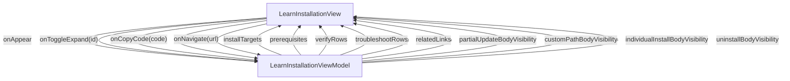

# LearnInstallation - Installation

## Overview

Learn > Installation. The one-line bootstrap page. A beginner (audience A) must be able to install the CLI, the MCP server, and the agent pack into Claude Code with a single curl command and reach a working environment in three steps. Page is one vertical ScrollView containing: hero + primary CTA CodeBlock, 'what gets installed' Collection (3 InstallTargetCard rows), prerequisites Collection (5 PrereqRow rows), three static inline steps (each with a CodeBlock), verify Collection (3 VerifyRow rows), four expandable detail sections (partial update / custom path / individual install / uninstall), troubleshooting Collection (6 TroubleshootRow rows, each individually expandable), and related-links Collection (5 RelatedLink rows) plus a 'next: /learn/hello-world' CTA. No custom Collapse / Details / PlatformBadge component types are introduced; all expand/collapse behaviour rides on a single uiVariable `expandedIds: [String]` plus display logic that derives per-section visibility strings.

| | |
|---|---|
| Created | 2026-04-23 |
| Updated | 2026-05-27 |

## Screen Structure

### UI Components

| Component | ID | Platform | Description | Initial State | Notes |
|---|---|---|---|---|---|
| View | `learn_installation_root` | - | - | - | - |
| &nbsp;&nbsp;↳ Scroll | `learn_installation_scroll` | - | - | - | - |
| &nbsp;&nbsp;&nbsp;&nbsp;↳ View | `learn_installation_header` | - | - | - | - |
| &nbsp;&nbsp;&nbsp;&nbsp;&nbsp;&nbsp;↳ Label | `-` | - | - | - | - |
| &nbsp;&nbsp;&nbsp;&nbsp;&nbsp;&nbsp;↳ Label | `learn_installation_title` | - | - | - | - |
| &nbsp;&nbsp;&nbsp;&nbsp;&nbsp;&nbsp;↳ Label | `learn_installation_subcopy` | - | - | - | - |
| &nbsp;&nbsp;&nbsp;&nbsp;&nbsp;&nbsp;↳ View | `learn_installation_cta_wrap` | - | - | - | - |
| &nbsp;&nbsp;&nbsp;&nbsp;&nbsp;&nbsp;&nbsp;&nbsp;↳ CodeBlock | `-` | - | - | - | - |
| &nbsp;&nbsp;&nbsp;&nbsp;↳ View | `learn_installation_content_with_rail` | - | - | - | - |
| &nbsp;&nbsp;&nbsp;&nbsp;&nbsp;&nbsp;↳ View | `learn_installation_body_column` | - | - | - | - |
| &nbsp;&nbsp;&nbsp;&nbsp;&nbsp;&nbsp;&nbsp;&nbsp;↳ View | `learn_installation_targets` | - | - | - | - |
| &nbsp;&nbsp;&nbsp;&nbsp;&nbsp;&nbsp;&nbsp;&nbsp;&nbsp;&nbsp;↳ Label | `-` | - | - | - | - |
| &nbsp;&nbsp;&nbsp;&nbsp;&nbsp;&nbsp;&nbsp;&nbsp;&nbsp;&nbsp;↳ Label | `-` | - | - | - | - |
| &nbsp;&nbsp;&nbsp;&nbsp;&nbsp;&nbsp;&nbsp;&nbsp;&nbsp;&nbsp;↳ Collection | `learn_installation_targets_collection` | - | - | - | - |
| &nbsp;&nbsp;&nbsp;&nbsp;&nbsp;&nbsp;&nbsp;&nbsp;&nbsp;&nbsp;↳ Label | `-` | - | - | - | - |
| &nbsp;&nbsp;&nbsp;&nbsp;&nbsp;&nbsp;&nbsp;&nbsp;↳ View | `learn_installation_prereqs` | - | - | - | - |
| &nbsp;&nbsp;&nbsp;&nbsp;&nbsp;&nbsp;&nbsp;&nbsp;&nbsp;&nbsp;↳ Label | `-` | - | - | - | - |
| &nbsp;&nbsp;&nbsp;&nbsp;&nbsp;&nbsp;&nbsp;&nbsp;&nbsp;&nbsp;↳ Label | `-` | - | - | - | - |
| &nbsp;&nbsp;&nbsp;&nbsp;&nbsp;&nbsp;&nbsp;&nbsp;&nbsp;&nbsp;↳ Collection | `learn_installation_prereq_collection` | - | - | - | - |
| &nbsp;&nbsp;&nbsp;&nbsp;&nbsp;&nbsp;&nbsp;&nbsp;↳ View | `learn_installation_steps` | - | - | - | - |
| &nbsp;&nbsp;&nbsp;&nbsp;&nbsp;&nbsp;&nbsp;&nbsp;&nbsp;&nbsp;↳ Label | `-` | - | - | - | - |
| &nbsp;&nbsp;&nbsp;&nbsp;&nbsp;&nbsp;&nbsp;&nbsp;&nbsp;&nbsp;↳ Label | `-` | - | - | - | - |
| &nbsp;&nbsp;&nbsp;&nbsp;&nbsp;&nbsp;&nbsp;&nbsp;&nbsp;&nbsp;↳ View | `learn_installation_step_1` | - | - | - | - |
| &nbsp;&nbsp;&nbsp;&nbsp;&nbsp;&nbsp;&nbsp;&nbsp;&nbsp;&nbsp;&nbsp;&nbsp;↳ View | `-` | - | - | - | - |
| &nbsp;&nbsp;&nbsp;&nbsp;&nbsp;&nbsp;&nbsp;&nbsp;&nbsp;&nbsp;&nbsp;&nbsp;&nbsp;&nbsp;↳ Label | `-` | - | - | - | - |
| &nbsp;&nbsp;&nbsp;&nbsp;&nbsp;&nbsp;&nbsp;&nbsp;&nbsp;&nbsp;&nbsp;&nbsp;&nbsp;&nbsp;↳ Label | `-` | - | - | - | - |
| &nbsp;&nbsp;&nbsp;&nbsp;&nbsp;&nbsp;&nbsp;&nbsp;&nbsp;&nbsp;&nbsp;&nbsp;↳ Label | `-` | - | - | - | - |
| &nbsp;&nbsp;&nbsp;&nbsp;&nbsp;&nbsp;&nbsp;&nbsp;&nbsp;&nbsp;&nbsp;&nbsp;↳ CodeBlock | `-` | - | - | - | - |
| &nbsp;&nbsp;&nbsp;&nbsp;&nbsp;&nbsp;&nbsp;&nbsp;&nbsp;&nbsp;↳ View | `learn_installation_step_2` | - | - | - | - |
| &nbsp;&nbsp;&nbsp;&nbsp;&nbsp;&nbsp;&nbsp;&nbsp;&nbsp;&nbsp;&nbsp;&nbsp;↳ View | `-` | - | - | - | - |
| &nbsp;&nbsp;&nbsp;&nbsp;&nbsp;&nbsp;&nbsp;&nbsp;&nbsp;&nbsp;&nbsp;&nbsp;&nbsp;&nbsp;↳ Label | `-` | - | - | - | - |
| &nbsp;&nbsp;&nbsp;&nbsp;&nbsp;&nbsp;&nbsp;&nbsp;&nbsp;&nbsp;&nbsp;&nbsp;&nbsp;&nbsp;↳ Label | `-` | - | - | - | - |
| &nbsp;&nbsp;&nbsp;&nbsp;&nbsp;&nbsp;&nbsp;&nbsp;&nbsp;&nbsp;&nbsp;&nbsp;↳ Label | `-` | - | - | - | - |
| &nbsp;&nbsp;&nbsp;&nbsp;&nbsp;&nbsp;&nbsp;&nbsp;&nbsp;&nbsp;&nbsp;&nbsp;↳ CodeBlock | `-` | - | - | - | - |
| &nbsp;&nbsp;&nbsp;&nbsp;&nbsp;&nbsp;&nbsp;&nbsp;&nbsp;&nbsp;↳ View | `learn_installation_step_3` | - | - | - | - |
| &nbsp;&nbsp;&nbsp;&nbsp;&nbsp;&nbsp;&nbsp;&nbsp;&nbsp;&nbsp;&nbsp;&nbsp;↳ View | `-` | - | - | - | - |
| &nbsp;&nbsp;&nbsp;&nbsp;&nbsp;&nbsp;&nbsp;&nbsp;&nbsp;&nbsp;&nbsp;&nbsp;&nbsp;&nbsp;↳ Label | `-` | - | - | - | - |
| &nbsp;&nbsp;&nbsp;&nbsp;&nbsp;&nbsp;&nbsp;&nbsp;&nbsp;&nbsp;&nbsp;&nbsp;&nbsp;&nbsp;↳ Label | `-` | - | - | - | - |
| &nbsp;&nbsp;&nbsp;&nbsp;&nbsp;&nbsp;&nbsp;&nbsp;&nbsp;&nbsp;&nbsp;&nbsp;↳ Label | `-` | - | - | - | - |
| &nbsp;&nbsp;&nbsp;&nbsp;&nbsp;&nbsp;&nbsp;&nbsp;&nbsp;&nbsp;&nbsp;&nbsp;↳ CodeBlock | `-` | - | - | - | - |
| &nbsp;&nbsp;&nbsp;&nbsp;&nbsp;&nbsp;&nbsp;&nbsp;↳ View | `learn_installation_verify` | - | - | - | - |
| &nbsp;&nbsp;&nbsp;&nbsp;&nbsp;&nbsp;&nbsp;&nbsp;&nbsp;&nbsp;↳ Label | `-` | - | - | - | - |
| &nbsp;&nbsp;&nbsp;&nbsp;&nbsp;&nbsp;&nbsp;&nbsp;&nbsp;&nbsp;↳ Label | `-` | - | - | - | - |
| &nbsp;&nbsp;&nbsp;&nbsp;&nbsp;&nbsp;&nbsp;&nbsp;&nbsp;&nbsp;↳ Collection | `learn_installation_verify_collection` | - | - | - | - |
| &nbsp;&nbsp;&nbsp;&nbsp;&nbsp;&nbsp;&nbsp;&nbsp;↳ View | `learn_installation_update` | - | - | - | - |
| &nbsp;&nbsp;&nbsp;&nbsp;&nbsp;&nbsp;&nbsp;&nbsp;&nbsp;&nbsp;↳ Label | `-` | - | - | - | - |
| &nbsp;&nbsp;&nbsp;&nbsp;&nbsp;&nbsp;&nbsp;&nbsp;&nbsp;&nbsp;↳ Label | `-` | - | - | - | - |
| &nbsp;&nbsp;&nbsp;&nbsp;&nbsp;&nbsp;&nbsp;&nbsp;&nbsp;&nbsp;↳ View | `-` | - | - | - | - |
| &nbsp;&nbsp;&nbsp;&nbsp;&nbsp;&nbsp;&nbsp;&nbsp;&nbsp;&nbsp;&nbsp;&nbsp;↳ CodeBlock | `-` | - | - | - | - |
| &nbsp;&nbsp;&nbsp;&nbsp;&nbsp;&nbsp;&nbsp;&nbsp;&nbsp;&nbsp;&nbsp;&nbsp;↳ Label | `-` | - | - | - | - |
| &nbsp;&nbsp;&nbsp;&nbsp;&nbsp;&nbsp;&nbsp;&nbsp;↳ View | `learn_installation_partial_update` | - | - | - | - |
| &nbsp;&nbsp;&nbsp;&nbsp;&nbsp;&nbsp;&nbsp;&nbsp;&nbsp;&nbsp;↳ View | `-` | - | - | - | - |
| &nbsp;&nbsp;&nbsp;&nbsp;&nbsp;&nbsp;&nbsp;&nbsp;&nbsp;&nbsp;&nbsp;&nbsp;↳ Label | `-` | - | - | - | - |
| &nbsp;&nbsp;&nbsp;&nbsp;&nbsp;&nbsp;&nbsp;&nbsp;&nbsp;&nbsp;&nbsp;&nbsp;↳ Label | `-` | - | - | - | - |
| &nbsp;&nbsp;&nbsp;&nbsp;&nbsp;&nbsp;&nbsp;&nbsp;&nbsp;&nbsp;↳ View | `installation_partial_update_body` | - | - | - | - |
| &nbsp;&nbsp;&nbsp;&nbsp;&nbsp;&nbsp;&nbsp;&nbsp;&nbsp;&nbsp;&nbsp;&nbsp;↳ Label | `-` | - | - | - | - |
| &nbsp;&nbsp;&nbsp;&nbsp;&nbsp;&nbsp;&nbsp;&nbsp;&nbsp;&nbsp;&nbsp;&nbsp;↳ CodeBlock | `-` | - | - | - | - |
| &nbsp;&nbsp;&nbsp;&nbsp;&nbsp;&nbsp;&nbsp;&nbsp;&nbsp;&nbsp;&nbsp;&nbsp;↳ Label | `-` | - | - | - | - |
| &nbsp;&nbsp;&nbsp;&nbsp;&nbsp;&nbsp;&nbsp;&nbsp;↳ View | `learn_installation_custom_path` | - | - | - | - |
| &nbsp;&nbsp;&nbsp;&nbsp;&nbsp;&nbsp;&nbsp;&nbsp;&nbsp;&nbsp;↳ View | `-` | - | - | - | - |
| &nbsp;&nbsp;&nbsp;&nbsp;&nbsp;&nbsp;&nbsp;&nbsp;&nbsp;&nbsp;&nbsp;&nbsp;↳ Label | `-` | - | - | - | - |
| &nbsp;&nbsp;&nbsp;&nbsp;&nbsp;&nbsp;&nbsp;&nbsp;&nbsp;&nbsp;&nbsp;&nbsp;↳ Label | `-` | - | - | - | - |
| &nbsp;&nbsp;&nbsp;&nbsp;&nbsp;&nbsp;&nbsp;&nbsp;&nbsp;&nbsp;↳ View | `installation_custom_path_body` | - | - | - | - |
| &nbsp;&nbsp;&nbsp;&nbsp;&nbsp;&nbsp;&nbsp;&nbsp;&nbsp;&nbsp;&nbsp;&nbsp;↳ Label | `-` | - | - | - | - |
| &nbsp;&nbsp;&nbsp;&nbsp;&nbsp;&nbsp;&nbsp;&nbsp;&nbsp;&nbsp;&nbsp;&nbsp;↳ CodeBlock | `-` | - | - | - | - |
| &nbsp;&nbsp;&nbsp;&nbsp;&nbsp;&nbsp;&nbsp;&nbsp;&nbsp;&nbsp;&nbsp;&nbsp;↳ Label | `-` | - | - | - | - |
| &nbsp;&nbsp;&nbsp;&nbsp;&nbsp;&nbsp;&nbsp;&nbsp;&nbsp;&nbsp;&nbsp;&nbsp;↳ Label | `-` | - | - | - | - |
| &nbsp;&nbsp;&nbsp;&nbsp;&nbsp;&nbsp;&nbsp;&nbsp;↳ View | `learn_installation_individual` | - | - | - | - |
| &nbsp;&nbsp;&nbsp;&nbsp;&nbsp;&nbsp;&nbsp;&nbsp;&nbsp;&nbsp;↳ View | `-` | - | - | - | - |
| &nbsp;&nbsp;&nbsp;&nbsp;&nbsp;&nbsp;&nbsp;&nbsp;&nbsp;&nbsp;&nbsp;&nbsp;↳ Label | `-` | - | - | - | - |
| &nbsp;&nbsp;&nbsp;&nbsp;&nbsp;&nbsp;&nbsp;&nbsp;&nbsp;&nbsp;&nbsp;&nbsp;↳ Label | `-` | - | - | - | - |
| &nbsp;&nbsp;&nbsp;&nbsp;&nbsp;&nbsp;&nbsp;&nbsp;&nbsp;&nbsp;↳ View | `installation_individual_install_body` | - | - | - | - |
| &nbsp;&nbsp;&nbsp;&nbsp;&nbsp;&nbsp;&nbsp;&nbsp;&nbsp;&nbsp;&nbsp;&nbsp;↳ Label | `-` | - | - | - | - |
| &nbsp;&nbsp;&nbsp;&nbsp;&nbsp;&nbsp;&nbsp;&nbsp;&nbsp;&nbsp;&nbsp;&nbsp;↳ CodeBlock | `-` | - | - | - | - |
| &nbsp;&nbsp;&nbsp;&nbsp;&nbsp;&nbsp;&nbsp;&nbsp;↳ View | `learn_installation_uninstall` | - | - | - | - |
| &nbsp;&nbsp;&nbsp;&nbsp;&nbsp;&nbsp;&nbsp;&nbsp;&nbsp;&nbsp;↳ View | `-` | - | - | - | - |
| &nbsp;&nbsp;&nbsp;&nbsp;&nbsp;&nbsp;&nbsp;&nbsp;&nbsp;&nbsp;&nbsp;&nbsp;↳ Label | `-` | - | - | - | - |
| &nbsp;&nbsp;&nbsp;&nbsp;&nbsp;&nbsp;&nbsp;&nbsp;&nbsp;&nbsp;&nbsp;&nbsp;↳ Label | `-` | - | - | - | - |
| &nbsp;&nbsp;&nbsp;&nbsp;&nbsp;&nbsp;&nbsp;&nbsp;&nbsp;&nbsp;↳ View | `installation_uninstall_body` | - | - | - | - |
| &nbsp;&nbsp;&nbsp;&nbsp;&nbsp;&nbsp;&nbsp;&nbsp;&nbsp;&nbsp;&nbsp;&nbsp;↳ Label | `-` | - | - | - | - |
| &nbsp;&nbsp;&nbsp;&nbsp;&nbsp;&nbsp;&nbsp;&nbsp;&nbsp;&nbsp;&nbsp;&nbsp;↳ CodeBlock | `-` | - | - | - | - |
| &nbsp;&nbsp;&nbsp;&nbsp;&nbsp;&nbsp;&nbsp;&nbsp;↳ View | `learn_installation_trouble` | - | - | - | - |
| &nbsp;&nbsp;&nbsp;&nbsp;&nbsp;&nbsp;&nbsp;&nbsp;&nbsp;&nbsp;↳ Label | `-` | - | - | - | - |
| &nbsp;&nbsp;&nbsp;&nbsp;&nbsp;&nbsp;&nbsp;&nbsp;&nbsp;&nbsp;↳ Label | `-` | - | - | - | - |
| &nbsp;&nbsp;&nbsp;&nbsp;&nbsp;&nbsp;&nbsp;&nbsp;&nbsp;&nbsp;↳ Collection | `learn_installation_trouble_collection` | - | - | - | - |
| &nbsp;&nbsp;&nbsp;&nbsp;&nbsp;&nbsp;&nbsp;&nbsp;↳ View | `learn_installation_related` | - | - | - | - |
| &nbsp;&nbsp;&nbsp;&nbsp;&nbsp;&nbsp;&nbsp;&nbsp;&nbsp;&nbsp;↳ Label | `-` | - | - | - | - |
| &nbsp;&nbsp;&nbsp;&nbsp;&nbsp;&nbsp;&nbsp;&nbsp;&nbsp;&nbsp;↳ Label | `-` | - | - | - | - |
| &nbsp;&nbsp;&nbsp;&nbsp;&nbsp;&nbsp;&nbsp;&nbsp;&nbsp;&nbsp;↳ Collection | `learn_installation_related_collection` | - | - | - | - |
| &nbsp;&nbsp;&nbsp;&nbsp;&nbsp;&nbsp;&nbsp;&nbsp;↳ View | `learn_installation_next` | - | - | - | - |
| &nbsp;&nbsp;&nbsp;&nbsp;&nbsp;&nbsp;&nbsp;&nbsp;&nbsp;&nbsp;↳ Label | `-` | - | - | - | - |
| &nbsp;&nbsp;&nbsp;&nbsp;&nbsp;&nbsp;&nbsp;&nbsp;&nbsp;&nbsp;↳ Label | `-` | - | - | - | - |
| &nbsp;&nbsp;&nbsp;&nbsp;&nbsp;&nbsp;&nbsp;&nbsp;&nbsp;&nbsp;↳ Button | `learn_installation_next_cta` | - | - | - | - |
| &nbsp;&nbsp;&nbsp;&nbsp;&nbsp;&nbsp;&nbsp;&nbsp;↳ View | `learn_installation_footer` | - | - | - | - |
| &nbsp;&nbsp;&nbsp;&nbsp;&nbsp;&nbsp;&nbsp;&nbsp;&nbsp;&nbsp;↳ Label | `-` | - | - | - | - |
| &nbsp;&nbsp;&nbsp;&nbsp;&nbsp;&nbsp;↳ View | `learn_installation_rail_column` | - | - | - | - |
| &nbsp;&nbsp;&nbsp;&nbsp;&nbsp;&nbsp;&nbsp;&nbsp;↳ View | `learn_installation_toc_wrap` | - | - | - | - |
| &nbsp;&nbsp;&nbsp;&nbsp;&nbsp;&nbsp;&nbsp;&nbsp;&nbsp;&nbsp;↳ TableOfContents | `-` | - | - | - | - |

### Layout Structure

```
learn_installation_root
└── learn_installation_scroll
```

## Data Flow



### ViewModel

#### Methods

| Signature | Platforms | Description |
|---|---|---|
| `onAppear()` | all | Seed installTargets (3 cards), prerequisites (5 rows), verifyRows (3 commands), troubleshootRows (6 rows built from TROUBLESHOOT_ROW_DEFS), and relatedLinks (5 rows) from module-scope static catalogs. Every user-visible string is resolved via this.s() which wraps StringManager.getString with the learn_installation_ prefix. The four derived *BodyVisibility strings are computed from the private _expandedIds Set by sectionVisibilityFromExpandedIds(); onAppear pushes them alongside the collections. Private helpers prereqRow / relatedLink / buildTroubleshootRows live in the VM body — they are implementation detail, not public contract. |
| `onToggleExpand(id: String)` | all | Flip membership of id in the private _expandedIds Set. Then (a) re-hydrate troubleshootRows so each cell's rowVisibility flag reflects the new state, (b) re-derive the four section-level *BodyVisibility strings via sectionVisibilityFromExpandedIds, and (c) push both in a single updateData call. Called from the four section headers AND from each TroubleshootRow cell — the single handler covers both surface types because expandedIds is a flat Set keyed by id. |
| `onCopyCode(code: String)` | all | Optional analytics hook invoked when a CodeBlock's copy button fires. Not wired in v1 (copying itself is built into the CodeBlock converter). Declared here so future analytics can bind to a stable method name. |
| `onNavigate(url: String)` | all | router.push(url). Funnels RelatedLink taps + the 'next: Hello World' CTA (wired as onNavigateHelloWorld). Every destination is listed in transitions; the method is agnostic to which surface fired. |

#### Vars

| Declaration | Flags | Platforms | Description |
|---|---|---|---|
| `var installTargets: Array(InstallTargetCard)` | observable | all | 3 'what gets installed' cards (CLI / MCP / Agents). |
| `var prerequisites: Array(PrereqRow)` | observable | all | 5 prerequisite rows with required/optional tier. |
| `var verifyRows: Array(VerifyRow)` | observable | all | 3 post-install verification rows. |
| `var troubleshootRows: Array(TroubleshootRow)` | observable | all | 6 expandable troubleshooting rows; each carries its own rowVisibility derived from _expandedIds. |
| `var relatedLinks: Array(RelatedLink)` | observable | all | 5 related-link cards at the bottom. |
| `var partialUpdateBodyVisibility: String` | observable | all | Derived from _expandedIds (displayLogic target). |
| `var customPathBodyVisibility: String` | observable | all | Derived from _expandedIds. |
| `var individualInstallBodyVisibility: String` | observable | all | Derived from _expandedIds. |
| `var uninstallBodyVisibility: String` | observable | all | Derived from _expandedIds. |

## State Management

### UI Data Variables

| Variable Name | Type | Description | Notes |
|---|---|---|---|
| `installTargets` | [InstallTargetCard] | Three 'what gets installed' cards rendered below the hero CTA (CLI / MCP / Agents). Seeded by onAppear from the static v1 catalog. | - |
| `prerequisites` | [PrereqRow] | Five prerequisite rows (git+curl, Node.js >= 20, npm, Ruby >= 2.7, Python 3 >= 3.10) with a required/optional tier. Seeded by onAppear. | - |
| `verifyRows` | [VerifyRow] | Three post-install verification rows (shell `jui --help`, MCP `search_components`, `/jsonui` slash command -> conductor). Seeded by onAppear. | - |
| `troubleshootRows` | [TroubleshootRow] | Six troubleshooting rows; each row is individually expandable via onToggleExpand(row.id) so the cause+fix block is hidden until the user opens it. Seeded by onAppear. | - |
| `relatedLinks` | [RelatedLink] | Five related-link rows at the bottom of the page (/tools/cli, /tools/mcp, /tools/agents, /learn/hello-world, /tools/mcp/tools/get-data-source). Seeded by onAppear. | - |
| `expandedIds` | [String] | Canonical expand/collapse state for every expandable surface on this page. Contents: zero or more of the four section ids ('partial_update', 'custom_path', 'individual_install', 'uninstall') and any number of TroubleshootRow ids. onToggleExpand(id) toggles membership. The layout binds per-row visibility via `@{expandedIds contains id}` inside the TroubleshootRow cell, and the ViewModel exposes per-section derived visibility strings (see displayLogic) for the four section bodies. This is the canonical pattern for expandable sections in this project — future screens should reuse it rather than introducing custom Collapse / Details component types. | - |
| `partialUpdateBodyVisibility` | String | (from binding) | - |
| `customPathBodyVisibility` | String | (from binding) | - |
| `individualInstallBodyVisibility` | String | (from binding) | - |
| `uninstallBodyVisibility` | String | (from binding) | - |

### View-local Event Handlers

_Handlers kept inside the View layer. ViewModel public API lives under `dataFlow.viewModel`._

| Handler | Description | Notes |
|---|---|---|
| `onAppear` | Populate installTargets (3), prerequisites (5), verifyRows (3), troubleshootRows (6), and relatedLinks (5) from the static v1 catalog. Every user-visible string is an @string/learn_installation_* key so localization flows through StringManager. | - |
| `onToggleExpand` | Toggle membership of `id` in `expandedIds`. Wired from the four section-level expander headers (ids 'partial_update', 'custom_path', 'individual_install', 'uninstall') and from each TroubleshootRow cell (onClick binds the row's own id). Because `expandedIds` is an array, multiple sections can be open simultaneously. | - |
| `onCopyCode` | Optional analytics hook invoked when a CodeBlock's copy button fires. Not wired in v1 (copying itself is built into the CodeBlock converter). Declared here so future analytics work can bind to a stable handler name. | - |
| `onNavigate` | Handle taps on a RelatedLink card and on the 'next: /learn/hello-world' CTA at the bottom of the page. The bound URL is supplied per row by Collection binding (RelatedLink.url) or statically by the CTA button. | - |
| `onTogglePartialUpdate` |  | - |
| `onToggleCustomPath` |  | - |
| `onToggleIndividualInstall` |  | - |
| `onToggleUninstall` |  | - |
| `onNavigateHelloWorld` |  | - |

### Display Logic

```
expandedIds contains 'partial_update':
  - installation_partial_update_body: visible [variable: partialUpdateBodyVisibility]

expandedIds contains 'custom_path':
  - installation_custom_path_body: visible [variable: customPathBodyVisibility]

expandedIds contains 'individual_install':
  - installation_individual_install_body: visible [variable: individualInstallBodyVisibility]

expandedIds contains 'uninstall':
  - installation_uninstall_body: visible [variable: uninstallBodyVisibility]

```

## User Actions

| Action | Processing | Destination | Notes |
|---|---|---|---|
| Tap the hero CTA copy button | Copy is handled inside the CodeBlock converter itself. The optional onCopyCode(code) hook is not wired in v1; copying does not depend on it. | - | - |
| Expand or collapse a detail section (Partial update / Custom path / Individual install / Uninstall) | The section header's onClick invokes onToggleExpand(id) with one of 'partial_update', 'custom_path', 'individual_install', 'uninstall'. The ViewModel toggles membership in expandedIds; the corresponding displayLogic entry flips the matching *BodyVisibility string, which the layout binds as the section body's visibility. | - | - |
| Expand or collapse a troubleshooting row | Each TroubleshootRow cell's onClick invokes onToggleExpand(row.id). The cell itself binds its cause+fix body's visibility to `@{expandedIds contains id}`, so row-level expansion does not require per-row displayLogic entries. | - | - |
| Tap a Related link row | onNavigate(url) is invoked with the bound RelatedLink.url from the Collection row. | - | - |
| Tap the 'next: Hello World' CTA | onNavigate('/learn/hello-world') is invoked. | - | - |

## Validation

## Transitions

| Condition | Destination | Notes |
|---|---|---|
| url is any spec-mapped URL | Target spec screen resolved from url | - |

## Related Files

| Type | File Path | Notes |
|---|---|---|
| Layout | `docs/screens/layouts/learn/installation.json` | - |
| Layout | `docs/screens/layouts/cells/install_target_card.json` | - |
| Layout | `docs/screens/layouts/cells/prereq_row.json` | - |
| Layout | `docs/screens/layouts/cells/verify_row.json` | - |
| Layout | `docs/screens/layouts/cells/troubleshoot_row.json` | - |
| Layout | `docs/screens/layouts/cells/related_link.json` | - |
| ViewModel | `jsonui-doc-web/src/viewmodels/learn/InstallationViewModel.ts` | - |
| View | `jsonui-doc-web/src/app/learn/installation/page.tsx` | - |
| Component | `docs/components/json/codeblock.component.json` | - |

## Notes

- Content source of truth: docs/plans/18-content-plan-installation.md. Every section id, string prefix, card count, and Collection used in this spec maps back to a numbered subsection of plan 18.
- NO new custom component types are introduced. Plan 18 §4 is explicit: Collapse / Details / PlatformBadge are NOT custom types in this project. The only custom type referenced by this screen is CodeBlock (already authored at docs/components/json/codeblock.component.json and whitelisted in .jsonui-doc-rules.json).
- Expandable sections use a single canonical pattern: uiVariable `expandedIds: [String]` + eventHandler `onToggleExpand(id)` + displayLogic entries that derive per-section `*BodyVisibility` strings. TroubleshootRow uses the same expandedIds but handles its own visibility inside the cell via `@{expandedIds contains id}`, so individual troubleshoot rows do NOT require dedicated displayLogic entries. Future screens should copy this pattern rather than inventing new component types.
- The three main install steps (plan 18 §3.4) are NOT a Collection — they are three static inline Views in the layout, each wrapping a CodeBlock with fixed content. The implementer must hand-author them in the Layout JSON rather than binding them to a uiVariable.
- The hero CTA CodeBlock's `code` string (the bootstrap curl one-liner from plan 18 §3.1) is a layout literal, not a ViewModel binding — the one-liner never changes at runtime. The step 2 PATH snippet (plan 18 §3.4) and the idempotent-reinstall snippet (plan 18 §3.6) are likewise layout literals. The four expandable-section bodies (partial update / custom path / individual install / uninstall) are also layout-literal CodeBlocks living inside the section body Views whose visibility is toggled by expandedIds.
- Strings prefix `learn_installation_*`. The spec enumerates WHICH strings exist via the titleKey / locationKey / bodyKey / labelKey / toolKey / noteKey / commandKey / expectKey / symptomKey / causeKey / fixKey fields on the five custom types (and via @string/... refs in the layout for the hero headline / subcopy / step titles / section headers / CTA button labels). The CONTENTS of those strings live in the ViewModel's v1 seeding (implementer's job) and in docs/screens/layouts/Resources/strings.json.
- Phase-2 screenshots (plan 18 §6) are deferred. The spec does not declare any screenshot-related uiVariables or custom types.
- The home hero CTA currently navigates to /learn/hello-world; the implementer for this page is expected to rewire the home hero CTA to /learn/installation per plan 18 §8. That change belongs to the home screen's Layout (not this spec).
- Standard components + CodeBlock only. No TabView (this page sits inside one of the home TabView tabs — single root ScrollView per plan 18 §3 structure).
- 2026-05 update (swagger-driven Data Models): the prerequisites Collection's body copy for the Android tier (or a footnote on the Android troubleshooting row) gains ONE sentence noting 'If you plan to consume OpenAPI schemas on Android with the default Moshi serializer, also add the ksp Gradle plugin — see /guides/api-data-models §9 for the exact setup.' No new uiVariable / customType / row — single-string addition wired into the existing PrereqRow noteKey or a new related-link row pointing at /guides/api-data-models §9.
