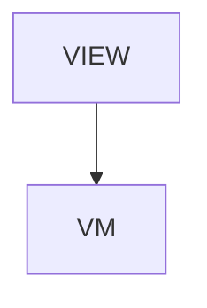

# Attributes - Attribute reference

## Overview

Reference > Attribute reference. Overview page. Four sections + TOC + next-reads. Generated via /tmp/gen-reference.js.

| | |
|---|---|
| Created | 2026-04-23 |
| Updated | 2026-04-23 |

## Screen Structure

### UI Components

| Component | ID | Platform | Description | Initial State | Notes |
|---|---|---|---|---|---|
| View | `reference_attributes_root` | - | - | - | - |
| &nbsp;&nbsp;↳ Scroll | `reference_attributes_scroll` | - | - | - | - |
| &nbsp;&nbsp;&nbsp;&nbsp;↳ View | `reference_attributes_header` | - | - | - | - |
| &nbsp;&nbsp;&nbsp;&nbsp;&nbsp;&nbsp;↳ Label | `-` | - | - | - | - |
| &nbsp;&nbsp;&nbsp;&nbsp;&nbsp;&nbsp;↳ Label | `-` | - | - | - | - |
| &nbsp;&nbsp;&nbsp;&nbsp;&nbsp;&nbsp;↳ Label | `-` | - | - | - | - |
| &nbsp;&nbsp;&nbsp;&nbsp;&nbsp;&nbsp;↳ Label | `-` | - | - | - | - |
| &nbsp;&nbsp;&nbsp;&nbsp;↳ View | `reference_attributes_content_with_rail` | - | - | - | - |
| &nbsp;&nbsp;&nbsp;&nbsp;&nbsp;&nbsp;↳ View | `reference_attributes_body_column` | - | - | - | - |
| &nbsp;&nbsp;&nbsp;&nbsp;&nbsp;&nbsp;&nbsp;&nbsp;↳ View | `section_structure` | - | - | - | - |
| &nbsp;&nbsp;&nbsp;&nbsp;&nbsp;&nbsp;&nbsp;&nbsp;&nbsp;&nbsp;↳ Label | `-` | - | - | - | - |
| &nbsp;&nbsp;&nbsp;&nbsp;&nbsp;&nbsp;&nbsp;&nbsp;&nbsp;&nbsp;↳ Label | `-` | - | - | - | - |
| &nbsp;&nbsp;&nbsp;&nbsp;&nbsp;&nbsp;&nbsp;&nbsp;↳ View | `section_source` | - | - | - | - |
| &nbsp;&nbsp;&nbsp;&nbsp;&nbsp;&nbsp;&nbsp;&nbsp;&nbsp;&nbsp;↳ Label | `-` | - | - | - | - |
| &nbsp;&nbsp;&nbsp;&nbsp;&nbsp;&nbsp;&nbsp;&nbsp;&nbsp;&nbsp;↳ Label | `-` | - | - | - | - |
| &nbsp;&nbsp;&nbsp;&nbsp;&nbsp;&nbsp;&nbsp;&nbsp;↳ View | `section_search` | - | - | - | - |
| &nbsp;&nbsp;&nbsp;&nbsp;&nbsp;&nbsp;&nbsp;&nbsp;&nbsp;&nbsp;↳ Label | `-` | - | - | - | - |
| &nbsp;&nbsp;&nbsp;&nbsp;&nbsp;&nbsp;&nbsp;&nbsp;&nbsp;&nbsp;↳ Label | `-` | - | - | - | - |
| &nbsp;&nbsp;&nbsp;&nbsp;&nbsp;&nbsp;&nbsp;&nbsp;↳ View | `section_contribute` | - | - | - | - |
| &nbsp;&nbsp;&nbsp;&nbsp;&nbsp;&nbsp;&nbsp;&nbsp;&nbsp;&nbsp;↳ Label | `-` | - | - | - | - |
| &nbsp;&nbsp;&nbsp;&nbsp;&nbsp;&nbsp;&nbsp;&nbsp;&nbsp;&nbsp;↳ Label | `-` | - | - | - | - |
| &nbsp;&nbsp;&nbsp;&nbsp;&nbsp;&nbsp;&nbsp;&nbsp;↳ View | `section_catalog` | - | - | - | - |
| &nbsp;&nbsp;&nbsp;&nbsp;&nbsp;&nbsp;&nbsp;&nbsp;&nbsp;&nbsp;↳ Label | `-` | - | - | - | - |
| &nbsp;&nbsp;&nbsp;&nbsp;&nbsp;&nbsp;&nbsp;&nbsp;&nbsp;&nbsp;↳ Label | `-` | - | - | - | - |
| &nbsp;&nbsp;&nbsp;&nbsp;&nbsp;&nbsp;&nbsp;&nbsp;&nbsp;&nbsp;↳ Collection | `reference_attributes_catalog_collection` | - | - | - | - |
| &nbsp;&nbsp;&nbsp;&nbsp;&nbsp;&nbsp;&nbsp;&nbsp;↳ View | `reference_attributes_next` | - | - | - | - |
| &nbsp;&nbsp;&nbsp;&nbsp;&nbsp;&nbsp;&nbsp;&nbsp;&nbsp;&nbsp;↳ Label | `-` | - | - | - | - |
| &nbsp;&nbsp;&nbsp;&nbsp;&nbsp;&nbsp;&nbsp;&nbsp;&nbsp;&nbsp;↳ Collection | `reference_attributes_next_collection` | - | - | - | - |
| &nbsp;&nbsp;&nbsp;&nbsp;&nbsp;&nbsp;&nbsp;&nbsp;↳ View | `reference_attributes_footer` | - | - | - | - |
| &nbsp;&nbsp;&nbsp;&nbsp;&nbsp;&nbsp;&nbsp;&nbsp;&nbsp;&nbsp;↳ Label | `-` | - | - | - | - |
| &nbsp;&nbsp;&nbsp;&nbsp;&nbsp;&nbsp;↳ View | `reference_attributes_rail_column` | - | - | - | - |
| &nbsp;&nbsp;&nbsp;&nbsp;&nbsp;&nbsp;&nbsp;&nbsp;↳ View | `reference_attributes_toc_wrap` | - | - | - | - |
| &nbsp;&nbsp;&nbsp;&nbsp;&nbsp;&nbsp;&nbsp;&nbsp;&nbsp;&nbsp;↳ TableOfContents | `-` | - | - | - | - |

### Layout Structure

```
reference_attributes_root
└── reference_attributes_scroll
```

## Data Flow



### ViewModel

#### Methods

| Signature | Platforms | Description |
|---|---|---|
| `onAppear()` | all | Seed nextReadLinks from the module-scope NEXT_READ_ENTRIES catalog (two rows: next_components -> /reference/components, next_json_schema -> /reference/json-schema) and stamp currentLanguage from StringManager.language. Each row's titleKey / descriptionKey is resolved through StringManager with the reference_attributes_ namespace prefix. |
| `onNavigate(url: String)` | all | Client-side navigation via router.push(url). Destinations are the spec-mapped URLs enumerated in transitions: /, /reference/components, /reference/json-schema. |

#### Vars

| Declaration | Flags | Platforms | Description |
|---|---|---|---|
| `var nextReadLinks: Array(NextReadLink)` | observable | all | Two closing 'read next' cards pointing at /reference/components and /reference/json-schema. Seeded by onAppear from the NEXT_READ_ENTRIES static catalog and re-seeded by onToggleLanguage. |

## State Management

### UI Data Variables

| Variable Name | Type | Description | Notes |
|---|---|---|---|
| `nextReadLinks` | [NextReadLink] | Two closing cards. | - |
| `categoryCatalog` | String | (from binding) | - |

### View-local Event Handlers

_Handlers kept inside the View layer. ViewModel public API lives under `dataFlow.viewModel`._

| Handler | Description | Notes |
|---|---|---|
| `onAppear` | Seed nextReadLinks. | - |
| `onNavigate` | Client-side navigation. | - |
| `onNavigateReference` |  | - |

## User Actions

| Action | Processing | Destination | Notes |
|---|---|---|---|
| Tap a TOC entry | TOC-internal scroll. | - | - |
| Tap a NextReadLink card | onNavigate(url). | - | - |

## Validation

## Transitions

| Condition | Destination | Notes |
|---|---|---|
| url is spec-mapped | Target screen or tab | - |

## Related Files

| Type | File Path | Notes |
|---|---|---|
| Layout | `docs/screens/layouts/reference/attributes.json` | - |
| ViewModel | `jsonui-doc-web/src/viewmodels/reference/AttributesViewModel.ts` | - |
| View | `jsonui-doc-web/src/app/reference/attributes/page.tsx` | - |

## Notes

- Live Reference entry. Flip REFERENCE_ENTRIES row for 'attributes' to 'live' in HomeViewModel when shipping.
- v1 is hand-authored overview. Auto-generation from the upstream artifact is a future pass.
- 2026-09-01 — jsonui-cli 1.7.53 adds the `alert` attribute, and taking it up exposed that this page drops any attribute the SSoT declares but docs/data/attribute-categories.json does not name. Page assembly filters with categoryMap[k] === category, so an unmapped attribute matches no category and is published nowhere, with the build still green. Measured: after sync_tool at the pin the vendored definitions carried `alert` and the generated runtime data mentioned it in zero files, while its sibling `confirmationDialog` was present — that contrast is the only reason the absence was legible. build-attribute-reference.ts now reports SSoT attributes missing from the map and exits 1, the mirror of the check that already existed for overrides missing from the SSoT. On its first run it found two more nobody had noticed: `offsetX` and `offsetY`, declared and published nowhere. Both are post-layout positional offsets whose own declaration compares them to leftMargin ('absolute, not RTL-mirroring'), so they are mapped to spacing rather than layout or alignment. `alert` is mapped to state beside confirmationDialog. Verified with a decoy: removing `alert` from the map again makes the build exit 1 and name it. Note what was checked and what was not — the declaration's shape is measured here (five properties against confirmationDialog's six, `titleVisibility` absent), while its stated reason for existing, that .confirmationDialog omits the cancel role in a regular size class, is an iOS runtime claim this lane has no way to reproduce and is published as the declaration's own words, not as a measurement.
- 2026-09-04 - jsonui-cli 1.8.38 gives `items` a per-component contract in the shared definitions, and this site does not inherit it: regenerating the attribute reference against the new definitions changed 0 files, because the description here is the site's own copy and is keyed by attribute name alone. Written by hand into the per-component notes instead. SelectBox and Radio entries are data, not strings keys — measured on the web face, a key registered in strings.json and written as an item renders as the key text. Radio gains an items note at all for the first time, including that `items` with `group` emits the whole group from one node. Segment's half of the contract, that an entry may be a strings key resolved on every face, is NOT written: on the web face no spelling satisfied it, and the canonical object form does not survive code generation on any face (filed upstream). Segment's note carries that as a dated line instead.
- 2026-09-04 - the Segment items page is rewritten because the shape it documented has no source. It described `{ label?, icon?, value }` with three examples, one of them icon-only. Traced: the declaration carries no element type at jsonui-cli 1.4.1, 1.6.0 or 1.8.38; no converter on any face reads `label` or `icon` from an entry at 1.8.38 (the rjui one interpolates the entry itself, which is where the Ruby hash in the generated JSX came from); and the wording dates from this site's first commit, 2026-05-07, untouched since. So the documentation invented it and the declaration was right. Both examples now use string arrays, the icon-only example is deleted because Segment declares nine attributes and `icon` is not one of them, and the note says the attribute is static — Segment's items declare no binding, where SelectBox, Radio and Collection declare `[array, binding]`. The strings-key half of the declaration is reported as declared rather than confirmed: measured on the web face, a registered key rendered as its own text.
- 2026-09-04 - correcting my own measurement from earlier the same day. I reported that a Segment entry naming a strings key does not resolve on the web face, and treated the declaration's 'resolved at render time on every face' as unconfirmed here. The fixture was malformed: I wrote the scratch project's strings file language-first, `{en: {section: {key: value}}}`, where the resolver reads section-first, `{section: {key: {en, ja}}}`. Nothing could resolve, so all three components looked alike and the one that differs was invisible. Re-measured with the file shaped correctly at 1.8.38: Segment compiles a registered key to the string manager accessor `{$s.sampleOptA}`, while SelectBox renders `opt_a` and Radio renders `opt_a`. The declaration is right on all three counts, and the page now says so with the accessor quoted. A broken fixture does not report itself; it reports agreement.
- 2026-09-04 - jsonui-cli 1.8.39 makes the Segment items contract enforceable, and the page's dated clause is retired. Measured as an A/B against a 1.8.38 baseline, eight element shapes on the web face plus object and binding on iOS and Android. Object, array and null elements now cost their element and raise one warning naming the index; a binding given to the whole attribute raises its own warning and generates nothing; strings, booleans and numbers survive, and the boolean renders as `true`. At 1.8.38 every one of those shapes was silent. One change the release notice did not mention: a binding in Segment items used to FAIL the iOS build (exit 1) and now exits 0 with warnings, so a project that relied on that build breaking will stop hearing about it — reported upstream. The baseline is what made that visible; a single reading of 1.8.39 would have shown a warning and looked entirely correct.
