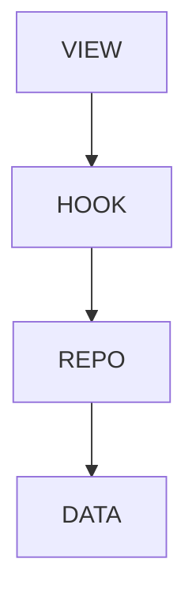

# RefAttributeEvent - Event attributes — Reference

## Overview

Event attributes bind user interactions to ViewModel methods. All are optional; their omission disables the corresponding interaction.

| | |
|---|---|
| Created | 2026-08-25 |
| Updated | 2026-08-25 |

## Screen Structure

### UI Components

| Component | ID | Platform | Description | Initial State | Notes |
|---|---|---|---|---|---|
| View | `reference_attributes_event_root` | - | - | - | - |
| &nbsp;&nbsp;↳ View | `reference_attributes_event_scroll` | - | - | - | - |
| &nbsp;&nbsp;&nbsp;&nbsp;↳ View | `reference_attributes_event_page_header` | - | - | - | - |
| &nbsp;&nbsp;&nbsp;&nbsp;&nbsp;&nbsp;↳ View | `reference_attributes_event_page_header_kicker_row` | - | - | - | - |
| &nbsp;&nbsp;&nbsp;&nbsp;&nbsp;&nbsp;&nbsp;&nbsp;↳ Label | `reference_attributes_event_page_header_kicker` | - | - | - | - |
| &nbsp;&nbsp;&nbsp;&nbsp;&nbsp;&nbsp;&nbsp;&nbsp;↳ Collection | `reference_attributes_event_page_header_badges` | - | - | - | - |
| &nbsp;&nbsp;&nbsp;&nbsp;&nbsp;&nbsp;↳ View | `reference_attributes_event_page_header_breadcrumb_row` | - | - | - | - |
| &nbsp;&nbsp;&nbsp;&nbsp;&nbsp;&nbsp;&nbsp;&nbsp;↳ Label | `reference_attributes_event_page_header_breadcrumb_parent` | - | - | - | - |
| &nbsp;&nbsp;&nbsp;&nbsp;&nbsp;&nbsp;&nbsp;&nbsp;↳ Label | `-` | - | - | - | - |
| &nbsp;&nbsp;&nbsp;&nbsp;&nbsp;&nbsp;&nbsp;&nbsp;↳ Label | `reference_attributes_event_page_header_breadcrumb_current` | - | - | - | - |
| &nbsp;&nbsp;&nbsp;&nbsp;&nbsp;&nbsp;↳ View | `reference_attributes_event_page_header_title_row` | - | - | - | - |
| &nbsp;&nbsp;&nbsp;&nbsp;&nbsp;&nbsp;&nbsp;&nbsp;↳ Label | `reference_attributes_event_page_header_title` | - | - | - | - |
| &nbsp;&nbsp;&nbsp;&nbsp;&nbsp;&nbsp;&nbsp;&nbsp;↳ Button | `reference_attributes_event_page_header_copy_type` | - | - | - | - |
| &nbsp;&nbsp;&nbsp;&nbsp;&nbsp;&nbsp;↳ View | `reference_attributes_event_page_header_alias_callout` | - | - | - | - |
| &nbsp;&nbsp;&nbsp;&nbsp;&nbsp;&nbsp;&nbsp;&nbsp;↳ Label | `-` | - | - | - | - |
| &nbsp;&nbsp;&nbsp;&nbsp;&nbsp;&nbsp;&nbsp;&nbsp;↳ Label | `-` | - | - | - | - |
| &nbsp;&nbsp;&nbsp;&nbsp;&nbsp;&nbsp;↳ Label | `reference_attributes_event_page_header_description` | - | - | - | - |
| &nbsp;&nbsp;&nbsp;&nbsp;↳ View | `reference_attributes_event_content_with_rail` | - | - | - | - |
| &nbsp;&nbsp;&nbsp;&nbsp;&nbsp;&nbsp;↳ View | `reference_attributes_event_column_body` | - | - | - | - |
| &nbsp;&nbsp;&nbsp;&nbsp;&nbsp;&nbsp;&nbsp;&nbsp;↳ View | `section-overview` | - | - | - | - |
| &nbsp;&nbsp;&nbsp;&nbsp;&nbsp;&nbsp;&nbsp;&nbsp;&nbsp;&nbsp;↳ Label | `-` | - | - | - | - |
| &nbsp;&nbsp;&nbsp;&nbsp;&nbsp;&nbsp;&nbsp;&nbsp;&nbsp;&nbsp;↳ View | `reference_attributes_event_overview_table` | - | - | - | - |
| &nbsp;&nbsp;&nbsp;&nbsp;&nbsp;&nbsp;&nbsp;&nbsp;&nbsp;&nbsp;&nbsp;&nbsp;↳ View | `-` | - | - | - | - |
| &nbsp;&nbsp;&nbsp;&nbsp;&nbsp;&nbsp;&nbsp;&nbsp;&nbsp;&nbsp;&nbsp;&nbsp;&nbsp;&nbsp;↳ Label | `-` | - | - | - | - |
| &nbsp;&nbsp;&nbsp;&nbsp;&nbsp;&nbsp;&nbsp;&nbsp;&nbsp;&nbsp;&nbsp;&nbsp;&nbsp;&nbsp;↳ Label | `-` | - | - | - | - |
| &nbsp;&nbsp;&nbsp;&nbsp;&nbsp;&nbsp;&nbsp;&nbsp;&nbsp;&nbsp;&nbsp;&nbsp;&nbsp;&nbsp;↳ Label | `-` | - | - | - | - |
| &nbsp;&nbsp;&nbsp;&nbsp;&nbsp;&nbsp;&nbsp;&nbsp;&nbsp;&nbsp;&nbsp;&nbsp;↳ View | `-` | - | - | - | - |
| &nbsp;&nbsp;&nbsp;&nbsp;&nbsp;&nbsp;&nbsp;&nbsp;&nbsp;&nbsp;&nbsp;&nbsp;↳ Collection | `reference_attributes_event_overview_rows` | - | - | - | - |
| &nbsp;&nbsp;&nbsp;&nbsp;&nbsp;&nbsp;&nbsp;&nbsp;↳ View | `section-detail` | - | - | - | - |
| &nbsp;&nbsp;&nbsp;&nbsp;&nbsp;&nbsp;&nbsp;&nbsp;&nbsp;&nbsp;↳ Label | `-` | - | - | - | - |
| &nbsp;&nbsp;&nbsp;&nbsp;&nbsp;&nbsp;&nbsp;&nbsp;&nbsp;&nbsp;↳ Collection | `reference_attributes_event_detail_rows` | - | - | - | - |
| &nbsp;&nbsp;&nbsp;&nbsp;&nbsp;&nbsp;&nbsp;&nbsp;↳ View | `section-next` | - | - | - | - |
| &nbsp;&nbsp;&nbsp;&nbsp;&nbsp;&nbsp;&nbsp;&nbsp;&nbsp;&nbsp;↳ Collection | `reference_attributes_event_next` | - | - | - | - |
| &nbsp;&nbsp;&nbsp;&nbsp;&nbsp;&nbsp;↳ View | `reference_attributes_event_column_rail` | - | - | - | - |
| &nbsp;&nbsp;&nbsp;&nbsp;&nbsp;&nbsp;&nbsp;&nbsp;↳ TableOfContents | `reference_attributes_event_toc` | - | - | - | - |

### Layout Structure

```
reference_attributes_event_root
└── reference_attributes_event_scroll
```

## Data Flow



### ViewModel

### Repositories

#### AttributeReferenceRepository

- `async fetchCategory(category: String)` → `RefCategoryData` — GET /data/attribute-reference/attributes/<category>.json

## State Management

### UI Data Variables

| Variable Name | Type | Description | Notes |
|---|---|---|---|
| `kicker` | String | (from binding) | - |
| `badges` | String | (from binding) | - |
| `kickerParentLabel` | String | (from binding) | - |
| `title` | String | (from binding) | - |
| `copyTypeVisibility` | String | (from binding) | - |
| `aliasCalloutVisibility` | String | (from binding) | - |
| `aliasNotice` | String | (from binding) | - |
| `description` | String | (from binding) | - |
| `overviewRows` | String | (from binding) | - |
| `attributes` | String | (from binding) | - |
| `nextReadLinks` | String | (from binding) | - |
| `tocEntries` | String | (from binding) | - |

### View-local Event Handlers

_Handlers kept inside the View layer. ViewModel public API lives under `dataFlow.viewModel`._

| Handler | Description | Notes |
|---|---|---|
| `onNavigateBreadcrumb` |  | - |
| `onCopyTypeName` |  | - |

## Validation

## Related Files

| Type | File Path | Notes |
|---|---|---|
| Layout | `docs/screens/layouts/reference/attributes/event.json` | - |
| Data | `jsonui-doc-web/public/data/attribute-reference/attributes/event.json` | - |
| View | `jsonui-doc-web/src/app/reference/attributes/event/page.tsx` | - |
| Override | `docs/data/attribute-overrides/_common_event.json` | - |

## Notes

- Auto-generated by scripts/build-attribute-reference.ts.
- Do not hand-edit — update docs/data/attribute-overrides/_common_<category>.json and re-run `npm run build:attrs`.
