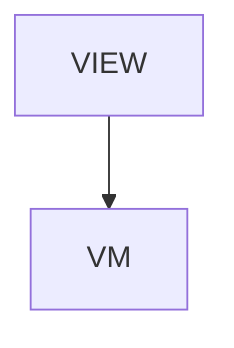

# CliCommands - CLI command reference

## Overview

Reference > CLI command reference. Overview page. Eight sections + TOC + next-reads. Sections: layout, exit, env, stability, api_models (added 2026-05 for swagger-driven Data Model), ssot (added 2026-07 for Renderer SSoT: conformance + attr-bindings), checks (added 2026-07 for jsonui-doc check), test_tools (added 2026-07 for jsonui-test validate/generate/report/mock incl. the validate flatten-install side-effect).

| | |
|---|---|
| Created | 2026-04-23 |
| Updated | 2026-07-09 |

## Screen Structure

### UI Components

| Component | ID | Platform | Description | Initial State | Notes |
|---|---|---|---|---|---|
| View | `reference_cli_commands_root` | - | - | - | - |
| &nbsp;&nbsp;↳ Scroll | `reference_cli_commands_scroll` | - | - | - | - |
| &nbsp;&nbsp;&nbsp;&nbsp;↳ View | `reference_cli_commands_header` | - | - | - | - |
| &nbsp;&nbsp;&nbsp;&nbsp;&nbsp;&nbsp;↳ Label | `-` | - | - | - | - |
| &nbsp;&nbsp;&nbsp;&nbsp;&nbsp;&nbsp;↳ Label | `-` | - | - | - | - |
| &nbsp;&nbsp;&nbsp;&nbsp;&nbsp;&nbsp;↳ Label | `-` | - | - | - | - |
| &nbsp;&nbsp;&nbsp;&nbsp;&nbsp;&nbsp;↳ Label | `-` | - | - | - | - |
| &nbsp;&nbsp;&nbsp;&nbsp;↳ View | `reference_cli_commands_content_with_rail` | - | - | - | - |
| &nbsp;&nbsp;&nbsp;&nbsp;&nbsp;&nbsp;↳ View | `reference_cli_commands_body_column` | - | - | - | - |
| &nbsp;&nbsp;&nbsp;&nbsp;&nbsp;&nbsp;&nbsp;&nbsp;↳ View | `section_layout` | - | - | - | - |
| &nbsp;&nbsp;&nbsp;&nbsp;&nbsp;&nbsp;&nbsp;&nbsp;&nbsp;&nbsp;↳ Label | `-` | - | - | - | - |
| &nbsp;&nbsp;&nbsp;&nbsp;&nbsp;&nbsp;&nbsp;&nbsp;&nbsp;&nbsp;↳ Label | `-` | - | - | - | - |
| &nbsp;&nbsp;&nbsp;&nbsp;&nbsp;&nbsp;&nbsp;&nbsp;↳ View | `section_binaries` | - | - | - | - |
| &nbsp;&nbsp;&nbsp;&nbsp;&nbsp;&nbsp;&nbsp;&nbsp;&nbsp;&nbsp;↳ Label | `-` | - | - | - | - |
| &nbsp;&nbsp;&nbsp;&nbsp;&nbsp;&nbsp;&nbsp;&nbsp;&nbsp;&nbsp;↳ Label | `-` | - | - | - | - |
| &nbsp;&nbsp;&nbsp;&nbsp;&nbsp;&nbsp;&nbsp;&nbsp;&nbsp;&nbsp;↳ Collection | `reference_cli_commands_binaries_collection` | - | - | - | - |
| &nbsp;&nbsp;&nbsp;&nbsp;&nbsp;&nbsp;&nbsp;&nbsp;↳ View | `section_catalog` | - | - | - | - |
| &nbsp;&nbsp;&nbsp;&nbsp;&nbsp;&nbsp;&nbsp;&nbsp;&nbsp;&nbsp;↳ Label | `-` | - | - | - | - |
| &nbsp;&nbsp;&nbsp;&nbsp;&nbsp;&nbsp;&nbsp;&nbsp;&nbsp;&nbsp;↳ Label | `-` | - | - | - | - |
| &nbsp;&nbsp;&nbsp;&nbsp;&nbsp;&nbsp;&nbsp;&nbsp;&nbsp;&nbsp;↳ Collection | `reference_cli_commands_catalog_collection` | - | - | - | - |
| &nbsp;&nbsp;&nbsp;&nbsp;&nbsp;&nbsp;&nbsp;&nbsp;↳ View | `section_exit` | - | - | - | - |
| &nbsp;&nbsp;&nbsp;&nbsp;&nbsp;&nbsp;&nbsp;&nbsp;&nbsp;&nbsp;↳ Label | `-` | - | - | - | - |
| &nbsp;&nbsp;&nbsp;&nbsp;&nbsp;&nbsp;&nbsp;&nbsp;&nbsp;&nbsp;↳ Label | `-` | - | - | - | - |
| &nbsp;&nbsp;&nbsp;&nbsp;&nbsp;&nbsp;&nbsp;&nbsp;↳ View | `section_env` | - | - | - | - |
| &nbsp;&nbsp;&nbsp;&nbsp;&nbsp;&nbsp;&nbsp;&nbsp;&nbsp;&nbsp;↳ Label | `-` | - | - | - | - |
| &nbsp;&nbsp;&nbsp;&nbsp;&nbsp;&nbsp;&nbsp;&nbsp;&nbsp;&nbsp;↳ Label | `-` | - | - | - | - |
| &nbsp;&nbsp;&nbsp;&nbsp;&nbsp;&nbsp;&nbsp;&nbsp;↳ View | `section_stability` | - | - | - | - |
| &nbsp;&nbsp;&nbsp;&nbsp;&nbsp;&nbsp;&nbsp;&nbsp;&nbsp;&nbsp;↳ Label | `-` | - | - | - | - |
| &nbsp;&nbsp;&nbsp;&nbsp;&nbsp;&nbsp;&nbsp;&nbsp;&nbsp;&nbsp;↳ Label | `-` | - | - | - | - |
| &nbsp;&nbsp;&nbsp;&nbsp;&nbsp;&nbsp;&nbsp;&nbsp;↳ View | `section_api_models` | - | - | - | - |
| &nbsp;&nbsp;&nbsp;&nbsp;&nbsp;&nbsp;&nbsp;&nbsp;&nbsp;&nbsp;↳ Label | `-` | - | - | - | - |
| &nbsp;&nbsp;&nbsp;&nbsp;&nbsp;&nbsp;&nbsp;&nbsp;&nbsp;&nbsp;↳ Label | `-` | - | - | - | - |
| &nbsp;&nbsp;&nbsp;&nbsp;&nbsp;&nbsp;&nbsp;&nbsp;↳ View | `section_ssot` | - | - | - | - |
| &nbsp;&nbsp;&nbsp;&nbsp;&nbsp;&nbsp;&nbsp;&nbsp;&nbsp;&nbsp;↳ Label | `-` | - | - | - | - |
| &nbsp;&nbsp;&nbsp;&nbsp;&nbsp;&nbsp;&nbsp;&nbsp;&nbsp;&nbsp;↳ Label | `-` | - | - | - | - |
| &nbsp;&nbsp;&nbsp;&nbsp;&nbsp;&nbsp;&nbsp;&nbsp;↳ View | `section_checks` | - | - | - | - |
| &nbsp;&nbsp;&nbsp;&nbsp;&nbsp;&nbsp;&nbsp;&nbsp;&nbsp;&nbsp;↳ Label | `-` | - | - | - | - |
| &nbsp;&nbsp;&nbsp;&nbsp;&nbsp;&nbsp;&nbsp;&nbsp;&nbsp;&nbsp;↳ Label | `-` | - | - | - | - |
| &nbsp;&nbsp;&nbsp;&nbsp;&nbsp;&nbsp;&nbsp;&nbsp;↳ View | `section_test_tools` | - | - | - | - |
| &nbsp;&nbsp;&nbsp;&nbsp;&nbsp;&nbsp;&nbsp;&nbsp;&nbsp;&nbsp;↳ Label | `-` | - | - | - | - |
| &nbsp;&nbsp;&nbsp;&nbsp;&nbsp;&nbsp;&nbsp;&nbsp;&nbsp;&nbsp;↳ Label | `-` | - | - | - | - |
| &nbsp;&nbsp;&nbsp;&nbsp;&nbsp;&nbsp;&nbsp;&nbsp;↳ View | `reference_cli_commands_next` | - | - | - | - |
| &nbsp;&nbsp;&nbsp;&nbsp;&nbsp;&nbsp;&nbsp;&nbsp;&nbsp;&nbsp;↳ Label | `-` | - | - | - | - |
| &nbsp;&nbsp;&nbsp;&nbsp;&nbsp;&nbsp;&nbsp;&nbsp;&nbsp;&nbsp;↳ Collection | `reference_cli_commands_next_collection` | - | - | - | - |
| &nbsp;&nbsp;&nbsp;&nbsp;&nbsp;&nbsp;&nbsp;&nbsp;↳ View | `reference_cli_commands_footer` | - | - | - | - |
| &nbsp;&nbsp;&nbsp;&nbsp;&nbsp;&nbsp;&nbsp;&nbsp;&nbsp;&nbsp;↳ Label | `-` | - | - | - | - |
| &nbsp;&nbsp;&nbsp;&nbsp;&nbsp;&nbsp;↳ View | `reference_cli_commands_rail_column` | - | - | - | - |
| &nbsp;&nbsp;&nbsp;&nbsp;&nbsp;&nbsp;&nbsp;&nbsp;↳ View | `reference_cli_commands_toc_wrap` | - | - | - | - |
| &nbsp;&nbsp;&nbsp;&nbsp;&nbsp;&nbsp;&nbsp;&nbsp;&nbsp;&nbsp;↳ TableOfContents | `-` | - | - | - | - |

### Layout Structure

```
reference_cli_commands_root
└── reference_cli_commands_scroll
```

## Data Flow



### ViewModel

#### Methods

| Signature | Platforms | Description |
|---|---|---|
| `onAppear()` | all | Seed nextReadLinks from the module-scope NEXT_READ_ENTRIES catalog (two rows: next_cli -> /tools/cli, next_first_spec -> /guides/writing-your-first-spec) and stamp currentLanguage from StringManager.language. Each row's titleKey / descriptionKey is resolved through StringManager with the reference_cli_commands_ namespace prefix. |
| `onNavigate(url: String)` | all | Client-side navigation via router.push(url). Destinations are the spec-mapped URLs enumerated in transitions: /, /tools/cli, /guides/writing-your-first-spec. |

#### Vars

| Declaration | Flags | Platforms | Description |
|---|---|---|---|
| `var nextReadLinks: Array(NextReadLink)` | observable | all | Two closing 'read next' cards pointing at /tools/cli and /guides/writing-your-first-spec. Seeded by onAppear from the NEXT_READ_ENTRIES static catalog and re-seeded by onToggleLanguage. |
| `var binaries: Array(CliBinaryRow)` | observable | all | Binary overview rows built from CliCommandsRepository.binaries(). meta concatenates implementation language, target platforms and the subcommand count from countsByBinary(). |
| `var commands: Array(CliCommandDetail)` | observable | all | Command cards built from CliCommandsRepository.commands(). Prose comes from the dataset's own en / ja pair via pickCli, not from strings.json; only the fixed labels (Flags / Example / See also / Also / required / default) are StringManager keys. Optional blocks are hidden by driving each visibility field to 'gone' — aliases, flags, example and seeAlso are absent on most platform-CLI commands. |

### Repositories

#### CliCommandsRepository

- `async binaries()` — Every binary in dataset order.
- `async commands()` — Every command, ordered by the binary order declared in the dataset.
- `async commandCount()` — Total number of commands.
- `async countsByBinary()` — Commands per binary, keyed by binary name, in dataset order.

## State Management

### UI Data Variables

| Variable Name | Type | Description | Notes |
|---|---|---|---|
| `nextReadLinks` | [NextReadLink] | Two closing cards. | - |
| `binaries` | [CliBinaryRow] | One row per binary declared in docs/data/cli-commands.json. | - |
| `commands` | [CliCommandDetail] | One detail card per subcommand, ordered by the binary order in the dataset. | - |

### View-local Event Handlers

_Handlers kept inside the View layer. ViewModel public API lives under `dataFlow.viewModel`._

| Handler | Description | Notes |
|---|---|---|
| `onAppear` | Seed nextReadLinks, binaries and commands. | - |
| `onNavigate` | Client-side navigation. | - |
| `onNavigateReference` |  | - |

## User Actions

| Action | Processing | Destination | Notes |
|---|---|---|---|
| Tap a TOC entry | TOC-internal scroll. | - | - |
| Tap a NextReadLink card | onNavigate(url). | - | - |

## Validation

## Transitions

| Condition | Destination | Notes |
|---|---|---|
| url is spec-mapped | Target screen or tab | - |

## Related Files

| Type | File Path | Notes |
|---|---|---|
| Layout | `docs/screens/layouts/reference/cli-commands.json` | - |
| ViewModel | `jsonui-doc-web/src/viewmodels/reference/CliCommandsViewModel.ts` | - |
| View | `jsonui-doc-web/src/app/reference/cli-commands/page.tsx` | - |

## Notes

- Live Reference entry. Flip REFERENCE_ENTRIES row for 'cli-commands' to 'live' in HomeViewModel when shipping.
- v1 was a hand-authored overview with no command listing. 2026-07-28 — the listing shipped: section_binaries + section_catalog render docs/data/cli-commands.json (6 binaries, 36 commands) through cells/cli_binary_row and cells/cli_command_detail. Until then the dataset had been accumulating for three sessions while NOTHING read it, so every entry added to it (including jui screens and jui lint-generated) was invisible on the site; the page meanwhile claimed the reference was generated from each binary's --help and that rows expanded to show flags. Both claims are gone from lead / section_layout_body, and read_time no longer says 'auto-generated'.
- Coverage is uneven by dataset, not by design of the page: all 10 jui subcommands carry flags, plus sjui generate and jsonui-test run; the other 22 commands have synopsis + purpose only. section_layout_body states this rather than letting the gap read as an omission. Filling it means editing docs/data/cli-commands.json — the page needs no change.
- Optional blocks (aliases / flags / example / seeAlso) are hidden by driving a per-block visibility field to 'gone'. They shipped wrapped in a View because a bound `visibility` on a CodeBlock node was silently dropped by the rjui converter — the guard reached Label and View but not the extension component, so an unwrapped CodeBlock rendered empty-but-present. Filed as rjui-codeblock-visibility-dropped and fixed upstream the same day (jsonui-cli 2747fd5): visibility is now applied in BaseConverter#convert_node, the single entry point both dispatchers use, so every converter gets it whether or not it remembers to wrap. The View wrapper was removed on 2026-07-28 once the fixed toolchain was synced — verified in the regenerated cell, where the CodeBlock carries the same `!== "gone"` guard and `invisible` class as the Label beside it.
- 2026-05-27 — Swagger-driven Data Model additions. Surgical edits only; do not restructure existing groups.
- Add row to existing 'generate' group: `jui g api`. en summary: 'Regenerate API DTOs + Domain scaffolds from `docs/api/*.json` without running the full build. Honors `api.schemas.*` filter.' ja summary: '`docs/api/*.json` から API DTO と Domain scaffold だけを再生成（full build はスキップ）。`api.schemas.*` の filter も適用される。'
- `jui g api` flags: `--dry-run` (filter preview JSON; same backing as MCP preview_api_model_sync) / `--fail-on-diff` (CI exit non-zero on drift) / `--platform ios|android|web` / `--json`. NOTE: `--regenerate-domain {Name}` is v2-only — do NOT list in v1.
- Add NEW parent command group `jui ls` (discovery) with 2 subcommands. Group summary (en): 'Discovery commands for swagger files and generated API models.' (ja): 'swagger ファイルと生成済み API モデルの discovery コマンド群。'
- `jui ls api-specs` — en: 'List swagger files in `api_directory` with title / version / schema_count / endpoint_count metadata.' ja: '`api_directory` 内の swagger ファイルを title / version / schema 数 / endpoint 数の metadata と共に一覧表示。' Flags: `--platform ios|android|web` / `--json`.
- `jui ls api-models` — en: 'List generated DTO + Domain scaffold files per platform, including orphans (schema deleted but file remains).' ja: 'プラットフォーム別に生成済み DTO / Domain scaffold ファイルを一覧表示。orphan（swagger から schema が削除されたがファイルが残っているケース）も含む。' Flags: `--platform ios|android|web` / `--json`.
- Extend EXISTING `jui lint-generated` with new flag `--fail-on-orphan` — en: 'Fail when a Domain scaffold exists for a schema that has been deleted from the swagger file.' ja: 'swagger ファイルから削除された schema に対応する Domain scaffold が残っている場合に失敗させる。'
- Extend EXISTING `jui verify --fail-on-diff` description with 1 sentence — en: 'Also re-generates API DTOs in-memory and compares byte-equal against disk; fails on any DTO drift.' ja: 'API DTO もメモリ上で再生成し、ディスク上のファイルと byte-equal で比較する。DTO に drift があれば失敗する。'
- String-key declarations required for the above (en + ja owned by jsonui-localize): `reference_cli_commands_cmd_g_api_*` (name / summary_{en,ja} / flag rows), `reference_cli_commands_cmd_ls_*` (group heading / summary_{en,ja}), `reference_cli_commands_cmd_ls_api_specs_*`, `reference_cli_commands_cmd_ls_api_models_*`, `reference_cli_commands_cmd_lint_generated_fail_on_orphan_*`, `reference_cli_commands_cmd_verify_dto_byte_equal_*`. Surgical key additions only — do not rename existing keys.
- 2026-07-07 — Renderer SSoT additions. Add new prose section `section_ssot` (heading + body) after `section_api_models`. Heading: 'Renderer SSoT commands (since 2026-07)' / 'Renderer SSoT コマンド (2026-07 追加)'. Body describes: `jui conformance generate` (fixtures/manifest から attribute_definitions 出力), `jui conformance report` (results から REPORT.md 生成), `jui conformance compat-doc` (KotlinJsonUI attribute_compatibility.md 自動生成), `jui generate attr-bindings [--lang swift|kotlin|ruby|all]` (attribute_definitions から型付き属性抽出コード生成)。Note that `normalizeLayouts` は 2026-07 から default 有効 (`jui.config.json` で `"normalizeLayouts": false` にすると opt-out)。TOC row `toc_ssot` を追加、`section_stability` と `section_api_models` の間位置に。
- 2026-07-07 — doc contract check additions. Add new prose section `section_checks` after `section_ssot`. Heading: 'Implementation contract checks (since 2026-07)' / '実装との整合性チェック (2026-07 追加)'. Body describes: `jsonui-doc check` (config 宣言済みチェッカーを実行), positional filters (`db` / `api` / `db:main` / チェッカー name), `--list` (実行内容の事前表示), exit codes 0/1/2 (OK / mismatch / execution error), `jsonui-doc generate html --with-checks` (シュガー). Builtin checkers: `builtin:openapi-diff` (実装 OpenAPI vs docs/api 照合), `builtin:db-schema` (実 DB スキーマ vs docs/db 照合、MySQL/PostgreSQL/SQLite)。Plugin types: `type: checker` (フルチェッカー型)、`dump_command` (アダプタ型)。詳細な cookbook は /guides/verifying-implementation-against-docs (別 PR で追加予定) を参照。TOC row `toc_checks` を追加。
- 2026-07-07 — Update top-level string `cli_jsonui_doc_body` (roots outside `reference_cli_commands` namespace): 現状 en 'Generates HTML documentation from screen / component specs. Used by /reference pages and anywhere a spec needs a human-readable companion view. Also powers doc_generate_* MCP tools. See /tools/doc for full reference.' を 'Generates HTML documentation from screen / component specs and runs implementation contract checks (`jsonui-doc check`) that verify docs against real APIs and DBs. Used by /reference pages and anywhere a spec needs a human-readable companion view. Also powers doc_generate_* MCP tools. See /tools/doc for full reference.' に拡張。ja も対応。既存の cli_jui_body / cli_sjui_body / cli_kjui_body / cli_rjui_body / cli_jsonui_test_body は現状維持。
- 2026-07-09 — Test tooling additions. Add new prose section `section_test_tools` after `section_checks` (heading + body), plus TOC row `toc_test_tools`. Body covers the `jsonui-test` CLI (now shipped inside jsonui-cli): `validate` incl. the config-driven flatten-install side-effect (success-gated, full-sync, screen-name collision → exit 1, `--no-install` / `--config`), `generate test|description`, `report --format junit|html`, `mock generate|serve`; notes that 6 of these are MCP Group F while `mock serve` stays CLI-only. Full how-to lives on /guides/testing and (for mocks) /guides/api-mock.
- 2026-07-31 — the coverage story in section_ssot_body rewritten end-to-end: the 209 figure was mostly unnarrowed declarations; upstream narrowed 9 attribute surfaces with the new platform_reasons SSoT field, made the scan per component × attribute pair (surfacing 62 real gaps the flat name-match hid), and implemented that backlog. Ledger now 15 pairs (5 unimplemented UIKit-facing / 10 legacy aliases). The jui conformance coverage catalogue entry and its example output updated to match. The attribute reference now renders the declared surface (platform matrix with an em-dash for excluded platforms) and platform_reasons notes via declaredPlatformSet/platformReasonsNote in scripts/build-attribute-reference.ts — the swift/kotlin/react vocabulary is normalized to ios/android/web there.
- 2026-09-02, cli 1.8.0: added the jsonui-test pregrant card (docs/data/cli-commands.json, after `run`) and a pregrant sentence in section_test_tools_body. Reason: driver 1.8.5's deny failure names `jsonui-test pregrant` as its prescription, and the reference — whose lead promises every subcommand — had no card for it. Options are transcribed from `--help` at v1.8.0. Examples: the Android refusal and the 0-deny line were measured on throwaway fixtures; the `revoked N permission(s)` and iOS `granted photos-add` lines are rendered from the command's own print formats (no installed app / no booted simulator here), with fictional ids.
- 2026-09-02, same pass, measured at jsonui-cli v1.8.0 (git archive of the tag): `jsonui-test run` is not a subcommand — argparse rejects it with exit 2 (choices: validate, generate, report, mock, artifacts, pregrant) — and the card had been on the page since the initial commit (2026-05-07); the coverage note above even counted it among the commands with flags. Card removed; the seeAlso entries that pointed at it now point at report / artifacts pull. The three shipped subcommands the page did not carry — report, artifacts pull, artifacts status — got cards transcribed from their --help (examples are command lines only; the outputs were not exercised on a real results file or device here). The pregrant card therefore sits after artifacts status, not after run.
- 2026-09-02, live-verify of the pregrant card: the page renders examples[0] only (CliCommandsViewModel reads one example per card), so the card's second example — the measured Android refusal — was published nowhere while the build stayed green. Two cards were in that state: jsonui-test pregrant (added today) and jui lint-strings (its `--usage --json` example, unseen since 2026-07). Both merged into one code block, and build-cli-commands.ts now exits 1 on a card with more than one example — measured firing on lint-strings before the merge and passing after. Same family as the attribute-category gap: data the SSoT accepts but the page cannot show.
- 2026-09-02, coverage check built (scripts/check-cli-coverage.ts, 7th CI gate). Walking each argparse binary's --help tree at the pinned toolchain and comparing both directions found 13 leaf subcommands with no card: jui conformance parity / cross-effect / inert-audit / codegen-effect, and jsonui-doc validate component, generate doc, generate mermaid, generate adapter (ios|android|web), figma fetch, figma images, check. Eleven cards added to cover them (one `generate adapter` card covers the three platform leaves, as prefix matching allows). Now 3 binaries / 58 subcommands agree. Card paths are alias-normalized against the tree, so `jui g project` matches `generate project`. NOT covered and printed as such: sjui / kjui / rjui (three different hand-rolled help formats — a partial parse would pass a non-empty guard while hiding entries) and flags (the page records a selection on purpose). Negative tests, each with a control proving the mutation landed: fake card -> red, deleted card -> red, JSONUI_CLI_PATH unset -> 'cannot compare' red, and a stub binary whose help parses cleanly but lacks the control subcommand -> 'could not parse' red; restored -> green.
- 2026-09-02, first drift the new coverage gate does NOT catch: the `jsonui-test generate` card's synopsis was `generate <screen|flow|action> <name>`, a shape the binary rejects (measured: `generate screen <name>` exits 2, 'invalid choice'). The gate stayed green because the card path `generate` prefix-matches the real leaves. The page's own test-tooling prose had the right shape (`generate test screen|flow`), so the page contradicted itself. Synopsis and purpose rewritten from the three real sub-shapes (test screen|flow, description screen|flow <case>, branch-tests <screen>). Flag names were measured clean at the same time: 111 flags across 31 cards, 0 absent from --help, with a present/absent control pair. Filed upstream as the class of hole (set agreement does not check prose).
- 2026-09-02, lead and layout-body revised to match what is now mechanically true. The lead promised 'hand-maintained against each binary's --help' — a promise that broke twice today (a card for a command that never existed, and a synopsis that does not run). It now separates the checked part (the SET of subcommands, three argparse binaries, both directions, at the pinned version) from the unchecked part (every word of every card), and names the three platform CLIs as outside the gate. Also corrected: 'every jui subcommand lists its flags' was false at 23 of 29 — false before today, and four more flagless cards were added this morning. Rewritten by shape rather than by count on purpose: a number in prose is exactly the unchecked claim this page just filed a ticket about.
- 2026-09-03, read-stamps implemented (scripts/lib/cli-help.ts + classify-help-stampability.ts + stamp-cli-card.ts, folded into the existing cli-coverage gate). A stamp is {version, columns, helpHash, cardHash, fieldHashes} and claims only that a human read the card against that version's --help. helpHash covers every node at or below the card's path, not just the leaves: `jsonui-test generate` documents shapes that live in `generate test` and `generate description`, and hashing one level would miss them. cardHash excludes the stamp itself (self-reference), and fieldHashes exist only to name which field moved when a stamp lapses — the decision still rests on the whole-card hash, because deciding which fields are load-bearing would let the others ride through stamped. Stampability is read from docs/data/cli-help-stampability.json, produced by a three-axis experiment (checkout/cwd/home, COLUMNS pinned): 63 of 74 nodes at 1.8.4; the 11 jui conformance leaves print the checkout path as a --dir default. First run: 39 stampable cards, 15 stamped, 24 unstamped. Negative tests, each with a control proving the mutation landed: edited card lapses to unstamped naming the field (not red), changed helpHash is red, a stamp taken at another COLUMNS falls back to unstamped rather than reddening the set, a stamp on an unstampable card is red, a missing classification is 'cannot compare' red; restored green.
- 2026-09-03, discovery quota (3 cards/release, no discretion) took jui build / jui g converter / jui g project — the head of the queue by last-edit age. Reading them against v1.8.4's --help found one real gap: `jui build` accepts --lint-strings (runs the localize gate and reports findings as build warnings; also settable as lint.strings in jui.config.json) and the card recorded neither the flag nor it in the synopsis. g converter and g project matched their help exactly. One defect in the first three cards read.
- 2026-09-03, the stamp gate's first CI run went RED and the deploy was skipped — the first time the enforcing arm has fired on main, and it fired on a difference the maintainer's machine could not show. Eight cards' helpHash disagreed: argparse changed how it lists an option carrying both a short and a long spelling (Python 3.13: `-f FORMAT, --format FORMAT` became `-f, --format FORMAT`), so a hash taken on 3.14 could not match one read on CI's 3.11. Diagnosis measured with a control pair: `jsonui-test report` hashes differently under 3.12 and 3.14, `jui build` (no short options) hashes identically. The three-axis classification (checkout, cwd, HOME) could not have caught this — the interpreter was a fourth axis nobody varied. Fix: the interpreter is pinned in scripts/lib/cli-help.ts, recorded in every stamp and in the classification, checked by the gate (a mismatch reads as unstamped and named, never as verified, and never reddens the set), and CI's setup-python moved from 3.11 to 3.12 in both jobs so the maintainer and the runner read the same rendering. Verified the difference is rendering only: the two renderings of the same help differ in option-listing format and in nothing else — same flags, same help strings, same defaults — so the reading behind the stamps stands and re-taking them under 3.12 does not weaken the claim.
- 2026-09-03, closed a quiet degradation in the stamp gate before the next release could hit it. The stampability classification is measured at one version; when a later toolchain ADDS a subcommand, its nodes are unclassified, every card covering them silently stops being stampable, and the only visible effect is the stampable count shrinking. The gate now says both things on every run: that the classification was measured at another version, and how many nodes have no classification (naming them). Neither is red — a stale classification is a tooling fact, not a content defect, and the same reasoning that keeps a COLUMNS or interpreter mismatch out of the red applies. Measured with controls: faking measuredAt prints the version line; deleting two nodes from the classification drops 39 stampable cards to 37 and names jui verify and jsonui-test validate as the cause. Prompted by upstream announcing that 1.8.5 will move `jui verify`'s help.
- 2026-09-03, v1.8.5: `jui verify` gained --json and a summary that names its denominator. Card updated from the help (--json option, purpose says a green run no longer hides how much it compared, example shows this repository's own 0-of-2) and stamped — a discovery-side read, since the card was unstamped so the maintenance driver had no stamp to invalidate. Measured at the same time: `jui build`'s help did NOT move between 1.8.4 and 1.8.5, so the stamp taken yesterday at 1.8.4 still matched today at 1.8.5 — the carry-forward the design promised, demonstrated rather than assumed. Help churn across all 58 leaves: exactly one moved.
- 2026-09-03, v1.8.7 uptake. Help churn 1.8.5 -> 1.8.7 measured across all 58 leaves: 0 moved, 0 added, 0 removed, so all 16 existing stamps carried forward untouched — the second demonstration of the carry-forward, this time across a release that changed shipped behaviour. Discovery quota took jui g screen / jui init / jui lint-generated (queue head by last-edit age) and found one gap in three again: `jui init --ios-mode` accepts `all` as well as swiftui and uikit, and the card listed only two. g screen and lint-generated matched their help.
- 2026-09-03, an eighth gate: the committed jsonui-doc-web/rjui_tools must be what the pinned toolchain syncs, compared file by file rather than by its VERSION stamp. Found because a build run locally without JSONUI_CLI_PATH vendors from ~/.jsonui-cli, which auto-updates — measured with a control pair (env=1.8.5 with home=1.8.7 vendored 1.8.5; env unset vendored 1.8.7). The 1.8.5 pin had shipped with a tree stamped 1.8.6 whose content was older still: 35 paths differed from what the pin syncs, including ten spec files that had never been vendored. A VERSION-only check would have passed on a right stamp over stale files, which is why the gate diffs content; sync_tool is idempotent (measured), so a clean tree is a real answer.
- 2026-09-03, v1.8.9 uptake (1.8.8 skipped upstream). Help churn 1.8.7 -> 1.8.9 across 58 leaves: 0, so all 19 stamps carried forward — third demonstration. Discovery quota read jui migrate-layouts / jui screens / jsonui-test mock serve and found the worst card yet: migrate-layouts said `--from PATH` ("Source layouts directory") and described itself as applying AST transforms, while the command copies Layout JSON out of a platform project into the shared layouts_directory and `--from` selects the PLATFORM (ios|android|web, default ios). Two false claims on one card, both corrected from the help. mock serve was incomplete rather than wrong — --mock-dir, --config and --artifacts were missing; added. jui screens matched exactly. Stamps now 22 of 39.
- 2026-09-03: the eighth gate caught a real off-pin vendored tree within hours of being written, and not from my own work — the upstream lane ran `jui build` twice against this checkout to measure 1.8.9's manifest stability, which left rjui_tools stamped 1.8.9 under a 1.8.7 pin and 89 manifest entries at 1.8.8. Nothing was committed from that state; the tree was re-synced from the pin, whose Source line now names its own version (the fix that closed my filing): `Source: <path> (1.8.9, $JSONUI_CLI_PATH)`.
- 2026-09-03, v1.8.10: the maintenance driver fired for the first time. `jui build`'s help moved (1 of 58 leaves — it gained --platform {ios,android,web}, a synonym for the --*-only flags that matches the MCP jui_build vocabulary), and the stamp taken at 1.8.4 went red with 'the --help this card was read against has changed since 1.8.4'. Read again, card updated, re-stamped at 1.8.10. That is the loop the design promised: a help that moves forces a re-read of exactly the card that describes it, and nothing else.
- 2026-09-03, discovery quota at v1.8.10 read jsonui-test validate / jui lint-strings / jsonui-doc generate component. One wrong: `generate component` said it generates 'an HTML document' when the format defaults to Markdown (html only when --format says so or the output path implies it), and it recorded neither -o/--format nor that the argument may be a directory for batch generation. One incomplete: `jsonui-test validate` recorded only --no-mock-check while the help also carries --no-install and --config, both of which the page's own prose already describes. lint-strings matched exactly.
- 2026-09-03, v1.8.11: help churn from 1.8.10 measured at 0 across 58 leaves, so all 25 stamps carried forward. Discovery quota read jsonui-doc generate spec / init / rules and found TWO wrong of three. `init` said it initialises a documentation site at a given path; the command is `init spec|component` and writes a specification template — the argument is a kind, not a path, so the documented invocation fails with an invalid choice. `generate spec` carried the identical wrong sentence its sibling `generate component` carried until last release ('Generate an HTML document from a ...') when the format defaults to Markdown, plus the same missing -o/--format and the same unmentioned directory-batch mode. Fixing one instance last release did not prompt a check of its sibling; the queue caught it a release later, which is slower than a sibling check would have been.
- 2026-09-03: re-read the published quotations of tool output against 1.8.11, as promised when the inventory was taken. Measured and still exact: `Result: PASSED (N spec file(s))` from jsonui-doc validate spec (103 here), `Files: N, Errors: N, Warnings: N` from jsonui-test validate, and the `Path checks skipped: document, layout` suffix on a fixture declaring both kinds against absent directories. NOT re-measured: the api-mock quotations ([WARN] stale generated body, [BODY], Unknown scenario key, 'no status — not compared', the Warnings: deltas) — this project has no api_directory and no mock config, so they need a purpose-built fixture. They were measured on scratch fixtures when written and are recorded here as unverified at 1.8.11.
- 2026-09-03, sibling sweep after the generate-spec finding, applying the rule the finding produced. Swept the whole card corpus for the phrasings corrected today: 'Generate an HTML document from' — 0 remaining; 'Source layouts directory' — 0; 'Initialize a JsonUI documentation site' — 0; 'AST transforms' — 0. One near-hit, `jsonui-doc check -p <project>`, is correct: the help calls it a project directory, so a path is what it takes. Of the jsonui-doc generate family, `generate html` and `generate doc` mention HTML for good reason (one only emits HTML; the other offers both and says so). The class is clean as of this pin; recorded here so 'one instance fixed' is not read later as 'the class was checked'. Upstream confirmed the tool help was accurate in both cases — the defects were the cards', so nothing was filed.
- 2026-09-03, v1.8.12: help churn 0 across 58 leaves, so the 28 stamps carried forward. Discovery quota read jsonui-doc validate spec / generate html / jsonui-test mock generate and found two more wrong. `validate spec` said it verifies that a spec and its generated HTML are in sync; it validates the spec against the schema and the project's rules and compares it with nothing, and it also accepts a directory. `generate html` named flags that do not exist — --input-dir and --output-dir — where the command takes a positional input directory and -o/--output, and it recorded none of -t/-d/-fig/--app/--layouts-dir. mock generate was incomplete rather than wrong (--swagger/--out/--config/--strict/--dry-run unrecorded).
- 2026-09-03, pattern worth naming: of the jsonui-doc cards read so far — init, generate spec, generate component, generate html, validate spec, rules — five were wrong and one matched. The errors are of a kind: a plausible sentence about what the command sounds like it should do (initialise a site, verify spec-vs-HTML, emit HTML) rather than what its help says. That is what a card written from the command's NAME looks like. The queue is finding them at three per release; the family is now nearly exhausted, and no card in it has been wrong in a way the set-agreement check could see.
- 2026-09-03, the colours fix reproduced on a different write path than the one it was written for. With a layout referencing two colour NAMES absent from the palette and an unparseable colors.json, 1.8.11 writes defined_colors.json holding {brand_primary_undefined: null, accent_undefined: null} and 1.8.12 writes nothing; with a valid colors.json both versions write it, which is the control showing the difference comes from the unreadable state and not from the version. So 'a failure was read as an empty file' reached at least one derived artefact besides colors.json itself. The colors.json overwrite the release describes still did not reproduce here — the authored token survives under both versions in every arm tried — and that stays recorded as a fixture that never reached the path.
- 2026-09-03, population worth naming for the discovery queue. Upstream's reading of the jsonui-doc card errors is sharper than 'the writer missed the help': five of six were plausible sentences about what the command's NAME suggests, which is what a card written WITHOUT reading the help looks like. If that is the cause, the suspect population is not the five already found but every card no one has read — which is exactly the unstamped set. Eight remain unstamped of 39 stampable; at the rate the queue has been finding errors (roughly one in two of the jsonui-doc family) those eight should be assumed wrong until read, not assumed fine because nothing has flagged them.
- 2026-09-03, the sibling sweep missed a third place in the same card. Having corrected `generate html`'s synopsis and options away from --input-dir/--output-dir, live verification still found --input-dir on the page: the card's EXAMPLE still used them. The sweep had covered purposes and synopses, not transcripts, so a flag that does not exist survived in the one place a reader is most likely to copy. Example rewritten from a measured run (`jsonui-doc generate html tests -o html` on this project: 174 files, 'Component pages: 6 generated, 0 failed'), with the failure half kept as an illustration and marked as such. Sweeps over prose must include examples; the corpus now holds zero occurrences of either flag.
- 2026-09-03, the colours overwrite reproduced, and the discriminator was not what either lane guessed. Not the hex literals — an earlier arm already had them — but `--web-only`: every attempt here had used it, and the write-back is not on that path. With a full `jui build`, 1.8.11 replaces the DISTRIBUTED colors.json with a palette holding only the names it generated for the two hex literals, and the previously defined entry is gone; 1.8.12 leaves the unparseable file unparseable, so the failure stays visible instead of being replaced by a plausible file. Structural point for this site: what gets overwritten is the distributed copy, not the authored SSoT. Here those are two different paths (docs/screens/layouts/Resources/colors.json, tracked; jsonui-doc-web/src/Layouts/Resources/colors.json, gitignored), so the worst case is a rebuild. The axis to check on any surface is not 'has it been corrupted' but 'are the authored file and the distributed copy the same path'.
- 2026-09-03, a second vacuous gate found — this one had findings it could not report. Upstream's 1.8.14 fixes a distributed launcher that calls main() without sys.exit; jui and jsonui-test wrap it, jsonui-doc does not. This repository's gate invokes exactly that launcher, so `jsonui-doc validate spec` printed its verdict and exited 0 regardless. Measured pair on the current pin: 103 valid specs exit 0, a deliberately broken spec prints 'Result: FAILED (1 of 1 spec file(s))' with 5 errors and also exits 0; the same calls wrapped in sys.exit(main()) give 0 and 1. The gate now reads the verdict line instead of the exit code, which is independent of the launcher's plumbing and of the sibling sys.path setup it performs, and it fails when no verdict is printed at all — three arms measured: PASSED exit 0, FAILED exit 1, unreachable path exit 1. Two instruments of my own broke while writing it: a fixture I called valid had 5 errors (the launcher's exit code could not tell me), and a sed alternation \| that works under GNU sed and not under the BSD sed on this machine, which would have made the local test disagree with CI.
- 2026-09-03, v1.8.13: help churn 0 across 58 leaves, generated tree byte-identical to 1.8.12 (decoy-checked). The manifest block is now one claim per line — `454 tracked generated file(s)` alone, then `this run (jui 1.8.13): recorded/updated 0`, then `recorded versions: 390 at 1.8.7, 54 at 1.8.10, 10 at 1.8.11 — the version of the run that stamped each entry, not proof of what generated the file`. Both things this lane asked for are in it: the version claim is off the line carrying the count, and the two populations no longer sit adjacent in one parenthesis.
- 2026-09-03, the discovery quota came back clean for the first time — jui g api, jui g attr-bindings and jui hotload listen all match their help exactly, flags and all. That refutes the generalisation written here two releases ago, that the eight unstamped cards should be assumed wrong at the rate the jsonui-doc family showed. The rate is not a property of being unread; it is a property of that binary's cards, five of six of which were written from the command's name. The jui cards read so far have been accurate. Assume-wrong-until-read still holds as a posture, but the expected yield differs by binary and the ledger should not have generalised from one family.
- 2026-09-03, the same shape found inside `jui build`, guarded here before the fix ships. Upstream measured a caught exception logged as `[ERROR] Error processing <file>` while the build exits 0 and prints its success line — the defect this repository's jsonui-doc gate had, one layer up, in the step that produces what gets deployed. Not reproduced here: an unparseable layout exits 1 on this project, which is a different path, so what is guarded is a class someone else measured. Both build steps now capture the log and fail if any [ERROR] appears — version-independent by design, because a healthy build of this site prints zero (measured), and 1.8.15's honest final line would only help from 1.8.15 onward. Writing the guard I introduced the same defect into the workflow: piping the build through `tee` without `set -o pipefail` reports the pipeline's last status, so a failing build would have been masked by tee's zero. Measured both ways in bash before fixing it.
- 2026-09-03, the build guard stopped being borrowed. Upstream supplied the input that reaches the rescue path — a layout whose `child` is a string rather than a list — and on THIS surface, at the pin then in place (1.8.13): exit 0, four [ERROR] lines, and a final line reading 'Build completed successfully - 453 tracked generated file(s)' two lines below 'the build carried on without them'. The guard added on someone else's measurement fires on it. Measured at 1.8.15 as well: same exit 0, same four [ERROR] lines, but the final line now reads 'Build finished - 453 ...; 1 stage(s) did not complete'. The guard fires under both and is silent on a healthy log, which is what version-independence was for. What could not be reproduced earlier was the input, not the defect: an unparseable layout dies in the Python distribution step and exits 1, never reaching the Ruby rescue.
- 2026-09-03, v1.8.15 uptake: help churn 0 across 58 leaves, generated tree byte-identical to 1.8.13 (decoy-checked), 34 stamps carried forward. Discovery quota read jui hotload status / hotload stop / ls api-specs — all three match their help exactly, the second clean quota running. Two cards remain unread: jui ls api-models and jui sync_tool.
- 2026-09-03, v1.8.17 uptake (1.8.16 was tag-only and folded in): help churn 0 across 58 leaves; the web generated tree is byte-identical to 1.8.15 with the 1.8.17 tools vendored (decoy-checked); the vendored change is two files, VERSION and lib/core/attribute_validator_core.rb. The validator change does reach this face: on a layout whose child is a string the warning text moves from 'expects array, got string' to 'must be a component node or an array of them ... would be dropped silently', while the rescue path, the four [ERROR] lines, exit 0 and the build guard's behaviour are identical under both versions. Stampability re-measured at 1.8.17: 63 of 74 nodes, no change.
- 2026-09-03, the last two argparse cards read: `jui ls api-models` matches its help exactly. `jui sync_tool` did not: the card said the tools come 'from the home install (~/.jsonui-cli)', and the help's own default for --from is '$JSONUI_CLI_PATH or ~/.jsonui-cli' - the very precedence that once put a tree from no pin into this repository. Synopsis gained --from, purpose rewritten from the help. With these, all 39 stampable cards carry a read-stamp; the quota, which is by last-edit age with no discretion, now falls on the hand-rolled-help family (sjui / kjui / rjui, 19 cards untouched since the initial commit) whose reads the stamp mechanism cannot record - only this ledger can.
- 2026-09-03, first card of that family read: `sjui init` said it 'installs scaffolding'; the command writes sjui.config.json (or keeps an existing one, filling only an empty source_directory) and prints 'Run sjui setup to install libraries and base files' - scaffolding is setup's job. Its only flag, --mode all|uikit|swiftui, was missing. Example replaced by a measured run in an empty directory, both the first run and the re-run over an existing file. Same shape as the jsonui-doc family: a plausible sentence about what the name suggests.
- 2026-09-03, `jsonui-doc generate spec` measured on the way to regenerating this site's spec docs: batch mode (a directory argument) writes HTML into .html files whatever --format says, at 1.8.15 and 1.8.17 alike, while a single file with -o x.md yields Markdown. The card had said the format defaults to Markdown; it now says what was measured and points to single-file runs, and the behaviour is reported upstream. Separately, the tracked docs/screens/html and docs/screens/md trees had drifted eight ledger entries behind this spec: nothing here regenerates them and no gate compares them. Regenerated in this uptake; a ninth gate (regenerate to a scratch directory, diff against the tracked tree) is the candidate fix and is not yet built.
- 2026-09-03, the live check caught what the sibling sweep had not: the needle for the old sentence 'The format defaults to Markdown' was still present on the page, because `jsonui-doc generate component` carried the same copied wording. Measured on this site's six component specs: batch mode writes HTML into .html whatever --format says, printing 'Generating HTML for 6 component files...', while a single file with -o x.md yields Markdown - the same defect, two commands. Card corrected the same way and the upstream filing now names both. A sweep must search for the sentence, not the command name.
- 2026-09-03, v1.8.18 uptake: help churn exactly two leaves, `jsonui-doc generate spec` and `generate component` (the --format line), and the read-stamp check went red on exactly those two cards before anything was touched - 'the --help this card was read against has changed since 1.8.17 - read it again and update the stamp'. The first time the mechanism fired on a real release. Both cards re-read against the new help and the measured runs (batch --format markdown now writes Markdown: 103 spec files, 6 component files; a directory still defaults to HTML), re-stamped at 1.8.18. Stampability re-measured, 63 of 74, unchanged. Web generated tree byte-identical to 1.8.17 (decoy-checked); the vendored change is rjui_tools/VERSION alone.
- 2026-09-03, the NOTE line measured as a pair at 1.8.18: this site's build prints 0 of 478 lines (read, not grepped), and the synthetic fixture prints one at build level and one at the extractor, with the hand-written control printing none. At 1.8.17 the same fixture printed none, so a zero on this site has meant 'not emitted' only since this release.
- 2026-09-03, quota cards, all three from the hand-rolled family and all three wrong in the same way as `sjui init`: `sjui setup` said it resolves CocoaPods / SPM dependencies - it adds the package references to the project, creates the directories, installs the Hot Loader hook and, in UIKit mode, strips the storyboard from Info.plist; the packages download on the next Xcode build and CocoaPods is not involved. `sjui generate` listed the types `view / viewcontroller / cell / style`; the tool's subcommands are view, partial, collection, binding, converter and adapter, and its example transcript was invented. `sjui destroy` lacked the four types, the confirmation prompt and its alias `d`. None of these runs can be measured on this site (no Xcode project), so the examples now quote the tools' own help examples and nothing else - a transcript that cannot be measured here is not written here. Note in passing: `sjui generate --help` prints 'Unknown generate command: --help' before its usage; the usage still prints.
- 2026-09-03, ninth gate built: spec-docs-match regenerates docs/screens/html and docs/screens/md into a scratch directory with the pinned jsonui-doc and diffs them against the tracked trees (206 files). Possible only from 1.8.18, where batch mode honours --format markdown. Run three ways before it was trusted: healthy tree green; a spec note appended without regenerating red, naming the page in both trees; a tracked html edited by hand red; healthy again green. An empty comparison is refused as a match.
- 2026-09-03, v1.8.19 uptake: tag = origin/main, both CI runs on the SHA green; help churn 0 across 58 leaves; web generated tree byte-identical to 1.8.18 with each tree vendored (decoy-checked); NOTE 0 of 478 with a detector known to work since 1.8.18. The vendored change is nine files (VERSION, attribute_definitions.json, attribute_validator_core.rb and six generated attribute tables) for the child/children `acceptsSingle` declaration. Measured on this site rather than assumed: the attribute-reference runtime JSON (38 files) is byte-identical under both declarations, the new SSoT sentence appears in none of them because this site's descriptions come from its own files, and the ninth gate is green under the 1.8.19 jsonui-doc.
- 2026-09-03, quota cards `sjui build`, `sjui convert`, `sjui validate` - the hand-rolled family is now 7 read, 6 wrong. `sjui build` was 'an xcodebuild wrapper that first runs JsonUI pre-processing (strings merge, asset expansion)': it extracts strings, validates attributes and bindings, and generates the UIKit binding files and/or SwiftUI views; it never runs xcodebuild, and its four flags (--mode, --clean, --no-validate, --strict) were missing. `sjui convert` said it was 'useful for inspecting Dynamic Mode output': it emits static SwiftUI source, the opposite of Dynamic mode, and has a second form, to-group. `sjui validate` was right in substance and gained its file arguments, --verbose and the tool's own examples.
- 2026-09-03, v1.8.20 uptake: tag = origin/main, both CI runs green (the second was still running at the notice and was waited for); help churn 0 across 58 leaves; measured entirely in a scratch copy of the site while the distribution was in flight - web generated tree byte-identical to 1.8.19 (decoy-checked), attribute-reference runtime JSON 38 files identical, ninth gate green under the 1.8.20 jsonui-doc, jsonui-doc validate PASSED with 0 warnings under both; vendored change three files (VERSION, attribute_definitions.json, collection_attributes.rb). Stampability re-measured, 63 of 74, unchanged.
- 2026-09-03, quota cards: `sjui hotload` describes a command that does not exist - `sjui hotload` prints 'Unknown command: hotload' and the tool's command list has no such entry (the hot loader runs centrally as `jui hotload listen`); card removed, and the two seeAlso links that pointed at it now point at `jui hotload listen`. `sjui watch` said it 'pushes to the Hot Loader'; the source watches the layouts and styles directories and re-runs the build, nothing more - rewritten with its --mode flag. `kjui init` lacked --mode and, measured in an empty directory at 1.8.19 and 1.8.20, `--mode compose` stops with 'uninitialized constant KjuiTools::Core::Resources' and writes nothing while xml and all write kjui.config.json; the card says so with the version, the defect is filed upstream, and the example is the measured xml run. The hand-rolled family is now 10 read, 9 wrong; one of them was a card for a command that is not there, which the set-agreement gate cannot see for this family.
- 2026-09-03, tenth gate built: raw-string-keys scans the generated components for any string key rendered as its own name. It checks the symptom, not the cause - a key that fails to resolve for some other reason is caught the same way - and it refuses an empty scan. Measured three ways before it was trusted: healthy tree green (141 components against 1988 keys), the camelCase key restored and rebuilt red naming file, line and key while the build itself printed zero errors and zero warnings, and the generated directory hidden refused rather than passing. This is the second gate here built from a defect that reached the published site: the first was the CLI reference's set agreement.
- 2026-09-03, v1.8.21 uptake: tag = origin/main, CI green; help churn 0 across 58 leaves. The release carries the fix for the raw-key defect this lane filed - a key now resolves by membership rather than by how it is spelled - and, under it, a second one the implementers found: the generated accessor name was derived one way in Ruby (capitalize, which lowercases the rest) and another in the JS proxy (only the character after an underscore is raised), so the two sides could name different accessors. Accepted in two stages rather than one, because a lookup that resolves to nothing renders an empty span and looks like healthy emission: with a camelCase key restored in a scratch copy, 1.8.20 emitted the key name as literal text and 1.8.21 emits {$s....BulletScrollEnabled} which returns its sentence; with a key ending in an underscore, 1.8.20 emitted a lookup that LOOKED fine and resolved to undefined (Ruby dropped the trailing underscore, the proxy keeps it) while 1.8.21 emits ...Trailing_ and resolves. Controls both ways: a known-good accessor resolved, a never-defined one returned undefined. This site now has zero keys of either shape.
- 2026-09-03, the generated tree was NOT unchanged, against the release's prediction of zero: cells/ReferenceCodeExample.tsx gains an import of useStringManager and a `const $s = useStringManager();` that the body never uses (0 uses). Harmless - tsc --noEmit passes, so noUnusedLocals is off - and reported upstream as output noise rather than a defect. The decoy arm distinguished it from a dead comparator: one real difference, two with the decoy.
- 2026-09-03, quota cards: `kjui generate-xml` is the second card here for a command that does not exist - `kjui generate-xml` prints 'Unknown command' and the tool's list has no such entry (XML generation is `kjui generate` in xml mode); card removed. `kjui setup` said it resolves Gradle dependencies and configures Navigation: it creates the directory structure and base files and APPENDS dependencies to build.gradle, leaving resolution to the next Gradle build, and the word Navigation appears nowhere in its setup paths (0 files, against 1 for gradle as a control). `kjui generate` listed types the tool does not have; its real subcommands are view / partial / collection (alias cell) / binding / converter / adapter, with --mode, --activity, --fragment, --type and --force. The hand-rolled family is now 13 read, 12 wrong, two of them cards for commands that do not exist.
