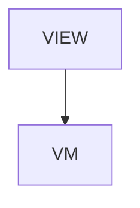

# McpTools - MCP tool API

## Overview

Reference > MCP tool API. Overview page. Four sections + TOC + next-reads. Generated via /tmp/gen-reference.js.

| | |
|---|---|
| Created | 2026-04-23 |
| Updated | 2026-07-09 |

## Screen Structure

### UI Components

| Component | ID | Platform | Description | Initial State | Notes |
|---|---|---|---|---|---|
| View | `reference_mcp_tools_root` | - | - | - | - |
| &nbsp;&nbsp;↳ Scroll | `reference_mcp_tools_scroll` | - | - | - | - |
| &nbsp;&nbsp;&nbsp;&nbsp;↳ View | `reference_mcp_tools_header` | - | - | - | - |
| &nbsp;&nbsp;&nbsp;&nbsp;&nbsp;&nbsp;↳ Label | `-` | - | - | - | - |
| &nbsp;&nbsp;&nbsp;&nbsp;&nbsp;&nbsp;↳ Label | `-` | - | - | - | - |
| &nbsp;&nbsp;&nbsp;&nbsp;&nbsp;&nbsp;↳ Label | `-` | - | - | - | - |
| &nbsp;&nbsp;&nbsp;&nbsp;&nbsp;&nbsp;↳ Label | `-` | - | - | - | - |
| &nbsp;&nbsp;&nbsp;&nbsp;↳ View | `reference_mcp_tools_content_with_rail` | - | - | - | - |
| &nbsp;&nbsp;&nbsp;&nbsp;&nbsp;&nbsp;↳ View | `reference_mcp_tools_body_column` | - | - | - | - |
| &nbsp;&nbsp;&nbsp;&nbsp;&nbsp;&nbsp;&nbsp;&nbsp;↳ View | `section_authority` | - | - | - | - |
| &nbsp;&nbsp;&nbsp;&nbsp;&nbsp;&nbsp;&nbsp;&nbsp;&nbsp;&nbsp;↳ Label | `-` | - | - | - | - |
| &nbsp;&nbsp;&nbsp;&nbsp;&nbsp;&nbsp;&nbsp;&nbsp;&nbsp;&nbsp;↳ Label | `-` | - | - | - | - |
| &nbsp;&nbsp;&nbsp;&nbsp;&nbsp;&nbsp;&nbsp;&nbsp;↳ View | `section_groups` | - | - | - | - |
| &nbsp;&nbsp;&nbsp;&nbsp;&nbsp;&nbsp;&nbsp;&nbsp;&nbsp;&nbsp;↳ Label | `-` | - | - | - | - |
| &nbsp;&nbsp;&nbsp;&nbsp;&nbsp;&nbsp;&nbsp;&nbsp;&nbsp;&nbsp;↳ Label | `-` | - | - | - | - |
| &nbsp;&nbsp;&nbsp;&nbsp;&nbsp;&nbsp;&nbsp;&nbsp;↳ View | `section_schema` | - | - | - | - |
| &nbsp;&nbsp;&nbsp;&nbsp;&nbsp;&nbsp;&nbsp;&nbsp;&nbsp;&nbsp;↳ Label | `-` | - | - | - | - |
| &nbsp;&nbsp;&nbsp;&nbsp;&nbsp;&nbsp;&nbsp;&nbsp;&nbsp;&nbsp;↳ Label | `-` | - | - | - | - |
| &nbsp;&nbsp;&nbsp;&nbsp;&nbsp;&nbsp;&nbsp;&nbsp;↳ View | `section_versioning` | - | - | - | - |
| &nbsp;&nbsp;&nbsp;&nbsp;&nbsp;&nbsp;&nbsp;&nbsp;&nbsp;&nbsp;↳ Label | `-` | - | - | - | - |
| &nbsp;&nbsp;&nbsp;&nbsp;&nbsp;&nbsp;&nbsp;&nbsp;&nbsp;&nbsp;↳ Label | `-` | - | - | - | - |
| &nbsp;&nbsp;&nbsp;&nbsp;&nbsp;&nbsp;&nbsp;&nbsp;↳ View | `section_catalog` | - | - | - | - |
| &nbsp;&nbsp;&nbsp;&nbsp;&nbsp;&nbsp;&nbsp;&nbsp;&nbsp;&nbsp;↳ Label | `-` | - | - | - | - |
| &nbsp;&nbsp;&nbsp;&nbsp;&nbsp;&nbsp;&nbsp;&nbsp;&nbsp;&nbsp;↳ Label | `-` | - | - | - | - |
| &nbsp;&nbsp;&nbsp;&nbsp;&nbsp;&nbsp;&nbsp;&nbsp;&nbsp;&nbsp;↳ Collection | `reference_mcp_tools_catalog_collection` | - | - | - | - |
| &nbsp;&nbsp;&nbsp;&nbsp;&nbsp;&nbsp;&nbsp;&nbsp;↳ View | `reference_mcp_tools_next` | - | - | - | - |
| &nbsp;&nbsp;&nbsp;&nbsp;&nbsp;&nbsp;&nbsp;&nbsp;&nbsp;&nbsp;↳ Label | `-` | - | - | - | - |
| &nbsp;&nbsp;&nbsp;&nbsp;&nbsp;&nbsp;&nbsp;&nbsp;&nbsp;&nbsp;↳ Collection | `reference_mcp_tools_next_collection` | - | - | - | - |
| &nbsp;&nbsp;&nbsp;&nbsp;&nbsp;&nbsp;&nbsp;&nbsp;↳ View | `reference_mcp_tools_footer` | - | - | - | - |
| &nbsp;&nbsp;&nbsp;&nbsp;&nbsp;&nbsp;&nbsp;&nbsp;&nbsp;&nbsp;↳ Label | `-` | - | - | - | - |
| &nbsp;&nbsp;&nbsp;&nbsp;&nbsp;&nbsp;↳ View | `reference_mcp_tools_rail_column` | - | - | - | - |
| &nbsp;&nbsp;&nbsp;&nbsp;&nbsp;&nbsp;&nbsp;&nbsp;↳ View | `reference_mcp_tools_toc_wrap` | - | - | - | - |
| &nbsp;&nbsp;&nbsp;&nbsp;&nbsp;&nbsp;&nbsp;&nbsp;&nbsp;&nbsp;↳ TableOfContents | `-` | - | - | - | - |

### Layout Structure

```
reference_mcp_tools_root
└── reference_mcp_tools_scroll
```

## Data Flow



### ViewModel

#### Methods

| Signature | Platforms | Description |
|---|---|---|
| `onAppear()` | all | Seed nextReadLinks from the module-scope NEXT_READ_ENTRIES catalog (two rows: next_mcp_overview -> /tools/mcp, next_agents -> /tools/agents) and stamp currentLanguage from StringManager.language. Each row's titleKey / descriptionKey is resolved through StringManager with the reference_mcp_tools_ namespace prefix. |
| `onNavigate(url: String)` | all | Client-side navigation via router.push(url). Destinations are the spec-mapped URLs enumerated in transitions: /, /tools/mcp, /tools/agents. |

#### Vars

| Declaration | Flags | Platforms | Description |
|---|---|---|---|
| `var tools: CollectionDataSource(McpToolDetail)` | observable | all | 39 MCP tools across 6 groups (A:8 Lookup / B:6 Validation / C:7 Generation / D:9 Build + Runtime / E:3 API Model Discovery / F:6 Test Tooling) rendered as one row each via cells/reference_mcp_tool_detail. Each row carries the tool name, group letter chip, one-line role, a Parameters heading, and a preformatted parameters code block (or '(no parameters)'). |
| `var nextReadLinks: Array(NextReadLink)` | observable | all | Two closing 'read next' cards pointing at /tools/mcp and /tools/agents. Seeded by onAppear from the NEXT_READ_ENTRIES static catalog and re-seeded by onToggleLanguage. |

## State Management

### UI Data Variables

| Variable Name | Type | Description | Notes |
|---|---|---|---|
| `tools` | CollectionDataSource(McpToolDetail) | 39 MCP tools across 6 groups (A:8 / B:6 / C:7 / D:9 / E:3 / F:6). Each row carries name, group letter, role, and a preformatted parameters block. | - |
| `nextReadLinks` | [NextReadLink] | Two closing cards. | - |

### View-local Event Handlers

_Handlers kept inside the View layer. ViewModel public API lives under `dataFlow.viewModel`._

| Handler | Description | Notes |
|---|---|---|
| `onAppear` | Seed nextReadLinks. | - |
| `onNavigate` | Client-side navigation. | - |
| `onNavigateReference` |  | - |

## User Actions

| Action | Processing | Destination | Notes |
|---|---|---|---|
| Tap a TOC entry | TOC-internal scroll. | - | - |
| Tap a NextReadLink card | onNavigate(url). | - | - |

## Validation

## Transitions

| Condition | Destination | Notes |
|---|---|---|
| url is spec-mapped | Target screen or tab | - |

## Related Files

| Type | File Path | Notes |
|---|---|---|
| Layout | `docs/screens/layouts/reference/mcp-tools.json` | - |
| ViewModel | `jsonui-doc-web/src/viewmodels/reference/McpToolsViewModel.ts` | - |
| View | `jsonui-doc-web/src/app/reference/mcp-tools/page.tsx` | - |

## Notes

- Live Reference entry. Flip REFERENCE_ENTRIES row for 'mcp-tools' to 'live' in HomeViewModel when shipping.
- v1 is hand-authored overview. Auto-generation from the upstream artifact is a future pass.
- 2026-05-27 — Swagger-driven Data Model additions. Surgical edits only; do not restructure existing group ordering.
- Base catalog is 30 tools across 4 groups: A:8 (Lookup) / B:6 (Validation) / C:7 (Generation) / D:9 (Build + Runtime). Source of truth = `TOOL_IDS` in `jsonui-doc-web/src/viewmodels/reference/McpToolsViewModel.ts` lines 27-39. Do NOT use the earlier (incorrect) 29 / A:7 count that briefly appeared in `tools/mcp.spec.json`.
- Append Group E (API Model Discovery) with 3 entries after the existing Group D tail. New totals: 33 tools / 5 groups (A:8 / B:6 / C:7 / D:9 / E:3).
- Group E entry 1 — `list_api_specs`. group=E. role (en): 'Discover swagger files + parsed metadata (schema_count, endpoint_count, halts)'. role (ja): 'swagger ファイルと metadata を発見（schema 件数 / endpoint 件数 / halt の有無）'.
- Group E entry 2 — `list_api_models`. group=E. role (en): 'Inventory generated DTO + Domain scaffold + orphan files per platform'. role (ja): 'プラットフォーム別 DTO / Domain scaffold / orphan の在庫を返す'.
- Group E entry 3 — `preview_api_model_sync`. group=E. role (en): 'Dry-run filter impact — returns kept_schemas / filtered_out / skip_domain_matches / halts as JSON without writing files'. role (ja): 'filter 変更の影響を dry-run — kept_schemas / filtered_out / skip_domain_matches / halts を JSON で返す。ファイル書き込みなし'.
- String-key declarations for the 3 new rows (en + ja content owned by jsonui-localize): each tool needs name / group letter chip text / role / params heading / params CodeBlock body. Suggested key shape (mirrors existing rows): `reference_mcp_tools_tool_list_api_specs_{name,group,role,params_heading,params_code}`, `reference_mcp_tools_tool_list_api_models_{...}`, `reference_mcp_tools_tool_preview_api_model_sync_{...}`. Group label key (en 'API Model Discovery' / ja 'API Model Discovery'): `reference_mcp_tools_group_e_label`. The actual `_params` JSON schema bodies are jsonui-implement's responsibility — only the string-key declarations live here.
- Update any prose strings on this page that name the group / tool counts: `reference_mcp_tools_intro_*`, `reference_mcp_tools_section_overview_*`, any 'X tools across Y groups' sentence. 30 -> 33, 4 -> 5. Surgical replacements; do not rewrite the surrounding copy.
- 2026-07-09 — Test Tooling additions. Append Group F (Test Tooling) with 6 entries after the Group E tail. New totals: 39 tools / 6 groups (A:8 / B:6 / C:7 / D:9 / E:3 / F:6). Source of truth = `TOOL_IDS` in `jsonui-doc-web/src/viewmodels/reference/McpToolsViewModel.ts` (kept in sync with the tools/mcp McpViewModel).
- Group F entries (group=F), added after preview_api_model_sync: test_validate (role: schema-validate screen/flow tests + descriptions; installs validated tests to platform dirs when test.install is configured), test_generate_screen (scaffold screen test template), test_generate_flow (scaffold flow test template), test_generate_description (scaffold a description JSON for one case), test_report (results JSON → JUnit/HTML), test_mock_generate (scaffold OpenAPI mocks; check:true = drift-only). `mock serve` is intentionally NOT exposed over MCP.
- String-key declarations for the 6 new rows: name / group / role shared with tools/mcp via `tools_mcp_tool_test_{...}_{name,group,role}`; per-tool params via `reference_mcp_tools_tool_test_{...}_params`. Group label key `reference_mcp_tools_group_f_label` (en/ja 'Test Tooling'). Prose counts on this page: 33 -> 39, 5 -> 6, A–E -> A–F. Also fixed the stale section_groups_body which still read A:7 / 4 groups.
- 2026-07-28 — two stale claims corrected. read_time said 'auto-generated', but this catalogue is hand-authored (TOOL_IDS in the ViewModel plus the tools_mcp_* / reference_mcp_tools_* strings); it now reads 'reference', matching the lead, which already said hand-authored. section_groups_body still showed B (6) after get_screen_identity joined group B — measured from TOOL_IDS against the tools_mcp tool_<id>_group keys, the real split is A:8 / B:7 / C:7 / D:9 / E:3 / F:8 = 42, which the lead, tools_mcp.section_catalog_body and learn_installation.card_mcp_body already stated. This one line was the only place left behind. reference_attributes / reference_components keep 'auto-generated' — those pages really are emitted by scripts/build-attribute-reference.ts.
