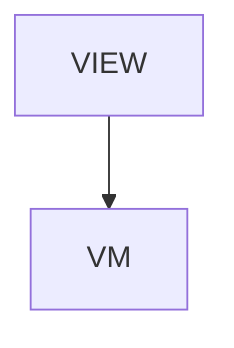

# TestTooling - Test tooling reference

## Overview

Reference > Test tooling reference. Two sections + TOC + next-reads. (1) Feature support matrix — where the three drivers agree (core actions, all asserts + auto-wait, state via provider, screenshot) and where they differ, source-verified against driver code (id mapping, pass/fail accessor, addMedia, tap.retryTapIfNoChange, launch.permissions/clearState, run command). (2) Source-of-truth ownership — schemas=jsonui-test-runner, validator constants + CLI=jsonui-cli, drivers=each driver repo (1.0.0), mock.schema.json=editor/doc-only, schema<->validator drift-check=jsonui-cli CI. Tables rendered as monospace CodeBlocks.

| | |
|---|---|
| Created | 2026-07-09 |
| Updated | 2026-07-09 |

## Screen Structure

### UI Components

| Component | ID | Platform | Description | Initial State | Notes |
|---|---|---|---|---|---|
| View | `reference_test_tooling_root` | - | - | - | - |
| &nbsp;&nbsp;↳ Scroll | `reference_test_tooling_scroll` | - | - | - | - |
| &nbsp;&nbsp;&nbsp;&nbsp;↳ View | `reference_test_tooling_header` | - | - | - | - |
| &nbsp;&nbsp;&nbsp;&nbsp;&nbsp;&nbsp;↳ Label | `-` | - | - | - | - |
| &nbsp;&nbsp;&nbsp;&nbsp;&nbsp;&nbsp;↳ Label | `-` | - | - | - | - |
| &nbsp;&nbsp;&nbsp;&nbsp;&nbsp;&nbsp;↳ Label | `-` | - | - | - | - |
| &nbsp;&nbsp;&nbsp;&nbsp;&nbsp;&nbsp;↳ Label | `-` | - | - | - | - |
| &nbsp;&nbsp;&nbsp;&nbsp;↳ View | `reference_test_tooling_content_with_rail` | - | - | - | - |
| &nbsp;&nbsp;&nbsp;&nbsp;&nbsp;&nbsp;↳ View | `reference_test_tooling_body_column` | - | - | - | - |
| &nbsp;&nbsp;&nbsp;&nbsp;&nbsp;&nbsp;&nbsp;&nbsp;↳ View | `section_matrix` | - | - | - | - |
| &nbsp;&nbsp;&nbsp;&nbsp;&nbsp;&nbsp;&nbsp;&nbsp;&nbsp;&nbsp;↳ Label | `-` | - | - | - | - |
| &nbsp;&nbsp;&nbsp;&nbsp;&nbsp;&nbsp;&nbsp;&nbsp;&nbsp;&nbsp;↳ Label | `-` | - | - | - | - |
| &nbsp;&nbsp;&nbsp;&nbsp;&nbsp;&nbsp;&nbsp;&nbsp;&nbsp;&nbsp;↳ Label | `-` | - | - | - | - |
| &nbsp;&nbsp;&nbsp;&nbsp;&nbsp;&nbsp;&nbsp;&nbsp;&nbsp;&nbsp;↳ CodeBlock | `-` | - | - | - | - |
| &nbsp;&nbsp;&nbsp;&nbsp;&nbsp;&nbsp;&nbsp;&nbsp;↳ View | `section_ownership` | - | - | - | - |
| &nbsp;&nbsp;&nbsp;&nbsp;&nbsp;&nbsp;&nbsp;&nbsp;&nbsp;&nbsp;↳ Label | `-` | - | - | - | - |
| &nbsp;&nbsp;&nbsp;&nbsp;&nbsp;&nbsp;&nbsp;&nbsp;&nbsp;&nbsp;↳ Label | `-` | - | - | - | - |
| &nbsp;&nbsp;&nbsp;&nbsp;&nbsp;&nbsp;&nbsp;&nbsp;&nbsp;&nbsp;↳ Label | `-` | - | - | - | - |
| &nbsp;&nbsp;&nbsp;&nbsp;&nbsp;&nbsp;&nbsp;&nbsp;&nbsp;&nbsp;↳ CodeBlock | `-` | - | - | - | - |
| &nbsp;&nbsp;&nbsp;&nbsp;&nbsp;&nbsp;&nbsp;&nbsp;↳ View | `reference_test_tooling_next` | - | - | - | - |
| &nbsp;&nbsp;&nbsp;&nbsp;&nbsp;&nbsp;&nbsp;&nbsp;&nbsp;&nbsp;↳ Label | `-` | - | - | - | - |
| &nbsp;&nbsp;&nbsp;&nbsp;&nbsp;&nbsp;&nbsp;&nbsp;&nbsp;&nbsp;↳ Collection | `reference_test_tooling_next_collection` | - | - | - | - |
| &nbsp;&nbsp;&nbsp;&nbsp;&nbsp;&nbsp;&nbsp;&nbsp;↳ View | `reference_test_tooling_footer` | - | - | - | - |
| &nbsp;&nbsp;&nbsp;&nbsp;&nbsp;&nbsp;&nbsp;&nbsp;&nbsp;&nbsp;↳ Label | `-` | - | - | - | - |
| &nbsp;&nbsp;&nbsp;&nbsp;&nbsp;&nbsp;↳ View | `reference_test_tooling_rail_column` | - | - | - | - |
| &nbsp;&nbsp;&nbsp;&nbsp;&nbsp;&nbsp;&nbsp;&nbsp;↳ View | `reference_test_tooling_toc_wrap` | - | - | - | - |
| &nbsp;&nbsp;&nbsp;&nbsp;&nbsp;&nbsp;&nbsp;&nbsp;&nbsp;&nbsp;↳ TableOfContents | `-` | - | - | - | - |

### Layout Structure

```
reference_test_tooling_root
└── reference_test_tooling_scroll
```

## Data Flow



### ViewModel

#### Methods

| Signature | Platforms | Description |
|---|---|---|
| `onAppear()` | all | Seed nextReadLinks from the module-scope NEXT_READ_ENTRIES catalog (two rows: next_testing -> /guides/testing, next_api_mock -> /guides/api-mock). Each row's titleKey / descriptionKey is resolved through StringManager with the reference_test_tooling_ namespace prefix. |
| `onNavigate(url: String)` | all | Client-side navigation via router.push(url). Destinations are the spec-mapped URLs enumerated in transitions: /, /guides/testing, /guides/api-mock. |

#### Vars

| Declaration | Flags | Platforms | Description |
|---|---|---|---|
| `var nextReadLinks: Array(NextReadLink)` | observable | all | Two closing 'read next' cards pointing at /guides/testing and /guides/api-mock. Seeded by onAppear and re-seeded by mountLanguage. |

## State Management

### UI Data Variables

| Variable Name | Type | Description | Notes |
|---|---|---|---|
| `nextReadLinks` | [NextReadLink] | Two closing cards: /guides/testing + /guides/api-mock. | - |

### View-local Event Handlers

_Handlers kept inside the View layer. ViewModel public API lives under `dataFlow.viewModel`._

| Handler | Description | Notes |
|---|---|---|
| `onAppear` | Seed nextReadLinks. | - |
| `onNavigate` | Client-side navigation (bound in the layout as onNavigateReference). | - |
| `onNavigateReference` |  | - |

## User Actions

| Action | Processing | Destination | Notes |
|---|---|---|---|
| Tap a TOC entry | TOC-internal scroll. | - | - |
| Tap a NextReadLink card | onNavigate(url). | - | - |

## Validation

## Transitions

| Condition | Destination | Notes |
|---|---|---|
| url is spec-mapped | Target screen or tab | - |

## Related Files

| Type | File Path | Notes |
|---|---|---|
| Layout | `docs/screens/layouts/reference/test-tooling.json` | - |
| ViewModel | `jsonui-doc-web/src/viewmodels/reference/TestToolingViewModel.ts` | - |
| View | `jsonui-doc-web/src/app/reference/test-tooling/page.tsx` | - |

## Notes

- Live Reference entry (added 2026-07-09 for the test-tooling doc pass). Added to ChromeViewModel NAV_CATALOG reference + ReferenceIndexViewModel CATALOG.
- Matrix rows are source-verified against jsonui-test-runner driver code, deliberately correcting stale docs: Web element id is the HTML id (#id), not data-testid; pass/fail is result.allPassed on iOS + Android (computed property on TestSuiteResult) but the allPassed(result) function on Web.
- Companion to /guides/testing (DSL) and /guides/api-mock (mocks). Tables are monospace CodeBlocks (no new Collection cell needed).
- 2026-09-02, driver android 1.8.4 (d990624): the matrix Android clearState cell pm clear -> in-process wipe [fn2]. Measured on the driver source: instrumentation runs in the target package's process, so pm clear force-stopped the process running the tests; 1.8.4 wipes files/shared_prefs/databases/cache/code_cache in-process and relaunches — persisted state only, process memory survives. Boundary carried in footnote [fn2].
- Same pass: the [fn] marker on the Web pass/fail cell had no rendered body anywhere on the page since 2026-07-09 (the intent lived only in these notes). Footnote block added at the bottom of the matrix CodeBlock; [fn] body states property-vs-function.
- 2026-09-02, driver android 1.8.5 (183e8ae) + cli 1.8.0 (3b49fc0f): the matrix Android permissions cell 'pm grant / pm revoke' -> 'grant / deny->assert [fn3]'. Measured on the driver source: allow still runs pm grant; deny asserts the arriving state and fails the file when granted (no pm revoke is executed — the driver's own comment and the schema at jsonui-test-runner b2a042e declare that an in-run revoke kills the instrumented process; that runtime claim is attributed, not re-measured here); unset executes nothing. Prescription in the footnote: jsonui-test pregrant --platform android.
