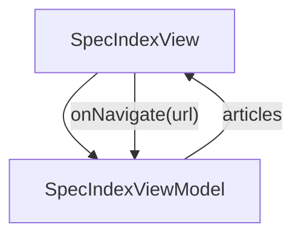

# SpecIndex - Spec

## Overview

Catalog page for the Spec section. Lists the eight spec-authoring articles (anatomy, the six split patterns' map, layout-file, parent + sub, component spec, custom types, cell classes, validation + drift) with one-line descriptions. Same seeder pattern as GuidesIndex: the catalog constant mirrors ChromeViewModel's NAV_CATALOG for the `spec` section so the sidebar and this index stay in lockstep.

| | |
|---|---|
| Created | 2026-08-01 |
| Updated | 2026-08-25 |

## Screen Structure

### UI Components

| Component | ID | Platform | Description | Initial State | Notes |
|---|---|---|---|---|---|
| View | `spec_index_root` | - | - | - | - |
| &nbsp;&nbsp;↳ Scroll | `spec_index_scroll` | - | - | - | - |
| &nbsp;&nbsp;&nbsp;&nbsp;↳ View | `spec_index_hero` | - | - | - | - |
| &nbsp;&nbsp;&nbsp;&nbsp;&nbsp;&nbsp;↳ Label | `-` | - | - | - | - |
| &nbsp;&nbsp;&nbsp;&nbsp;&nbsp;&nbsp;↳ Label | `-` | - | - | - | - |
| &nbsp;&nbsp;&nbsp;&nbsp;&nbsp;&nbsp;↳ Label | `-` | - | - | - | - |
| &nbsp;&nbsp;&nbsp;&nbsp;↳ View | `spec_index_catalog` | - | - | - | - |
| &nbsp;&nbsp;&nbsp;&nbsp;&nbsp;&nbsp;↳ Label | `-` | - | - | - | - |
| &nbsp;&nbsp;&nbsp;&nbsp;&nbsp;&nbsp;↳ Label | `-` | - | - | - | - |
| &nbsp;&nbsp;&nbsp;&nbsp;&nbsp;&nbsp;↳ Collection | `spec_index_articles_collection` | - | - | - | - |

### Layout Structure

```
spec_index_root
└── spec_index_scroll
```

## Data Flow



### ViewModel

#### Methods

| Signature | Platforms | Description |
|---|---|---|
| `onAppear()` | all | Seed `articles` from the module-scope CATALOG constant in SpecIndexViewModel. Each row expands into an ArticleCell with StringManager-resolved titleKey + descriptionKey (`_title` → `_lead`), a pre-wired onNavigate closure, and the standard live-status decorations. |
| `onNavigate(url: String)` | all | router.push(url). All article cards funnel through this one method. |

#### Vars

| Declaration | Flags | Platforms | Description |
|---|---|---|---|
| `var articles: Array(SpecArticle)` | observable | all | Ordered catalog, seeded in onAppear. Order matches the sidebar's spec section. |

## State Management

### UI Data Variables

| Variable Name | Type | Description | Notes |
|---|---|---|---|
| `articles` | [SpecArticle] | Ordered catalog of spec-section articles. Order matches the sidebar: anatomy, split-overview, layout-file, parent-sub-spec, component-spec, custom-types, cell-classes, validation-and-drift. All eight are live. | - |

### View-local Event Handlers

_Handlers kept inside the View layer. ViewModel public API lives under `dataFlow.viewModel`._

| Handler | Description | Notes |
|---|---|---|
| `onAppear` | Populate `articles` from the static catalog. Titles resolve from each target page's strings key (spec_<name>_title); descriptions derive by suffix substitution `_title` → `_lead`, so the index re-uses each article's own lead and cannot drift from it. | - |
| `onNavigate` | Client-side navigation. Destination URLs are spec-mapped (e.g. /spec/anatomy). | - |

## User Actions

| Action | Processing | Destination | Notes |
|---|---|---|---|
| Tap an article card | onNavigate(url) is invoked with the bound SpecArticle.url. Router pushes the URL, landing the reader on that article. | - | - |

## Validation

## Transitions

| Condition | Destination | Notes |
|---|---|---|
| url is any spec-mapped /spec/* URL | Target spec screen resolved from url | - |

## Related Files

| Type | File Path | Notes |
|---|---|---|
| Layout | `docs/screens/layouts/spec_index.json` | - |
| Layout | `docs/screens/layouts/cells/learn_article_card.json` | - |
| ViewModel | `jsonui-doc-web/src/viewmodels/SpecIndexViewModel.ts` | - |
| View | `jsonui-doc-web/src/app/spec/page.tsx` | - |

## Notes

- The spec section shipped its eight articles before it had an index; /spec was the only section root without a landing page. This screen closes that gap.
- Strings prefix: `spec_index_*` (namespace derives from the layoutFile `spec/index`).
- 2026-08-25 — layoutFile corrected from 'spec/index' to 'spec_index': the layout has always lived at the flat path, and the stale nested spelling meant the spec claimed a layout that does not exist. Surfaced by the spec-coverage check added in jsonui-cli 1.6.35 — no earlier gate compared these two sides.
