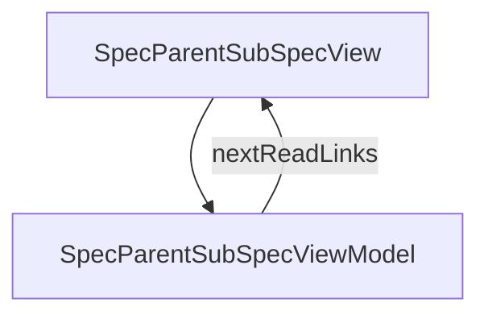

# SpecParentSubSpec - Parent + sub specs

## Overview

Pattern 2 of spec splitting — deep dive into screen_parent_spec + screen_sub_spec. Rewritten for jsonui-cli 1.7.6, where the parent became a pure container: every behavioural section is supplied by the sub-specs and declaring one in the parent is an error. Covers the parent's remaining fields, what a sub owns (including branchContracts beside the method it constrains), a merger-derived table of where each section goes, the keyed-vs-concatenated merge rules and where a conflict is reported, and a migration section for parents written earlier.

| | |
|---|---|
| Created | 2026-04-24 |
| Updated | 2026-08-28 |

## Screen Structure

### UI Components

| Component | ID | Platform | Description | Initial State | Notes |
|---|---|---|---|---|---|
| View | `spec_parent_sub_spec_root` | - | - | - | - |
| &nbsp;&nbsp;↳ Scroll | `spec_parent_sub_spec_scroll` | - | - | - | - |
| &nbsp;&nbsp;&nbsp;&nbsp;↳ View | `spec_parent_sub_spec_header` | - | - | - | - |
| &nbsp;&nbsp;&nbsp;&nbsp;&nbsp;&nbsp;↳ Label | `-` | - | - | - | - |
| &nbsp;&nbsp;&nbsp;&nbsp;&nbsp;&nbsp;↳ Label | `-` | - | - | - | - |
| &nbsp;&nbsp;&nbsp;&nbsp;&nbsp;&nbsp;↳ Label | `-` | - | - | - | - |
| &nbsp;&nbsp;&nbsp;&nbsp;&nbsp;&nbsp;↳ Label | `-` | - | - | - | - |
| &nbsp;&nbsp;&nbsp;&nbsp;↳ View | `spec_parent_sub_spec_body` | - | - | - | - |
| &nbsp;&nbsp;&nbsp;&nbsp;&nbsp;&nbsp;↳ View | `section_when` | - | - | - | - |
| &nbsp;&nbsp;&nbsp;&nbsp;&nbsp;&nbsp;&nbsp;&nbsp;↳ Label | `-` | - | - | - | - |
| &nbsp;&nbsp;&nbsp;&nbsp;&nbsp;&nbsp;&nbsp;&nbsp;↳ Label | `-` | - | - | - | - |
| &nbsp;&nbsp;&nbsp;&nbsp;&nbsp;&nbsp;↳ View | `section_parent` | - | - | - | - |
| &nbsp;&nbsp;&nbsp;&nbsp;&nbsp;&nbsp;&nbsp;&nbsp;↳ Label | `-` | - | - | - | - |
| &nbsp;&nbsp;&nbsp;&nbsp;&nbsp;&nbsp;&nbsp;&nbsp;↳ Label | `-` | - | - | - | - |
| &nbsp;&nbsp;&nbsp;&nbsp;&nbsp;&nbsp;&nbsp;&nbsp;↳ CodeBlock | `-` | - | - | - | - |
| &nbsp;&nbsp;&nbsp;&nbsp;&nbsp;&nbsp;↳ View | `section_sub` | - | - | - | - |
| &nbsp;&nbsp;&nbsp;&nbsp;&nbsp;&nbsp;&nbsp;&nbsp;↳ Label | `-` | - | - | - | - |
| &nbsp;&nbsp;&nbsp;&nbsp;&nbsp;&nbsp;&nbsp;&nbsp;↳ Label | `-` | - | - | - | - |
| &nbsp;&nbsp;&nbsp;&nbsp;&nbsp;&nbsp;&nbsp;&nbsp;↳ CodeBlock | `-` | - | - | - | - |
| &nbsp;&nbsp;&nbsp;&nbsp;&nbsp;&nbsp;↳ View | `section_inherited` | - | - | - | - |
| &nbsp;&nbsp;&nbsp;&nbsp;&nbsp;&nbsp;&nbsp;&nbsp;↳ Label | `-` | - | - | - | - |
| &nbsp;&nbsp;&nbsp;&nbsp;&nbsp;&nbsp;&nbsp;&nbsp;↳ Label | `-` | - | - | - | - |
| &nbsp;&nbsp;&nbsp;&nbsp;&nbsp;&nbsp;&nbsp;&nbsp;↳ CodeBlock | `-` | - | - | - | - |
| &nbsp;&nbsp;&nbsp;&nbsp;&nbsp;&nbsp;↳ View | `section_merge` | - | - | - | - |
| &nbsp;&nbsp;&nbsp;&nbsp;&nbsp;&nbsp;&nbsp;&nbsp;↳ Label | `-` | - | - | - | - |
| &nbsp;&nbsp;&nbsp;&nbsp;&nbsp;&nbsp;&nbsp;&nbsp;↳ Label | `-` | - | - | - | - |
| &nbsp;&nbsp;&nbsp;&nbsp;&nbsp;&nbsp;&nbsp;&nbsp;↳ CodeBlock | `-` | - | - | - | - |
| &nbsp;&nbsp;&nbsp;&nbsp;&nbsp;&nbsp;↳ View | `section_migrate` | - | - | - | - |
| &nbsp;&nbsp;&nbsp;&nbsp;&nbsp;&nbsp;&nbsp;&nbsp;↳ Label | `-` | - | - | - | - |
| &nbsp;&nbsp;&nbsp;&nbsp;&nbsp;&nbsp;&nbsp;&nbsp;↳ Label | `-` | - | - | - | - |
| &nbsp;&nbsp;&nbsp;&nbsp;&nbsp;&nbsp;&nbsp;&nbsp;↳ Label | `-` | - | - | - | - |
| &nbsp;&nbsp;&nbsp;&nbsp;&nbsp;&nbsp;&nbsp;&nbsp;↳ CodeBlock | `-` | - | - | - | - |
| &nbsp;&nbsp;&nbsp;&nbsp;&nbsp;&nbsp;&nbsp;&nbsp;↳ Label | `-` | - | - | - | - |
| &nbsp;&nbsp;&nbsp;&nbsp;&nbsp;&nbsp;&nbsp;&nbsp;↳ Label | `-` | - | - | - | - |
| &nbsp;&nbsp;&nbsp;&nbsp;&nbsp;&nbsp;↳ View | `section_antipatterns` | - | - | - | - |
| &nbsp;&nbsp;&nbsp;&nbsp;&nbsp;&nbsp;&nbsp;&nbsp;↳ Label | `-` | - | - | - | - |
| &nbsp;&nbsp;&nbsp;&nbsp;&nbsp;&nbsp;&nbsp;&nbsp;↳ Label | `-` | - | - | - | - |
| &nbsp;&nbsp;&nbsp;&nbsp;↳ View | `spec_parent_sub_spec_next` | - | - | - | - |
| &nbsp;&nbsp;&nbsp;&nbsp;&nbsp;&nbsp;↳ Label | `-` | - | - | - | - |
| &nbsp;&nbsp;&nbsp;&nbsp;&nbsp;&nbsp;↳ Label | `-` | - | - | - | - |
| &nbsp;&nbsp;&nbsp;&nbsp;&nbsp;&nbsp;↳ Collection | `spec_parent_sub_spec_next_collection` | - | - | - | - |
| &nbsp;&nbsp;&nbsp;&nbsp;↳ View | `spec_parent_sub_spec_footer` | - | - | - | - |
| &nbsp;&nbsp;&nbsp;&nbsp;&nbsp;&nbsp;↳ Label | `-` | - | - | - | - |

### Layout Structure

```
spec_parent_sub_spec_root
└── spec_parent_sub_spec_scroll
```

## Data Flow



### ViewModel

#### Methods

| Signature | Platforms | Description |
|---|---|---|
| `onAppear()` | all | Seed nextReadLinks from NEXT_READ_ENTRIES. |
| `onNavigate(url: String)` | all | router.push. |

#### Vars

| Declaration | Flags | Platforms | Description |
|---|---|---|---|
| `var nextReadLinks: Array(NextReadLink)` | observable | all | Closing cards. |

## State Management

### UI Data Variables

| Variable Name | Type | Description | Notes |
|---|---|---|---|
| `nextReadLinks` | [NextReadLink] | Follow-up cards. | - |

### View-local Event Handlers

_Handlers kept inside the View layer. ViewModel public API lives under `dataFlow.viewModel`._

| Handler | Description | Notes |
|---|---|---|
| `onAppear` | Seed nextReadLinks. | - |
| `onNavigate` | Client-side navigation. | - |
| `onNavigateSpec` |  | - |

## User Actions

| Action | Processing | Destination | Notes |
|---|---|---|---|
| Tap a NextReadLink card | onNavigate(url). | - | - |

## Validation

## Transitions

| Condition | Destination | Notes |
|---|---|---|
| url is /spec/layout-file or /spec/component-spec | Target spec screen | - |

## Related Files

| Type | File Path | Notes |
|---|---|---|
| Layout | `docs/screens/layouts/spec/parent-sub-spec.json` | - |
| ViewModel | `jsonui-doc-web/src/viewmodels/spec/ParentSubSpecViewModel.ts` | - |
| View | `jsonui-doc-web/src/app/spec/parent-sub-spec/page.tsx` | - |

## Notes

- Phase 2 article 2/5: the parent + sub split. Uses ~6 sections to walk through why + how + what validator enforces + what jui build merges.
- No live examples of this pattern inside JsonUIDocument yet — the CodeBlocks are illustrative (a Home screen with Feed + Notifications sub regions).
- 2026-08-28 (v1.7.3 + v1.7.6) — rewritten after measuring the merger directly: a parent declaring dataFlow.viewModel / repositories / stateManagement.uiVariables / userActions produced four errors with the move-it wording (quoted on the page); two subs declaring the same method identically merged to one entry and validate passed; the same method declared differently produced `dataFlow.viewModel.methods[name=send]: Defined differently in 'ChatCore' and 'ChatStreaming'` from the merger and nothing from validate spec, which is why the page says which tool sees a conflict; the parent's structure.notes survived the merge and notes concatenated parent-first.
- The migration section states that output is expected to grow rather than match, because the parent's declarations were being discarded before. Upstream had circulated the opposite (delete them, the merged output is byte-identical) and corrected it; the page is written so a reader who deletes instead of moving is warned before they do it.
- 2026-08-31 — section_merge_body corrected: this page listed branchContracts among the name-keyed sections since the 1.7.6 rewrite, and that was the intent rather than the behaviour. Until jsonui-cli 1.7.18 the merge keyed on the sub-section (conditions/methods), so a second sub-spec that merely had the section collided and its contracts were dropped whole. Measured on a two-sub fixture sharing no contract name via ParentSpecMerger.merge_from_file: v1.7.17 returned conditions ['hasDraft'] / methods ['send'] with two conflicts keyed 'branchContracts[conditions]' and 'branchContracts[methods]', v1.7.18 returned both of each with none. The discriminating case is published with it — adding a same-named condition with different wording makes 1.7.18 report exactly one conflict keyed branchContracts.conditions[name=hasDraft], because a merge that never conflicts would equally be a merge that never descended.
- 2026-09-04 - unitContracts joins the two lists on this page (what lives in a sub-spec, and what the merger keys by name). Until jsonui-cli 1.8.28 a split screen had NO legal place to declare one: the parent refuses it by default-deny and no reader looked in the subs, which is the same trap branchContracts was in before 1.7.6 - the page already tells that story, so the new sentence sits beside it. Verified in the merger rather than taken from the notice: the block is read from each sub and keyed at (target, case name), one level deeper than branchContracts, so several sub-specs may add cases to the same target and only a same-named case with different content is reported as a conflict. The doc validator also gained a closed-vocabulary check for the section, so `jsonui-doc validate spec` now catches a misspelled key where before only the other command would have.
- 2026-09-04 - jsonui-cli 1.8.29 gives this page's first list a canonical source: shared/core/parent_spec_rules.py's MERGER_BUILDS_FROM_SUB_SPECS, which an upstream test walks through a real merge so the set and the merger cannot drift. The prose is NOT derived from it - the sentence groups sections editorially and two of the eleven names (relatedFiles, notes) are read from the parent too, so they belong in a different sentence - but an eleventh CI gate now checks coverage: every canonical section must be named somewhere in this namespace. Measured four ways before it was trusted: green as it stands (11 of 11), red with one name removed from the prose, refusing when the toolchain has no rules module, green again. The same release makes the refusal message branch on whether a section has a destination at all, and that distinction is now in the migrate bullet: default-deny refusal plus hand-written construction means a section can be refused in the parent and read by nobody in the sub, which happened twice.
