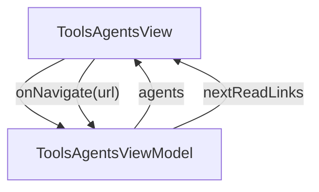

# Agents - Agents for Claude / Codex

## Overview

Tools > Agents overview. Explains the 9-agent + 11-skill + 5-rule pack that teaches Claude Code (or Codex) how to run the spec-first JsonUI workflow. Four H2 sections (What ships / The conductor flow / Per-agent summary / Adding your own). ~10-min read. Secondary audience is the AI-first team (plan 00 priority 2) — the page should read like a control-plane reference, not an essay. Per-agent rows now include 1-line notes for the 2026-05 swagger-driven Data Model awareness: conductor checks list_api_specs at startup; define knows the two-tier skip_domain rule; implement carries the DTO vs Domain return-type convention; debug has the swagger -> DTO -> Domain -> Repository -> ViewModel trace; ground sets api_directory during scaffold; test mentions the DTO mock factory.

| | |
|---|---|
| Created | 2026-04-23 |
| Updated | 2026-05-27 |

## Screen Structure

### UI Components

| Component | ID | Platform | Description | Initial State | Notes |
|---|---|---|---|---|---|
| View | `tools_agents_root` | - | - | - | - |
| &nbsp;&nbsp;↳ Scroll | `tools_agents_scroll` | - | - | - | - |
| &nbsp;&nbsp;&nbsp;&nbsp;↳ View | `tools_agents_header` | - | - | - | - |
| &nbsp;&nbsp;&nbsp;&nbsp;&nbsp;&nbsp;↳ Label | `-` | - | - | - | - |
| &nbsp;&nbsp;&nbsp;&nbsp;&nbsp;&nbsp;↳ Label | `-` | - | - | - | - |
| &nbsp;&nbsp;&nbsp;&nbsp;&nbsp;&nbsp;↳ Label | `-` | - | - | - | - |
| &nbsp;&nbsp;&nbsp;&nbsp;&nbsp;&nbsp;↳ Label | `-` | - | - | - | - |
| &nbsp;&nbsp;&nbsp;&nbsp;↳ View | `tools_agents_content_with_rail` | - | - | - | - |
| &nbsp;&nbsp;&nbsp;&nbsp;&nbsp;&nbsp;↳ View | `tools_agents_body_column` | - | - | - | - |
| &nbsp;&nbsp;&nbsp;&nbsp;&nbsp;&nbsp;&nbsp;&nbsp;↳ View | `section_ships` | - | - | - | - |
| &nbsp;&nbsp;&nbsp;&nbsp;&nbsp;&nbsp;&nbsp;&nbsp;&nbsp;&nbsp;↳ Label | `-` | - | - | - | - |
| &nbsp;&nbsp;&nbsp;&nbsp;&nbsp;&nbsp;&nbsp;&nbsp;&nbsp;&nbsp;↳ Label | `-` | - | - | - | - |
| &nbsp;&nbsp;&nbsp;&nbsp;&nbsp;&nbsp;&nbsp;&nbsp;↳ View | `section_flow` | - | - | - | - |
| &nbsp;&nbsp;&nbsp;&nbsp;&nbsp;&nbsp;&nbsp;&nbsp;&nbsp;&nbsp;↳ Label | `-` | - | - | - | - |
| &nbsp;&nbsp;&nbsp;&nbsp;&nbsp;&nbsp;&nbsp;&nbsp;&nbsp;&nbsp;↳ Label | `-` | - | - | - | - |
| &nbsp;&nbsp;&nbsp;&nbsp;&nbsp;&nbsp;&nbsp;&nbsp;&nbsp;&nbsp;↳ CodeBlock | `-` | - | - | - | - |
| &nbsp;&nbsp;&nbsp;&nbsp;&nbsp;&nbsp;&nbsp;&nbsp;↳ View | `section_catalog` | - | - | - | - |
| &nbsp;&nbsp;&nbsp;&nbsp;&nbsp;&nbsp;&nbsp;&nbsp;&nbsp;&nbsp;↳ Label | `-` | - | - | - | - |
| &nbsp;&nbsp;&nbsp;&nbsp;&nbsp;&nbsp;&nbsp;&nbsp;&nbsp;&nbsp;↳ Label | `-` | - | - | - | - |
| &nbsp;&nbsp;&nbsp;&nbsp;&nbsp;&nbsp;&nbsp;&nbsp;&nbsp;&nbsp;↳ Collection | `tools_agents_collection` | - | - | - | - |
| &nbsp;&nbsp;&nbsp;&nbsp;&nbsp;&nbsp;&nbsp;&nbsp;↳ View | `section_custom` | - | - | - | - |
| &nbsp;&nbsp;&nbsp;&nbsp;&nbsp;&nbsp;&nbsp;&nbsp;&nbsp;&nbsp;↳ Label | `-` | - | - | - | - |
| &nbsp;&nbsp;&nbsp;&nbsp;&nbsp;&nbsp;&nbsp;&nbsp;&nbsp;&nbsp;↳ Label | `-` | - | - | - | - |
| &nbsp;&nbsp;&nbsp;&nbsp;&nbsp;&nbsp;&nbsp;&nbsp;↳ View | `tools_agents_next` | - | - | - | - |
| &nbsp;&nbsp;&nbsp;&nbsp;&nbsp;&nbsp;&nbsp;&nbsp;&nbsp;&nbsp;↳ Label | `-` | - | - | - | - |
| &nbsp;&nbsp;&nbsp;&nbsp;&nbsp;&nbsp;&nbsp;&nbsp;&nbsp;&nbsp;↳ Collection | `tools_agents_next_collection` | - | - | - | - |
| &nbsp;&nbsp;&nbsp;&nbsp;&nbsp;&nbsp;&nbsp;&nbsp;↳ View | `tools_agents_footer` | - | - | - | - |
| &nbsp;&nbsp;&nbsp;&nbsp;&nbsp;&nbsp;&nbsp;&nbsp;&nbsp;&nbsp;↳ Label | `-` | - | - | - | - |
| &nbsp;&nbsp;&nbsp;&nbsp;&nbsp;&nbsp;↳ View | `tools_agents_rail_column` | - | - | - | - |
| &nbsp;&nbsp;&nbsp;&nbsp;&nbsp;&nbsp;&nbsp;&nbsp;↳ View | `tools_agents_toc_wrap` | - | - | - | - |
| &nbsp;&nbsp;&nbsp;&nbsp;&nbsp;&nbsp;&nbsp;&nbsp;&nbsp;&nbsp;↳ TableOfContents | `-` | - | - | - | - |

### Layout Structure

```
tools_agents_root
└── tools_agents_scroll
```

## Data Flow



### ViewModel

#### Methods

| Signature | Platforms | Description |
|---|---|---|
| `onAppear()` | all | Seed both `agents` and `nextReadLinks` from module-scope static catalogs. Every AgentRow (9 entries: conductor / define / ground / implement / test / debug / navigation-ios / navigation-android / navigation-web) has its nameKey / roleKey / whenToUseKey pre-resolved through StringManager.getString with the tools_agents_ prefix. Two NextReadLink entries point at /tools/cli and /tools/mcp as the natural next reads. |
| `onNavigate(url: String)` | all | router.push(url). Hit by NextReadLink card taps and any inline CTA. Agents are descriptive rows — no per-row navigation in v1. |

#### Vars

| Declaration | Flags | Platforms | Description |
|---|---|---|---|
| `var agents: Array(AgentRow)` | observable | all | 9-row agent catalog, seeded once per mount. |
| `var nextReadLinks: Array(NextReadLink)` | observable | all | 2 closing cards, seeded once per mount. |

## State Management

### UI Data Variables

| Variable Name | Type | Description | Notes |
|---|---|---|---|
| `agents` | [AgentRow] | Nine agent entries (conductor / define / ground / implement / test / debug / navigation-ios / navigation-android / navigation-web) with name + role + when-to-use. | - |
| `nextReadLinks` | [NextReadLink] | Two closing cards: CLI tools + MCP server overview. | - |

### View-local Event Handlers

_Handlers kept inside the View layer. ViewModel public API lives under `dataFlow.viewModel`._

| Handler | Description | Notes |
|---|---|---|
| `onAppear` | Seed agents + nextReadLinks from the static v1 catalog. | - |
| `onNavigate` | Client-side navigation. | - |
| `onNavigateTools` |  | - |

## User Actions

| Action | Processing | Destination | Notes |
|---|---|---|---|
| Tap a TOC entry | TOC-internal scroll. | - | - |
| Tap a NextReadLink card | onNavigate(url). | - | - |

## Validation

## Transitions

| Condition | Destination | Notes |
|---|---|---|
| url is a spec-mapped tools URL or / | Target spec screen or tab | - |

## Related Files

| Type | File Path | Notes |
|---|---|---|
| Layout | `docs/screens/layouts/tools/agents.json` | - |
| Layout | `docs/screens/layouts/cells/agent_row.json` | - |
| ViewModel | `jsonui-doc-web/src/viewmodels/tools/ToolsAgentsViewModel.ts` | - |
| View | `jsonui-doc-web/src/app/tools/agents/page.tsx` | - |

## Notes

- First live entry under the Tools tab. Flipping TOOLS_ENTRIES row 4 (agents) from 'upcoming' to 'live' in HomeViewModel finishes the task.
- The agents Collection uses a dedicated cells/agent_row layout rather than the generic learn_article_card — the row has three strings (name / role / whenToUse) and a distinct density, so pulling it into its own cell keeps the styling honest.
- Plan 11 (content-plan-agents.md) lists nine agents. This page is the INTRO — each agent deserves a dedicated page later, but v1 ships only the overview catalog.
- Priority-2 audience (plan 00) is teams running JsonUI through Claude Code / Codex. Copy stays practical: what to type, when to invoke which agent, how conductor dispatches. No brand prose.
- 2026-05 update (swagger-driven Data Models): each AgentRow's whenToUseKey body gains ONE sentence about its swagger-aware responsibility — (1) conductor whenToUseKey ends '... and pings list_api_specs at startup to know whether the project consumes OpenAPI'; (2) define whenToUseKey notes 'knows the two-tier skip_domain rule (schema-side x-jui-skip-domain vs app-side api.schemas.skip_domain)'; (3) implement whenToUseKey notes 'follows the Repository return-type convention: schema name -> Domain, *Dto suffix -> raw DTO'; (4) debug whenToUseKey notes 'can trace swagger -> DTO -> Domain -> Repository -> ViewModel end-to-end'; (5) ground whenToUseKey notes 'sets api_directory in jui.config.json during scaffold'; (6) test whenToUseKey notes 'generates DTO mock factories from the codegen DTO'. The remaining 3 agents (navigation-ios / -android / -web) are unaffected. No new uiVariable / customType — body-copy change only inside existing tools_agents_*_when_to_use_body strings.
