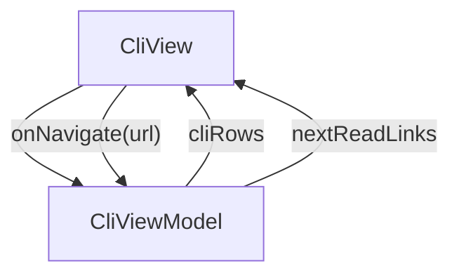

# Cli - jsonui-cli

## Overview

Tools > CLI overview. Six sub-CLIs under one install: jui (orchestrator) + sjui / kjui / rjui (per-platform builders) + jsonui-test + jsonui-doc. ~10-min read. Companion to /tools/agents and /tools/mcp — the CLIs are what the MCP tools and agents ultimately delegate to for heavy lifting. Mentions the new `jui g api` subcommand (DTO + Domain codegen from OpenAPI) and the new `jui ls` group (`ls api-specs` / `ls api-models`). All generate-side commands honor the `api.schemas.*` filter when scoping schema codegen.

| | |
|---|---|
| Created | 2026-04-23 |
| Updated | 2026-05-27 |

## Screen Structure

### UI Components

| Component | ID | Platform | Description | Initial State | Notes |
|---|---|---|---|---|---|
| View | `tools_cli_root` | - | - | - | - |
| &nbsp;&nbsp;↳ Scroll | `tools_cli_scroll` | - | - | - | - |
| &nbsp;&nbsp;&nbsp;&nbsp;↳ View | `tools_cli_header` | - | - | - | - |
| &nbsp;&nbsp;&nbsp;&nbsp;&nbsp;&nbsp;↳ Label | `-` | - | - | - | - |
| &nbsp;&nbsp;&nbsp;&nbsp;&nbsp;&nbsp;↳ Label | `-` | - | - | - | - |
| &nbsp;&nbsp;&nbsp;&nbsp;&nbsp;&nbsp;↳ Label | `-` | - | - | - | - |
| &nbsp;&nbsp;&nbsp;&nbsp;&nbsp;&nbsp;↳ Label | `-` | - | - | - | - |
| &nbsp;&nbsp;&nbsp;&nbsp;↳ View | `tools_cli_content_with_rail` | - | - | - | - |
| &nbsp;&nbsp;&nbsp;&nbsp;&nbsp;&nbsp;↳ View | `tools_cli_body_column` | - | - | - | - |
| &nbsp;&nbsp;&nbsp;&nbsp;&nbsp;&nbsp;&nbsp;&nbsp;↳ View | `section_topology` | - | - | - | - |
| &nbsp;&nbsp;&nbsp;&nbsp;&nbsp;&nbsp;&nbsp;&nbsp;&nbsp;&nbsp;↳ Label | `-` | - | - | - | - |
| &nbsp;&nbsp;&nbsp;&nbsp;&nbsp;&nbsp;&nbsp;&nbsp;&nbsp;&nbsp;↳ Label | `-` | - | - | - | - |
| &nbsp;&nbsp;&nbsp;&nbsp;&nbsp;&nbsp;&nbsp;&nbsp;↳ View | `section_orchestrator` | - | - | - | - |
| &nbsp;&nbsp;&nbsp;&nbsp;&nbsp;&nbsp;&nbsp;&nbsp;&nbsp;&nbsp;↳ Label | `-` | - | - | - | - |
| &nbsp;&nbsp;&nbsp;&nbsp;&nbsp;&nbsp;&nbsp;&nbsp;&nbsp;&nbsp;↳ Label | `-` | - | - | - | - |
| &nbsp;&nbsp;&nbsp;&nbsp;&nbsp;&nbsp;&nbsp;&nbsp;&nbsp;&nbsp;↳ CodeBlock | `-` | - | - | - | - |
| &nbsp;&nbsp;&nbsp;&nbsp;&nbsp;&nbsp;&nbsp;&nbsp;↳ View | `section_catalog` | - | - | - | - |
| &nbsp;&nbsp;&nbsp;&nbsp;&nbsp;&nbsp;&nbsp;&nbsp;&nbsp;&nbsp;↳ Label | `-` | - | - | - | - |
| &nbsp;&nbsp;&nbsp;&nbsp;&nbsp;&nbsp;&nbsp;&nbsp;&nbsp;&nbsp;↳ Label | `-` | - | - | - | - |
| &nbsp;&nbsp;&nbsp;&nbsp;&nbsp;&nbsp;&nbsp;&nbsp;&nbsp;&nbsp;↳ Collection | `tools_cli_catalog_collection` | - | - | - | - |
| &nbsp;&nbsp;&nbsp;&nbsp;&nbsp;&nbsp;&nbsp;&nbsp;↳ View | `section_exit` | - | - | - | - |
| &nbsp;&nbsp;&nbsp;&nbsp;&nbsp;&nbsp;&nbsp;&nbsp;&nbsp;&nbsp;↳ Label | `-` | - | - | - | - |
| &nbsp;&nbsp;&nbsp;&nbsp;&nbsp;&nbsp;&nbsp;&nbsp;&nbsp;&nbsp;↳ Label | `-` | - | - | - | - |
| &nbsp;&nbsp;&nbsp;&nbsp;&nbsp;&nbsp;&nbsp;&nbsp;↳ View | `tools_cli_next` | - | - | - | - |
| &nbsp;&nbsp;&nbsp;&nbsp;&nbsp;&nbsp;&nbsp;&nbsp;&nbsp;&nbsp;↳ Label | `-` | - | - | - | - |
| &nbsp;&nbsp;&nbsp;&nbsp;&nbsp;&nbsp;&nbsp;&nbsp;&nbsp;&nbsp;↳ Collection | `tools_cli_next_collection` | - | - | - | - |
| &nbsp;&nbsp;&nbsp;&nbsp;&nbsp;&nbsp;&nbsp;&nbsp;↳ View | `tools_cli_footer` | - | - | - | - |
| &nbsp;&nbsp;&nbsp;&nbsp;&nbsp;&nbsp;&nbsp;&nbsp;&nbsp;&nbsp;↳ Label | `-` | - | - | - | - |
| &nbsp;&nbsp;&nbsp;&nbsp;&nbsp;&nbsp;↳ View | `tools_cli_rail_column` | - | - | - | - |
| &nbsp;&nbsp;&nbsp;&nbsp;&nbsp;&nbsp;&nbsp;&nbsp;↳ View | `tools_cli_toc_wrap` | - | - | - | - |
| &nbsp;&nbsp;&nbsp;&nbsp;&nbsp;&nbsp;&nbsp;&nbsp;&nbsp;&nbsp;↳ TableOfContents | `-` | - | - | - | - |

### Layout Structure

```
tools_cli_root
└── tools_cli_scroll
```

## Data Flow



### ViewModel

#### Methods

| Signature | Platforms | Description |
|---|---|---|
| `onAppear()` | all | Seed cliRows + nextReadLinks from module-scope catalogs. cliRows carries 6 CLI entries (jui / sjui / kjui / rjui / jsonui-test / jsonui-doc) with nameKey / roleKey / bodyKey keys under the tools_cli_ prefix, all pre-resolved via StringManager. nextReadLinks points to /tools/agents and /tools/mcp. |
| `onNavigate(url: String)` | all | router.push(url). Hit by NextReadLink card taps; cliRows are informational, no per-row nav. |

#### Vars

| Declaration | Flags | Platforms | Description |
|---|---|---|---|
| `var cliRows: Array(CliRow)` | observable | all | 6-row CLI catalog, seeded once per mount. |
| `var nextReadLinks: Array(NextReadLink)` | observable | all | 2 closing cards. |

## State Management

### UI Data Variables

| Variable Name | Type | Description | Notes |
|---|---|---|---|
| `cliRows` | [CliRow] | Six sub-CLI entries (jui / sjui / kjui / rjui / jsonui-test / jsonui-doc). Each carries name + role + one-line description. | - |
| `nextReadLinks` | [NextReadLink] | Two closing cards: Agents + MCP server. | - |

### View-local Event Handlers

_Handlers kept inside the View layer. ViewModel public API lives under `dataFlow.viewModel`._

| Handler | Description | Notes |
|---|---|---|
| `onAppear` | Seed cliRows + nextReadLinks. | - |
| `onNavigate` | Client-side navigation. | - |
| `onNavigateTools` |  | - |

## User Actions

| Action | Processing | Destination | Notes |
|---|---|---|---|
| Tap a TOC entry | TOC-internal scroll. | - | - |
| Tap a NextReadLink card | onNavigate(url). | - | - |

## Validation

## Transitions

| Condition | Destination | Notes |
|---|---|---|
| url is a spec-mapped tools URL or / | Target spec screen or tab | - |

## Related Files

| Type | File Path | Notes |
|---|---|---|
| Layout | `docs/screens/layouts/tools/cli.json` | - |
| Layout | `docs/screens/layouts/cells/cli_row.json` | - |
| ViewModel | `jsonui-doc-web/src/viewmodels/tools/CliViewModel.ts` | - |
| View | `jsonui-doc-web/src/app/tools/cli/page.tsx` | - |

## Notes

- Third live entry under the Tools tab. Flipping TOOLS_ENTRIES row 1 (cli) from 'upcoming' to 'live' in HomeViewModel finishes the task.
- Sub-CLI row is a richer cell than agent_row / mcp_tool_row because the per-tool role is a full sentence (not a short one-liner). Keeping it separate avoids forcing agent_row to grow.
- 2026-05 update (swagger-driven Data Models): the `jui` row's body adds one sentence noting the new `g api` subcommand (DTO + Domain codegen) and the new `ls` group (`ls api-specs`, `ls api-models`). The generate group description gains one line: 'Generate steps honor `api.schemas.{include_paths, exclude_paths, include_schemas, exclude_schemas, skip_domain}` when scoping schema codegen for shared swaggers.' Detail links to /guides/api-data-models §3 (filter syntax) and /reference/cli-commands (the full flag reference). No new uiVariable / customType added — the change is body-copy only inside the existing tools_cli_cli_jsonui_body, tools_cli_cli_jui_body, and a new tools_cli_cli_jui_ls_intro string.
