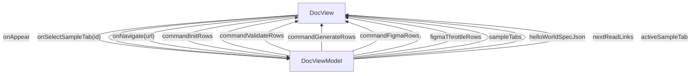

# Doc - jsonui-doc

## Overview

Tools > jsonui-doc (DOC GEN) overview. The Python CLI that generates HTML / Markdown / Mermaid / test adapters / Figma-as-HTML from JsonUI screen specs, component specs, test JSON files, and Figma API responses. 13 subcommands across four groups (init / validate / generate / figma). Companion to /tools/cli and /tools/mcp — the doc_generate_* MCP tools are thin wrappers that delegate here, and the /reference HTML pages on this site are produced by the same binary. 2026-05 note: document_tools/.../swagger.py is no longer the entry point for OpenAPI codegen — its core logic is now in jsonui-cli and is invoked through `jui g api`; jsonui-doc retains only the doc-generation side.

| | |
|---|---|
| Created | 2026-04-24 |
| Updated | 2026-05-27 |

## Screen Structure

### UI Components

| Component | ID | Platform | Description | Initial State | Notes |
|---|---|---|---|---|---|
| View | `tools_doc_root` | - | - | - | - |
| &nbsp;&nbsp;↳ Scroll | `tools_doc_scroll` | - | - | - | - |
| &nbsp;&nbsp;&nbsp;&nbsp;↳ View | `tools_doc_header` | - | - | - | - |
| &nbsp;&nbsp;&nbsp;&nbsp;&nbsp;&nbsp;↳ Label | `-` | - | - | - | - |
| &nbsp;&nbsp;&nbsp;&nbsp;&nbsp;&nbsp;↳ Label | `-` | - | - | - | - |
| &nbsp;&nbsp;&nbsp;&nbsp;&nbsp;&nbsp;↳ Label | `-` | - | - | - | - |
| &nbsp;&nbsp;&nbsp;&nbsp;&nbsp;&nbsp;↳ Label | `-` | - | - | - | - |
| &nbsp;&nbsp;&nbsp;&nbsp;↳ View | `tools_doc_content_with_rail` | - | - | - | - |
| &nbsp;&nbsp;&nbsp;&nbsp;&nbsp;&nbsp;↳ View | `tools_doc_body_column` | - | - | - | - |
| &nbsp;&nbsp;&nbsp;&nbsp;&nbsp;&nbsp;&nbsp;&nbsp;↳ View | `section_overview` | - | - | - | - |
| &nbsp;&nbsp;&nbsp;&nbsp;&nbsp;&nbsp;&nbsp;&nbsp;&nbsp;&nbsp;↳ Label | `-` | - | - | - | - |
| &nbsp;&nbsp;&nbsp;&nbsp;&nbsp;&nbsp;&nbsp;&nbsp;&nbsp;&nbsp;↳ Label | `-` | - | - | - | - |
| &nbsp;&nbsp;&nbsp;&nbsp;&nbsp;&nbsp;&nbsp;&nbsp;↳ View | `section_when` | - | - | - | - |
| &nbsp;&nbsp;&nbsp;&nbsp;&nbsp;&nbsp;&nbsp;&nbsp;&nbsp;&nbsp;↳ Label | `-` | - | - | - | - |
| &nbsp;&nbsp;&nbsp;&nbsp;&nbsp;&nbsp;&nbsp;&nbsp;&nbsp;&nbsp;↳ Label | `-` | - | - | - | - |
| &nbsp;&nbsp;&nbsp;&nbsp;&nbsp;&nbsp;&nbsp;&nbsp;↳ View | `section_commands` | - | - | - | - |
| &nbsp;&nbsp;&nbsp;&nbsp;&nbsp;&nbsp;&nbsp;&nbsp;&nbsp;&nbsp;↳ Label | `-` | - | - | - | - |
| &nbsp;&nbsp;&nbsp;&nbsp;&nbsp;&nbsp;&nbsp;&nbsp;&nbsp;&nbsp;↳ Label | `-` | - | - | - | - |
| &nbsp;&nbsp;&nbsp;&nbsp;&nbsp;&nbsp;&nbsp;&nbsp;&nbsp;&nbsp;↳ Label | `-` | - | - | - | - |
| &nbsp;&nbsp;&nbsp;&nbsp;&nbsp;&nbsp;&nbsp;&nbsp;&nbsp;&nbsp;↳ Collection | `tools_doc_init_collection` | - | - | - | - |
| &nbsp;&nbsp;&nbsp;&nbsp;&nbsp;&nbsp;&nbsp;&nbsp;&nbsp;&nbsp;↳ Label | `-` | - | - | - | - |
| &nbsp;&nbsp;&nbsp;&nbsp;&nbsp;&nbsp;&nbsp;&nbsp;&nbsp;&nbsp;↳ Collection | `tools_doc_validate_collection` | - | - | - | - |
| &nbsp;&nbsp;&nbsp;&nbsp;&nbsp;&nbsp;&nbsp;&nbsp;&nbsp;&nbsp;↳ Label | `-` | - | - | - | - |
| &nbsp;&nbsp;&nbsp;&nbsp;&nbsp;&nbsp;&nbsp;&nbsp;&nbsp;&nbsp;↳ Collection | `tools_doc_generate_collection` | - | - | - | - |
| &nbsp;&nbsp;&nbsp;&nbsp;&nbsp;&nbsp;&nbsp;&nbsp;&nbsp;&nbsp;↳ Label | `-` | - | - | - | - |
| &nbsp;&nbsp;&nbsp;&nbsp;&nbsp;&nbsp;&nbsp;&nbsp;&nbsp;&nbsp;↳ Collection | `tools_doc_figma_collection` | - | - | - | - |
| &nbsp;&nbsp;&nbsp;&nbsp;&nbsp;&nbsp;&nbsp;&nbsp;↳ View | `section_throttle` | - | - | - | - |
| &nbsp;&nbsp;&nbsp;&nbsp;&nbsp;&nbsp;&nbsp;&nbsp;&nbsp;&nbsp;↳ Label | `-` | - | - | - | - |
| &nbsp;&nbsp;&nbsp;&nbsp;&nbsp;&nbsp;&nbsp;&nbsp;&nbsp;&nbsp;↳ Label | `-` | - | - | - | - |
| &nbsp;&nbsp;&nbsp;&nbsp;&nbsp;&nbsp;&nbsp;&nbsp;&nbsp;&nbsp;↳ Collection | `tools_doc_throttle_collection` | - | - | - | - |
| &nbsp;&nbsp;&nbsp;&nbsp;&nbsp;&nbsp;&nbsp;&nbsp;↳ View | `section_layout` | - | - | - | - |
| &nbsp;&nbsp;&nbsp;&nbsp;&nbsp;&nbsp;&nbsp;&nbsp;&nbsp;&nbsp;↳ Label | `-` | - | - | - | - |
| &nbsp;&nbsp;&nbsp;&nbsp;&nbsp;&nbsp;&nbsp;&nbsp;&nbsp;&nbsp;↳ Label | `-` | - | - | - | - |
| &nbsp;&nbsp;&nbsp;&nbsp;&nbsp;&nbsp;&nbsp;&nbsp;↳ View | `section_mcp` | - | - | - | - |
| &nbsp;&nbsp;&nbsp;&nbsp;&nbsp;&nbsp;&nbsp;&nbsp;&nbsp;&nbsp;↳ Label | `-` | - | - | - | - |
| &nbsp;&nbsp;&nbsp;&nbsp;&nbsp;&nbsp;&nbsp;&nbsp;&nbsp;&nbsp;↳ Label | `-` | - | - | - | - |
| &nbsp;&nbsp;&nbsp;&nbsp;&nbsp;&nbsp;&nbsp;&nbsp;↳ View | `section_sample` | - | - | - | - |
| &nbsp;&nbsp;&nbsp;&nbsp;&nbsp;&nbsp;&nbsp;&nbsp;&nbsp;&nbsp;↳ Label | `-` | - | - | - | - |
| &nbsp;&nbsp;&nbsp;&nbsp;&nbsp;&nbsp;&nbsp;&nbsp;&nbsp;&nbsp;↳ Label | `-` | - | - | - | - |
| &nbsp;&nbsp;&nbsp;&nbsp;&nbsp;&nbsp;&nbsp;&nbsp;&nbsp;&nbsp;↳ Label | `-` | - | - | - | - |
| &nbsp;&nbsp;&nbsp;&nbsp;&nbsp;&nbsp;&nbsp;&nbsp;&nbsp;&nbsp;↳ Collection | `tools_doc_sample_tabs` | - | - | - | - |
| &nbsp;&nbsp;&nbsp;&nbsp;&nbsp;&nbsp;&nbsp;&nbsp;&nbsp;&nbsp;↳ View | `sample_panel_json` | - | - | - | - |
| &nbsp;&nbsp;&nbsp;&nbsp;&nbsp;&nbsp;&nbsp;&nbsp;&nbsp;&nbsp;&nbsp;&nbsp;↳ CodeBlock | `-` | - | - | - | - |
| &nbsp;&nbsp;&nbsp;&nbsp;&nbsp;&nbsp;&nbsp;&nbsp;&nbsp;&nbsp;↳ View | `sample_panel_html` | - | - | - | - |
| &nbsp;&nbsp;&nbsp;&nbsp;&nbsp;&nbsp;&nbsp;&nbsp;&nbsp;&nbsp;&nbsp;&nbsp;↳ DocSamplePreview | `-` | - | - | - | - |
| &nbsp;&nbsp;&nbsp;&nbsp;&nbsp;&nbsp;&nbsp;&nbsp;↳ View | `tools_doc_next` | - | - | - | - |
| &nbsp;&nbsp;&nbsp;&nbsp;&nbsp;&nbsp;&nbsp;&nbsp;&nbsp;&nbsp;↳ Label | `-` | - | - | - | - |
| &nbsp;&nbsp;&nbsp;&nbsp;&nbsp;&nbsp;&nbsp;&nbsp;&nbsp;&nbsp;↳ Collection | `tools_doc_next_collection` | - | - | - | - |
| &nbsp;&nbsp;&nbsp;&nbsp;&nbsp;&nbsp;&nbsp;&nbsp;↳ View | `tools_doc_footer` | - | - | - | - |
| &nbsp;&nbsp;&nbsp;&nbsp;&nbsp;&nbsp;&nbsp;&nbsp;&nbsp;&nbsp;↳ Label | `-` | - | - | - | - |
| &nbsp;&nbsp;&nbsp;&nbsp;&nbsp;&nbsp;↳ View | `tools_doc_rail_column` | - | - | - | - |
| &nbsp;&nbsp;&nbsp;&nbsp;&nbsp;&nbsp;&nbsp;&nbsp;↳ View | `tools_doc_toc_wrap` | - | - | - | - |
| &nbsp;&nbsp;&nbsp;&nbsp;&nbsp;&nbsp;&nbsp;&nbsp;&nbsp;&nbsp;↳ TableOfContents | `-` | - | - | - | - |

### Layout Structure

```
tools_doc_root
└── tools_doc_scroll
```

## Data Flow



### ViewModel

#### Methods

| Signature | Platforms | Description |
|---|---|---|
| `onAppear()` | all | Seed every public observable from module-scope catalogs: commandInitRows (2), commandValidateRows (2), commandGenerateRows (6), commandFigmaRows (2), figmaThrottleRows (4 plan rows), nextReadLinks (2 cards), helloWorldSpecJson (the literal learn/hello-world spec JSON, pasted as a template literal constant). Every string field on every row type is a tools_doc_ prefixed key pre-resolved via StringManager. Finally calls buildSampleTabs('html') to populate sampleTabs and leaves activeSampleTab at its 'html' initial value. |
| `onSelectSampleTab(id: String)` | all | Set `activeSampleTab` to the tapped TabHeaderCell.id, then assign `sampleTabs = buildSampleTabs(id)` so the active/inactive palettes swap without a full re-seed. displayLogic derives jsonSamplePanelVisibility / htmlSamplePanelVisibility from activeSampleTab; the VM does not set those — the generated component does via the layout's visibility bindings. |
| `onNavigate(url: String)` | all | router.push(url). Bound to the 'View this page live' CTA (target: /learn/hello-world) and to each NextReadLink card. |
| `buildSampleTabs(activeId: String)` | all | Helper that returns [TabHeaderCell] with exactly 2 entries (id='json' / id='html'). For the row whose id === activeId it sets bgColor: 'var(--color-accent)', fgColor: 'var(--color-on-accent)', borderColor: 'var(--color-accent)'; for the other row it sets bgColor: 'var(--color-surface)', fgColor: 'var(--color-ink)', borderColor: 'var(--color-border)'. Each row's onSelect is wired to () => this.onSelectSampleTab(id). Mirrors LearnHelloWorldViewModel.buildPlatformTabs exactly so a maintainer who has read one has read both. |

#### Vars

| Declaration | Flags | Platforms | Description |
|---|---|---|---|
| `var commandInitRows: Array(CommandRow)` | observable | all | 2-row init catalog (`init spec`, `init component`). |
| `var commandValidateRows: Array(CommandRow)` | observable | all | 2-row validate catalog (`validate spec`, `validate component`). |
| `var commandGenerateRows: Array(CommandRow)` | observable | all | 6-row generate catalog (`generate html` / `mermaid` / `adapter` / `doc` / `spec` / `component`). |
| `var commandFigmaRows: Array(CommandRow)` | observable | all | 2-row figma catalog (`figma fetch`, `figma images`). |
| `var figmaThrottleRows: Array(FigmaThrottleRow)` | observable | all | 4-row throttle table (starter / pro / org / enterprise). |
| `var sampleTabs: Array(TabHeaderCell)` | observable | all | 2-row tab header for the live-sample section, rebuilt on every selection. |
| `var helloWorldSpecJson: String` | observable | all | Literal JSON text of the hello-world spec, displayed in a CodeBlock on the 'Spec JSON' tab. |
| `var nextReadLinks: Array(NextReadLink)` | observable | all | 2 closing cards (/tools/mcp, /reference/cli-commands). |
| `var activeSampleTab: String` | observable | all | Currently visible sample tab id; 'html' by default. |
| `var jsonSamplePanelVisibility: String` | observable | all | Derived visibility from displayLogic; set by the layout's binding, not the VM. |
| `var htmlSamplePanelVisibility: String` | observable | all | Same as above — mirrors activeSampleTab == 'html'. |

## State Management

### UI Data Variables

| Variable Name | Type | Description | Notes |
|---|---|---|---|
| `commandInitRows` | [CommandRow] | 2 entries: `init spec`, `init component`. Each CommandRow carries name + description + key flags (-d, -o, -c). Seeded by onAppear from a module-scope static catalog. | - |
| `commandValidateRows` | [CommandRow] | 2 entries: `validate spec`, `validate component`. Rows rendered inside the 'validate' Collection. | - |
| `commandGenerateRows` | [CommandRow] | 6 entries: `generate html`, `generate mermaid`, `generate adapter`, `generate doc`, `generate spec`, `generate component`. The largest group — where most day-to-day invocations land. | - |
| `commandFigmaRows` | [CommandRow] | 2 entries: `figma fetch`, `figma images`. Throttling-sensitive; see figmaThrottleRows below for the companion plan table. | - |
| `figmaThrottleRows` | [FigmaThrottleRow] | 4 rows mirroring the Figma plan throttling table from document_tools/README.md (starter 10 req/min ~12s, pro 15 req/min ~8s, org 20 req/min ~6s, enterprise unlimited / no throttle). Static; never mutated after onAppear. | - |
| `sampleTabs` | [TabHeaderCell] | 2 T6-pattern tab headers for the live-sample section: 'Spec JSON' (id='json') and 'Generated HTML' (id='html'). Initial render defaults to id='html' active. Rebuilt on every onSelectSampleTab call by buildSampleTabs(activeId) so the active row carries accent bgColor/fgColor/borderColor and the inactive row carries the surface palette — exactly the same pattern hello-world's buildPlatformTabs uses for the Swift/Kotlin/React switcher. | - |
| `helloWorldSpecJson` | String | Literal JSON text of docs/screens/json/learn/hello-world.spec.json, inlined at author time as a module-scope constant and read into the VM from onAppear. Rendered inside a CodeBlock (language='json') on the 'Spec JSON' tab. Seeded once; never mutated. | - |
| `nextReadLinks` | [NextReadLink] | 2 closing cards: /tools/mcp (the MCP server, whose doc_generate_* tools wrap this CLI) and /reference/cli-commands (the broader CLI reference). | - |
| `activeSampleTab` | String | Id of the currently selected live-sample tab ('json' | 'html'). Defaults to 'html' so a first-time visitor sees the generated preview (the more visually immediate output), with the raw spec one click away. Drives displayLogic for the two sample-panel visibility variables and is fed into buildSampleTabs on each toggle. Matches the naming pattern LearnHelloWorldViewModel uses for `activeTab`. | - |
| `jsonSamplePanelVisibility` | String | (from binding) | - |
| `htmlSamplePanelVisibility` | String | (from binding) | - |

### View-local Event Handlers

_Handlers kept inside the View layer. ViewModel public API lives under `dataFlow.viewModel`._

| Handler | Description | Notes |
|---|---|---|
| `onAppear` | Seed all seven public uiVariables (commandInitRows / commandValidateRows / commandGenerateRows / commandFigmaRows / figmaThrottleRows / nextReadLinks / helloWorldSpecJson) from module-scope static catalogs, then call buildSampleTabs('html') to populate sampleTabs. All user-visible command/flag descriptions resolve through StringManager with the tools_doc_ prefix. | - |
| `onSelectSampleTab` | T6-pattern tab toggle. Sets activeSampleTab to the tapped TabHeaderCell.id ('json' | 'html'), then re-invokes buildSampleTabs(id) to refresh sampleTabs so the clicked row picks up the active palette and the other row reverts to the inactive palette. displayLogic's *SamplePanelVisibility vars are derived from activeSampleTab so exactly one sample panel is visible at a time. | - |
| `onNavigate` | Client-side navigation. Bound to the 'View this page live →' link above the sample tabs (target: /learn/hello-world) and to each NextReadLink card's onClick via Collection row binding. | - |
| `onNavigateTools` |  | - |
| `onNavigateSampleLive` |  | - |

### Display Logic

```
activeSampleTab == 'json':
  - sample_panel_json: visible [variable: jsonSamplePanelVisibility]

activeSampleTab == 'html':
  - sample_panel_html: visible [variable: htmlSamplePanelVisibility]

```

## User Actions

| Action | Processing | Destination | Notes |
|---|---|---|---|
| Tap a TOC entry | TOC-internal scroll. | - | - |
| Tap a command row | No handler — informational cards, no per-row nav. Flag syntax is shown inline. | - | - |
| Tap a sample tab ('Spec JSON' / 'Generated HTML') | onSelectSampleTab(id) is invoked with the bound TabHeaderCell.id. VM sets activeSampleTab and rebuilds sampleTabs; displayLogic flips the matching sample_panel_* visibility. | - | - |
| Tap the 'View this page live →' link | onNavigate('/learn/hello-world') — the page whose spec is being previewed. | - | - |
| Tap a NextReadLink card | onNavigate(url) with the bound card url (/tools/mcp or /reference/cli-commands). | - | - |

## Validation

## Transitions

| Condition | Destination | Notes |
|---|---|---|
| url is a spec-mapped URL | Target spec screen | - |

## Related Files

| Type | File Path | Notes |
|---|---|---|
| Layout | `docs/screens/layouts/tools/doc.json` | - |
| Layout | `docs/screens/layouts/cells/command_row.json` | - |
| Layout | `docs/screens/layouts/cells/figma_throttle_row.json` | - |
| Layout | `docs/screens/layouts/cells/tab_header.json` | - |
| Component | `docs/components/json/codeblock.component.json` | - |
| Component | `docs/components/json/doc-sample-preview.component.json` | - |
| ViewModel | `jsonui-doc-web/src/viewmodels/tools/DocViewModel.ts` | - |
| View | `jsonui-doc-web/src/app/tools/doc/page.tsx` | - |
| View | `jsonui-doc-web/src/components/extensions/DocSamplePreview.tsx` | - |

## Notes

- Fourth live entry under the Tools tab (after cli / mcp / test-runner). Flipping the TOOLS_ENTRIES 'doc' row from 'upcoming' to 'live' in HomeViewModel is the last step to surface this page alongside its siblings.
- Source of truth for command copy — upstream jsonui-cli/document_tools/README.md. The 13-subcommand catalog is summarized in four Collections (2 init + 2 validate + 6 generate + 2 figma = 12 rows). The aliases column (e.g. 'i spec', 'g mermaid') is omitted from v1 to keep rows one-line; if readers ask for it, add an aliasKey field to CommandRow in a follow-up.
- Grouped into four Collections rather than one long list because the user-provided spec requested a 4-way categorical split (init / validate / generate / figma). Each Collection gets its own heading above it in the layout; no per-group expand/collapse state is needed (all rows always visible).
- Figma throttle table — faithful mirror of the README table (starter 10 req/min ~12s, pro 15 ~8s, org 20 ~6s, enterprise unlimited / no throttle). Encoded as 4 FigmaThrottleRows because those three columns don't fit CommandRow's shape and because readers asked about rate limits often enough to deserve its own visual block.
- File-layout convention (specs/ / components/ / tests/ / figma/ / html/ with auto-discovery from screens/ and flows/) is described in the body copy under a dedicated section heading; no row catalog needed for it — it's prose.
- MCP wiring — the doc_generate_spec / doc_generate_component / doc_generate_html tools on /tools/mcp are called out in the overview section as thin wrappers over this CLI. The mcp.spec.json and strings.json entries for those tools are updated in the same cross-link pass.
- Live sample pattern mirrors /learn/hello-world exactly: T6 inline tab switcher (activeTab: String + Collection of TabHeaderCell + cellClasses: ['cells/tab_header']) inside a root Scroll, not a root TabView. The VM's buildSampleTabs(activeId) method has the same shape as buildPlatformTabs — swap the active-row palette, wire onSelect to the corresponding handler. Re-reading one implementation is enough to maintain the other.
- sampleTabs.initial is '[]' not the pre-built palette because buildSampleTabs is called at the end of onAppear — doing it inline in the initial value would mean the VM's palette helper runs before StringManager is ready.
- The initial active tab is 'html' (Generated HTML) because a reader new to the site benefits more from seeing the visual output first; the JSON view is one click away and the CodeBlock's copy button is on that tab.
- DocSamplePreview is a new custom component authored alongside this spec (see /tools/doc/doc-sample-preview.component.json). It was registered in .jsonui-doc-rules.json componentTypes.screen as part of this same define pass so validation accepts the screen spec's reference.
- helloWorldSpecJson is seeded as a literal template-literal string in DocViewModel.ts — the VM does not read the file at runtime. That means any change to learn/hello-world.spec.json requires a manual re-paste in DocViewModel.ts AND a manual regeneration of RAW_HTML inside DocSamplePreview.tsx. This coupling is deliberate: both artifacts are static snapshots of a stable reference fixture, and `jui verify` will surface drift if any generated Layout stops matching its spec.
- All user-visible strings flow through @string/tools_doc_* keys into Resources/strings.json for en+ja. No paragraph exceeds ~100 chars in v1 so docs/content/{en,ja}/ is not needed.
- Cross-links seeded by this same define pass: (1) strings.json tools_cli.cli_jsonui_doc_body appended with 'See /tools/doc for full reference.' en+ja; (2) strings.json tools_mcp.tool_doc_generate_{spec,component,html}_role appended with '(wraps jsonui-doc CLI — see /tools/doc)' en+ja; (3) NAV_CATALOG 'tools' section in jsonui-doc-web/src/viewmodels/ChromeViewModel.ts received a new entry { id: 'doc', titleKey: 'tools_doc_title', url: '/tools/doc' }.
- onSelectSampleTab was added to .jsonui-doc-rules.json eventHandlers.allowedNames during this define pass.
- 2026-05 update (swagger-driven Data Models): document_tools/.../swagger.py — the original Python OpenAPI -> per-platform-model generator — was ported into the jsonui-cli core and is now reached through `jui g api`. The jsonui-doc body copy is updated with ONE sentence noting this heritage so a reader who knows the old path lands on the right new entry point. No catalog row added (jui g api lives under /tools/cli, not here).
- 2026-08-31 — removed a literal '**v1.6.13 以降**' from the JA install text, same cause as the api-mock one: markdown bold reaches the screen as asterisks. A full scan of strings.json now leaves two '**' occurrences, both of which are the subject of their sentence (documenting that glob '**' is unsupported) rather than emphasis.
