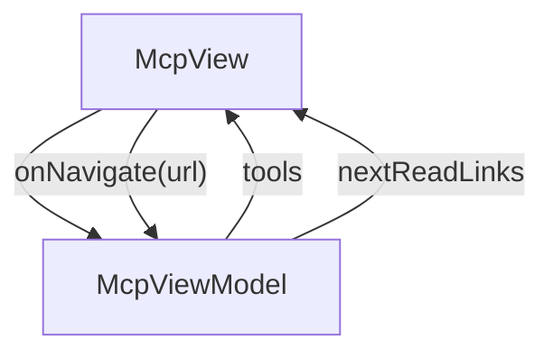

# Mcp - jsonui-mcp-server

## Overview

Tools > MCP server overview. The typed API surface the agents use to inspect every JsonUI project. 39 tools in six groups: A (lookup), B (validation), C (generation), D (build + runtime), E (API model discovery — 2026-05), F (test tooling — new in 2026-07). ~12-min read. Companion to /tools/agents — agents are the clients, MCP is the protocol.

| | |
|---|---|
| Created | 2026-04-23 |
| Updated | 2026-07-09 |

## Screen Structure

### UI Components

| Component | ID | Platform | Description | Initial State | Notes |
|---|---|---|---|---|---|
| View | `tools_mcp_root` | - | - | - | - |
| &nbsp;&nbsp;↳ Scroll | `tools_mcp_scroll` | - | - | - | - |
| &nbsp;&nbsp;&nbsp;&nbsp;↳ View | `tools_mcp_header` | - | - | - | - |
| &nbsp;&nbsp;&nbsp;&nbsp;&nbsp;&nbsp;↳ Label | `-` | - | - | - | - |
| &nbsp;&nbsp;&nbsp;&nbsp;&nbsp;&nbsp;↳ Label | `-` | - | - | - | - |
| &nbsp;&nbsp;&nbsp;&nbsp;&nbsp;&nbsp;↳ Label | `-` | - | - | - | - |
| &nbsp;&nbsp;&nbsp;&nbsp;&nbsp;&nbsp;↳ Label | `-` | - | - | - | - |
| &nbsp;&nbsp;&nbsp;&nbsp;↳ View | `tools_mcp_content_with_rail` | - | - | - | - |
| &nbsp;&nbsp;&nbsp;&nbsp;&nbsp;&nbsp;↳ View | `tools_mcp_body_column` | - | - | - | - |
| &nbsp;&nbsp;&nbsp;&nbsp;&nbsp;&nbsp;&nbsp;&nbsp;↳ View | `section_what` | - | - | - | - |
| &nbsp;&nbsp;&nbsp;&nbsp;&nbsp;&nbsp;&nbsp;&nbsp;&nbsp;&nbsp;↳ Label | `-` | - | - | - | - |
| &nbsp;&nbsp;&nbsp;&nbsp;&nbsp;&nbsp;&nbsp;&nbsp;&nbsp;&nbsp;↳ Label | `-` | - | - | - | - |
| &nbsp;&nbsp;&nbsp;&nbsp;&nbsp;&nbsp;&nbsp;&nbsp;↳ View | `section_shape` | - | - | - | - |
| &nbsp;&nbsp;&nbsp;&nbsp;&nbsp;&nbsp;&nbsp;&nbsp;&nbsp;&nbsp;↳ Label | `-` | - | - | - | - |
| &nbsp;&nbsp;&nbsp;&nbsp;&nbsp;&nbsp;&nbsp;&nbsp;&nbsp;&nbsp;↳ Label | `-` | - | - | - | - |
| &nbsp;&nbsp;&nbsp;&nbsp;&nbsp;&nbsp;&nbsp;&nbsp;&nbsp;&nbsp;↳ CodeBlock | `-` | - | - | - | - |
| &nbsp;&nbsp;&nbsp;&nbsp;&nbsp;&nbsp;&nbsp;&nbsp;↳ View | `section_catalog` | - | - | - | - |
| &nbsp;&nbsp;&nbsp;&nbsp;&nbsp;&nbsp;&nbsp;&nbsp;&nbsp;&nbsp;↳ Label | `-` | - | - | - | - |
| &nbsp;&nbsp;&nbsp;&nbsp;&nbsp;&nbsp;&nbsp;&nbsp;&nbsp;&nbsp;↳ Label | `-` | - | - | - | - |
| &nbsp;&nbsp;&nbsp;&nbsp;&nbsp;&nbsp;&nbsp;&nbsp;&nbsp;&nbsp;↳ Collection | `tools_mcp_catalog_collection` | - | - | - | - |
| &nbsp;&nbsp;&nbsp;&nbsp;&nbsp;&nbsp;&nbsp;&nbsp;↳ View | `section_groups` | - | - | - | - |
| &nbsp;&nbsp;&nbsp;&nbsp;&nbsp;&nbsp;&nbsp;&nbsp;&nbsp;&nbsp;↳ Label | `-` | - | - | - | - |
| &nbsp;&nbsp;&nbsp;&nbsp;&nbsp;&nbsp;&nbsp;&nbsp;&nbsp;&nbsp;↳ Label | `-` | - | - | - | - |
| &nbsp;&nbsp;&nbsp;&nbsp;&nbsp;&nbsp;&nbsp;&nbsp;↳ View | `tools_mcp_next` | - | - | - | - |
| &nbsp;&nbsp;&nbsp;&nbsp;&nbsp;&nbsp;&nbsp;&nbsp;&nbsp;&nbsp;↳ Label | `-` | - | - | - | - |
| &nbsp;&nbsp;&nbsp;&nbsp;&nbsp;&nbsp;&nbsp;&nbsp;&nbsp;&nbsp;↳ Collection | `tools_mcp_next_collection` | - | - | - | - |
| &nbsp;&nbsp;&nbsp;&nbsp;&nbsp;&nbsp;&nbsp;&nbsp;↳ View | `tools_mcp_footer` | - | - | - | - |
| &nbsp;&nbsp;&nbsp;&nbsp;&nbsp;&nbsp;&nbsp;&nbsp;&nbsp;&nbsp;↳ Label | `-` | - | - | - | - |
| &nbsp;&nbsp;&nbsp;&nbsp;&nbsp;&nbsp;↳ View | `tools_mcp_rail_column` | - | - | - | - |
| &nbsp;&nbsp;&nbsp;&nbsp;&nbsp;&nbsp;&nbsp;&nbsp;↳ View | `tools_mcp_toc_wrap` | - | - | - | - |
| &nbsp;&nbsp;&nbsp;&nbsp;&nbsp;&nbsp;&nbsp;&nbsp;&nbsp;&nbsp;↳ TableOfContents | `-` | - | - | - | - |

### Layout Structure

```
tools_mcp_root
└── tools_mcp_scroll
```

## Data Flow



### ViewModel

#### Methods

| Signature | Platforms | Description |
|---|---|---|
| `onAppear()` | all | Seed tools + nextReadLinks. tools carries 39 MCP tool entries grouped A/B/C/D/E/F by function (Lookup / Validation / Generation / Build+Runtime / API Model Discovery / Test Tooling). Each row's nameKey / groupKey / roleKey is pre-resolved via StringManager with the tools_mcp_ prefix. nextReadLinks points to /tools/agents and /tools/cli. |
| `onNavigate(url: String)` | all | router.push(url). Hit by NextReadLink card taps. |

#### Vars

| Declaration | Flags | Platforms | Description |
|---|---|---|---|
| `var tools: Array(McpToolRow)` | observable | all | 39 MCP tool rows, grouped by role (A/B/C/D/E/F). |
| `var nextReadLinks: Array(NextReadLink)` | observable | all | 2 closing cards. |

## State Management

### UI Data Variables

| Variable Name | Type | Description | Notes |
|---|---|---|---|
| `tools` | [McpToolRow] | 39 MCP tools. Each entry names the tool, declares its group (A/B/C/D/E/F), and a one-line role. Group E (added 2026-05) holds the 3 API Model Discovery tools: list_api_specs, list_api_models, preview_api_model_sync. Group F (added 2026-07) holds the 6 Test Tooling tools: test_validate, test_generate_screen, test_generate_flow, test_generate_description, test_report, test_mock_generate. | - |
| `nextReadLinks` | [NextReadLink] | Two closing cards: Agents (client of MCP) + CLI (caller behind jui build). | - |

### View-local Event Handlers

_Handlers kept inside the View layer. ViewModel public API lives under `dataFlow.viewModel`._

| Handler | Description | Notes |
|---|---|---|
| `onAppear` | Seed tools + nextReadLinks from the static v1 catalog. | - |
| `onNavigate` | Client-side navigation. | - |
| `onNavigateTools` |  | - |

## User Actions

| Action | Processing | Destination | Notes |
|---|---|---|---|
| Tap a TOC entry | TOC-internal scroll. | - | - |
| Tap a NextReadLink card | onNavigate(url). | - | - |

## Validation

## Transitions

| Condition | Destination | Notes |
|---|---|---|
| url is a spec-mapped tools URL or / | Target spec screen or tab | - |

## Related Files

| Type | File Path | Notes |
|---|---|---|
| Layout | `docs/screens/layouts/tools/mcp.json` | - |
| Layout | `docs/screens/layouts/cells/mcp_tool_row.json` | - |
| ViewModel | `jsonui-doc-web/src/viewmodels/tools/McpViewModel.ts` | - |
| View | `jsonui-doc-web/src/app/tools/mcp/page.tsx` | - |

## Notes

- Second live entry under the Tools tab. Flipping TOOLS_ENTRIES row 2 (mcp) from 'upcoming' to 'live' in HomeViewModel finishes the task.
- 39 tools total (as of 2026-07). Group A = 8 (lookup, incl. get_data_source), Group B = 6 (validation), Group C = 7 (generation), Group D = 9 (build + runtime), Group E = 3 (API Model Discovery — 2026-05), Group F = 6 (Test Tooling — new 2026-07). Per-tool prose lives on /reference/mcp-tools; this page is the overview.
- The cell uses a generic mcp_tool_row layout, not the agent_row layout — even though the visual is similar, the group pill differs in semantics (A/B/C/D/E/F letter code rather than a named role).
- 2026-05 update (swagger-driven Data Models): Group E added with 3 tools — list_api_specs (enumerate docs/api/), list_api_models (per-platform DTO/Domain/orphan inventory), preview_api_model_sync (dry-run filter changes; returns kept_schemas / filtered_out / skip_domain_matches / halts JSON). Body copy gains a Group E section after the existing D section; the section_groups_body / section_catalog_body / section_what_body strings are revised accordingly. Per /docs/plans/2026-05-27-swagger-models-doc-additions §5, this is also the trigger to fix the stale 'Rendered from live Swagger / tool manifests' phrasing in tools_mcp_section_catalog_body — replacement copy framing is 'Hand-authored catalog kept in sync with the MCP server's 5-group tool list (33 tools currently — A:8 / B:6 / C:7 / D:9 / E:3).' Detail page for each Group E tool is /reference/mcp-tools and /guides/api-data-models §5–§6.
- 2026-07 update (test tooling migrated to jsonui-cli + MCP): Group F added with 6 tools — test_validate (schema-validate test files; installs validated tests to platform dirs when test.install is configured), test_generate_screen, test_generate_flow, test_generate_description, test_report (results JSON → JUnit/HTML), test_mock_generate (scaffold OpenAPI mocks; check:true = drift-only). The long-running `mock serve` is intentionally NOT exposed over MCP (local HTTP server + run-target execution). Totals move 33 → 39 tools, 5 → 6 groups; section_groups_body / section_catalog_body strings gain a Group F clause. Source of truth = TOOL_IDS in jsonui-doc-web/src/viewmodels/tools/McpViewModel.ts. Detail rows on /reference/mcp-tools; guide at /guides/testing.
